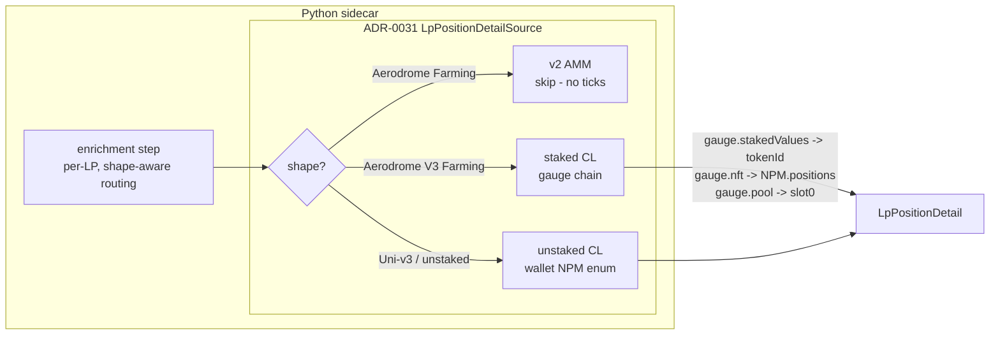

# 0048 — Fix Slipstream staked-CL deep read (gauge indirection)

> **Status:** draft (2026-06-05) — grounded by the Plan 0034 phase-5 live smoke against `0xae5b…9790` (2026-06-05): the on-chain read chain below was decoded end-to-end against Base mainnet, so the implementer inherits exact addresses/selectors, not assumptions.
> **Created:** 2026-06-05
> **Owner skill(s):** dev
> **Related ADRs:** [0034](../adrs/0034-defi-portfolio-aggregator.md) (deep state comes from our own RPC + The Graph — **this plan corrects the *keying*, the stance holds, no new ADR**), [0031](../adrs/0031-data-source-adapter-contract.md) (the `LpPositionDetailSource` seam this reworks behind), [0035](../adrs/0035-defi-domain-placement.md) (`defi/` placement), [0038](../adrs/0038-third-party-api-key-storage.md) (`base_rpc_url`/`eth_rpc_url` secrets), [0019](../adrs/0019-external-http-adapter-resilience.md) (resilience client)

## TL;DR

Plan 0034's phase-3 Aerodrome "one-hop on `pool_address`" deep read is **wrong for staked Slipstream concentrated-liquidity positions**, and the 2026-06-05 live smoke proved it: for a gauge-staked CL position, **Zerion returns the CL *gauge* address as `pool_address`**, and the gauge exposes neither `slot0()` nor `positions()` — so every `eth_call` reverts and the position comes back un-enriched (the fail-safe path held; no corruption, just `null` deep fields). This plan replaces `_fetch_aerodrome` with the **verified gauge-indirection chain** and adds a **shape discriminator** so each of the three LP shapes Zerion can hand us is read correctly. First visible behavior: scanning `0xae5b…9790` returns its `Aerodrome V3` LPs with real `tick_lower`/`tick_upper`/`current_tick`/`in_range` (e.g. the WETH/AERO position: ticks `84000..86200`, current `85198`, **in range**) instead of `null`.

## Context & problem

Plan 0034 closed with two live verifications deferred to a user-run smoke. The Aerodrome smoke ran 2026-06-05 against `0xae5b…9790` (5 positions, Base). **Discovery / F1 passed** (classification, `pool_address`, token de-dup, single-asset staking all correct). **Enrichment produced nothing** — all LP deep fields stayed `null`. Direct RPC probing of Base mainnet decoded exactly why and what the correct read is.

The phase-3 read assumed `pool_address` is the **CL pool** and called `slot0()` + `positions()` (no-arg) on it. For a *staked* Slipstream position that address is actually the **CL gauge**, which has a different interface (`token0`/`token1`/`tickSpacing`/`nft()` resolve; `slot0`/`factory`/`gauge`/`positions` revert). The position's tick state lives on an **NFT** held by the gauge (the wallet owns 0 NFTs directly), so reading it is a multi-call chain, not one hop.

**The decoded chain (real values, WETH/AERO position):**

| Call | Result |
|------|--------|
| `gauge.pool()` (`pool_address` = gauge `0x9564…88f1`) | `0x4e50…ce51` (the real CLPool) |
| `gauge.nft()` | `0xe1f8…8b53` (Slipstream NonfungiblePositionManager) |
| `gauge.stakedValues(owner)` | `[232923, …]` (staked count = 2; **not** wallet-owned NFTs) |
| `NPM.positions(232923)` | `tickLower=84000`, `tickUpper=86200`, `tokensOwed0=0`, `tokensOwed1=0` |
| `CLPool(0x4e50…ce51).slot0()` | `currentTick=85198` |
| ⇒ derived | `84000 ≤ 85198 < 86200` → `in_range = True` |

And Zerion's `pool_address` can point at **three different shapes**, which the deep adapter must distinguish:

| Discovery shape (smoke labels) | `pool_address` is | Correct deep read |
|--------------------------------|-------------------|-------------------|
| `Aerodrome Farming` (v2 AMM — e.g. WETH/GHST, 3 legs) | a constant-product pool | **No ticks exist** → skip; leave deep fields `null` (correct) |
| `Aerodrome V3 Farming` (**staked** CL) | the **CL gauge** | the gauge chain above |
| unstaked CL (Uniswap-v3 / unstaked Slipstream) | the **pool**, wallet owns the NFT | the existing phase-4 wallet→NPM enumeration |

## Decision

Rework the concrete `RpcLpDetailAdapter` (and the enrichment routing) behind the **unchanged `LpPositionDetailSource` seam**, keeping the existing two-step shape (resolve a `token_id`, then `fetch_lp_detail`) — it already fits the gauge case. We **generalize token-id resolution** to be shape-aware: the gauge path resolves via `gauge.stakedValues(owner)`; the unstaked-CL path keeps the `NonfungiblePositionManager` wallet enumeration that already exists. `fetch_lp_detail`, given the gauge address + a resolved `token_id`, walks `gauge.nft()`→`NPM.positions(token_id)` for bounds/owed and `gauge.pool()`→`slot0()` for the current tick. A **shape discriminator** (Decision sub-point below) routes v2 AMM positions to a clean skip rather than wasted reverts. The deep read stays live/un-persisted, deterministic-decode, typed-error, and **fail-safe** (a revert still degrades to discovery depth) — the properties Plan 0034 established are preserved, not relaxed.

**Sub-decision — the discriminator source.** Two candidates: (a) **thread a hint from discovery** (Zerion's `protocol_module` / position class — `farming` + concentrated vs `farming` + v2), or (b) **probe at the adapter** (`gauge.pool()` returns an address ⇒ it's a gauge/staked-CL; a successful `slot0()` ⇒ it's a bare CL pool; both revert ⇒ v2). Phase 2 picks one; (a) is preferred if discovery already carries enough signal (no extra RPC round-trips, cheaper against the rate limit), with (b) as the fallback when the Zerion class is ambiguous. We reject *guessing from the human `pool` display name* (`"… V3 …"`) — it's presentation text, not a contract.

We reject (again, as in Plan 0034) doing Aave health here, and reject persisting deep state.

## Architecture diagram



## Implementation phases

### Phase 1 — Gauge-indirection deep read (the core fix)
- **Owner skill:** `dev`
- **What:** Replace `_fetch_aerodrome`'s one-hop with the verified gauge chain: given the gauge `pool_address` + a resolved `token_id`, `eth_call` `gauge.nft()` → `NPM.positions(token_id)` (tick bounds + owed words + token addresses) and `gauge.pool()` → `slot0()` (current tick), then assemble an `LpPositionDetail`. Add a gauge-aware `token_id` resolver (`gauge.stakedValues(owner)`, falling back to `stakedLength`/`stakedByIndex`) alongside the existing `resolve_univ3_token_id`. Add the new selectors (`pool()`, `nft()`, `stakedValues(address)`, `stakedByIndex(address,uint256)`, `stakedLength(address)`).
- **Files touched:** `src/market_analyser/data/adapters/lp_detail.py`, `tests/data/test_lp_detail_adapter.py` (recorded fixtures using the decoded values).
- **Done when:** against recorded `eth_call` fixtures mirroring the smoke (gauge `0x9564…88f1`, NPM `0xe1f8…8b53`, pool `0x4e50…ce51`, tokenId `232923`), the adapter yields `LpPositionDetail(tick_lower=84000, tick_upper=86200, current_tick=85198, in_range=True)`; the gauge resolver returns `232923` from a `stakedValues` fixture and `None` when the owner has no staked position; a gauge whose getters revert raises the typed `LpDetailError`/`LpDetailConfigError` (not a bare exception); offline-deterministic; `mypy --strict` + `ruff` green.

### Phase 2 — Shape discriminator + routing
- **Owner skill:** `dev`
- **What:** Distinguish the three LP shapes and route each: v2 AMM → clean skip (no RPC, deep fields stay `null`); staked CL → phase-1 gauge chain; unstaked CL → the existing wallet→NPM enumeration. Implement the discriminator chosen in the Decision sub-point (prefer a discovery-threaded class hint; fall back to a `gauge.pool()`/`slot0()` probe). Update the enrichment `_is_univ3`-style routing (which today only branches on `"uniswap" in protocol`) to use the shape, not the protocol display string.
- **Files touched:** `src/market_analyser/defi/enrichment.py`, possibly `src/market_analyser/data/adapters/zerion.py` (+ `defi/models.py`) if a class hint is threaded from discovery, `tests/defi/test_enrichment.py`, `tests/data/test_zerion_adapter.py`.
- **Done when:** an `Aerodrome Farming` (v2) position is skipped with **zero** detail `eth_call`s and deep fields `null`; an `Aerodrome V3 Farming` position routes through the gauge chain; an unstaked Uni-v3 position routes through the wallet-NPM path; each asserted against fakes/fixtures by the resolved route taken (call-pattern assertions, as the existing enrichment specs do); `mypy --strict` + `ruff` green.

### Phase 3 — Uncollected-fees definition + live smoke
- **Owner skill:** `dev`
- **What:** Pin what `uncollected_fees` *means* and implement it. The position struct's `tokensOwed0/1` are 0 until a poke/collect (they read 0 in the smoke), so decide: (a) report the struct's owed words as-is (cheap, under-reports real-time fees), or (b) compute claimable fees from `feeGrowthInside` deltas (accurate, more calls + math), noting that for *staked* CL, emissions accrue to the gauge as a separate reward stream (out of scope — this field is swap fees only). Document the choice in the model docstring. Then re-run the live smoke against `0xae5b…9790` and record a masked sample enriched LP.
- **Files touched:** `src/market_analyser/data/adapters/lp_detail.py`, `src/market_analyser/defi/models.py` (docstring), `tests/`, smoke result captured in the close handoff.
- **Done when:** the chosen fee definition is implemented + documented + fixture-tested; the live smoke shows the `Aerodrome V3` LPs enriched with plausible `in_range` + the defined fee figure (masked wallet + a sample recorded); offline suite + `mypy --strict` + `ruff` green.

## Data shapes

```python
# No model change required: LpPositionDetail / DefiPosition already carry the
# fields. The change is *how* the adapter populates them. The gauge chain reads:
#
#   gauge.pool()                 -> CLPool address      (slot0 source)
#   gauge.nft()                  -> NPM address
#   gauge.stakedValues(owner)    -> [tokenId, ...]      (staked NFTs)
#   NPM.positions(tokenId)       -> (..., tickLower[w5], tickUpper[w6],
#                                    ..., tokensOwed0[w10], tokensOwed1[w11])
#   CLPool.slot0()               -> (sqrtPriceX96[w0], tick[w1], ...)
#
# Verified selectors to add (keccak256(sig)[:4]):
#   pool()                       0x16f0115b
#   nft()                        0x47ccca02
#   stakedValues(address)        (compute + pin in phase 1)
#   stakedByIndex(address,uint256)
#   stakedLength(address)
# (Recompute and assert each selector in a test, as the adapter already does.)
```

## Risks & open questions

- **Selector accuracy.** The `pool()`/`nft()`/`stakedValues` selectors above were used live but **recompute and pin each in a unit test** (keccak self-check) before trusting them — the adapter's existing tests already do this for the Uni-v3 selectors.
- **Discriminator robustness.** If Zerion's position class doesn't cleanly separate staked-CL from v2 farming, the adapter-probe fallback (b) adds one `gauge.pool()` round-trip per LP — acceptable under the existing ~1.1s spacing, but it multiplies calls. Confirm the discovery hint is sufficient first.
- **Fee definition.** Option (b) (`feeGrowthInside` math) is materially more work and more calls; option (a) under-reports. This is the one genuine product decision in the plan — resolve it in phase 3 with the user if the cheap path is too lossy.
- **Unstaked-CL live coverage.** The smoke wallet is staked-only, so the unstaked-CL route (and the F3 Uni-v3 path) stay fixture-tested; live-confirm when a wallet holds one (carry the existing F3 followup).
- **Rate limits.** The public Base RPC throttled hard during investigation; the user's configured `base_rpc_url` should be a real provider. Enrichment's serialized+spaced cadence already applies; the gauge chain adds ~4 calls per staked LP, so spacing matters more.

## What this plan does NOT do

- **No Aave health/liquidation** — still a separate later deep-state plan.
- **No P&L / cost basis / risk** ([ADR-0036](../adrs/0036-defi-pnl-reconstruction.md) / [0037](../adrs/0037-defi-position-risk-forecast.md)).
- **No gauge reward/emission accounting** — `uncollected_fees` is swap fees only; staking rewards are a different concept, out of scope.
- **No new ADR** — this corrects the keying within ADR-0034's accepted "deep state from our own RPC" stance.
- **No persistence, no UI.**

## Followups (after this lands)

- F3 (carried from Plan 0032/0034): live-confirm the unstaked Uni-v3 path and Aave decoding when a wallet holds them.
