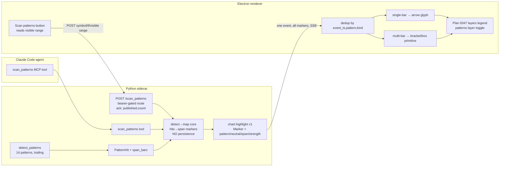

# 0049 — Pattern sweep + multi-bar span rendering

> **Status:** approved
> **Created:** 2026-06-06
> **Owner skill(s):** dev, ui-builder
> **Related ADRs:** [0045](../adrs/0045-candlestick-pattern-span-delivery.md) (this plan's paired ADR — accepts at close), [0023](../adrs/0023-technical-analysis-surface.md) (the `analysis/` pattern surface), [0017](../adrs/0017-live-ui-updates-via-sse.md) (SSE), [0015](../adrs/0015-claude-code-primary-control-surface.md) (agent-driven renders), [0006](../adrs/0006-persistence-layout.md) (persistence — the derived-not-persisted call)

## TL;DR

A smoke run showed candlestick patterns appear **only once** on the chart even when many exist
in view. Root cause: the only path from `detect_patterns` to the chart is the agent tool
`highlight_pattern`, which emits **one** marker per call — there is no "sweep the range and emit
every pattern" path — and the marker model is lossy (binary `kind`, so doji/neutral can't be
represented and two same-bar/same-direction patterns dedup into one; no span, so a 3-bar morning
star is a single arrow). This plan adds a `scan_patterns` MCP tool **and a renderer-facing `POST /scan_patterns` route
behind a "Scan patterns" UI button**, either of which detects every pattern in a range and
publishes them all in one `chart.highlight` event; extends the marker model to carry first-class
pattern identity + neutral direction + an optional bar span ([ADR-0045](../adrs/0045-candlestick-pattern-span-delivery.md)),
fixes the renderer dedup collision, and renders multi-bar patterns as a **span bracket/box** over
the bars they occupy. First visible behavior: one agent call **or one button click** surfaces every
pattern in the current view, each multi-bar pattern drawn as a box spanning its 2–3 bars, with doji
and same-bar patterns no longer swallowed.

## Context & problem

The 2026-06-05 BTC smoke + viewer walkthrough surfaced "patterns display only once." Tracing both
sides (`src/market_analyser/analysis/patterns.py`, `src/market_analyser/events/__init__.py`,
`desktop/renderer/`):

- **No bulk emission path.** `detect_patterns(bars)` finds all 14 patterns over a series and they
  ride inside `ConditionSnapshot.recent_patterns`, but **nothing turns that list into chart
  markers**. The sole detection→chart path is the agent tool `highlight_pattern`
  (`api/mcp_tools/highlight_pattern.py`), which publishes a single marker
  (`markers=[marker]`). Seeing "all patterns in range" would require the agent to call it once per
  pattern by hand. The renderer accumulation logic (`dedupHighlights`, `mergePolledAndLive`,
  `annotationsToMarkers`) is itself correct — it appends — so the deficit is purely upstream.

- **The marker model is lossy.** `Marker.kind` is `Literal["bullish_marker","bearish_marker"]`
  (`events/__init__.py`). Consequences: **neutral** patterns (doji, neutral marubozu) cannot be
  emitted at all; pattern identity exists only as free-text `label`; and the renderer dedup key is
  `(event_ts, kind)` everywhere, so a doji and a hammer on the same bar (same/neutral direction)
  collapse to one marker.

- **Multi-bar patterns lose their span.** `PatternHit` (`analysis/types.py`) carries only the
  completing `bar_index`. Six patterns span 2 bars and four span 3 bars, but every one renders as a
  single arrow on its last bar — the visual span is gone.

- **Spans are net-new rendering.** The renderer uses only standard lightweight-charts series — no
  `createPriceLine`, no `ISeriesPrimitive`/primitives anywhere. `setMarkers` is point-in-time. A
  bracket/box over a bar range needs a custom rectangle primitive (or a canvas overlay mapping bar
  timestamps to pixels via the time scale). This is the plan's main implementation risk.

This plan is the natural follow-on to **Plan 0047**, which deliberately scoped this out (its "does
NOT do" keeps markers `bullish_marker`/`bearish_marker` and colors per-pattern by parsing `label`).
0047 ships bigger per-pattern-colored markers (phase 7), hover tooltips (phase 8), and a layers
legend (phase 9). **Plan 0049 builds on those** rather than redoing them — it makes pattern
identity first-class, adds the sweep, and adds span rendering that slots into 0047's legend.

## Decision

Per [ADR-0045](../adrs/0045-candlestick-pattern-span-delivery.md): deliver pattern sweeps as
**span-bearing markers on the existing `chart.highlight` channel**, treated as **derived,
non-persisted** data, triggerable from **both** the agent and the UI. Four `dev` phases (span in
the analysis layer → extend the marker schema → the shared detect→map core + `scan_patterns` MCP
tool → a renderer-facing `POST /scan_patterns` route) then three `ui-builder` phases (TS mirror +
dedup fix → span rendering → the "Scan patterns" button). Cross-skill handoff at the phase-4/5
boundary. **No migration** (sweeps are recomputed, never persisted), single working tree.

- **Marker extension is additive:** add optional `pattern`, `span_start_ts`, `span_end_ts`,
  `strength`, and a `neutral_marker` kind. Existing `highlight_pattern` and the
  `bullish_marker`/`bearish_marker` kinds are untouched, so the change is backward-compatible.
- **Dedup keys on identity:** `(event_ts, pattern, kind)`, falling back to `(event_ts, kind)` when
  `pattern` is absent — fixes the same-bar collision without breaking existing point markers.
- **One detect→map core, two callers:** a pure mapper turns a range's `PatternHit`s into markers;
  the MCP tool and the HTTP route each fetch bars + map + publish, so the agent path and the UI path
  emit identical markers and can't drift.
- **Both triggers publish one event:** the `scan_patterns` tool *and* `POST /scan_patterns`
  publish a single `chart.highlight` carrying all markers; the renderer accumulates them through its
  existing SSE path (so the button needs no separate "draw from HTTP body" code). The POST returns a
  synchronous `{published, count}` ack purely for button feedback.
- **The button scans the current view:** it reads the chart's *visible* time range and the active
  symbol/timeframe, POSTs, and the markers arrive via SSE — derived and ephemeral (cleared on
  reload, re-scannable), matching the not-persisted decision.
- **Single-bar vs multi-bar render split:** a pattern with `span_*` draws a bracket/box over its
  bars (behind the candles); a single-bar pattern keeps its arrow glyph (no box).

We rejected a dedicated `chart.patterns` event (duplicates the marker plumbing the renderer already
has, including 0047's legend/tooltip work) and persisting sweep results (derived data; would add a
migration and a staleness surface) — see ADR-0045 alternatives A and B. We also rejected having the
route **return** markers in its HTTP body and inject them renderer-side (a second draw path
alongside SSE); publishing on the bus reuses the path the rest of the plan already builds.

## Architecture diagram



## Implementation phases

`dev` runs phases 1–4 in one session, then hands off to `ui-builder` for phases 5–7 (cross-skill
handoff at the phase-4/5 boundary). Single working tree, no migration touched.

### Phase 1 — Pattern span in the analysis layer
- **Owner skill:** `dev`
- **What:** Give every `PatternHit` an explicit bar span and a helper to resolve it to start/end
  timestamps against a bar series.
- **Files touched:** `src/market_analyser/analysis/types.py` (add a span notion to `PatternHit` —
  a `span_bars: int` count, or `start_bar_index`), `src/market_analyser/analysis/patterns.py`
  (each detector reports its statically-known span: 1/2/3), a small resolver helper; tests in
  `tests/analysis/test_patterns.py`.
- **Done when:** Each detected pattern reports the correct span — single-bar patterns
  (doji/hammer/hanging_man/marubozu) span 1, the six two-bar patterns span 2, the four three-bar
  patterns span 3 (asserted per pattern); the resolver maps a `PatternHit` + bars to
  `(start_ts, end_ts)` where `start_ts` is the timestamp of `bar_index - (span_bars - 1)` and
  `end_ts` is `bar_index`'s timestamp; the existing no-lookahead test still holds (a pattern at
  bar `i` reads only `bars[0..=i]`). The behavioral claim defended: "a 3-bar morning_star reports a
  3-bar span ending on its completing bar, derived only from trailing data."

### Phase 2 — Extend the `chart.highlight` marker schema
- **Owner skill:** `dev`
- **What:** Add first-class pattern identity, a neutral kind, an optional span, and strength to the
  `chart.highlight` marker — additively, keeping existing markers valid.
- **Files touched:** `src/market_analyser/events/__init__.py` (`Marker`: add `pattern: str | None`,
  `span_start_ts: datetime | None`, `span_end_ts: datetime | None`, `strength: float | None`; widen
  `kind` to include `neutral_marker`); schema round-trip tests alongside; renderer types regenerate
  is **not** automatic for hand-mirrored event types (done in phase 4).
- **Done when:** A `Marker` with `kind="neutral_marker"`, `pattern="doji"`, no span round-trips on
  `chart.highlight v1` without a validation error; a `Marker` with `span_start_ts`/`span_end_ts`
  round-trips; an existing `bullish_marker`-only marker (no new fields) still validates and serializes
  identically modulo the new optional fields (`exclude_none` keeps the wire clean); a span with
  `span_end_ts < span_start_ts` is rejected by a validator. The claim defended: "the highlight marker
  can carry a named, neutral, spanning pattern without breaking the existing binary point marker."
  *(This phase realizes [ADR-0045](../adrs/0045-candlestick-pattern-span-delivery.md); the ADR
  accepts at this plan's close.)*

### Phase 3 — Shared detect→map core + `scan_patterns` MCP tool (derived, not persisted)
- **Owner skill:** `dev`
- **What:** A pure mapper from a range's `PatternHit`s (over bars) to span-bearing markers, plus the
  `scan_patterns` MCP tool that fetches bars, maps, and publishes them all in one `chart.highlight`
  event — without writing any `Annotation` rows. The mapper is the shared core phase 4's route reuses.
- **Files touched:** the pure mapper (e.g. `src/market_analyser/analysis/patterns.py` or a small
  `analysis/` helper — `patterns_to_markers(hits, bars)`, no event/IO dependency, so layering stays
  clean); new `src/market_analyser/api/mcp_tools/scan_patterns.py`; register it in
  `src/market_analyser/api/mcp_app.py`; extend the full-toolset registration test
  (`tests/api/test_mcp_tools.py`) so a forgotten registration fails; tests alongside.
- **Done when:** the pure mapper turns a `PatternHit` list + bars into markers carrying `pattern`,
  the right `kind` (incl. `neutral_marker`), and resolved `span_start_ts`/`span_end_ts` for multi-bar
  ones (unit-tested in isolation, no event bus); `scan_patterns(symbol, timeframe, range_start,
  range_end)` with a stubbed provider whose bars contain N patterns (including a doji and two distinct
  same-bar patterns) publishes **exactly one** `chart.highlight` event whose `markers` has one entry
  per detected pattern; the optional `patterns: list[str] | None` and `min_strength: float | None`
  parameters filter the emitted set (asserted for each); **no `Annotation` row is written** (assert
  the repository is not a dependency); the tool is registered (full-toolset test green). The claim
  defended: "one `scan_patterns` call emits every in-range pattern as span-bearing markers in a single
  event via a reusable pure mapper, and persists nothing."

### Phase 4 — Renderer-facing `POST /scan_patterns` route (UI trigger backend)
- **Owner skill:** `dev`
- **What:** A renderer-bearer-gated `POST /scan_patterns` route that reuses phase 3's mapper to scan a
  supplied range and publish the same `chart.highlight` event the MCP tool does, returning a small ack.
- **Files touched:** new `src/market_analyser/api/routes/scan_patterns.py` (+ register it), a frozen
  request/response model (`ScanPatternsRequest{symbol, timeframe, range_start, range_end, patterns?,
  min_strength?}` → `ScanPatternsResponse{published: bool, count: int}`), route test; renderer types
  via `pnpm --filter desktop gen-types`.
- **Done when:** `POST /scan_patterns` with the renderer bearer and a body for a stubbed provider whose
  bars contain N patterns publishes **the same** single `chart.highlight` event the MCP tool produces
  (assert identical markers for identical inputs — the shared-mapper guarantee) and returns
  `{published: true, count: N}`; the route returns `401` without the bearer; an `unknown_symbol` /
  upstream failure maps to a typed error response (not a 500), and an empty/uncached range returns
  `{published: false, count: 0}` rather than erroring; `gen-types:check` shows the new request/response
  types with no drift. The claim defended: "the UI's HTTP trigger emits byte-identical markers to the
  agent's MCP trigger, via the same core, and is bearer-gated."

--- cross-skill handoff: `dev` → `ui-builder` ---

### Phase 5 — TS mirror + dedup-by-identity fix
- **Owner skill:** `ui-builder`
- **What:** Mirror the extended marker fields in the renderer's hand-written event types, fix the
  dedup key so distinct same-bar patterns survive, and render `neutral_marker` point markers.
- **Files touched:** `desktop/renderer/types/events.ts` (+ `events.test.ts` parity test);
  `desktop/renderer/handlers/chartHandlers.ts` (`dedupHighlights` key → `event_ts|pattern|kind`);
  `desktop/renderer/views/OhlcvView.tsx` (`mergePolledAndLive` same key);
  `desktop/renderer/lib/markers.ts` (a glyph/token for `neutral_marker`); tests alongside.
- **Done when:** The parity test asserts the TS `Marker` field set + the widened `kind` union match
  the pydantic model (the existing `events.test.ts` mechanism); a `chartHandlers.test.ts` case feeds
  two markers with the **same** `event_ts` and `kind` but **different** `pattern` and asserts **both**
  survive dedup (the collision is gone), while a true duplicate (same `event_ts`+`pattern`+`kind`)
  still dedups to one; a `neutral_marker` renders a neutral-token glyph (not bullish/bearish), reading
  ADR-0039 theme tokens. Builds on Plan 0047 phase 7's marker styling (don't re-hardcode hex). The
  claim defended: "a doji and a hammer on the same bar both render; identical patterns still dedup."

### Phase 6 — Multi-bar span rendering (bracket/box)
- **Owner skill:** `ui-builder`
- **What:** Draw a bracket/box spanning the bars a multi-bar pattern occupies; keep the arrow glyph
  for single-bar patterns; wire the spans into Plan 0047's layers legend as a toggleable layer.
- **Files touched:** `desktop/renderer/components/CandlestickChart.tsx` (the span primitive + its
  reconcile), a `lib/` helper mapping `span_start_ts`/`span_end_ts` → chart coordinates via the time
  scale, `desktop/renderer/lib/markers.ts` (expose a span-layer descriptor for the legend), tests
  alongside; **first task: confirm the lightweight-charts version's primitive support**
  (`ISeriesPrimitive`/`attachPrimitive`, v4.1+) and pick the rectangle-primitive path, else fall back
  to a canvas overlay using `timeScale().timeToCoordinate()` — record which in the commit.
- **Done when:** A marker with `span_start_ts`/`span_end_ts` three bars apart (a `morning_star`) draws
  a box/bracket spanning exactly those three bars, behind the candles, colored by direction from theme
  tokens; a single-bar marker (a `doji`, no span) draws **no** box, only its glyph (asserted —
  branch on `span_*` presence); the span layer appears as one row in the Plan 0047 layers panel and
  unchecking it removes the boxes and leaves arrows/overlays (assert add/remove on toggle); the
  `__test_chart_render__` gate stays green and spans recolor in place on a theme flip (no remount, per
  Plan 0033). The claim defended: "a 3-bar pattern renders as a 3-bar span; a 1-bar pattern does not;
  the span layer is independently toggleable."

### Phase 7 — "Scan patterns" UI button (manual trigger on the current view)
- **Owner skill:** `ui-builder`
- **What:** A chart control that scans the **current visible range** of the active symbol/timeframe by
  calling `POST /scan_patterns`; the resulting markers/spans arrive via the existing SSE path.
- **Files touched:** `desktop/renderer/api/client.ts` (`scanPatterns(req)` typed method);
  `desktop/renderer/components/CandlestickChart.tsx` or `OhlcvView.tsx` (a button + the visible-range
  read via `timeScale().getVisibleRange()` → `range_start`/`range_end`); a small busy/empty/error
  affordance; tests alongside.
- **Done when:** clicking the button reads the chart's current visible time range and the active
  symbol/timeframe and issues one `POST /scan_patterns` with that range (asserted — the request body's
  range equals the stubbed visible range, not the full buffer); on the stubbed ack `{published:true,
  count:N}` the button shows a transient "N patterns" / done state, and the markers render once the
  stubbed `chart.highlight` SSE event is dispatched (reusing the phase 5/6 path — no second draw path);
  `count:0` shows a "no patterns in view" affordance, an error shows a non-crashing message; the button
  goes through the typed bearer client (never a raw fetch). The claim defended: "clicking Scan patterns
  sweeps exactly the visible range and the patterns appear via the normal marker path."

## Data shapes

```python
# illustrative — Phase 1 PatternHit gains a static span (analysis layer)
class PatternHit(BaseModel):
    bar_index: int          # the completing (latest) bar — unchanged
    pattern: str
    direction: Direction    # "bullish" | "bearish" | "neutral" — unchanged
    strength: float
    span_bars: int          # NEW: 1 | 2 | 3 — statically known per pattern
    # resolver: (hit, bars) -> (start_ts, end_ts), start = bars[bar_index-(span_bars-1)].ts
```

```python
# illustrative — Phase 2 extended chart.highlight marker (sidecar)
class Marker(BaseModel):
    event_ts: datetime
    kind: Literal["bullish_marker", "bearish_marker", "neutral_marker"]  # neutral NEW
    label: str | None = None
    pattern: str | None = None            # NEW — first-class identity, not just label
    span_start_ts: datetime | None = None # NEW — present for multi-bar patterns
    span_end_ts: datetime | None = None   # NEW
    strength: float | None = None         # NEW — styling without re-deriving
```

```python
# illustrative — Phase 4 renderer-facing route models (sidecar)
class ScanPatternsRequest(BaseModel):
    symbol: str
    timeframe: str
    range_start: datetime          # the chart's current visible range
    range_end: datetime
    patterns: list[str] | None = None      # optional filter (same as the MCP tool)
    min_strength: float | None = None
class ScanPatternsResponse(BaseModel):   # synchronous ack; markers arrive via SSE
    published: bool
    count: int
```

```ts
// illustrative — Phase 6 renderer span-layer descriptor (ephemeral, renderer-only)
type PatternSpanLayer = {
  id: string            // "span:morning_star:<endTs>"
  label: string         // "morning_star"
  color: string         // resolved direction theme-token === the drawn color
  startTs: string
  endTs: string
  visible: boolean      // toggled via the Plan 0047 legend; not persisted
}
```

## Risks & open questions

- **lightweight-charts primitive support is unverified.** Spans are net-new rendering — no
  primitive/`createPriceLine` usage exists today. Phase 5's first task confirms whether the pinned
  version exposes `ISeriesPrimitive`/`attachPrimitive` (v4.1+); if not, fall back to a canvas overlay
  driven by `timeScale().timeToCoordinate()`. Either way the box must track pan/zoom — the same
  coordinate machinery Plan 0047 phase 8 uses for crosshair tooltips; reuse it.
- **Renderer-initiated render is within ADR-0015.** The "Scan patterns" button has the renderer pull
  a *derived, read-only* overlay over HTTP — the same posture as the `/quote` poll (Plan 0047), the
  lazy `/ohlcv` fetch (Plan 0030), and `/news` (Plan 0023). It authors no persistent state and crosses
  no agent-only boundary (no trades, no secrets), so it does not contradict "the agent is the primary
  control surface." Stated here so Mode 4 reads it as deliberate, not a layering slip. No new ADR (a
  renderer read/derive route like `/quote`); the marker model + derived-not-persisted call is ADR-0045.
- **Serializes behind Plan 0047.** Both touch `CandlestickChart.tsx`, `markers.ts`, and
  `chartHandlers.ts`, and 0049 builds on 0047's marker styling (phase 7), tooltips (phase 8), and
  legend (phase 9). Do **not** run 0049 in a parallel worktree against in-flight 0047 (the
  plans/README chart-serialization rule). Start 0049 after 0047 closes.
- **Sweep noise.** A wide range can surface many patterns, especially dojis. The `patterns` filter
  and `min_strength` parameters (phase 3) plus the legend toggle (phase 5) are the mitigations; the
  default sweep emits everything and lets the user filter.
- **Marker doing two jobs.** The same `Marker` now renders either a point arrow or a span box,
  distinguished by `span_*` presence. Phases 4–5 must branch cleanly; a missing branch silently drops
  spans or double-draws.
- **Adding `neutral_marker` widens a `Literal`.** Every exhaustive switch over `kind` (sidecar and
  renderer) must add the neutral arm — the parity test (phase 4) and Python schema test (phase 2)
  guard the two ends.

## What this plan does NOT do

- **No persistence of sweep results.** Pattern spans are derived and recomputed on demand; reopening
  Electron re-runs the sweep rather than reading stored spans (ADR-0045). Agent-authored
  `highlight_pattern` markers still persist as before — unchanged.
- **No auto-scan on chart load.** The sweep is an explicit trigger — the `scan_patterns` MCP tool or
  the "Scan patterns" button — never an automatic on-show behavior. A future plan could add an
  auto-sweep or a re-scan-on-pan behavior.
- **No new patterns or detector changes.** Uses the existing 14 detectors; only adds a span field.
- **No re-doing Plan 0047's marker work.** Marker sizing/coloring, hover tooltips, and the layers
  legend are 0047's; 0049 consumes them and adds the pattern-identity, sweep, and span pieces.
- **No user-drawn spans or a pattern-annotation editor.** Spans are detector output, not a drawing tool.

## Followups (after this lands)

- (empty at draft time)
