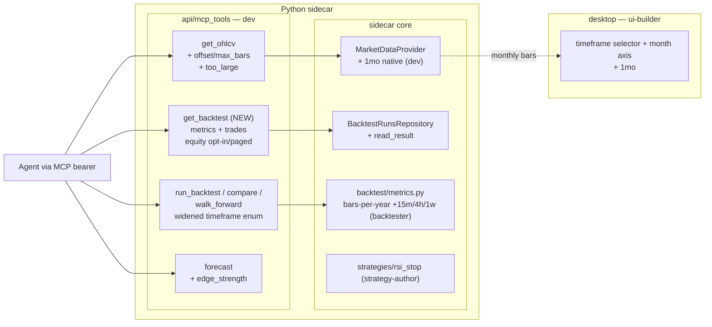

# 0050 — Agent-surface fixes: backtest fetch, OHLCV paging, monthly timeframe, forecast honesty, RSI stop

> **Status:** approved
> **Created:** 2026-06-08
> **Owner skill(s):** backtester, dev, strategy-author, ui-builder (one contiguous run each, in that order)
> **Related ADRs:** [0046](../adrs/0046-mcp-large-result-delivery.md) (MCP large-result paging — accepts at this plan's close), [0047](../adrs/0047-variable-duration-monthly-timeframe.md) (monthly timeframe — accepts at close), [0018](../adrs/0018-backtest-result-schema.md) (BacktestResult), [0024](../adrs/0024-extended-backtest-metrics.md) (metrics annualization), [0028](../adrs/0028-timeframe-resampling-and-expansion.md) (timeframe registry), [0030](../adrs/0030-forecasting-subsystem.md) (forecast honest-uncertainty invariant), [0004](../adrs/0004-strategy-interface.md) (strategy contract)

## TL;DR

A grab-bag of correctness and ergonomics gaps that an agent driving the sidecar over MCP hit in one live BTC analysis session. We give the agent a supported way to fetch a backtest's trades (`get_backtest` MCP tool — today the trade list is only reachable by reading the filesystem); stop `get_ohlcv` from overflowing the context window on multi-year windows (bounded pages + a typed `too_large` reason, per ADR-0046); add a native `1mo` timeframe end-to-end (data + chart, per ADR-0047); make `forecast` flag a statistically-thin edge explicitly; fix `run_backtest`'s timeframe enum (it allows the unsupported `1m` and omits `15m/4h/1w`); and add a stop-loss RSI strategy variant. First visible win: `get_ohlcv BTC-USD 1w 2015→now` returns a usable first page instead of spilling to a file.

## Context & problem

During a 2026-06-08 session the agent ran a full TradFi/crypto read on BTC — chart, forecast, backtest, trade breakdown — entirely through MCP tools. Six distinct gaps surfaced; each was verified against the codebase before this plan was written.

1. **No MCP path to a backtest's trades.** `run_backtest` returns only a 5-metric summary + `run_id` (by design — `run_backtest.py:126`). The full `BacktestResult` (trades, equity, costs, sizing) is on disk and a REST route serves it — but `GET /backtests/{run_id}` is **deliberately gated to the renderer bearer, not the MCP bearer** (`routes/backtests.py:1-12`, cross-tenant isolation). There is **no `get_backtest` MCP tool** (confirmed by listing `api/mcp_tools/`). To break down individual trades this session, the agent had to read `AppData/Roaming/market-analyser/runs/<run_id>/result.json` directly — unsupported and unavailable to a sandboxed agent.

2. **`get_ohlcv` overflows the context window.** Reading `BTC-USD 1w` 2015→2026 — 611 bars, **~108,992 chars** — exceeded the MCP result token cap and force-spilled to a file. There is no cap, paging, or compact mode. Daily/intraday over long windows is far worse.

3. **No monthly timeframe.** The registry (`data/timeframes.py`) stops at `1w`; the agent silently substituted weekly for a "monthly" chart request. (The sidecar *does* reject unknown timeframes — the silent downgrade was an agent choice, not a sidecar bug — so this is a feature add, not a fix.)

4. **`forecast` reads over-confident on a thin edge.** A 4h/horizon-12 call returned `prob_down=0.889` while its out-of-sample `skill` (0.490) barely beat `baseline_skill` (0.488) — a ~0.003 margin. The `validation` block already carries skill/baseline (ADR-0030 invariant 4), but nothing labels the margin, so a 0.889 reads as near-certainty.

5. **`run_backtest` timeframe enum is wrong.** It declares `Literal["1d", "1h", "1m"]` (`run_backtest.py:67`) — `1m` is **not** a supported data timeframe, and `15m/4h/1w` (real, since Plan 0025) are missing. `compare_strategies` and `walk_forward_backtest` share the bug. The binding constraint behind it: `backtest/metrics.py`'s annualization table only knows `1d/1h/1m` (the standing 0020 follow-up), so widening the enum requires widening the table first.

6. **RSI strategy has no stop-loss.** `strategies/rsi.py` exits only on RSI-crosses-overbought; a position opened before a sustained downtrend rides it down (observed −18% to −28% trades in an 11-year BTC backtest). A feature gap, not a bug.

## Decision

Fix all six in one mixed-owner plan. Findings #1 and #2 share a root concern — handing a context-bounded agent an unbounded series — captured in **ADR-0046** (bounded pages + typed `too_large`, trades-inline/equity-opt-in for `get_backtest`). Monthly (#3) is captured in **ADR-0047** (native `1mo`, variable-duration `bar_duration`). Finding #4 is an incremental refinement of ADR-0030's existing honest-uncertainty invariant, so it gets a response field, **no new ADR**. Findings #5 and #6 are within accepted contracts (ADR-0024 metrics, ADR-0004 strategy), no new ADR.

We rejected bundling #4 as its own ADR (it only adds a label to an already-shipped honesty invariant), and rejected downsampling/columnar encoding for #2 in favor of paging (ADR-0046 alternatives A/B). Per the interview, scope is all six; `get_backtest` returns trades inline with equity opt-in; `get_ohlcv` uses cap+pagination; forecast adds a marginal-edge qualifier (not a null-gate).

## Architecture diagram



## Implementation phases

Ordered so each owner runs a single contiguous batch: **backtester → dev → strategy-author → ui-builder** (three handoffs, per the cross-skill protocol). Phase 1 (metrics table) leads because the timeframe-enum fix (phase 5) depends on it and it independently closes a standing follow-up.

### Phase 1 — Widen metrics annualization to the full timeframe set
- **Owner skill:** backtester
- **What:** Extend `backtest/metrics.py`'s per-timeframe bars-per-year table (and the `UnknownTimeframeError` accepted set) to cover `15m`, `4h`, `1w` alongside the existing `1d`/`1h`, so Sharpe/Sortino/Calmar annualize correctly on every data-layer timeframe.
- **Files touched:** `src/market_analyser/backtest/metrics.py`, `tests/backtest/test_metrics.py`.
- **Done when:** computing annualized metrics for a `4h` and a `1w` run returns finite, correctly-scaled values (no `UnknownTimeframeError`); a test asserts the bars-per-year value for each of `15m/1h/4h/1d/1w` equals the expected calendar count, and that an unknown timeframe still raises. Closes the standing 0020 follow-up.

### Phase 2 — `get_ohlcv` bounded pages + typed `too_large` (ADR-0046, finding #2)
- **Owner skill:** dev
- **What:** Add a `MAX_OHLCV_BARS` cap, `offset: int = 0` / `max_bars: int | None = None` params, and `total_available`/`offset`/`returned` fields to `GetOhlcvResponse`; when the cached window exceeds the page size, return the first page with `partial_reason="too_large"` and a `message` naming the total and how to page. The full `[start, end]` window is still fetched/cached — only the returned payload is sliced.
- **Files touched:** `src/market_analyser/api/mcp_tools/get_ohlcv.py`, `src/market_analyser/api/backfill_response.py` (the `GetOhlcvResponse` model + `partial_reason` union), `tests/api/test_get_ohlcv*.py`.
- **Done when:** a request whose window holds more bars than the cap returns exactly `MAX_OHLCV_BARS` bars with `partial_reason="too_large"` and `total_available` equal to the true count; `offset=MAX_OHLCV_BARS` returns the next page with no overlap and no gap; a sub-cap window returns all bars with `partial_reason=None` and unchanged shape; the cache after a capped call contains the **whole** window (slicing didn't shrink the backfill). A test pins the cap against a realistic per-bar char size so it stays under the harness token budget.

### Phase 3 — `get_backtest` MCP tool: trades inline, equity opt-in (ADR-0046, finding #1)
- **Owner skill:** dev
- **What:** New `get_backtest(run_id, include_equity=False, equity_offset=0, max_equity_points=None)` MCP tool that reads the persisted result via `BacktestRunsRepository.get` + `read_result` (the same path the REST route uses) and returns metrics + spec + the **full trade list** by default; the equity curve is returned only when `include_equity=true`, paged per ADR-0046 (`too_large` + offset/limit). Unknown `run_id` returns a typed not-found error.
- **Files touched:** new `src/market_analyser/api/mcp_tools/get_backtest.py`, its registration in the MCP app wiring, the full-toolset registration test, `tests/api/test_get_backtest_tool.py`.
- **Done when:** calling `get_backtest` with a freshly-run `run_id` returns all trades from that run with entry/exit indices and prices and the full metrics block, and **no equity curve**; with `include_equity=true` it returns equity points obeying the page cap (`too_large` when over); an unknown `run_id` returns a not-found error, not a 500; the tool appears in the registered-toolset assertion. (The renderer-bearer REST route is unchanged — this adds the MCP-tenant path that was missing.)

### Phase 4 — Widen the backtest-tool timeframe enum (finding #5)
- **Owner skill:** dev
- **What:** Replace `Literal["1d", "1h", "1m"]` in `run_backtest`, `compare_strategies`, and `walk_forward_backtest` with the data-registry-supported set (`15m/1h/4h/1d/1w`), dropping the unsupported `1m`. Depends on phase 1 (metrics now annualize the wider set).
- **Files touched:** `src/market_analyser/api/mcp_tools/run_backtest.py`, `compare_strategies.py`, `walk_forward_backtest.py`, their tests.
- **Done when:** a backtest on `BTC-USD 4h` runs end-to-end and returns finite metrics; requesting `1m` is rejected at the boundary with a clear unsupported-timeframe message; the three tools' accepted timeframe set matches the data registry (a test cross-checks against `SUPPORTED_TIMEFRAMES` so the two can't drift).

### Phase 5 — `forecast` marginal-edge qualifier (finding #4)
- **Owner skill:** dev
- **What:** Add an explicit edge-strength signal to `ForecastResult` — an `edge_margin` (skill − baseline_skill) plus an `edge_strength` label (`marginal` vs `clear`) computed from a named threshold — so a thin beat reads as thin while still shipping `prob_*`. Refines ADR-0030 invariant 4; `prob_*` semantics and the no-edge (`None`) path are unchanged.
- **Files touched:** `src/market_analyser/api/mcp_tools/forecast.py` (the `ForecastResult`/validation surface), possibly `src/market_analyser/forecast/validation.py`, the forecast tests, `gen-types` check if the model is on the typed surface.
- **Done when:** a forecast whose skill barely beats baseline (margin below the threshold) returns `prob_*` populated **and** `edge_strength="marginal"` with `edge_margin` equal to skill−baseline; a comfortably-beating forecast returns `edge_strength="clear"`; a no-edge forecast still returns `prob_*=None` and is labeled as no-edge; the field is documented in the tool description so the agent surfaces it. (UI surfacing is deferred — see "does NOT do".)

### Phase 6 — RSI stop-loss strategy variant (finding #6)
- **Owner skill:** strategy-author
- **What:** A stop-loss-bearing RSI strategy (a new `rsi_stop` module, or a `stop_loss_pct` param on a new variant) conforming to ADR-0004 (pydantic `Params` + pure `generate_signals` + `META`): enter long on RSI-cross-down-through-oversold; exit on either RSI-cross-up-through-overbought **or** a stop breach. Plus its pytest smoke test.
- **Files touched:** `src/market_analyser/strategies/rsi_stop.py` (+ registration), `tests/strategies/test_rsi_stop.py`.
- **Done when:** on a constructed bar series where price falls a fixed % below entry before RSI recovers, `generate_signals` emits the `EXIT_LONG` at the stop-breach bar (not later, at the RSI cross); with the stop set wide enough never to trigger, behavior matches the plain `rsi` strategy; the smoke test asserts the stop-exit `bar_index` is the breaching bar. **Open question for the implementer (flag, don't guess):** does the stop exit fill at the breaching bar's *close* (signal-at-close, engine fills per its existing model) or at the stop *price* (intrabar fill)? The current engine fills on signals by `bar_index`; default to close-fill unless the engine already supports a fill price — if intrabar fill is wanted, that's an engine change and a separate `backtester` phase, out of scope here.

### Phase 7 — Monthly timeframe in the renderer (ADR-0047, finding #3 — UI half)
- **Owner skill:** ui-builder
- **What:** Surface `1mo` in the chart: add it to the canonical `renderer/lib/timeframes.ts` selector list and ensure the time axis formats month-spaced bars legibly (month/year ticks, not day-level). Depends on the data-layer `1mo` (phase added below — see ordering note).
- **Files touched:** `desktop/renderer/lib/timeframes.ts`, the axis/tick-format path in `CandlestickChart.tsx` (or its formatting helper), `desktop/renderer/lib/timeframes.test.ts`.
- **Done when:** selecting "Monthly" in the timeframe dropdown requests `1mo` and renders monthly candles with month/year-formatted axis ticks (no duplicated day labels); the timeframe-parity test includes `1mo`; switching 1mo↔1w preserves the symbol and doesn't crash the chart.

### Phase 4.5 — Add native `1mo` to the timeframe registry (ADR-0047, finding #3 — data half)
- **Owner skill:** dev
- **What:** Add the `1mo` row to `data/timeframes.py` (`yahoo_interval="1mo"`, `resampled_from=None`, `max_history=None`, `bar_duration=timedelta(days=31)`) and to `SUPPORTED_TIMEFRAMES`; confirm/adapt the coverage-gap math to read `bar_duration` as max adjacent spacing (ADR-0047) so a multi-year monthly span including February shows no false gaps.
- **Files touched:** `src/market_analyser/data/timeframes.py`, `src/market_analyser/annotations/types.py` (`SUPPORTED_TIMEFRAMES`), the coverage/gap module under `data/`, `tests/data/test_timeframes.py`, the coverage tests.
- **Done when:** `get_ohlcv BTC-USD 1mo` over 2015→2026 returns monthly bars with `partial_reason=None` (modulo phase-2 paging) and the registry/`SUPPORTED_TIMEFRAMES` parity test passes with `1mo` on both sides; a coverage check across a 24-month span (spanning at least one February) reports **no** missing-bar gaps when all months are present, and **does** flag a deliberately-omitted month.

> **Ordering note:** phase 4.5 is dev-owned and must land before phase 7 (ui-builder). Implement it in the dev batch (it slots after phase 5, before the strategy-author handoff); it is numbered 4.5 only to keep the finding-#3 pair adjacent in the reader's mind. The effective owner sequence is **backtester (1) → dev (2,3,4,4.5,5) → strategy-author (6) → ui-builder (7)**.

## Data shapes

```python
# illustrative — not the final interface

# Phase 2 — GetOhlcvResponse gains paging fields (additive)
class GetOhlcvResponse(BaseModel):
    bars: list[Bar]
    partial_reason: Literal[..., "too_large"] | None  # add "too_large" to the existing union
    message: str | None
    total_available: int   # bars in the full window
    offset: int            # echo of the requested offset
    returned: int          # len(bars) in this page

# Phase 3 — get_backtest reply (equity omitted unless include_equity)
{
  "run_id": "…", "strategy_id": "rsi", "symbol": "BTC-USD", "timeframe": "1d",
  "params": {...}, "costs": {...}, "sizing": {...},
  "metrics": { ...full BacktestMetrics... },
  "trades": [ {"entry_bar_index": 15, "exit_bar_index": 45,
               "entry_price": 209.38, "exit_price": 257.12, "kind": "long"}, ... ],
  "equity": None  # or, with include_equity=true, a paged list + too_large semantics
}

# Phase 5 — ForecastResult gains (additive; prob_* unchanged)
edge_margin: float            # skill - baseline_skill
edge_strength: Literal["marginal", "clear"]  # by a named threshold; "no-edge" still = prob_*=None
```

## Risks & open questions

- **Coverage-math assumption for monthly (phase 4.5).** ADR-0047 assumes the gap detector compares spacing against `bar_duration` as an upper bound; if it instead assumes exact `bar_duration` multiples, monthly needs the detector adapted, not just a registry row. The phase must *read* the coverage code first and the done-when (no false February gap) is the guard. Mitigation: if adapting the detector turns out non-trivial, surface it — don't force a `bar_duration` value that papers over a real gap-detection bug.
- **Page-cap tuning (phase 2).** The `MAX_OHLCV_BARS` constant is a guess against the current harness token cap; pinned by a test against a realistic row size, but a harness change could invalidate it. Named + centralized so it's a one-line retune.
- **Stop-fill semantics (phase 6).** Flagged in the phase: close-fill vs intrabar stop-price fill. Defaulting to close-fill keeps it inside the strategy layer; intrabar fill would be an engine change (separate backtester plan). Don't silently implement intrabar fill.
- **`forecast` threshold choice (phase 5).** What margin counts as "clear" vs "marginal" is a judgment call; pick a defensible default (documented in the code), and if the reviewer thinks the threshold is contract-significant enough to need an ADR, raise it at close rather than guessing now.
- **Three handoffs.** More owner transitions than a typical plan; each must follow the cross-skill handoff protocol. The phases are file-disjoint across owners, so a stumble in one batch doesn't block the others' already-committed work.

## What this plan does NOT do

- **Forecast UI / edge_strength on screen.** Plan 0037 (forecast UI surface) owns rendering; when it lands it should display `edge_strength`. This plan only adds the field to the tool contract.
- **Downsampling or columnar OHLCV encoding.** ADR-0046 rejected these as the mechanism; not built here.
- **Intrabar / stop-price fills in the engine.** Phase 6 uses close-fill; an intrabar fill model is a separate backtester plan.
- **A monthly resampler.** `1mo` is native (ADR-0047); no in-house aggregation.
- **Backfilling the renderer's `GET /backtests` cross-tenant gate.** The REST route stays renderer-only; we add the MCP tool rather than relax the bearer isolation (ADR-0017).

## Followups (after this lands)

- (none yet — fill as implementation surfaces them)
