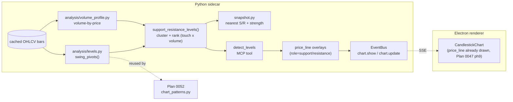

# 0051 — First-class support/resistance levels

> **Status:** approved
> **Created:** 2026-06-08
> **Owner skill(s):** dev
> **Related ADRs:** applies [0023](../adrs/0023-technical-analysis-surface.md) (analysis surface) and [0017](../adrs/0017-live-ui-updates-via-sse.md) (chart events); foundation consumed by [Plan 0052](0052-classical-chart-patterns.md)

## TL;DR

Support/resistance is half-built today: `snapshot.py::_support_resistance()` computes trailing swing-pivot levels (surfaced as numbers via `analyze_symbol`), and the renderer already *draws* horizontal `price_line` overlays with a support/resistance role (Plan 0047 phase 9). Nothing connects them. This plan promotes the pivot logic to a reusable public module `analysis/levels.py` (the swing-pivot primitive [Plan 0052](0052-classical-chart-patterns.md) also needs), adds a **volume-by-price profile** primitive so a level's strength reflects *touch count weighted by volume traded at that price*, clusters pivots into strength-ranked level zones, adds a `detect_levels` MCP tool that computes the levels **and auto-emits the `price_line` overlays in one call**, and **folds nearest support/resistance into the condition snapshot** so the `market-analyst` surface reports them automatically. Dev-only; the lines already render, so no UI work and no new ADR.

## Context & problem

The user asked whether S/R exists "in indicators or strategies" and, finding it partial, asked to make it first-class — recognizable, visible on the chart, and usable in analytics. The gaps, grounded in the code:

- **The math is private and single-purpose.** `_support_resistance(bars)` (`analysis/snapshot.py:93`) finds confirmed swing pivots (a 3-bar centred window, last 5 levels per side) and returns bare floats inside the snapshot. It is a module-private helper — not reusable, not strength-ranked, and the pivots it computes are exactly what classical-pattern detection ([Plan 0052](0052-classical-chart-patterns.md)) needs but can't reach.
- **Raw pivots aren't levels, and touch count alone undersells a level.** Five separate pivot prices a few ticks apart are really one zone; a zone that has *also* absorbed heavy volume is a stronger level than one touched the same number of times on thin trade. The current output neither clusters nor ranks, and has no volume awareness.
- **No one-call "draw the levels".** The `price_line` `OverlaySpec` (role `support`/`resistance`) exists and the renderer reconciles it into horizontal lines with a legend row (`CandlestickChart.tsx:729`). But the only producer is a human/agent hand-assembling overlays from `analyze_symbol` output.
- **The snapshot's S/R is bare floats.** `ConditionSnapshot.support_resistance` is `dict[str, list[float]]` — no strength, no nearest-level framing — so the `market-analyst` skill can't say "nearest resistance is R at strength S".

## Decision

Extract a public `analysis/levels.py` (`swing_pivots()` + clustered, strength-ranked `support_resistance_levels()`), add an `analysis/volume_profile.py` volume-by-price primitive that feeds level strength, add a `detect_levels` MCP tool that computes the levels and auto-emits `price_line` overlays, and enrich `ConditionSnapshot` with nearest support/resistance (price + strength). We rejected a separate level renderer (the `price_line` path already draws and themes the lines), rejected leaving the pivot logic inside `snapshot.py` (Plan 0052 needs it as a shared primitive), and rejected touch-count-only strength (the user chose volume-weighted, which is a better strength proxy and reuses the existing volume bars).

## Architecture diagram



## Implementation phases

### Phase 1 — Extract `analysis/levels.py` (swing-pivot primitive)
- **Owner skill:** dev
- **What:** Public `swing_pivots(bars, left=3, right=3) -> list[Pivot]` (confirmed trailing pivots, generalized to asymmetric wings). Refactor `snapshot._support_resistance` to delegate to it; its existing `{"support": [...], "resistance": [...]}` output stays byte-identical at this phase.
- **Files touched:** new `src/market_analyser/analysis/levels.py`; `analysis/types.py` (add `Pivot`); `analysis/snapshot.py` (delegate); `tests/analysis/test_levels.py`; existing snapshot tests unchanged.
- **Done when:** `swing_pivots` returns the confirmed highs/lows of a constructed fixture, and a truncation-invariance test proves a pivot reported at bar `i` is unchanged when bars are truncated to `bars[0..=i]` (no lookahead); the refactored `condition_snapshot` produces the **same** `support_resistance` dict as before on the existing snapshot fixtures (pinned by the unchanged snapshot tests).

### Phase 2 — `analysis/volume_profile.py` (volume-by-price)
- **Owner skill:** dev
- **What:** A trailing volume-by-price profile: bin each bar's volume across a price range over a window and expose the binned distribution + a `volume_at_price(price, band)` reader. Pure, trailing (bar `i` reads only `bars[0..=i]`), no new dependency (reuses bar volume).
- **Files touched:** new `src/market_analyser/analysis/volume_profile.py`; `tests/analysis/test_volume_profile.py`.
- **Done when:** on a constructed fixture, the profile bins volume into the expected price buckets and `volume_at_price` returns the summed volume within a band around a level; a truncation-invariance test proves the profile at the as-of bar reads no future bar.

### Phase 3 — `support_resistance_levels()` + `detect_levels` tool (compute + auto-draw)
- **Owner skill:** dev
- **What:** `support_resistance_levels(bars, ...) -> list[Level]` clusters nearby pivots into zones and ranks them by **strength = f(touch count, volume-at-level)** read from the phase-2 profile. A `detect_levels(symbol, timeframe, range_start, range_end, max_levels=...)` MCP tool fetches bars, computes the ranked levels, returns them as data, **and** emits a `chart.show`/`chart.update` carrying one `price_line` overlay per level (`role`, `label` e.g. `S1`/`R1`, `price`). Reuses the existing `OverlaySpec(kind="price_line")` channel — no schema change.
- **Files touched:** `analysis/levels.py` (add `support_resistance_levels`, `Level`); `analysis/types.py` (`Level`); new `api/mcp_tools/detect_levels.py`; tool registration + the full-toolset registration test; `tests/api/test_detect_levels.py`.
- **Done when:** `support_resistance_levels` collapses three pivots within the cluster tolerance into one `Level` with `touches == 3`, keeps two pivots outside the tolerance separate, and ranks a high-volume-at-level zone above an equal-touch low-volume one; `detect_levels` on a seeded fixture returns the ranked `Level` list **and** publishes exactly one chart event whose `overlays` are all `price_line`s with the expected `price`/`role`/`label` (asserted against the bus); the tool appears in the full expected-toolset assertion.

### Phase 4 — Fold nearest S/R into `ConditionSnapshot`
- **Owner skill:** dev
- **What:** Enrich `ConditionSnapshot` with nearest support and nearest resistance as structured levels (price + strength), replacing/augmenting the bare-float `support_resistance` so `analyze_symbol` (and the `market-analyst` skill) report them. Update the snapshot field-set test (the analyst-non-negotiable field pin) to the new shape.
- **Files touched:** `analysis/types.py` (`ConditionSnapshot` field); `analysis/snapshot.py` (populate from `support_resistance_levels`); `tests/analysis/test_snapshot.py` (field-set pin + value assertion); `analyze_symbol` tool response shape + its test; `market-analyst` skill reference docs (note the new fields).
- **Done when:** `condition_snapshot` on a fixture reports the nearest support below and nearest resistance above the last close, each with its strength; the snapshot field-set test pins the new shape (no action/buy/sell field — the analyst non-negotiable still holds); `analyze_symbol` surfaces the nearest levels.

## Data shapes

```python
# illustrative — final interface lands in analysis/types.py
class Pivot(BaseModel):            # frozen, extra="forbid"
    bar_index: int
    ts: datetime
    price: float
    kind: Literal["high", "low"]   # high -> resistance pivot, low -> support pivot

class Level(BaseModel):            # frozen, extra="forbid"
    price: float                   # representative price of the clustered zone
    role: Literal["support", "resistance"]
    touches: int                   # pivots in the cluster
    volume_at_level: float         # summed volume in the zone's price band (phase 2)
    strength: float                # 0..1 combining touches + volume_at_level
    first_ts: datetime
    last_ts: datetime
```

## Risks & open questions

- Risk: cluster tolerance and the touch/volume strength blend are new opinionated constants. Mitigation: default to a %-of-price cluster tolerance and a documented strength formula, both named constants with fixture tests; ATR-relative tolerance is a later refinement.
- Risk: the volume-by-price binning resolution is a tradeoff (too coarse → every level looks equally strong; too fine → noisy). Mitigation: a named bin-count/bin-width constant with a fixture asserting the intended bucketing.
- Risk: the phase-4 snapshot contract change touches the field-set pin + `market-analyst`. Mitigation: phase 1–3 keep the snapshot output stable; only phase 4 changes it, isolating the contract edit to one reviewable phase.

## What this plan does NOT do

- **No classical chart patterns** — that's [Plan 0052](0052-classical-chart-patterns.md), which consumes this plan's `swing_pivots`.
- **No new renderer work** — `price_line` already draws, themes, and legends (Plan 0047 phase 9).
- **No strategy** — S/R levels here are analytics + chart geometry, not signals.
- **No session/anchored VWAP** — the volume profile is a price-distribution primitive for level strength, not a VWAP variant (`analysis/volume.py` already owns VWAP).

## Followups (after this lands)

- (empty at draft)
