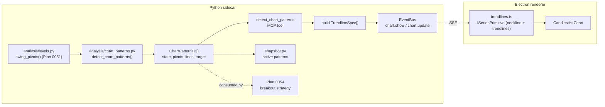

# 0052 — Classical chart patterns: detection, rendering, analytics

> **Status:** in-progress
> **Created:** 2026-06-08
> **Owner skill(s):** dev, ui-builder
> **Related ADRs:** [0048](../adrs/0048-classical-chart-pattern-detection.md) (detection model — **accepts at this plan's close**), [0049](../adrs/0049-chart-trendline-overlay-primitive.md) (trendline primitive — **accepts at this plan's close**); amends scope of [0023](../adrs/0023-technical-analysis-surface.md); builds on [Plan 0051](0051-support-resistance-levels.md); traded by [Plan 0054](0054-chart-pattern-breakout-strategy.md)

## TL;DR

Add classical chart-pattern recognition — **head & shoulders / inverse**, **double top / bottom**, **ascending / descending / symmetrical triangle**, **rising / falling wedge** — to the analysis surface, draw them faithfully on the chart with sloped trendlines, and fold them into the condition snapshot. Detection lives in a new `analysis/chart_patterns.py` built on [Plan 0051](0051-support-resistance-levels.md)'s `swing_pivots` primitive, with connect-the-extremes trendlines, a `k·ATR` breakout-confirmation rule, and an explicit **forming → confirmed** lifecycle that never reads a future bar (ADR-0048). The chart gains a `trendline` `ISeriesPrimitive` (ADR-0049) so necklines and converging trendlines render as real sloped lines, forming = dashed / confirmed = solid. First user-visible behavior: "scan ES for chart patterns" returns typed `ChartPatternHit`s, draws the neckline + shoulders on the live chart, and the condition snapshot lists any active pattern. **Trading the breakouts is [Plan 0054](0054-chart-pattern-breakout-strategy.md)** (which also needs short support from [Plan 0053](0053-short-selling-support.md)).

## Context & problem

[Plan 0051](0051-support-resistance-levels.md) makes `swing_pivots` a reusable primitive. The user wants the next layer: recognize multi-pivot formations, *see* them on the chart, and *use* them in analytics. Today none of this exists ([ADR-0023](../adrs/0023-technical-analysis-surface.md) deliberately scoped the analysis surface to candlestick patterns). The forces that make this a real design — lookahead risk on breakout-confirmed formations, fuzzy recognition, and two distinct recognition models (pivot-matching for H&S/double; connect-the-extremes trendlines for triangles/wedges) — are worked out in [ADR-0048](../adrs/0048-classical-chart-pattern-detection.md). The rendering gap (the chart can draw horizontal lines and vertical span bands but not sloped segments) is resolved by [ADR-0049](../adrs/0049-chart-trendline-overlay-primitive.md).

## Decision

Implement detection in `analysis/chart_patterns.py` over confirmed swing pivots, with connect-the-extremes trendlines, a `k·ATR` confirmation rule, a two-state (`forming`/`confirmed`) trailing lifecycle, and a rich `ChartPatternHit` result (ADR-0048). Carry the geometry to the chart as a new additive `trendlines` field on the chart payloads, rendered by a `trendline` `ISeriesPrimitive` modelled on `spans.ts` (ADR-0049). Fold active patterns into `ConditionSnapshot` so `analyze_symbol` reports them. Mixed-owner, sequential: all `dev` phases (detection → events/tool → snapshot fold-in) first, then a single handoff to `ui-builder` for rendering. We rejected folding this into Plan 0051 (it reviews as one oversized unit) and rejected the horizontal-line rendering approximation (the user wants faithful sloped geometry). The tradeable strategy is split out to [Plan 0054](0054-chart-pattern-breakout-strategy.md) so this plan stays "recognize + see + analytics" and doesn't block on short support.

## Architecture diagram



## Implementation phases

### Phase 1 — Detection core: `analysis/chart_patterns.py`
- **Owner skill:** dev
- **What:** `detect_chart_patterns(bars) -> list[ChartPatternHit]` over `swing_pivots`. Pivot-matched detectors: head & shoulders, inverse H&S, double top, double bottom. Trendline-fit (connect-the-extremes) detectors: ascending/descending/symmetrical triangle, rising/falling wedge. Each hit carries `state` (`forming`/`confirmed`), `direction`, ordered pivot points, defining line segment(s), measured-move `target`, `strength`, and the completing/confirming `bar_index`. Thresholds are named constants (symmetry tolerance, neckline flatness, min/max width, `k·ATR` breakout margin, trendline convergence tolerance).
- **Files touched:** new `src/market_analyser/analysis/chart_patterns.py`; `analysis/types.py` (add `ChartPatternHit`, `PatternState`, `LineSeg`, `PivotPoint`); `tests/analysis/test_chart_patterns.py`.
- **Done when (behavioral claims the specs defend):**
  - On a constructed H&S fixture, the detector reports `head_shoulders` with three pivots whose middle (head) exceeds both shoulders within the symmetry tolerance, and a neckline through the two intervening troughs.
  - **No lookahead:** a hit reported at bar `i` (in either state) is byte-identical when the series is truncated to `bars[0..=i]` — pinned per-pattern, the cardinal-sin guard.
  - **State transition:** the same fixture reports `state="forming"` at the bar where the geometry first completes and `state="confirmed"` only at the bar whose close breaks the neckline by `k·ATR`; a fixture that never breaks the neckline never reaches `confirmed`.
  - A symmetrical-triangle fixture reports converging upper/lower trendlines (opposite-sign slopes within tolerance) connecting the two highest highs / two lowest lows; an ascending-triangle fixture reports a flat upper line + rising lower line.
  - A formation outside the min/max width, or with shoulders outside the symmetry tolerance, does **not** fire.

### Phase 2 — Events schema (`trendline`) + `detect_chart_patterns` MCP tool
- **Owner skill:** dev
- **What:** Add `TrendlineSpec`/`TrendPoint` and the optional `trendlines` field to `ChartShowPayloadV1` + `ChartUpdatePayloadV1` (additive, `exclude_none`, no version bump — ADR-0049). Add a `detect_chart_patterns(symbol, timeframe, range_start, range_end, patterns=None, states=None)` MCP tool that fetches bars, runs detection, returns the hits as data, and emits a chart event carrying one `TrendlineSpec` per hit's line(s) (`style="dashed"` for forming, `"solid"` for confirmed).
- **Files touched:** `events/__init__.py` (new types + field + validator); new `api/mcp_tools/detect_chart_patterns.py`; tool registration + full-toolset test; `tests/events/...`; `tests/api/test_detect_chart_patterns.py`.
- **Done when:**
  - A `ChartShowPayloadV1` with no `trendlines` serialises byte-identically to today (the `exclude_none` wire-stability guard, mirroring the `Marker` span precedent); a `TrendlineSpec` with one anchor fails validation (≥2 required).
  - `detect_chart_patterns` on a seeded fixture returns the hit list **and** publishes a chart event whose `trendlines` carry the expected anchor `(ts, price)` points and `style` matching each hit's state (asserted against the bus); the tool appears in the full expected-toolset assertion.

### Phase 3 — Fold active patterns into `ConditionSnapshot`
- **Owner skill:** dev
- **What:** Add an active-patterns list (recent `ChartPatternHit` summaries) to `ConditionSnapshot` so `analyze_symbol` and the `market-analyst` skill surface them. Pairs with Plan 0051 phase 4's nearest-S/R fold-in (same snapshot, same field-set pin).
- **Files touched:** `analysis/types.py` (`ConditionSnapshot` field); `analysis/snapshot.py` (populate from `detect_chart_patterns`); `tests/analysis/test_snapshot.py` (field-set pin + value assertion); `analyze_symbol` response shape + test; `market-analyst` reference docs.
- **Done when:** `condition_snapshot` on an H&S fixture lists the active `head_shoulders` hit (pattern, state, direction, strength) and an empty list on a flat fixture; the snapshot field-set test pins the new shape (still no action/buy/sell field — analyst non-negotiable holds).

### Phase 4 — Renderer: `trendline` ISeriesPrimitive + legend + forming/confirmed styling
- **Owner skill:** ui-builder
- **What:** Mirror the new wire types in `types/events.ts` (parity-guarded). Add `desktop/renderer/lib/trendlines.ts` — a `TrendlinePrimitive` (`ISeriesPrimitive`) following `spans.ts`: map anchors via `timeToCoordinate` + the candle series' `priceToCoordinate`, stroke the polyline (solid/dashed by `style`, theme color by direction/role), off-screen-clip per `computeSpanRects`. Wire it into `CandlestickChart` **as a `useTrendlines` hook** — not inline — to push toward the standing decomposition follow-up. One legend row governs trendline visibility.
- **Files touched:** `desktop/renderer/types/events.ts`; new `desktop/renderer/lib/trendlines.ts` + `trendlines.test.ts`; new `desktop/renderer/hooks/useTrendlines.ts`; `CandlestickChart.tsx` (hook wiring); `LayersPanel` (legend row); relevant component tests.
- **Done when:**
  - The pure pixel-math maps a two-anchor spec to the expected `(x1,y1)-(x2,y2)` via a stubbed time/price scale, and **skips** a segment whose endpoint maps off-screen (unit-tested, canvas-free) — the `spans.ts` precedent.
  - A forming hit renders dashed and a confirmed hit solid (asserted on the primitive's style state).
  - Toggling the trendline legend row removes/restores the lines; the TS↔pydantic parity test passes (no drift) after the mirror update.

## Data shapes

```python
# illustrative — final interface lands in analysis/types.py
PatternState = Literal["forming", "confirmed"]

class PivotPoint(BaseModel):      # frozen, extra="forbid"
    ts: datetime
    price: float

class LineSeg(BaseModel):         # frozen, extra="forbid"
    start: PivotPoint
    end: PivotPoint
    role: Literal["neckline", "upper_trendline", "lower_trendline"]

class ChartPatternHit(BaseModel): # frozen, extra="forbid"
    pattern: str                  # head_shoulders, inverse_head_shoulders, double_top,
                                  # double_bottom, ascending_triangle, descending_triangle,
                                  # symmetrical_triangle, rising_wedge, falling_wedge
    state: PatternState
    direction: Direction          # reuse analysis/types.Direction
    bar_index: int                # completing (forming) / confirming (confirmed) bar
    pivots: list[PivotPoint]
    lines: list[LineSeg]
    target: float | None          # measured-move projection (geometry fact, not advice)
    strength: float               # 0..1 relative conviction

# wire (events/__init__.py) — additive, exclude_none, no version bump
class TrendPoint(BaseModel):      # frozen, extra="forbid"
    ts: datetime
    price: float

class TrendlineSpec(BaseModel):   # frozen, extra="forbid"; >=2 points
    points: list[TrendPoint]
    role: Literal["neckline", "upper_trendline", "lower_trendline"] | None = None
    style: Literal["solid", "dashed"] = "solid"   # confirmed vs forming
    label: str | None = None
    pattern: str | None = None
```

## Risks & open questions

- Risk: **forming-state flicker** — a forming pattern can vanish when a later pivot invalidates it (correct trailing behavior, ADR-0048). Mitigation: dashed styling reads it as provisional.
- Risk: **connect-the-extremes sensitivity** — one outlier pivot can tilt a triangle/wedge line. Mitigation: pivot window + convergence tolerance are named constants with per-pattern fixtures; narrow the family in a followup if real bars prove it unreliable.
- Risk: **CandlestickChart god-component regrowth** — the chart is already flagged (0047/0049 follow-up). Mitigation: phase 4 lands the reconcile as a `useTrendlines` hook from the start, not inline.
- Risk: **`priceToCoordinate` series dependency** — the trendline needs the price axis and a ready candle series. Mitigation: no pane view until the series is attached/non-empty (the `currentRects`-empty-until-attached pattern from `spans.ts`).
- Risk: **two snapshot folds in flight** — Plan 0051 ph4 (nearest S/R) and this plan's ph3 (active patterns) both edit `ConditionSnapshot` + its field-set pin. Mitigation: 0051 lands first (dependency), so ph3 extends the already-updated shape; both are value-asserting on the same test.

## What this plan does NOT do

- **No S/R level work** — that's [Plan 0051](0051-support-resistance-levels.md) (this plan consumes its `swing_pivots`).
- **No trading strategy** — the breakout strategy + backtest is [Plan 0054](0054-chart-pattern-breakout-strategy.md), which also depends on short support ([Plan 0053](0053-short-selling-support.md)).
- **No pivot-point glyphs** on the chart in v1 — the trendline anchors already sit on the pivots; standalone pivot markers are a possible followup.
- **No persistence** — classical-pattern hits and trendlines are derived/recomputed (ADR-0048/0049), like the candlestick sweep; no migration.

## Followups (after this lands)

- (empty at draft)
