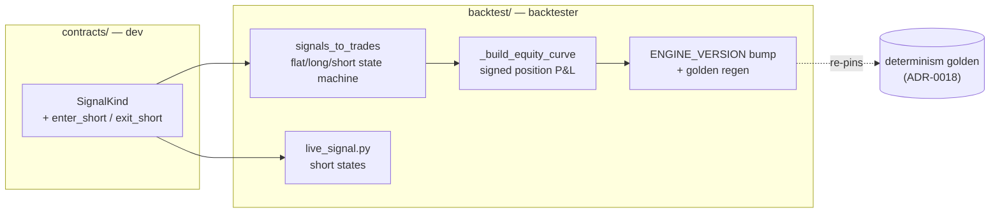

# 0053 — Short-selling support in the strategy + backtest contract

> **Status:** in-progress
> **Created:** 2026-06-08
> **Owner skill(s):** dev, backtester
> **Related ADRs:** [0050](../adrs/0050-short-selling-strategy-backtest.md) (**accepts at this plan's close**); amends [0004](../adrs/0004-strategy-interface.md); extends [0018](../adrs/0018-backtest-result-schema.md); relates [0024](../adrs/0024-extended-backtest-metrics.md), [0026 live-signal evaluator]

## TL;DR

Generalize the strategy + backtest contract from long-only to **flat / long / short**. Add `enter_short` / `exit_short` to `SignalKind`, teach the engine's `signals_to_trades` adapter and equity curve to model a short (P&L = `entry − exit`, same transaction cost as a long, **frictionless** — no borrow fee in v1), bump `ENGINE_VERSION`, and regenerate the determinism golden fixture. This is a broadly-useful capability (any strategy can now express a down-view) and the prerequisite that lets [Plan 0054](0054-chart-pattern-breakout-strategy.md) trade bearish chart patterns symmetrically. First user-visible behavior: a strategy emitting `enter_short` produces a backtest whose equity rises as price falls.

## Context & problem

The strategy contract ([ADR-0004](../adrs/0004-strategy-interface.md)) defines `SignalKind` as `enter_long` / `exit_long`, with shorts reserved-but-unimplemented. The engine (Plan 0008) is long-only end to end: `signals_to_trades` opens at the next bar's open, `_build_equity_curve` compounds long P&L. The user chose (Plan 0052/0054 interview) to trade bearish chart patterns (H&S, double top, rising wedge, descending-triangle down-break) **as shorts** rather than as long-exits-only, which requires position support the contract doesn't have. Because the engine sits on the determinism-critical path ([ADR-0018](../adrs/0018-backtest-result-schema.md) pins a byte-identical `BacktestResult` via a cross-process golden), this is a deliberate, isolated change — not a detail inside a strategy plan. See [ADR-0050](../adrs/0050-short-selling-strategy-backtest.md) for the full decision and the rejected alternatives.

## Decision

Extend `SignalKind` with `enter_short` / `exit_short` (contract, `dev`), then generalize the engine's position model to flat/long/short with symmetric, frictionless short P&L on a single signed code path, bump `ENGINE_VERSION`, and regenerate + re-verify the golden fixtures (`backtester`). Single-direction at a time: no simultaneous long+short, no pyramiding; a same-bar long-exit + short-entry is ordered exit-first-then-enter. We rejected the long-only "bearish = exit" mapping (the user wants real shorts), a separate inverted-series engine (duplicates the determinism surface), and modeling borrow cost now (v1 is frictionless; additive later) — all per ADR-0050.

## Architecture diagram



## Implementation phases

### Phase 1 — Contract: `enter_short` / `exit_short`
- **Owner skill:** dev
- **What:** Add `enter_short` / `exit_short` to `SignalKind`; update the strategy contract docstrings and any exhaustiveness checks. No engine behavior yet — this is the vocabulary.
- **Files touched:** `src/market_analyser/contracts/strategy.py`; `tests/contracts/test_strategy.py`.
- **Done when:** `SignalKind` exposes the four kinds; a strategy can emit an `enter_short` `Signal` and it validates; the contract test pins the full kind set. (No behavioral change to backtests yet — phase 2 wires the engine.)

### Phase 2 — Engine: flat/long/short trade adapter + signed equity curve
- **Owner skill:** backtester
- **What:** Generalize `signals_to_trades` to open/close shorts (short opened at next-bar open on `enter_short` while flat; closed on `exit_short` while short) and `_build_equity_curve` to value a signed position (short realized P&L = `entry − exit`, same transaction cost as a long, no borrow fee). Enforce single-direction (ignore `enter_short` while long, etc.); order a same-bar exit-then-enter. Bump `ENGINE_VERSION`, regenerate the Plan 0008 golden fixture, and re-pin the cross-process determinism golden.
- **Files touched:** `src/market_analyser/backtest/adapter.py` (or wherever `signals_to_trades` lives), `backtest/*equity*`, `backtest/types.py` if a trade field needs a direction, the golden fixture(s), `tests/backtest/test_*` (adapter + equity + determinism golden).
- **Done when:**
  - A strategy emitting `enter_short` at bar `i` / `exit_short` at bar `j` produces a trade whose P&L is `entry − exit` net of the same cost a long pays, and a falling-price fixture yields a **rising** equity curve.
  - The single-direction invariant holds: `enter_short` while long is ignored; no pyramiding (a second `enter_*` while in a position is a no-op), pinned by tests.
  - A same-bar `exit_long` + `enter_short` executes exit-first (flat between, both at the next open), pinned by a test.
  - `ENGINE_VERSION` is bumped and the regenerated golden re-pins byte-identical (modulo run provenance) cross-process per ADR-0018; a pure-long backtest produces the **same** result as before the change except for `ENGINE_VERSION` (no silent long-path regression).

### Phase 3 — Live-signal evaluator + metrics re-verification
- **Owner skill:** backtester
- **What:** Extend the live-signal evaluator (`backtest/live_signal.py`, Plan 0026) to report the short states symmetrically, and re-verify the extended metrics (ADR-0024) are correct on a short-bearing run (they operate on the equity curve / trade returns, so they should need no change — confirm, don't assume).
- **Files touched:** `src/market_analyser/backtest/live_signal.py`; `tests/backtest/test_live_signal.py`; a short-bearing metrics test.
- **Done when:** the evaluator reports a `short` live state for a strategy currently emitting `enter_short`; Sharpe/Sortino/Calmar/etc. compute correctly on a short-bearing equity curve (value-asserted against a hand-checked fixture), confirming the metrics are direction-agnostic.

## Data shapes

```python
# contracts/strategy.py — additive
class SignalKind(StrEnum):
    ENTER_LONG = "enter_long"
    EXIT_LONG = "exit_long"
    ENTER_SHORT = "enter_short"   # new
    EXIT_SHORT = "exit_short"     # new
# A Trade may gain a `direction: Literal["long","short"]` if the equity path
# needs it explicit (illustrative — decided in phase 2).
```

## Risks & open questions

- Risk: **silent long-path regression** when generalizing the equity curve. Mitigation: phase 2 done-when pins that a pure-long backtest is unchanged except `ENGINE_VERSION`; the golden regen is reviewed, not rubber-stamped.
- Risk: **`BacktestRunSummary` / persistence semantics** may assume long-only. Mitigation: audit the summary fields in phase 2; if a migration is needed it's surfaced (and this plan then touches `persistence/migrations/` → serialize, don't worktree-parallel).
- Risk: **frictionless shorts are optimistic.** Accepted for v1 (ADR-0050); a borrow-cost parameter is an additive followup on the same signed path.
- Open question: does any shipped strategy or the `compare_strategies`/`walk_forward` tooling hard-assume two `SignalKind` values? Phase 1 greps for exhaustiveness on `SignalKind` and updates any.

## What this plan does NOT do

- **No borrow/financing cost** — frictionless v1 (ADR-0050).
- **No real-money or live execution** — backtest/paper only; the execution pillar (ADR-0025) is unaffected.
- **No new strategy** — that's [Plan 0054](0054-chart-pattern-breakout-strategy.md); this plan only makes shorts *expressible and backtestable*.
- **No simultaneous hedged positions / pyramiding** — single-direction at a time by decision.

## Followups (after this lands)

- (empty at draft)
