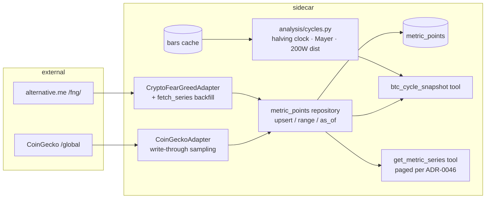

# 0055 — Cycle & macro time-series spine

> **Status:** in-progress
> **Created:** 2026-06-09
> **Owner skill(s):** dev
> **Related ADRs:** [ADR-0051](../adrs/0051-historized-metric-series-contract.md) (implements; accepts at close), [ADR-0027](../adrs/0027-crypto-macro-regime-classification.md) (the snapshot this historizes), [ADR-0046](../adrs/0046-mcp-large-result-delivery.md) (paging for the series tool)

## TL;DR

Lay the foundation the whole crypto program builds on: the generic `metric_points` store + `MetricSeriesSource` Protocol + series registry (ADR-0051), then fill it with the first series — full Fear & Greed history (one keyless call back to Feb 2018), BTC dominance / total-mcap accrual (write-through on every macro fetch; no free history exists), and a new `analysis/cycles.py` computing BTC cycle metrics from constants + already-cached bars (halving clock, Mayer Multiple, 200W-MA distance). First user-visible behavior: `btc_cycle_snapshot` returns the halving phase, Mayer Multiple, 200W-MA distance, current F&G and dominance with trend deltas — and `get_metric_series` pages out any stored series.

## Context & problem

The 2026-06-09 gap review: every crypto-meta read is snapshot-only — `bitcoin_market_pulse` and `crypto_fear_greed` discard what they fetch, so nothing meta can be backtested against or used as a forecast feature, and the user's stated interest (BTC cycles) has no surface at all. Three plans of new series (this one, 0056 derivatives, 0057 on-chain) need one storage contract first, because the Alembic chain is linear and only a single shared migration keeps the rest of the program parallel-able.

## Decision

Implement ADR-0051 exactly (one `metric_points` table, namespaced series registry, `range`/`as_of` repository), then the three cheapest-to-fill series families: F&G (backfillable in full — verified against the official API docs: `?limit=0` returns all data, daily since 2018-02-01), CoinGecko dominance/total-mcap (accrual-only — historical series verified paid-only on CoinGecko), and computed cycle metrics (no external source at all). We rejected per-family tables and bars-table reuse per ADR-0051.

## Architecture diagram



## Implementation phases

### Phase 1 — The contract: table, Protocol, registry, repository
- **Owner skill:** `dev`
- **What:** Migration adding `metric_points(series_id, ts, value, PRIMARY KEY(series_id, ts))`; `MetricSeriesSource` Protocol in `data/sources.py`; series-id registry in `data/metric_series.py`; repository with `upsert_points` / `range` / `as_of` (latest point with `ts <= bound`).
- **Files touched:** `persistence/migrations/versions/000N_metric_points.py`, `persistence/models/metric_points.py`, `persistence/repositories/metric_points.py`, `src/market_analyser/data/sources.py`, `data/metric_series.py`, tests.
- **Done when:** (a) `as_of` returns the latest point at-or-before the bound and **never** a later one — asserted with a point one second past the bound; (b) an unregistered `series_id` is rejected at the repository boundary; (c) upsert of an existing `(series_id, ts)` with a different value is refused outside the explicit `refresh` path (ADR-0051 immutability).

### Phase 2 — Fear & Greed: full backfill + incremental update
- **Owner skill:** `dev`
- **What:** Extend `CryptoFearGreedAdapter` with `fetch_series` (`?limit=0` full history; incremental = fetch-and-upsert-missing); register `fng.value`; the existing `crypto_fear_greed` tool also write-throughs the current value.
- **Files touched:** `data/adapters/crypto_fear_greed.py`, `data/metric_series.py`, tests (fixture from a captured real response).
- **Done when:** (a) backfill from the fixture lands one point per day with values 0–100 and the earliest at the fixture's first day (expected 2018-02-01 — assert against fixture, not the live API); (b) re-running backfill is idempotent (row count unchanged); (c) a live `crypto_fear_greed` call appends today's point exactly once.

### Phase 3 — Dominance / total-mcap accrual
- **Owner skill:** `dev`
- **What:** Register `coingecko.btc_dominance` and `coingecko.total_mcap_usd`; every successful `get_macro_context` fetch (i.e. each `bitcoin_market_pulse` / `market_snapshot` call) write-throughs both current values keyed to the fetch's UTC timestamp truncated to the hour (at most one point per series per hour — bounded growth, idempotent within the hour).
- **Files touched:** `data/adapters/coingecko.py`, `data/metric_series.py`, tests.
- **Done when:** (a) two macro fetches in the same hour produce one point; fetches in different hours produce two — both asserted; (b) a failed upstream fetch writes nothing (no fabricated points); (c) the write-through never makes the macro tool fail (storage error → logged, snapshot still returned).

### Phase 4 — `analysis/cycles.py` + tool surface
- **Owner skill:** `dev`
- **What:** Pure cycle math over cached daily bars: halving constants (2012-11-28, 2016-07-09, 2020-05-11, 2024-04-19; next-halving date is a **labeled estimate**), `days_since_halving` / `days_to_next_halving_est` / `halving_phase` (fraction 0–1 of the ~4y cycle), Mayer Multiple (close ÷ SMA200 of daily closes), 200W-MA distance (close ÷ SMA1400 of daily closes − 1; insufficient history → `None`, never a shortened window silently). New `btc_cycle_snapshot` MCP tool (cycle metrics + latest F&G/dominance with 7/30-day deltas from the store) and generic paged `get_metric_series` tool.
- **Files touched:** `src/market_analyser/analysis/cycles.py`, `api/mcp_tools/cycle_snapshot.py`, `api/mcp_tools/metric_series.py`, tool-registration test, tests.
- **Done when:** (a) cycle math is pinned by fixture: a synthetic bar series with a known SMA200 yields the exact Mayer value; a date inside a known cycle yields the exact phase fraction; (b) `dist_200w_ma` returns `None` (not a number) when fewer than 1400 daily bars exist; (c) `get_metric_series` pages per ADR-0046 with a typed `too_large`-style envelope, asserted at the cap boundary; (d) the full-toolset registration test grows both tools; (e) the snapshot tool is trailing-only — its deltas read the store via `as_of`/`range`, never a future point (asserted with an injected future point that must not appear).

## Data shapes

```python
# illustrative
class MetricPoint(BaseModel):
    series_id: str          # registered, namespaced: "fng.value"
    ts: int                 # UTC epoch seconds
    value: float

class BtcCycleSnapshot(BaseModel):
    as_of: datetime
    days_since_halving: int
    days_to_next_halving_est: int      # estimate — labeled as such in output
    halving_phase: float               # 0.0–1.0
    mayer_multiple: float | None
    dist_200w_ma: float | None         # None until 1400 daily bars cached
    fng: float | None
    fng_delta_7d: float | None
    btc_dominance: float | None
    dominance_delta_7d: float | None   # None until accrual warms up
```

## Risks & open questions

- **Migration-chain collision:** phase 1 adds the program's one migration — serialize this plan against 0035/0044/0053/0060 (any migration-adding plan). Everything downstream (0056/0057) is migration-free by design.
- **Dominance deltas are useless until accrual warms up.** ~weeks before a 7d delta exists, months before a trend feature is trainable. Honest `None`s, not fabricated values. (A later option, noted in ADR-0053's source space: derive historical dominance from CoinMetrics market caps — deliberately out of scope here.)
- **F&G API shape drift:** the fixture pins our parser, not their API. The incremental path must treat a shape change as a typed upstream error, consistent with the ADR-0019 taxonomy.
- Open question: hourly truncation for accrual (phase 3) vs daily. Hourly chosen for resolution; if it ever matters for storage (it won't — one float/hour), revisit.

## What this plan does NOT do

- No derivatives series (Plan 0056), no on-chain series (Plan 0057), no forecast integration (Plan 0059).
- No scheduler — accrual is write-through on existing call paths until Plan 0060 exists; cadence is therefore irregular and that's accepted.
- No UI surface; agent-only tools for now.
- No regime historization (`regime` is derived from dominance/mcap — recompute from the stored series when needed rather than storing a string).

## Followups (after this lands)

- (fill as discovered)
