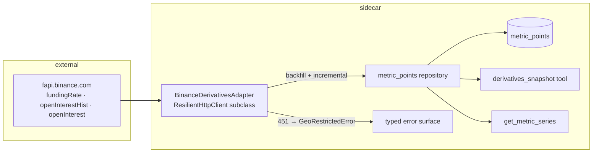

# 0056 — Binance derivatives data: funding rate + open interest

> **Status:** in-progress
> **Created:** 2026-06-09
> **Owner skill(s):** dev, human
> **Related ADRs:** [ADR-0052](../adrs/0052-binance-exchange-data-source.md) (the venue decision; the derivatives half lands here), [ADR-0051](../adrs/0051-historized-metric-series-contract.md) (storage), [ADR-0019](../adrs/0019-external-http-adapter-resilience.md) (HTTP resilience)

## TL;DR

First derivatives signals in the app: a keyless `BinanceDerivativesAdapter` over `fapi.binance.com` backfills **full funding-rate history** (BTCUSDT since Sep 2019, 8h cadence) and starts **recording open interest** (history is fetch-limited to ~30 days — verified against official docs — so the series is ours to accrue from day one, seeded by the available month). Surfaced via a `derivatives_snapshot` MCP tool (current funding, OI, recent deltas) and the generic `get_metric_series`. A `human` live-smoke phase early proves the geo question (HTTP 451 risk) before the rest is built on sand.

## Context & problem

Funding rates and open interest are among the strongest crypto positioning/crowding signals — extreme positive funding marks crowded longs; OI expansion vs price divergence flags squeeze conditions. The app has zero derivatives data. ADR-0052 picked Binance; ADR-0051 gives the storage. The OI retention trap (only ~1 month fetchable, ever) means every week of delay is a week of series lost — this plan is more time-sensitive than its siblings.

## Decision

One adapter, two series families, write-through + backfill per ADR-0051: `binance.funding_rate.<SYMBOL>` (full paginated backfill + incremental) and `binance.open_interest.<SYMBOL>` (one-time `openInterestHist` seed + snapshot accrual on the same write-through pattern as Plan 0055's dominance). v1 symbols: `BTCUSDT`, `ETHUSDT` (registry entries; adding more is config, not code). Geo failure is a typed `GeoRestrictedError` surfaced to the user, never retried — per ADR-0052.

## Architecture diagram



## Implementation phases

### Phase 1 — Adapter + funding-rate backfill
- **Owner skill:** `dev`
- **What:** `BinanceDerivativesAdapter` (ResilientHttpClient subclass; typed error taxonomy incl. `GeoRestrictedError` on 451); `fetch_series` for funding: paginate `GET /fapi/v1/fundingRate` (max 1000/page) from contract launch; empty page = end-of-history, not an error (ADR-0052 note); register `binance.funding_rate.BTCUSDT` / `.ETHUSDT`.
- **Files touched:** `data/adapters/binance_derivatives.py`, `data/metric_series.py`, `data/errors.py`, tests (captured-response fixtures).
- **Done when:** (a) pagination is proven against a 3-page fixture: points are contiguous, deduplicated, and terminate on the empty page; (b) a 451 fixture raises `GeoRestrictedError` (not a retry, not a generic HTTP error); (c) re-running backfill is idempotent; (d) funding values round-trip at full precision (8h points, rates ~1e-4 — no float truncation in storage, asserted by exact equality against the fixture).

### Phase 2 — Live smoke: connectivity + real backfill
- **Owner skill:** `human`
- **What:** From the user's actual network: run the funding backfill for BTCUSDT, confirm (or refute) geo access, confirm history depth reaches ~2019, eyeball a few known funding prints. **This phase gates the rest of the plan** — a 451 here stops the line and triggers ADR-0052's fallback decision instead of building further.
- **Files touched:** none (run artifact under `runs/analysis/` optional).
- **Done when:** The user reports the backfill completed with first-point date and row count, or reports 451 — either outcome recorded in the plan file as an honesty note.
- **Honesty note (2026-06-10, phase 2 ran):** No 451 — geo access confirmed; phases 3–4 may proceed. The first run exposed a phase-1 bug: the backfill returned only the latest 200 points (first 2026-04-05) because **Binance treats `startTime=0` as absent** and falls into latest-window mode, which also ignores `limit`. A direct probe (`startTime=1568102400000&limit=5` → prints from 2019-09-10) proved upstream serves full history; fixed forward in `668fd20` (`_HISTORY_START_MS = 1` never-falsy cursor; the fake transport now reproduces the real latest-window quirk so the old bug fails offline too). Re-run after the fix: **7397 points, first at 2019-09-10T08:00:00+00:00** — the expected Sep-2019 contract launch at 3 prints/day.

### Phase 3 — Open interest: seed + accrual
- **Owner skill:** `dev`
- **What:** OI seed from `GET /futures/data/openInterestHist` (whatever the ~30-day window holds, period `1h`); ongoing accrual from `GET /fapi/v1/openInterest` snapshots, write-through hour-truncated like Plan 0055 phase 3 (at most one point/hour); register `binance.open_interest.BTCUSDT` / `.ETHUSDT`.
- **Files touched:** `data/adapters/binance_derivatives.py`, `data/metric_series.py`, tests.
- **Done when:** (a) the seed lands the fixture's window and a re-seed is idempotent; (b) accrual writes at most one point per hour (same dual assertion as 0055 phase 3); (c) a seed/accrual overlap (same hour from both paths) does not duplicate or conflict.

### Phase 4 — `derivatives_snapshot` tool
- **Owner skill:** `dev`
- **What:** MCP tool returning, per symbol: current funding rate + time-to-next-funding, funding 7d mean, OI latest + 24h/7d deltas (`None` where the series hasn't warmed), all read from the store (`as_of`/`range`) — the tool works offline from accrued data; only an explicit `refresh=true` touches the network.
- **Files touched:** `api/mcp_tools/derivatives_snapshot.py`, tool-registration test, tests.
- **Done when:** (a) snapshot computes correct deltas from a seeded store with **no network calls** (asserted via a spy adapter); (b) warm-up gaps yield `None`, never zero; (c) the full-toolset registration test grows the tool.

## Data shapes

```python
# illustrative
class DerivativesSnapshot(BaseModel):
    symbol: str                       # "BTCUSDT"
    as_of: datetime
    funding_rate: float | None        # latest 8h print
    next_funding_ts: int | None
    funding_mean_7d: float | None
    open_interest: float | None       # contracts (base asset units)
    oi_delta_24h: float | None
    oi_delta_7d: float | None
```

## Risks & open questions

- **Geo (the big one):** phase 2 exists to learn this in hour one. If 451, the plan halts after phase 1 and the fallback (Bybit / binance.us-spot-only split / network posture) goes back to architect as an ADR-0052 follow-up. Do not improvise around it in the adapter.
- **OI series quality depends on accrual cadence** — write-through accrual is irregular until Plan 0060's scheduler gives it a clock. Accepted for v1; 0060 should add a metric-sampling tick as a natural watch kind.
- **Funding cadence varies by symbol** (some alts run 4h) — the adapter takes cadence from the data (points' actual spacing), never hardcodes 8h outside of display hints.
- Open question: store OI in base-asset units (what the endpoint returns) or USD-notional (× price)? Default: base units (raw observation; USD is derivable at read time with a bar join). Implementer may surface friction.

## What this plan does NOT do

- No klines/OHLCV (Plan 0058), no trading or keys of any kind (Pillar 5's lane), no liquidation feeds or long/short ratios (later candidates for the same contract).
- No forecast features (Plan 0059 consumes these series; nothing here touches `forecast/`).
- No UI.

## Followups (after this lands)

- (fill as discovered)
