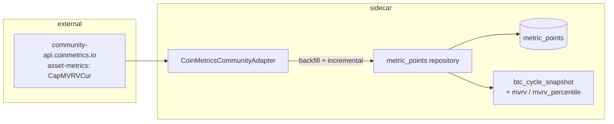

# 0057 — On-chain valuation metrics: MVRV, SOPR, realized cap

> **Status:** approved (2026-06-09)
> **Created:** 2026-06-09
> **Owner skill(s):** dev, human
> **Related ADRs:** [ADR-0053](../adrs/0053-onchain-valuation-source.md) (implements; accepts at close), [ADR-0051](../adrs/0051-historized-metric-series-contract.md) (storage), [ADR-0019](../adrs/0019-external-http-adapter-resilience.md)

## TL;DR

The deep half of BTC cycle analysis: a keyless `CoinMetricsCommunityAdapter` backfills full daily MVRV history (`CapMVRVCur`, to 2011-12-29) into one ADR-0051 series (`coinmetrics.btc.mvrv`). MVRV folds into Plan 0055's `btc_cycle_snapshot`, joining Mayer/200W as a valuation lens. First user-visible behavior: `btc_cycle_snapshot` gains `mvrv` and `mvrv_percentile` fields with full-history percentile context.

> **Scope reduced to MVRV-only after the phase-1 probe (2026-06-14):** realized cap (`CapRealUSD`) and SOPR are paywalled on the CoinMetrics community tier, and the blockchain.com MVRV cross-check endpoint is gone. A free-source sweep found SOPR only via bgeometrics (4-year window, 10 req/hr, single small vendor) and no keyless realized cap; the user chose not to take on that vendor for a metric Plan 0059 does not consume. See the phase-1 verdict note below and ADR-0053's probe-outcome section.

## Context & problem

Mayer Multiple and 200W-MA distance (Plan 0055) read the cycle from price alone; MVRV/SOPR read it from on-chain cost basis — the metrics the user's "BTC cycles meta information" interest actually points at. The 2026-06-09 verification established the free-source landscape (CoinMetrics community: all three metrics likely, keyless, 10 req/6s documented; blockchain.com: MVRV only) and ADR-0053 picked CoinMetrics-primary on that evidence, with two facts still needing a live probe (SOPR community coverage; exact history depth).

## Decision

Implement ADR-0053 at the scope the phase-1 probe established: one CoinMetrics community adapter, **one registered series (`coinmetrics.btc.mvrv`)**, full backfill + idempotent incremental update. Realized-cap and SOPR series are dropped (paywalled keyless); the blockchain.com cross-check (original phase 3) is cut — no working free MVRV cross-check remains. The probe-first design worked as intended: it caught the 1-of-3 reality before any adapter was built. MVRV-only still satisfies the consumer — Plan 0059's exogenous feature list names MVRV, not SOPR/realized-cap.

## Architecture diagram



## Implementation phases

### Phase 1 — Live coverage probe
- **Owner skill:** `human`
- **What:** The two probes ADR-0053 names, from the user's network: the CoinMetrics community `asset-metrics` call for `CapMVRVCur,CapRealUSD,SOPR` (which metrics return, earliest timestamp, page shape) and the blockchain.com `charts/mvrv?timespan=all&sampled=false` call (depth, cadence). Capture both responses as fixtures for the adapter tests.
- **Files touched:** fixture files under `tests/`.
- **Done when:** Both raw responses are saved; the metric coverage verdict (SOPR present or absent) is recorded in this plan file as an honesty note, and — if `CapMVRVCur` itself is absent — the plan stops and goes back to architect per ADR-0053's reversion clause.

> **Phase-1 probe verdict (2026-06-14, run from the user's network):**
> - **MVRV (`CapMVRVCur`): AVAILABLE keyless**, full daily history back to **2011-12-29** (verified: `0.85308817` on that date; current ~1.20). Ascending order when the window is bounded by `end_time`; descending-from-latest otherwise.
> - **Realized cap (`CapRealUSD`): `forbidden`** without paid credentials — NOT available on the community tier.
> - **SOPR: `forbidden`** without paid credentials — NOT available on the community tier.
> - **blockchain.com MVRV cross-check** (`charts/mvrv` and `charts/market-value-to-realized-value`): both return `not-found` — the phase-3 source named in ADR-0053 appears removed.
>
> `CapMVRVCur` is present, so the plan does **not** hit ADR-0053's hard-revert clause. But two of the three series and the cross-check source are gone, which exceeds the contingency ADR-0053 anticipated (SOPR-only absence). A free-source sweep (2026-06-14) found SOPR only via bgeometrics `/v1/sopr` (4-year window, 10 req/hr keyless, single small vendor) and **no** keyless realized cap. **Resolved (user, 2026-06-14): MVRV-only.** The plan below is amended to that scope — phases 2 and 4 are now **dev-ready**; phase 3 (cross-check) is cut. Plan 0059 is unblocked: its exogenous feature list names MVRV, not SOPR/realized-cap.

### Phase 2 — Adapter + backfill
- **Owner skill:** `dev`
- **What:** `CoinMetricsCommunityAdapter` (ResilientHttpClient subclass; paced under the documented 10 req/6s; typed errors), `fetch_series` over paged `asset-metrics` for **`CapMVRVCur` only**, daily cadence; register the single series `coinmetrics.btc.mvrv`; full backfill + idempotent incremental. Earliest history is 2011-12-29 — note the API returns descending-from-latest unless the window is `end_time`-bounded, so page with bounded windows to keep backfill contiguous and complete.
- **Files touched:** `data/adapters/coinmetrics.py`, `data/metric_series.py`, tests (phase-1 fixtures).
- **Done when:** (a) backfill from the fixture lands one MVRV point/day with exact values (no float drift); (b) paging is proven against a multi-page fixture (contiguous, deduplicated, terminates, reaches 2011-12-29); (c) re-run is idempotent; (d) pacing is asserted the way Plan 0034 pinned its RPC spacing — exactly-one pause per burst boundary against a fake clock.

### Phase 3 — MVRV cross-check — CUT (2026-06-14 probe)
- **Owner skill:** `dev`
- **CUT:** the blockchain.com `mvrv` cross-check endpoint is gone (`not-found`), and no other free MVRV source with usable history exists (bgeometrics MVRV is a 4-year window behind a 10 req/hr keyless limit). With no independent free computation to compare against, this phase is removed rather than built against a dead source. CoinMetrics' MVRV definition is published + versioned (checkable against the spec), the epistemic floor we accept for v1. Re-adding a cross-check is a future followup if a credible free source reappears.

### Phase 4 — Fold into the cycle snapshot
- **Owner skill:** `dev`
- **What:** `btc_cycle_snapshot` (Plan 0055) gains `mvrv` and `mvrv_percentile` (trailing full-history percentile — a cycle-position read), read from the store via `as_of`/`range`, `None` when absent.
- **Files touched:** `api/mcp_tools/cycle_snapshot.py`, tests.
- **Done when:** (a) percentile is trailing-only — asserted by injecting a future point that must not shift it; (b) absent series yield `None` fields, and the tool's output model documents which fields are conditional; (c) snapshot values match hand-computed fixture values exactly.

## Data shapes

```python
# illustrative — fields added to BtcCycleSnapshot (Plan 0055)
mvrv: float | None
mvrv_percentile: float | None     # trailing percentile over full stored history, 0–100
```

## Risks & open questions

- **SOPR + realized cap turned out paywalled keyless** (phase-1 probe) — resolved by reducing scope to MVRV-only; Plan 0059 is unaffected (it names MVRV, not the others). Re-adding them is a future plan if a paid budget or a credible free source appears.
- **No MVRV cross-check** (blockchain.com endpoint removed) — v1 trusts CoinMetrics' single published, versioned computation; phase 3 cut accordingly.
- **Community-tier revocability:** accrued points are ours even if the source trims later (ADR-0051); incremental updates would stop, surfaced as typed upstream errors, never silent staleness.
- Sequencing: migration-free by design (rides 0055's table); independent of other in-flight plans.

## What this plan does NOT do

- No NUPL, exchange-flow, supply-age, or miner metrics — same contract, future registry entries if wanted.
- No ETH or multi-asset coverage (BTC-centric per ADR-0053).
- No forecast integration (Plan 0059) and no UI.

## Followups (after this lands)

- (fill as discovered)
