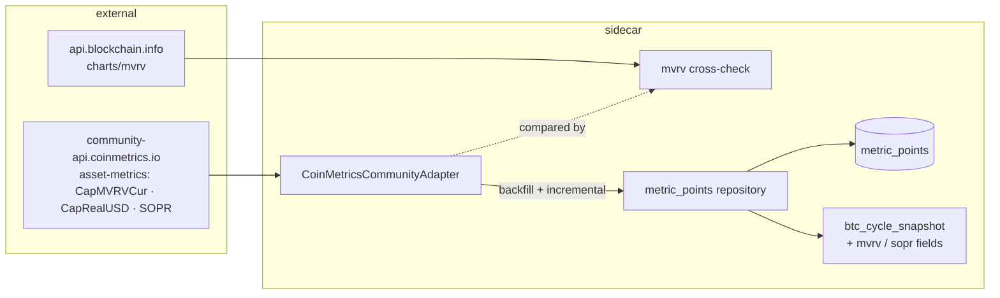

# 0057 — On-chain valuation metrics: MVRV, SOPR, realized cap

> **Status:** approved (2026-06-09)
> **Created:** 2026-06-09
> **Owner skill(s):** dev, human
> **Related ADRs:** [ADR-0053](../adrs/0053-onchain-valuation-source.md) (implements; accepts at close), [ADR-0051](../adrs/0051-historized-metric-series-contract.md) (storage), [ADR-0019](../adrs/0019-external-http-adapter-resilience.md)

## TL;DR

The deep half of BTC cycle analysis: a keyless `CoinMetricsCommunityAdapter` backfills full daily history for `CapMVRVCur` (MVRV), `CapRealUSD` (realized cap), and `SOPR` (presence to be confirmed by the phase-1 probe) into ADR-0051 series, cross-checked against blockchain.com's independent MVRV computation. Cycle metrics fold into Plan 0055's `btc_cycle_snapshot` (MVRV joins Mayer/200W as a valuation lens). First user-visible behavior: `btc_cycle_snapshot` gains `mvrv` and `sopr_7d_mean` fields with full-history percentile context.

## Context & problem

Mayer Multiple and 200W-MA distance (Plan 0055) read the cycle from price alone; MVRV/SOPR read it from on-chain cost basis — the metrics the user's "BTC cycles meta information" interest actually points at. The 2026-06-09 verification established the free-source landscape (CoinMetrics community: all three metrics likely, keyless, 10 req/6s documented; blockchain.com: MVRV only) and ADR-0053 picked CoinMetrics-primary on that evidence, with two facts still needing a live probe (SOPR community coverage; exact history depth).

## Decision

Implement ADR-0053: one CoinMetrics community adapter, three registered series (`coinmetrics.btc.mvrv`, `.realized_cap`, `.sopr`), full backfill + incremental update, blockchain.com as an MVRV cross-check only. The plan is probe-first and written to survive SOPR's absence (drop the series, note it in the ADR) — per ADR-0053's contingency.

## Architecture diagram



## Implementation phases

### Phase 1 — Live coverage probe
- **Owner skill:** `human`
- **What:** The two probes ADR-0053 names, from the user's network: the CoinMetrics community `asset-metrics` call for `CapMVRVCur,CapRealUSD,SOPR` (which metrics return, earliest timestamp, page shape) and the blockchain.com `charts/mvrv?timespan=all&sampled=false` call (depth, cadence). Capture both responses as fixtures for the adapter tests.
- **Files touched:** fixture files under `tests/`.
- **Done when:** Both raw responses are saved; the metric coverage verdict (SOPR present or absent) is recorded in this plan file as an honesty note, and — if `CapMVRVCur` itself is absent — the plan stops and goes back to architect per ADR-0053's reversion clause.

### Phase 2 — Adapter + backfill
- **Owner skill:** `dev`
- **What:** `CoinMetricsCommunityAdapter` (ResilientHttpClient subclass; paced under the documented 10 req/6s; typed errors), `fetch_series` over paged `asset-metrics`, daily cadence; register the confirmed series; full backfill + idempotent incremental.
- **Files touched:** `data/adapters/coinmetrics.py`, `data/metric_series.py`, tests (phase-1 fixtures).
- **Done when:** (a) backfill from the fixture lands one point/day per confirmed metric with exact values (no float drift); (b) paging is proven against a multi-page fixture (contiguous, deduplicated, terminates); (c) re-run is idempotent; (d) pacing is asserted the way Plan 0034 pinned its RPC spacing — exactly-one pause per burst boundary against a fake clock.

### Phase 3 — MVRV cross-check
- **Owner skill:** `dev`
- **What:** A comparison step (test-time + an opt-in maintenance path, not a runtime dependency): blockchain.com `mvrv` vs CoinMetrics `CapMVRVCur` over their overlap window; relative tolerance pinned at implementation from the fixtures' observed agreement (the two compute the same definition independently — expect close agreement; document the observed delta).
- **Files touched:** `data/adapters/blockchain_charts.py` (thin, MVRV-only), comparison test, tests.
- **Done when:** The cross-check test passes within the pinned tolerance on the fixture overlap, and a deliberately perturbed point fails it — the check is proven able to catch drift, not just pass.

### Phase 4 — Fold into the cycle snapshot
- **Owner skill:** `dev`
- **What:** `btc_cycle_snapshot` (Plan 0055) gains `mvrv`, `mvrv_percentile` (trailing full-history percentile — a cycle-position read), and `sopr_7d_mean` (if confirmed); all read from the store via `as_of`/`range`, `None` when absent.
- **Files touched:** `api/mcp_tools/cycle_snapshot.py`, tests.
- **Done when:** (a) percentile is trailing-only — asserted by injecting a future point that must not shift it; (b) absent series yield `None` fields, and the tool's output model documents which fields are conditional; (c) snapshot values match hand-computed fixture values exactly.

## Data shapes

```python
# illustrative — fields added to BtcCycleSnapshot (Plan 0055)
mvrv: float | None
mvrv_percentile: float | None     # trailing percentile over full stored history, 0–100
sopr_7d_mean: float | None        # only if SOPR confirmed by phase 1
```

## Risks & open questions

- **SOPR may be absent from community data** (CoinMetrics has retired community metrics before) — the plan survives it by design; Plan 0059's feature list loses one column and ADR-0053 gains a note.
- **Community-tier revocability:** accrued points are ours even if the source trims later (ADR-0051); incremental updates would stop, surfaced as typed upstream errors, never silent staleness.
- **Cross-check disagreement** beyond tolerance is a finding, not a blocker: investigate which source's definition shifted; the ADR records the outcome.
- Sequencing: migration-free by design (rides 0055's table) — parallel-able with 0056/0058 in worktrees after 0055 lands.

## What this plan does NOT do

- No NUPL, exchange-flow, supply-age, or miner metrics — same contract, future registry entries if wanted.
- No ETH or multi-asset coverage (BTC-centric per ADR-0053).
- No forecast integration (Plan 0059) and no UI.

## Followups (after this lands)

- (fill as discovered)
