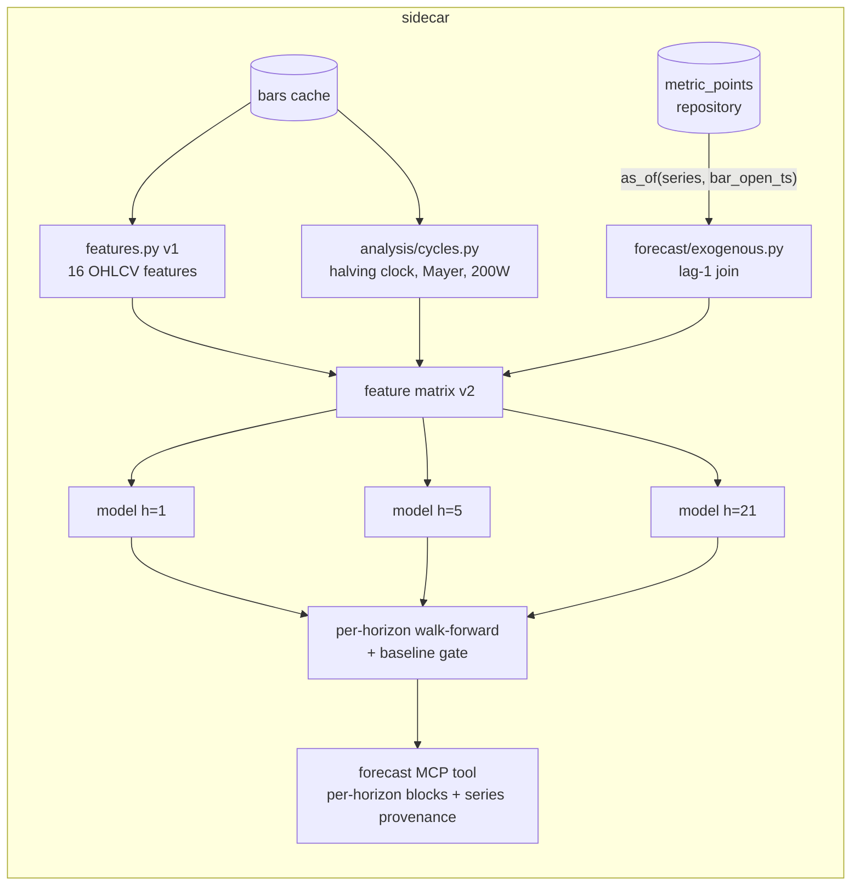

# 0059 — Forecast feature-set v2: exogenous crypto features + multi-horizon

> **Status:** approved (2026-06-09)
> **Created:** 2026-06-09
> **Owner skill(s):** dev, backtester
> **Related ADRs:** [ADR-0054](../adrs/0054-exogenous-forecast-features-multi-horizon.md) (implements; accepts at close), [ADR-0051](../adrs/0051-historized-metric-series-contract.md) (the `as_of` join it consumes), [ADR-0030](0030-forecasting-subsystem.md) / [ADR-0040](../adrs/0040-forecasting-model-artifacts.md) (invariants + versioning that carry over)

## TL;DR

Extend the Plan 0036 forecast pipeline from 16 single-symbol OHLCV features to a v2 set that adds BTC cycle features (halving clock, Mayer Multiple, 200W-MA distance — from Plan 0055's `analysis/cycles.py`) and exogenous historized series (Fear & Greed, BTC dominance, funding rate, open interest, MVRV — from Plans 0055/0056/0057), joined **lag-1 as-of** per ADR-0054 so publication-lag lookahead is structurally impossible. Add multi-horizon forecasts (1 / 5 / 21 bars on daily), each horizon trained and baseline-gated independently. First user-visible behavior: `forecast` on `BTC-USD 1d` returns up to three horizon blocks, each with its own probabilities-or-no-edge verdict, with provenance naming every exogenous series consumed.

## Context & problem

The 2026-06-09 gap review found the forecast pillar structurally sound (walk-forward gated, honest no-edge) but informationally narrow: 16 features, all derived from the target symbol's own bars — no cycle position, no sentiment, no derivatives posture, no dominance. For BTC specifically, the user explicitly wants cycle/meta information in the model's view. Plans 0055–0057 made those series available historically (all three closed by 2026-06-15 — F&G/dominance/funding/OI/MVRV are populated in `metric_points`; note 0057's reshape shipped **MVRV only**, which is all this plan names); this plan is the join, and it is fully unblocked. Separately, next-bar-only output is too short a view for cycle-aware analysis; ADR-0030 already reserves N-bar horizons — this plan ships them.

## Decision

Implement ADR-0054 exactly: exogenous features read through the metrics repository's `as_of` lookup bounded at **bar open time** (lag-1); rows with missing exogenous values are dropped from training, never filled; cycle features (computed from constants + cached bars) join as ordinary trailing features. The v2 feature list is frozen in code next to v1; `FEATURE_SET_ID` changes, so every v2 model gets a new `model_version` (ADR-0040). Horizons `{1, 5, 21}` bars each get an independent walk-forward validation + baseline gate; the `forecast` tool returns a per-horizon block. We rejected same-bar joins (publication-lag leakage, undetectable by walk-forward) and a multi-output model (one gate would cover three claims) per ADR-0054.

## Architecture diagram



## Implementation phases

### Phase 1 — Exogenous join machinery
- **Owner skill:** `dev`
- **What:** `forecast/exogenous.py`: given bars + a list of `series_id`s, produce per-bar feature columns via the metrics repository `as_of` lookup bounded at bar **open** ts; NaN where no point exists; deterministic ordering.
- **Files touched:** `src/market_analyser/forecast/exogenous.py`, tests under `tests/forecast/`.
- **Done when:** (a) a test inserts a metric point timestamped *inside* bar `i` (between open and close) and proves bar `i`'s feature row does **not** see it but bar `i+1`'s does — the lag-1 guarantee asserted directly; (b) a perturbation test changes a *future* metric point and asserts every feature row at or before that point's bar is byte-identical; (c) a missing-series test yields NaN columns, not zeros.

### Phase 2 — Feature-set v2 + row policy + versioning
- **Owner skill:** `dev`
- **What:** Frozen `FEATURE_NAMES_V2` (v1's 16 + `halving_phase`, `days_since_halving`, `mayer_multiple`, `dist_200w_ma`, `fng_value`, `fng_delta_7`, `btc_dominance`, `dominance_delta_7`, `funding_rate`, `oi_delta_7`, `mvrv` — exact list pinned in code at implementation, this is the intended shape); training-row drop on any NaN exogenous value; `FEATURE_SET_ID` recomputed; v1 remains importable and reproducible.
- **Files touched:** `src/market_analyser/forecast/features.py`, `forecast/model.py`, tests.
- **Done when:** (a) the `model_version` change-matrix test from Plan 0036 extends to prove v1→v2 changes the hash and that v1's hash is unchanged from its pinned value; (b) a row-policy test proves a bar with a missing exogenous value is absent from the training matrix and present again once the series warms; (c) the existing determinism golden pattern (byte-identical probabilities, seeded, single-threaded) passes for a v2 model on the BTC fixture.

### Phase 3 — Multi-horizon validation + tool surface
- **Owner skill:** `dev`
- **What:** Horizon set `{1, 5, 21}` (daily bars; other timeframes keep `{1}` for now). Per-horizon: labels, horizon-purged walk-forward, baseline gate, registry artifact. `forecast` tool returns a list of horizon blocks; provenance gains `series_inputs: [{series_id, last_point_ts}]`. Respect ADR-0046 size discipline.
- **Files touched:** `src/market_analyser/forecast/validation.py`, `forecast/registry.py`, `api/mcp_tools/forecast.py`, tests.
- **Done when:** (a) a test constructs data with genuine 1-bar signal and shuffled 21-bar labels and asserts h=1 ships probabilities while h=21 returns no-edge **in the same call** — per-horizon independence asserted; (b) the purge test proves training labels overlapping a fold's test window are excluded at h=21 (the widest overlap); (c) tool response round-trips with `series_inputs` populated and each block carrying its own `beats_baseline`/skill/baseline numbers.

### Phase 4 — v1-vs-v2 empirical read
- **Owner skill:** `backtester`
- **What:** Run v1 and v2 walk-forward on `BTC-USD 1d` (longest cached history) for each horizon; write a comparison artifact under `runs/analysis/` recording skill, baseline, beats-baseline per cell. This is an honesty checkpoint, not a gate — v2 losing is a valid, recorded outcome.
- **Files touched:** `runs/analysis/` artifact only (no source changes).
- **Done when:** The artifact exists with all six cells (2 feature sets × 3 horizons... v1 at h=1 only where v1 is defined — minimum four cells: v1 h=1, v2 h=1/5/21), each cell carrying skill vs baseline; the close review reads the numbers as shipped, whatever they say.

## Data shapes

```python
# illustrative — per-horizon forecast block in the tool response
class HorizonForecast(BaseModel):
    horizon_bars: int                  # 1 | 5 | 21
    prob_up: float | None              # None = no-edge for this horizon
    prob_down: float | None
    prob_flat: float | None
    skill: float
    baseline: float
    beats_baseline: bool
    marginal_edge: bool                # Plan 0050's qualifier carries over

class SeriesInput(BaseModel):
    series_id: str                     # e.g. "fng.value"
    last_point_ts: int                 # provenance: freshest point consumed
```

## Risks & open questions

- **Warm-up shrinks v2's training set** (dominance accrues only from Plan 0055's deployment; OI history is shallow). Early v2 runs may train on far fewer rows than v1 — the phase-4 artifact makes this visible instead of hidden. Mitigation: none needed beyond honesty; the gate decides.
- **Feature list drift between this plan and the landed series ids.** The phase-2 list is intent; if a Plan 0056/0057 series ships under a different id or not at all, the implementer pins the real list and notes the delta — that's an honesty fix, not a plan amendment.
- **Three horizons × walk-forward per call is slower.** If the tool becomes annoying, cap default horizons to `{1}` with opt-in for the rest; decide at implementation by measured runtime.
- Open question: should `fng_delta_7`-style derived features live in the pipeline or as registry series? Default: derive in-pipeline (keeps the registry raw-observations-only); implementer may push back at phase 2.

## What this plan does NOT do

- No regime-conditioned models (user deferred).
- No new data sources — strictly a consumer of 0055/0056/0057.
- No UI change: Plan 0037's forecast panel renders what the tool returns; multi-horizon presentation is a small follow-up to 0037 if wanted.
- No deep learning, no new model family (ADR-0030 posture unchanged).

## Followups (after this lands)

- (fill as discovered)
