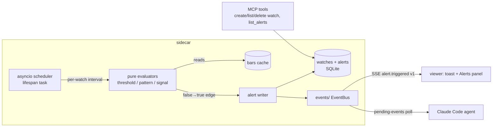

# 0060 — Watchlist alerting loop

> **Status:** in-progress (2026-07-02)
> **Created:** 2026-06-09
> **Owner skill(s):** dev, ui-builder
> **Related ADRs:** [ADR-0055](../adrs/0055-in-sidecar-watch-scheduler.md) (implements; accepts at close), [ADR-0016](../adrs/0016-standalone-sidecar-mode.md), [ADR-0017](../adrs/0017-live-ui-updates-via-sse.md), [ADR-0021](../adrs/0021-renderer-to-agent-feedback.md), [ADR-0029](../adrs/0029-advisory-recommendation-boundary.md) (the boundary alerts must not cross)

## TL;DR

Give the app its first unprompted voice: persisted watch definitions ("BTC-USD 1d RSI crosses below 30", "hammer printed on ETH-USD 4h", "rsi_stop strategy emits a fresh signal") evaluated by an asyncio scheduler inside the always-on sidecar, firing **edge-triggered**, condition-only alerts as `alert.triggered v1` SSE events — toast + history panel in the viewer, pollable pending-events for the agent. First user-visible behavior: create a watch via MCP tool, drop RSI below the threshold in cached data, see the alert toast appear without anyone asking anything.

## Context & problem

Everything signal-shaped today is pull-on-demand. The 2026-06-09 gap review named this the missing delivery half of "signals": primitives exist (`analyze_symbol`, `evaluate_signals`, patterns), but nothing watches them. The sidecar is the natural host — standalone, always-on (ADR-0016), already owns the cache and both delivery channels (SSE + agent pending-events). The advisor (Plan 0038) answers "what should I consider doing"; this plan answers "tell me when the condition I care about occurs" — facts, not advice, per the analyst non-negotiable.

## Decision

Implement ADR-0055: an in-lifespan asyncio scheduler; watches + alert history in SQLite (one migration — **serializes against other migration plans**: 0035, 0044, 0053); three watch kinds in v1, each wrapping an existing read-only primitive (indicator threshold, pattern occurrence, strategy signal via `evaluate_signals`); edge-triggered firing (false→true transition between consecutive evaluations); condition-only payloads. We rejected agent-side polling loops (alive only while a session pays for it), Electron-main timers (viewer is closeable by design), and OS schedulers (cold-start, no in-process edge state) per ADR-0055.

## Architecture diagram



## Implementation phases

### Phase 1 — Persistence: watches + alerts
- **Owner skill:** `dev`
- **What:** Migration adding `watches` (id, symbol, timeframe, kind, params JSON, interval, enabled, last_state, created_at) and `alerts` (id, watch_id, fired_at, payload JSON) tables; SQLAlchemy models + repositories; boundary-validated pydantic models for watch params per kind.
- **Files touched:** `persistence/migrations/versions/000N_watches_alerts.py`, `persistence/models/watches.py`, `persistence/repositories/watches.py`, `src/market_analyser/alerts/types.py`, tests.
- **Done when:** Repository round-trips each watch kind's params through JSON with validation rejecting unknown kinds/malformed params at the boundary; `last_state` persists across a simulated restart (the edge-detector's memory survives process death — asserted by writing state, reopening the repo, reading it back).

### Phase 2 — Evaluators + edge semantics (pure core)
- **Owner skill:** `dev`
- **What:** `alerts/evaluate.py`: pure functions `(watch, bars) -> bool` for the three kinds — indicator threshold (indicator id from the ADR-0023 surface + operator + level, evaluated on the latest **closed** bar), pattern occurrence (pattern name appears on the latest closed bar), strategy signal (wraps `backtest/live_signal.py`, true iff `fresh_signal`); plus the edge-transition reducer `(last_state, current) -> fire?`. No wall-clock, no I/O — the scheduler injects bars.
- **Files touched:** `src/market_analyser/alerts/evaluate.py`, tests.
- **Done when:** (a) threshold tests assert evaluation reads only the latest *closed* bar (a forming-bar value crossing the level does **not** fire — no-lookahead carried to alerting); (b) the edge reducer proves false→true fires, true→true does not (a condition staying true across N polls yields exactly one alert), and true→false→true fires again; (c) each evaluator is proven pure by calling twice with identical inputs and asserting identical outputs.

### Phase 3 — Scheduler + event + tools
- **Owner skill:** `dev`
- **What:** Lifespan-managed asyncio task ticking enabled watches at their intervals (wall-clock confined here); fetches bars via the existing provider/cache path; on fire: alert row + `alert.triggered v1` envelope on the EventBus (reaching SSE and the pending-events queue per ADR-0021). MCP tools `create_watch`, `list_watches`, `delete_watch`, `list_alerts` (paged per ADR-0046). A scheduler heartbeat (last-tick timestamp) exposed on an existing health/status surface.
- **Files touched:** `src/market_analyser/alerts/scheduler.py`, `api/app.py` (lifespan), `events/` schema, `api/mcp_tools/watches.py`, tests.
- **Done when:** (a) an integration test with a fake clock + seeded cache creates a watch, advances bars across the threshold, and observes exactly one `alert.triggered v1` envelope with a condition-only payload (schema test asserts no recommendation-shaped fields exist); (b) the full-toolset registration test grows the four new tools; (c) heartbeat reflects the last tick and a deliberately-raised evaluator exception is contained (scheduler keeps ticking other watches, error surfaced in the heartbeat status — asserted).

### Phase 4 — Alerts surface in the viewer
- **Owner skill:** `ui-builder`
- **What:** SSE-reactive toast on `alert.triggered v1`; an Alerts view listing history (newest first) and watches with enable/disable (via a renderer-gated route added in phase 3's tool plumbing or a thin `POST /watches/{id}` — implementer picks the minimal correct seam consistent with the typed fetch client); theme-token styling.
- **Files touched:** `desktop/renderer/` (new view + nav tab, `api/client.ts`, event types mirror + Zod), tests.
- **Done when:** (a) a pushed fake SSE alert renders a toast and prepends a row to the history list (component test); (b) disabling a watch round-trips and the list reflects it; (c) Zod-validates the alert payload at the SSE boundary (per the standing SSE-validation follow-up pattern) — malformed payload is dropped with a logged warning, not rendered.

## Data shapes

```python
# illustrative — watch + alert payload
class Watch(BaseModel):
    id: int
    symbol: str
    timeframe: str                      # canonical registry value
    kind: Literal["indicator_threshold", "pattern", "strategy_signal"]
    params: dict                        # kind-discriminated, validated at boundary
    interval_seconds: int               # default: bar period
    enabled: bool

class AlertPayloadV1(BaseModel):
    watch_id: int
    symbol: str
    timeframe: str
    kind: str
    fired_at: datetime
    condition: str                      # human-readable fact, e.g. "RSI(14) 28.4 < 30"
    values: dict[str, float]            # the numbers behind the fact
    # deliberately absent: direction, action, conviction — ADR-0029 boundary
```

## Risks & open questions

- **Upstream rate limits scale with watch count.** Each tick may hit the bars-refresh path. Mitigation: per-symbol fetch coalescing (one fetch serves all watches on the same symbol+timeframe per tick) — phase 3 requirement, asserted in its integration test if cheap, otherwise documented.
- **Scheduler wedging is silent by nature.** The heartbeat is the mitigation; phase 3's contained-exception test is the proof it degrades loudly, not quietly.
- **Migration-chain collision:** phase 1 adds a migration — do not run this plan in a worktree parallel to 0035/0044/0053 or any other migration-adding plan.
- Open question: should `create_watch` be agent-only (MCP) or also renderer-exposed? v1 default: agent creates, viewer manages (enable/disable/delete) — matching the "agent drives, viewer visualizes" grain (ADR-0015). Revisit if the user wants in-app creation.

## What this plan does NOT do

- No forecast-based watches (heavyweight per-call validation; deferred per ADR-0055).
- No OS-level notifications (tray/balloon) — viewer toast + agent poll only; a packaging-era follow-up.
- No advice in alerts, ever — that's the advisor's lane (Plan 0038).
- No tick-level or intra-bar alerting — bar-close semantics only.

## Followups (after this lands)

- (fill as discovered)
