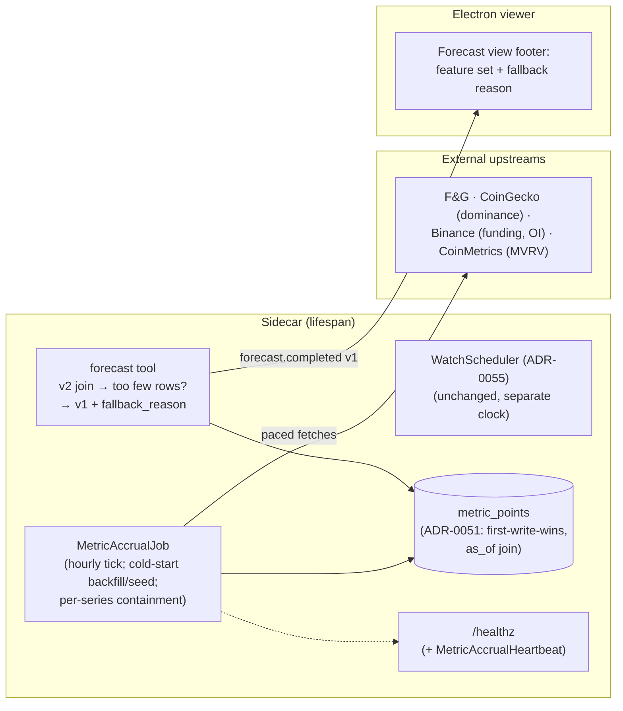

# 0061 — Metric-store self-warming + honest starved-forecast fallback

> **Status:** draft
> **Created:** 2026-07-06
> **Owner skill(s):** dev, ui-builder, human
> **Related ADRs:** [ADR-0056](../adrs/0056-self-warming-metric-store.md) (paired — proposed, accepts at this plan's close), [ADR-0051](../adrs/0051-historized-metric-series-contract.md) (the store contract), [ADR-0054](../adrs/0054-exogenous-forecast-features-multi-horizon.md) (the v2 feature set + the stated-not-silent fallback this extends), [ADR-0055](../adrs/0055-in-sidecar-watch-scheduler.md) (the lifespan-loop pattern), [ADR-0030](../adrs/0030-forecasting-subsystem.md) (honest uncertainty — the invariant the vacuous no-edge violates in spirit)
> **Related plans:** [Plan 0055](done/0055-cycle-macro-series-spine.md)/[0056](done/0056-binance-derivatives-data.md)/[0057](done/0057-onchain-valuation-mvrv.md) (built the sources + store this drives), [Plan 0059](done/0059-forecast-feature-set-v2.md) (the v2 set whose evaluability this unblocks; its phase-4 read found the store empty), [Plan 0037](done/0037-forecast-ui-surface.md) (the panel that surfaces the fallback statement)

## TL;DR

Two fixes, one goal: the forecast stops being starved and stops being silent about starvation. (1) The sidecar **self-warms the metric store**: a metric-accrual job rides the app lifespan (the ADR-0055 pattern), ticking hourly (config-adjustable, on by default with a `config.json` off-switch) and topping up all five exogenous series the v2 feature set requires — full-history backfill on first tick for the backfillable three (F&G, funding, MVRV), seed-then-accrue for open interest, bucket accrual for dominance — with per-series failure containment and a per-series heartbeat on `/healthz`. (2) The `forecast` tool stops returning a **vacuous no-edge on a wired-but-starved store** (the 2026-07-06 production finding: zero points → every v2 row dropped → `n_scored=0` rendered as if it were an evaluated verdict): when the v2 join yields too few rows to run the requested walk-forward, the tool computes on the v1 set and **states the fallback and its reason in provenance**; the Forecast panel renders the reason. First user-visible behavior: boot the sidecar, and within one tick a `forecast BTC-USD` returns a genuinely evaluated v1 result (the manual 2026-07-06 run of the same core: no edge at 1d/5d, 21d beating baseline 57.6% vs 49.5% calling down) with "v2 unavailable: exogenous store has insufficient history" stated, not implied.

## Context & problem

Plan 0059's phase-4 honesty read and an independent 2026-07-06 session both hit the same wall: **all five exogenous series had zero points in the production store.** Two distinct defects compound here:

1. **Nothing accrues unattended.** Write-through and `refresh=true` paths exist (Plans 0055–0057) but fire only on tool calls; a month of no habit produced zero data. Dominance and open interest have no historical upstream — every un-accrued hour is permanently lost, so the v2 feature set's evaluable history is shrinking in real time. ADR-0056 decides the posture change (background accrual, on by default); this plan implements it.
2. **The starved forecast lies by omission.** With a store *wired but empty*, `_compute_multi_horizon_forecast` builds the v2 matrix, ADR-0054's row policy drops every bar missing an exogenous value, all rows drop, and the walk-forward returns `beats_baseline=false` with `n_scored=0` — which the tool ships and the panel renders as "no edge over baseline". That reads as a market verdict; it is actually "the model never saw a single row". The existing v1 fallback fires only on `metric_lookup=None` (store **unwired**), never on wired-but-starved. ADR-0030's honest-uncertainty invariant is violated in spirit: the number shown (no-edge) is honest, but the basis shown (a validation that scored nothing) is not a validation.

Fixing only (1) leaves the forecast vacuous for the weeks dominance/OI need to accrue join-surviving history; fixing only (2) leaves v2 permanently unevaluable. Both, together, make the panel honest today and progressively better without ceremony.

## Decision

Implement ADR-0056 as a dedicated `MetricAccrualJob` in the data layer (beside the sources it drives, `defi/` scan-job precedent), started from the app lifespan exactly like the watch scheduler (constructed only when persistence is wired; absent in the test app), with an hourly default tick, cold-start backfill/seed, per-series containment, and a heartbeat on `/healthz`. Extend the forecast's fallback trigger from "store unwired" to "store unwired **or** v2 join yields too few rows for the requested walk-forward", carrying the reason in a new optional `ForecastProvenance.fallback_reason` field (wire-absent when absent — the `exclude_none` discipline) that the Forecast panel's feature-set footer states out loud. We **reject** folding accrual into the watch scheduler, an external cron, and opt-in-by-default — rationale in ADR-0056's alternatives.

## Architecture diagram

## Implementation phases

### Phase 1 — `MetricAccrualJob` + lifespan wiring
- **Owner skill:** dev
- **What:** A `MetricAccrualJob` (new module `src/market_analyser/data/metric_accrual.py`) owning the five v2 series (`EXOGENOUS_SERIES_IDS_V2` is the duty list's source of truth — no second registry): each tick incrementally tops up F&G, funding, and MVRV from each series' latest stored timestamp (full-history backfill when empty — one-time, paced per each adapter's documented contract), takes one OI accrual sample (upstream-anchored ~30-day seed when empty, the Plan 0056 mechanism), and drops one dominance hourly bucket via the existing CoinGecko write-through. Sibling series the same upstream call already returns (e.g. ETHUSDT funding) may ride along; no extra calls for them. Per-series error containment (one failing upstream never blocks the others; failures logged with the series id) and a `MetricAccrualHeartbeat` (last tick, per-series last-success timestamp / last error) exposed on `/healthz` beside the scheduler heartbeat. Config: `metric_accrual_enabled: bool = True` and `metric_accrual_interval_seconds: int = 3600` on `AppConfig` (`src/market_analyser/config.py`); disabled or persistence-free → job not constructed (the watch-scheduler posture). All writes go through the existing `MetricPointsRepository` — no new write semantics.
- **Files touched:** `src/market_analyser/data/metric_accrual.py` (new), `src/market_analyser/api/app.py` (construct + lifespan task + `/healthz` state), `src/market_analyser/config.py`, `tests/data/test_metric_accrual.py` (new), the `/healthz` route test.
- **Done when:** With fake sources, a first tick against an empty store issues full-history fetches for F&G/funding/MVRV (spy-asserted `start=None`) and a seed+sample for OI; a second tick issues only incremental fetches (spy-asserted `start == latest stored ts`) and writes nothing new into an already-written hour (first-write-wins asserted through the real repository); one series' raising source leaves the other four accrued in the same tick (containment asserted); `metric_accrual_enabled=false` constructs no job and the fake sources record zero calls; `/healthz` carries the heartbeat with per-series status including the failed series' error; the job is absent in the persistence-free test app.

### Phase 2 — Starved-store fallback in the `forecast` tool
- **Owner skill:** dev
- **What:** In `_compute_multi_horizon_forecast`, when a metric store is wired but the v2 join yields fewer usable rows than the requested purged walk-forward needs (bound derived from `n_splits` — a named constant/derivation, not a magic number), compute on the v1 feature set instead and set the new `ForecastProvenance.fallback_reason` (e.g. `"v2 unavailable: exogenous store has insufficient history (N of M bars survived the join)"`). The unwired path sets the field too (`"metric store not wired"`), so every v1-on-fallback result says why. Field is `str | None = None`, `exclude_none`-absent when the v2 set genuinely ran — existing wire dumps do not move (the 0052 additive-field precedent). Mirror the field in `desktop/renderer/types/events.ts` + extend the parity guard.
- **Files touched:** `src/market_analyser/forecast/result.py` (`ForecastProvenance.fallback_reason`), `src/market_analyser/api/mcp_tools/forecast.py`, `desktop/renderer/types/events.ts` + `events.test.ts` (parity), `tests/api/test_forecast_tool.py`.
- **Done when:** A wired store with zero exogenous points produces a v1-featured result (`feature_set_id` = v1, empty `series_inputs`) whose every block carries a genuine `n_scored > 0` validation and whose provenance carries the insufficient-history `fallback_reason` — and the vacuous shape (`beats_baseline=false` with `n_scored=0` on all folds) is pinned as **no longer producible** from a starved store; a store with enough joined history runs v2 with `fallback_reason` absent on the wire (byte-stability of the existing dump asserted); the unwired path states its own reason; the TS parity guard covers the new field.

### Phase 3 — Surface the fallback reason in the Forecast panel
- **Owner skill:** ui-builder
- **What:** Add `fallback_reason` (`.nullish()`) to the `forecastCompleted` Zod schema and render it in the Forecast view's feature-set footer — one plain sentence beside the existing v1-fallback statement, same quiet styling (it is a data-provenance fact, not an alarm).
- **Files touched:** `desktop/renderer/schemas/forecastCompleted.ts`, `desktop/renderer/views/ForecastView.tsx` (+ module CSS if needed), `desktop/renderer/views/ForecastView.test.tsx`.
- **Done when:** A dispatched envelope whose provenance carries `fallback_reason` renders the reason text in the feature-set footer (spec-asserted through the real dispatcher, the 0037 pattern); an envelope without the field renders exactly today's footer (no regression spec); the Zod schema accepts both shapes.

### Phase 4 — Live smoke
- **Owner skill:** human
- **What:** Boot the real sidecar with a warm-from-empty store and verify the loop end to end.
- **Done when:** Within one tick of boot, `/healthz` shows the heartbeat with all five series succeeding and the store holds full F&G/funding/MVRV history plus an OI seed and a first dominance bucket; `forecast BTC-USD 1d` returns an evaluated v1 result (real `n_scored`, the fallback reason stated) and the Forecast panel shows the reason in the footer; after the sidecar has run past the next hour boundary, a second dominance/OI bucket exists (accrual confirmed live); flipping `metric_accrual_enabled` to `false` and rebooting produces no accrual traffic.

## Risks & open questions

- **Series completeness is now coupled to sidecar uptime.** Hours the process is down are permanent dominance/OI holes (dropped v2 rows forever, per ADR-0054's no-zero-fill rule). Accepted for a desktop app — named in ADR-0056's consequences; the as-of join tolerates gaps.
- **Cold-start burst.** First tick pulls ~15k points across three upstreams. Each adapter already paces per its documented contract (CoinMetrics 10 req/6s, Binance pagination); the job serializes series within a tick, so the burst is bounded and one-time. If a backfill exceeds the tick interval, the next tick simply resumes incrementally — no overlap guard needed beyond first-write-wins.
- **The v2 evaluability horizon is unchanged by this plan.** Even accruing perfectly, dominance/OI need months before enough joined rows survive for the v2 walk-forward at 1d; until then every forecast will honestly say v1 + reason. That is the designed behavior, not a deficiency to paper over.
- Open question (deliberately deferred): whether the accrual duty should ever cover series beyond the v2 five (a general "keep everything in the registry warm" posture). v1 answer: only the v2 five plus free-rider siblings — revisit when a consumer for other series exists.

## What this plan does NOT do

- No new exogenous series, no new sources, no v2 feature changes (ADR-0054's set is frozen).
- No retro-backfill for accrue-only series — structurally impossible; the plan starts the clock, it cannot rewind it.
- No promise of v2 edge — the walk-forward gate keeps deciding that; this plan only makes the verdict real instead of vacuous.
- No change to the watch scheduler, no external cron, no OS service.
- No forecast-side caching or auto-refresh — the tool computes on demand, as before.

## Followups (after this lands)

- Re-run the `runs/analysis/2026-07-06-plan-0059-v1-vs-v2/` comparison once dominance/OI have accrued enough history for the v2 join (calendar check-in, not code).
- Consider surfacing per-series freshness in the viewer (a Settings or status surface) if `/healthz` forensics prove too hidden.
