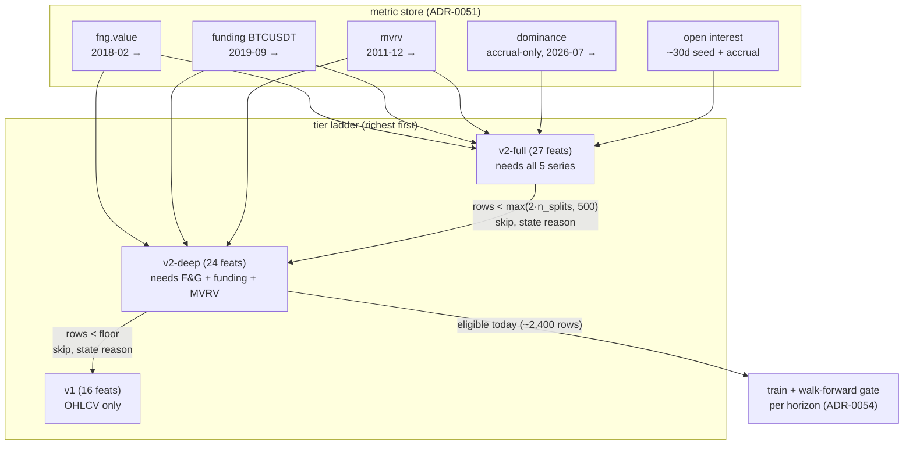

# 0062 — Tiered forecast feature sets (v2-deep) + the v1-vs-v2 evaluation, unblocked

> **Status:** in-progress
> **Created:** 2026-07-06
> **Owner skill(s):** dev, backtester, human
> **Related ADRs:** [ADR-0057](../adrs/0057-forecast-feature-set-tiers.md) (paired — accepts at this plan's close), [ADR-0054](../adrs/0054-exogenous-forecast-features-multi-horizon.md), [ADR-0030](../adrs/0030-forecasting-subsystem.md), [ADR-0051](../adrs/0051-historized-metric-series-contract.md), [ADR-0056](../adrs/0056-self-warming-metric-store.md), [ADR-0040](../adrs/0040-forecasting-model-artifacts.md)

## TL;DR

The v2 forecast feature set never reaches the model: its join is conjunctive across five exogenous series, and the two accrual-only ones (dominance, open interest) veto every historical bar — live `forecast BTC-USD 1d` reports `0 of 3109 bars survived the join` and falls back to v1. This plan adds a **v2-deep tier** (v2 minus the three accrual-fed features — 24 features over F&G/funding/MVRV plus the cycle features, ~2,400 BTC-USD 1d training rows from 2019-09) and a **richest-first ladder selection** (`v2-full → v2-deep → v1`, each exogenous tier eligible only past a 500-surviving-row floor, every skip stated in `fallback_reason`). Then the `backtester` re-runs the Plan 0059 phase-4 comparison that was unrunnable against an empty store — finally answering whether exogenous features add out-of-sample skill on BTC. An honest "still no edge" is an acceptable outcome (user-confirmed 2026-07-06).

## Context & problem

The user's 2026-07-06 report: "the forecast tool is not actionable, at least for BTC — what other information do we need? maybe new sources?" Investigation grounded two facts:

1. **The honest no-edge verdict is working as designed.** Live BTC-USD 1d: model skill 0.478–0.499 vs baseline 0.481–0.524 on all three horizons, `prob_* = null` — ADR-0030 invariant 4, not a bug. Because `recommend` requires the forecast leg to agree, the advisory chain goes flat too.
2. **But the verdict comes from the wrong feature set.** Every horizon carries `series_inputs: []` and `fallback_reason: "v2 unavailable: exogenous store has insufficient history (0 of 3109 bars survived the join…)"`. The Plan 0059 exogenous features — and the cycle features, which need no external data at all — are bypassed. The Plan 0061 accrual job *did* backfill F&G (3,074 pts), funding (7,475 pts), and MVRV (5,303 pts) to their full depth; the join still yields zero rows because dominance (no free history exists) and OI (~30-day upstream window) are missing for every historical bar and the row-drop rule is conjunctive.

So "new sources?" is premature: **the sources we already built can't reach the model, structurally.** Waiting on the ADR-0056 accrual clock means years before v2 has a meaningful daily-bar training population. The design decision — how a feature set should handle series with structurally different historical depth — is [ADR-0057](../adrs/0057-forecast-feature-set-tiers.md); this plan implements it and runs the evaluation it unblocks.

## Decision

Implement ADR-0057's fixed tier ladder. Add `v2-deep` — the 24-feature set dropping `btc_dominance`, `dominance_delta_7`, `oi_delta_7` from v2-full — with its own frozen name tuple and `feature_set_id`; select per call richest-first (`v2-full → v2-deep → v1`) with the exogenous tiers gated on `max(2·n_splits, MIN_TIER_ROWS=500)` surviving rows; state every skipped tier and its row count in `fallback_reason`. ADR-0054's lag-1 as-of join and no-imputation row-drop hold unchanged within each tier. Then refresh the `runs/analysis/` v1-vs-v2 comparison against the now-trainable deep tier. We rejected a NaN-native model (missingness ≡ era — a leakage-adjacent confound), buying/deriving dominance+OI history (vendor cost for unproven features), and waiting for accrual (years) — see ADR-0057.

## Architecture diagram



## Implementation phases

### Phase 1 — v2-deep feature set
- **Owner skill:** dev
- **What:** `FEATURE_NAMES_V2_DEEP` (24, frozen: v2-full minus `btc_dominance`, `dominance_delta_7`, `oi_delta_7`), `FEATURE_SET_ID_V2_DEEP`, `EXOGENOUS_SERIES_IDS_V2_DEEP` (F&G, funding-BTCUSDT, MVRV), and `build_feature_rows_v2_deep` (or a parameterized builder) reusing the existing exogenous-column machinery — the lag-1 join and NaN-drops-row semantics verbatim.
- **Files touched:** `src/market_analyser/forecast/features.py`, `src/market_analyser/forecast/exogenous.py` (if the column builder needs a series-subset parameter), tests under `tests/forecast/`.
- **Done when:** (a) the deep set is truncation-invariant per row (the ADR-0030 invariant-1 guard, same shape as v2-full's test); (b) v1's and v2-full's `FEATURE_SET_ID`s are pinned as literals and unmoved, and the deep id is pinned as a third literal; (c) **the defining behavior:** with dominance and OI series empty but F&G/funding/MVRV seeded, deep rows survive from the seeded intersection onward while `build_feature_rows_v2` yields zero usable rows on the same inputs; (d) a future-timestamped point in any deep series is byte-invisible to the matrix (the ADR-0054 perturbation test extended to the deep builder).

### Phase 2 — ladder selection in the forecast tool + provenance skip chain
- **Owner skill:** dev
- **What:** Replace the current binary v2/v1 fallback with the richest-first walk: count post-join surviving rows per tier, apply `max(2 * n_splits, MIN_TIER_ROWS)` (new named constant, 500) to the exogenous tiers, train the first eligible tier; `ForecastProvenance.fallback_reason` carries the full skip chain (each skipped tier named with its surviving-row count), `series_inputs` lists exactly the selected tier's consumed series.
- **Files touched:** `src/market_analyser/api/mcp_tools/forecast.py` (or wherever the v1-fallback trigger from Plan 0061 lives), `src/market_analyser/forecast/` selection helper, tests under `tests/api/` + `tests/forecast/`.
- **Done when:** (a) store absent/starved → v1 with the existing stated reason (no regression on Plan 0061's paths); (b) dominance+OI empty, deep series seeded across the bar window → **v2-deep trains**, provenance's `feature_set_id` is the deep id, `series_inputs` names exactly the three deep series, and `fallback_reason` names the v2-full skip with its row count; (c) all five series seeded past the floor → v2-full trains and `fallback_reason` is wire-absent (`exclude_none`, the Plan 0061 byte-stability property re-asserted); (d) a tier joinable at ≥ `2·n_splits` but < 500 rows is skipped (the floor is real, tested at the boundary); (e) the `recommend` tool and `forecast.completed` SSE flow the new provenance through unchanged (existing suites stay green — the fields are strings already on the wire).

### Phase 3 — the v1-vs-v2-deep comparison, finally run
- **Owner skill:** backtester
- **What:** Refresh the Plan 0059 phase-4 honesty artifact against a store where deep actually trains: v1 vs v2-deep on BTC-USD 1d, horizons {1, 5, 21}, seeded + deterministic, written to `runs/analysis/<date>-plan-0062-v1-vs-v2deep/` (summary + per-horizon validation dumps).
- **Files touched:** `runs/analysis/` artifact only (gitignored); no source changes.
- **Done when:** the artifact records, per horizon: surviving-row counts for both sets, out-of-sample skill vs both baselines, `edge_margin`/`edge_strength`, and a plain-language verdict — **recorded as it comes out, either way**. If deep underperforms v1, the ~600-row window difference (funding starts 2019-09) is explicitly called out as a confound, not smoothed over.

### Phase 4 — read the verdict, decide next
- **Owner skill:** human
- **What:** Read the phase-3 artifact. Decide: (a) edge appeared → the forecast/advisor chain is live for BTC, no new work; (b) no edge → accept honestly (the confirmed posture) and only then consider whether a *new-sources* plan (ADR-0057 Alternative B, or genuinely new feature families) has a concrete hypothesis behind it.
- **Files touched:** none.
- **Done when:** the user has stated the outcome in-session; the close ceremony records it in this plan's close note.

## Data shapes

```python
# illustrative — the deep tuple (24): v2-full minus the three accrual-fed features
FEATURE_NAMES_V2_DEEP: tuple[str, ...] = (
    *FEATURE_NAMES,            # the 16 v1 OHLCV features
    "halving_phase", "days_since_halving", "mayer_multiple", "dist_200w_ma",
    "fng_value", "fng_delta_7",
    "funding_rate",
    "mvrv",
)

MIN_TIER_ROWS = 500  # eligibility floor for exogenous tiers (ADR-0057; rough estimate)
```

Example `fallback_reason` (v2-deep selected):
`"v2-full unavailable: 3 of 3109 bars survived the join (floor 500); trained v2-deep (2412 rows)"`

## Risks & open questions

- **Risk: deep still shows no edge.** Likely, honestly — markets are near-efficient and v1 already loses to majority-class. Accepted end state (user-confirmed 2026-07-06); the value is that the answer becomes *evidence* instead of a starved non-run.
- **Risk: the takeover moment** (v2-full crossing 500 rows displaces a deeper-trained v2-deep). Guarded by the walk-forward gate; ADR-0057 carries the follow-up to re-compare at that moment. Not this plan's problem to solve.
- **Risk: builder duplication drift** — three feature sets sharing join machinery. Mitigation: phase 1 parameterizes one builder rather than copying it; the three id-pin literals catch accidental identity moves.
- **Open question: does the funding series' 2019-09 start cost deep more than the exogenous features gain?** Phase 3 measures it (v1 trains on ~3,100 rows, deep on ~2,400); the artifact must state the row counts beside the skill numbers.

## What this plan does NOT do

- **No new data sources.** Dominance/OI history purchases or derivations are ADR-0057 Alternative B — a future plan gated on phase 4's verdict.
- **No UI change.** The Forecast panel footer already renders `fallback_reason` (Plan 0061) and the provenance tooltip already shows `feature_set_id`; the richer strings flow through as data.
- **No change to ADR-0054's rules.** Lag-1 as-of and no-imputation hold within every tier; no NaN-native model, no zero-fill.
- **No ETH tiers.** The ETH funding/OI registry series stay non-inputs, as in v2-full.
- **No advisor/fusion changes.** If the forecast leg stays no-edge, `recommend` staying flat is correct behavior, not a defect of this plan.

## Followups (after this lands)

- When v2-full first becomes eligible (dominance/OI cross the floor — weeks on 1h, ~1.4y on 1d), re-run the comparison including v2-full and revisit ADR-0057's takeover rule (its Alternative C is the escape hatch).
