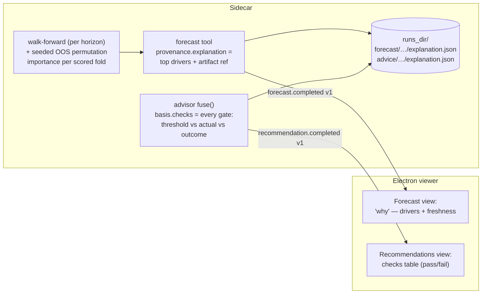

# 0063 — Forecast & recommendation explainability

> **Status:** approved (2026-07-06, user — "approve 63 but do not start"; factual anchors grounded against the tree at draft time in the same session: `ForecastProvenance`/`RecommendationBasis` field shapes, the `create_app(runs_dir=…)` seam, the 0061 provenance wire pin, the ADR-0029 field-set pins. **Not to be picked up yet** — serializes after Plan 0062, which reshapes the same fallback/provenance surface)
> **Created:** 2026-07-06
> **Owner skill(s):** dev, ui-builder, human
> **Related ADRs:** [ADR-0058](../adrs/0058-forecast-recommendation-explainability.md) (paired — proposed, accepts at this plan's close), [ADR-0030](../adrs/0030-forecasting-subsystem.md) (honest uncertainty), [ADR-0040](../adrs/0040-forecasting-model-artifacts.md) (provenance), [ADR-0054](../adrs/0054-exogenous-forecast-features-multi-horizon.md) (the v2 features being ranked), [ADR-0057](../adrs/0057-forecast-feature-set-tiers.md) (tier selection — this plan explains whichever tier trained), [ADR-0029](../adrs/0029-advisory-recommendation-boundary.md) (the basis that becomes replayable), [ADR-0046](../adrs/0046-mcp-large-result-delivery.md) (small-wire posture)
> **Related plans:** [Plan 0062](0062-tiered-forecast-feature-sets.md) (**sequencing: run 0062 first** — it reshapes the same fallback/provenance surface this plan instruments; both move the provenance wire pins, so serializing avoids a union conflict and this plan's explanations then rank the tiered sets directly), [Plan 0059](done/0059-forecast-feature-set-v2.md) (the feature pipeline + walk-forward this instruments), [Plan 0061](done/0061-metric-store-self-warming.md) (`fallback_reason` — the first "say why" field; this generalizes the posture), [Plan 0038](done/0038-advisor-layer.md) (the `fuse()` being traced), [Plan 0037](done/0037-forecast-ui-surface.md) / [0039](done/0039-advisor-ui-surface.md) (the panels that render it)

## TL;DR

Every forecast and every recommendation says **exactly why**, for two readers at once: the developer curating sources and method, and the trader deciding. Forecast: per-horizon **out-of-sample permutation importances** (seeded, computed on the walk-forward's scored folds — what the *validated* model leans on, no new dependency) plus the **predict-row's actual feature values**. Recommendation: `fuse()` emits a **structured trace of every gate** (leg, check, threshold, actual, outcome) so any verdict — directional or flat — is replayable line by line. Delivery is split per ADR-0058: a compact summary rides the existing wire shapes additively (top drivers on `ForecastProvenance`; the trace on `RecommendationBasis`), the **complete explanation JSON is persisted under `runs_dir`** (`forecast/…`, `advice/…` — diffable across method changes), and both panels render the summary with the artifact named. First user-visible behavior: `forecast BTC-USD 1d` answers with "top drivers: funding_rate_lag1, mayer_multiple, rsi_14" beside the probability and drops `runs/forecast/…/explanation.json`; `recommend` shows every check it passed or failed with the numbers.

## Context & problem

Post-0061 a forecast states how sure it is, whether that validated, what went in, and why a fallback happened — but not **which inputs drive the number** or what they said at the predicted bar. A recommendation names which legs agreed and why a flat blocked, but the gates' threshold-vs-actual arithmetic is nowhere. The owner asked for both audiences explicitly (2026-07-06): *"for each forecast or recommendation I want to be able to see exactly why … so I can adjust sources and method as developer and make conscious decision as a trader."* Interview decisions: global-plus-inputs depth (no `shap` in v1), all three surfaces (tool responses, panels, persisted artifact), fusion trace on the advisor side, split delivery. ADR-0058 captures method and delivery; this plan implements it.

## Decision

Implement ADR-0058 as: a new `forecast/explain.py` computing per-fold OOS permutation importances inside the existing walk-forward (seeded from the call's own seed — deterministic), aggregated per horizon; an `ExplanationSummary` added to `ForecastProvenance` (top drivers + artifact ref); `FusionCheck` records on `RecommendationBasis`; per-call explanation JSON written under the existing `create_app(runs_dir=…)` seam (absent seam → no artifact, summary still inline); panels render summaries. Wire field-set pins (the 0061 provenance pin, the ADR-0029 recommendation pins, the renderer Zod schemas) are updated **deliberately in the same phases** — a versioned wire change, not drift.

## Architecture diagram

## Implementation phases

### Phase 1 — Forecast explanation core (importances + predict row + artifact)
- **Owner skill:** dev
- **What:** New `src/market_analyser/forecast/explain.py`: per scored fold, `sklearn.inspection.permutation_importance` on that fold's own model over its out-of-sample slice (`n_repeats` a named constant, `random_state` derived deterministically from the call seed + fold index), aggregated per horizon into a `ForecastExplanation` (per-feature mean + spread, ordered; the predict-row's feature name → value map; a fixed association-not-causation disclaimer string). `ForecastProvenance` gains `explanation: ExplanationSummary | None = None` — top-N drivers (`N` a named constant, ~5) as `(feature, importance)` pairs plus the artifact's `runs_dir`-relative path (`None` when no `runs_dir`). The **0061 exact-field-set wire pin moves deliberately**: update `test_v2_run_keeps_fallback_reason_absent_and_wire_stable`'s field set (and its docstring) to include `explanation`. Artifact writer in the tool layer: `runs_dir/forecast/<started_at>-<symbol>-<timeframe>/explanation.json` carrying the full per-horizon explanations, fold table, series freshness, and provenance; written only when `runs_dir` is wired; content byte-identical across re-runs modulo the documented run-provenance exceptions (`started_at`, path). Unscored/fallback horizons get honest explanations of what ran (a v1-fallback call explains the v1 features; a no-model horizon carries no importances, stated). TS mirror in `desktop/renderer/types/events.ts` + parity guard + `forecastCompleted` Zod (`.nullish()` summary object).
- **Files touched:** `src/market_analyser/forecast/explain.py` (new), `src/market_analyser/forecast/result.py`, `src/market_analyser/forecast/validation.py` (expose per-fold models/slices — smallest seam that avoids re-training), `src/market_analyser/api/mcp_tools/forecast.py`, `desktop/renderer/types/events.ts` + `events.test.ts`, `desktop/renderer/schemas/forecastCompleted.ts`, `tests/forecast/test_explain.py` (new), `tests/api/test_forecast_tool.py`.
- **Done when:** Two identical calls produce byte-identical `ForecastExplanation` dumps (determinism, seeded); a synthetic fixture where one feature fully determines the label ranks that feature first with importance above every other (sanity anchor); importances are computed **only** on out-of-sample fold slices (spy/structure-asserted: never the final full-data fit); the provenance summary carries exactly top-N ordered drivers and the artifact path, and the updated field-set pin passes; with `runs_dir` unwired the artifact is not written and `explanation.artifact` is `None` while top drivers still ride the wire; the artifact JSON round-trips through the explanation model and its re-run diff is empty modulo the provenance exceptions; the TS parity guard covers the new shapes.

### Phase 2 — Fusion trace on the recommendation
- **Owner skill:** dev
- **What:** `advisor/models.py` gains `FusionCheck` (frozen, `extra="forbid"`): `leg: Literal["forecast","signal","backtest","conditions","alignment"]`, `check: str`, `threshold: BasisValue`, `actual: BasisValue`, `passed: bool`. `RecommendationBasis` gains `checks: tuple[FusionCheck, ...] = ()`; `fuse()` records **every** gate it evaluates — forecast argmax + probability, each signal vote and the conflict rule, walk-forward edge sign + strategy-agreement, as-of/symbol/timeframe alignment — in a fixed deterministic order, on directional **and** flat verdicts (a flat's failed checks are the numeric superset of its existing blocker strings; rationale strings stay, now derivable from the trace). The **ADR-0029 exact-field-set pins move deliberately** (recommendation payload pin, renderer Zod — including any `.strict()` schema, which would otherwise drop the envelope). The `recommend` tool writes `runs_dir/advice/<started_at>-<symbol>/explanation.json` (full trace + per-leg inputs + the fused verdict), same `runs_dir`-absent posture as phase 1.
- **Files touched:** `src/market_analyser/advisor/models.py`, `src/market_analyser/advisor/fusion.py`, `src/market_analyser/api/mcp_tools/recommend.py`, `desktop/renderer/types/events.ts` + `events.test.ts`, the recommendation Zod schema, `tests/advisor/test_models.py`, `tests/advisor/test_fusion.py`, `tests/api/test_recommend_tool.py`.
- **Done when:** Every `fuse()` verdict carries a non-empty `checks` tuple whose pass/fail set exactly reproduces the verdict (asserted: recomputing the decision from the trace alone yields the same direction/flat — the replayability claim, pinned on a directional case, a one-blocker flat, and an all-legs-fail flat); check order is deterministic across runs (dump equality); each check's `threshold`/`actual` are the real numbers (spot-pinned against hand-computed fixture values, not just non-null); the updated ADR-0029 field-set pins pass and a trace-bearing envelope survives the renderer Zod parse; the advice artifact round-trips and is re-run-stable modulo provenance exceptions.

### Phase 3 — Render the "why" in both panels
- **Owner skill:** ui-builder
- **What:** Forecast view: an expandable per-call "Why" section under the feature-set footer — top drivers (name + relative magnitude, quiet horizontal bars or plain list), per-series freshness from `series_inputs`, and the artifact's relative path as plain text (a provenance fact, not a link — the renderer never touches the filesystem). Recommendations view: a checks table (leg, check, threshold, actual, pass/fail) rendered quietly below the rationale; a flat verdict's failed checks are visible without expansion (the honest-flat must stay as legible as a call). Both read only fields already validated by the dispatcher schemas; absent fields render exactly today's panels (no-regression specs, the 0061 pattern).
- **Files touched:** `desktop/renderer/views/ForecastView.tsx` + `.test.tsx`, `desktop/renderer/views/RecommendationView.tsx` + `.test.tsx` (file names per the 0039 implementation), module CSS as needed.
- **Done when:** A dispatched forecast envelope with an explanation summary renders the ordered drivers and freshness (through the real dispatcher); one without renders exactly today's view; a dispatched recommendation with checks renders the table with pass/fail distinguishable by text (not color alone); a flat with failed checks shows them unexpanded; zero new interactive elements beyond the expand/collapse control on the Forecast "Why" (the ADR-0025/0029 no-action posture holds — asserted with the existing no-control spec pattern).

### Phase 4 — Live smoke
- **Owner skill:** human
- **What:** Run the loop end to end on the real sidecar and read the artifacts as their intended audiences.
- **Done when:** `forecast BTC-USD 1d` returns top drivers inline and writes `runs/forecast/…/explanation.json` whose full ranking is plausible against the known v1 result (momentum/cycle features present; no all-zero importances on a scored horizon); `recommend` on the same symbol writes `runs/advice/…/explanation.json` and every check's threshold/actual matches what the panel shows; both panels render the "why" sections; a second identical `forecast` call produces an identical explanation artifact modulo timestamp/path (the determinism claim, verified live).

## Risks & open questions

- **Correlated features split credit.** Funding and OI (or RSI and MACD-shaped features) share importance under permutation; a low-ranked feature is *evidence*, not proof, of removability. The disclaimer field and ADR-0058 both say so; the developer workflow is rank → hypothesize → re-run the 0059-style comparison, not rank → delete.
- **Walk-forward cost grows.** Extra predictions ≈ features × `n_repeats` × scored rows per horizon (~27 × 5 × 1000). HGB predict is fast; if a live call becomes noticeably slower, drop `n_repeats` (named constant) before anything structural.
- **Importance stability.** Per-fold spread is reported precisely because small folds make noisy rankings; the artifact carries mean **and** spread so the developer can tell a robust driver from a one-fold artifact.
- **`runs_dir` growth.** One JSON per call, unbounded; gitignored and owner-pruned. If it becomes a nuisance, a retention chore is a followup, not this plan.
- Open question (deferred): whether the trader eventually needs per-call local attribution (`shap`). The artifact schema reserves the slot; ADR-0058 records the rejection rationale to revisit against.

## What this plan does NOT do

- No `shap`, no per-prediction local attribution, no counterfactuals (v1 is global-validated + inputs + trace; ADR-0058 alternatives).
- No new exogenous sources, no feature changes, no model changes — this *measures* the existing method.
- No explanation for analyst condition reports or backtests (they are already factual surfaces; backtest explainability is its own future question).
- No artifact retention/rotation policy, no artifact browser in the viewer (path is named, not linked).
- No change to the recommendation's decision logic — the trace records `fuse()`, it does not alter it.

## Followups (after this lands)

- Use the first weeks of explanation artifacts to run a source-value review (which exogenous series earn their accrual) once the v2 join starts surviving — pairs with the standing 0059 v1-vs-v2 calendar follow-up.
- Revisit the `shap` question if driver-level "why this call" proves insufficient for trading decisions.
