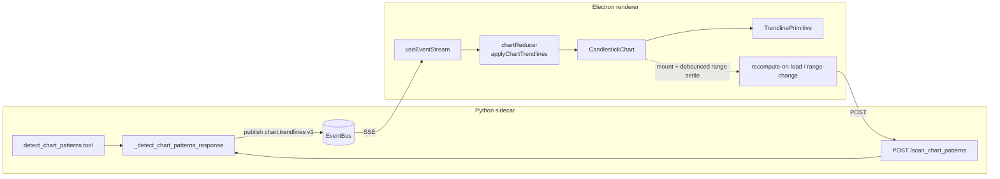

# 0064 — Chart-pattern trendlines: render, decouple, recompute

> **Status:** approved
> **Created:** 2026-07-08
> **Owner skill(s):** ui-builder, dev
> **Related ADRs:** [0059](../adrs/0059-trendline-event-channel-and-recompute.md) (proposed, accepts at this plan's close), [0049](0049-chart-trendline-overlay-primitive.md) (trendline primitive), [0048](../adrs/0048-classical-chart-pattern-detection.md) (detection), [0017](../adrs/0017-live-ui-updates-via-sse.md) (SSE)

## TL;DR

Classical chart patterns (necklines, triangle/wedge bounds) do not draw on the chart even though `detect_chart_patterns` computes them and they reach the renderer (the "Trendlines" legend row appears, but no lines). This plan reproduces and fixes the core rendering bug first (so lines draw at all), then fixes the two structural defects that surfaced in the same live session: a `chart.show` **wipe race** and a **durability gap** (trendlines vanish on reload, unlike markers). Per [ADR-0059](../adrs/0059-trendline-event-channel-and-recompute.md), trendlines move to a **dedicated `chart.trendlines v1` event** and are **recomputed from current bars** on chart load / range change — never persisted. First user-visible win lands in phase 1: detected patterns actually draw on the chart.

## Context & problem

Diagnosed live on BTC-USD 1h (2026-07-08), grounded in code:

1. **Core rendering bug.** `detect_chart_patterns` publishes `chart.show` with `trendlines=[…]` (verified `count=28`); the reducer stores them (`chartHandlers.ts::applyChartShow`); they reach `CandlestickChart` — *proven* because the LayersPanel "Trendlines" row renders, and that row only appears when `trendlines.length > 0` (`CandlestickChart.tsx` layers effect ~L878). Yet `TrendlinePrimitive.currentSegments()` (`lib/trendlines.ts`) draws nothing. `computeTrendlineSegments` **skips any segment** where `timeScale().timeToCoordinate(ts)` or `series.priceToCoordinate(price)` returns `null`. Something is null-skipping every segment. Markers at the *same* timestamps render correctly (they persist as annotations and draw via `series.setMarkers`), which rules out a time-unit bug and points at either the price-axis mapping, a primitive-lifecycle issue, or a range/scale mismatch specific to the trendline path. **Root cause must be reproduced, not assumed.**

2. **`chart.show` wipe race.** `show_chart` and `detect_chart_patterns` both publish `chart.show`; `applyChartShow` replaces the whole state (`trendlines: payload.trendlines ?? []`), and `show_chart` carries no trendlines. SSE ordering is not guaranteed, so a `show_chart` landing after a `detect` resets lines to `[]`. Reproduced live: the first "show + detect" pair drew nothing.

3. **Durability asymmetry.** Markers survive reload (annotation rows + poll). Trendlines are derived-only and vanish on reload or any later `chart.show`. Nothing recomputes them; the detect docstring's "reopening re-runs detection" is false today.

4. **No re-detect affordance** for chart-pattern trendlines (the "Scan patterns" button only re-runs candlestick-*marker* detection via `/scan_patterns`).

5. **Agent-mode UX.** "Agent mode OFF" gates only pointer gestures, not agent-drawn overlays — so markers appeared while lines didn't, which reads as inconsistent. The behavior is fine; the mental model isn't communicated.

## Decision

Fix the rendering bug first as an independently shippable walking skeleton (phase 1), then adopt [ADR-0059](../adrs/0059-trendline-event-channel-and-recompute.md): a dedicated `chart.trendlines v1` event (active-chart-gated, like `chart.highlight`), `chart.show` no longer carrying/clearing trendlines except on a real symbol/timeframe switch, and renderer-driven **recompute-on-load/range-change** via a new `POST /scan_chart_patterns` endpoint (sibling of `/scan_patterns`). Trendlines stay derived, never persisted. Agent-mode semantics are clarified in UI copy only — no behavior change.

We rejected reducer preserve-on-omit (fixes the race but not durability, keeps two meanings on one event) and a persistence table (staleness + migration cost for cheap-to-recompute derived data) — see ADR-0059 alternatives A/C.

## Architecture diagram



## Implementation phases

Owner runs are grouped to minimize handoffs: `ui-builder` (phase 1) → `dev` (phases 2–3) → `ui-builder` (phases 4–6). Handoffs at the 1→2 and 3→4 boundaries follow the cross-skill handoff protocol.

### Phase 1 — Reproduce and fix the core rendering bug

- **Owner skill:** ui-builder
- **What:** Reproduce the "specs present, zero segments drawn" bug in a renderer test that drives the real trendline path, identify the exact null-skip cause, and fix it so lines draw. This phase alone makes detected patterns visible (re-emitting `detect` draws lines) and is shippable on its own.
- **Files touched:** `desktop/renderer/lib/trendlines.ts`, `desktop/renderer/hooks/useTrendlines.ts`, `desktop/renderer/components/CandlestickChart.tsx`, `desktop/renderer/lib/trendlines.test.ts`, `desktop/renderer/components/CandlestickChart.trendlines.test.tsx` (extend).
- **Done when:** A renderer test constructs a realistic scenario mirroring the live case — candlestick series loaded with 1h `UTCTimestamp` bars over a window, `TrendlineSpec` anchors whose `ts` fall on loaded bars and whose `price` sits inside the visible price range — and asserts that `currentSegments()` (via stubbed-but-realistic `timeToCoordinate`/`priceToCoordinate`, matching how the existing trendline test stubs the scales) returns **one non-empty segment per spec line** with correct endpoints, role→color, and dashed/solid flag. The test must **fail before the fix and pass after** (the repro is the acceptance gate — a green test that never went red does not count; see the `feedback_tests_are_acceptance_criteria` memory). Manual check: a fresh `detect_chart_patterns` on BTC-USD 1h draws visible neckline/triangle lines on the viewer.
- **Note for the implementer:** Before changing draw code, confirm the null source empirically — instrument or unit-test `timeToCoordinate` vs `priceToCoordinate` separately on the failing anchors. Candidate causes to distinguish: (a) `priceToCoordinate` returning `null` because the primitive reads the series before its price scale has a range; (b) the trendline primitive attaching to a series that is later replaced (lifecycle) so `currentSegments()` reads a detached series; (c) a genuine off-scale/out-of-range anchor set. Fix the confirmed cause; do not blanket-widen the skip guard.

### Phase 2 — Dedicated `chart.trendlines v1` event; decouple `detect` from `chart.show`

- **Owner skill:** dev
- **What:** Add `ChartTrendlinesPayloadV1` to the events core, remove the `trendlines` field from `ChartShowPayloadV1`/`ChartUpdatePayloadV1`, and switch `detect_chart_patterns` to publish the new layer-only event (it no longer mounts a chart, mirroring `highlight_pattern`).
- **Files touched:** `src/market_analyser/events/__init__.py`, `src/market_analyser/api/mcp_tools/detect_chart_patterns.py`, `src/market_analyser/api/mcp_tools/show_chart.py` / `update_chart.py` (only if they reference the removed field), tests under `tests/` for the events model and the detect tool.
- **Done when:** `detect_chart_patterns` publishes exactly one `chart.trendlines` envelope carrying `{symbol, timeframe, trendlines:[…]}` on a non-empty hit set (asserted at the tool level, replacing the old `chart.show` assertion), and publishes nothing on an empty/uncached range (count=0 path unchanged); `ChartShowPayloadV1`/`ChartUpdatePayloadV1` no longer declare `trendlines` (pydantic model test asserts the field is gone); `show_chart` still publishes a `chart.show` with no trendline concept. The `VERSION` constant on the new payload is 1.

### Phase 3 — `POST /scan_chart_patterns` endpoint + docstring truth-up

- **Owner skill:** dev
- **What:** Add a bearer-gated `POST /scan_chart_patterns` route (sibling of `/scan_patterns`) that runs detection over a supplied `{symbol, timeframe, range_start, range_end}` and publishes `chart.trendlines`, reusing the already-factored `_detect_chart_patterns_response`. Update the `detect_chart_patterns` docstring so "reopening re-runs detection" is now literally true (via the renderer recompute added in phase 5).
- **Files touched:** the FastAPI route module that hosts `/scan_patterns` (sibling route), `src/market_analyser/api/mcp_tools/detect_chart_patterns.py` (docstring), route tests.
- **Done when:** `POST /scan_chart_patterns` with a valid body returns `{published: bool, count: int}` and publishes a `chart.trendlines` event with `count` lines (asserted via the event bus in a route spec); the route rejects an unauthenticated request (bearer gate, matching `/scan_patterns`); the detect docstring no longer claims auto-rerun behavior that the renderer doesn't perform.

### Phase 4 — Renderer event path: mirror, parity, reducer, `chart.show` semantics

- **Owner skill:** ui-builder
- **What:** Mirror `ChartTrendlinesPayloadV1` in TS (+ envelope union + parity test), add `applyChartTrendlines` to the reducer (active-chart-gated like `applyChartHighlight`), wire it through `useEventStream`/`App`, remove `trendlines` from the `ChartShow`/`ChartUpdate` TS mirrors, and change `applyChartShow` to clear trendlines **only on a symbol/timeframe change** (preserve on a same-chart show).
- **Files touched:** `desktop/renderer/types/events.ts`, `desktop/renderer/types/events.test.ts`, `desktop/renderer/handlers/chartHandlers.ts`, `desktop/renderer/handlers/chartHandlers.test.ts`, `desktop/renderer/hooks/useEventStream.ts`, `desktop/renderer/App.tsx`.
- **Done when:** Reducer tests assert — a `chart.trendlines` on the active chart adds the lines; on a non-active chart (symbol or timeframe mismatch) it is dropped; a subsequent plain `chart.show` for the **same** symbol/timeframe **preserves** existing trendlines; a `chart.show` for a **different** symbol/timeframe **clears** them. The TS↔pydantic parity test (`events.test.ts`) passes with the new type present and the `trendlines` field absent from the chart-show/update payloads.

### Phase 5 — Recompute-on-load / range-change + re-detect affordance

- **Owner skill:** ui-builder
- **What:** Fire `POST /scan_chart_patterns` (via the typed sidecar client — never a raw fetch) on chart mount and on a **debounced** visible-range settle, so trendlines are re-derived for whatever bars are loaded; add a manual "Scan chart patterns" trigger for on-demand re-detect. This closes both the durability gap (reload → lines return) and the missing affordance.
- **Files touched:** `desktop/renderer/api/client.ts` (new `scanChartPatterns` method), `desktop/renderer/components/CandlestickChart.tsx` (mount + debounced range-change trigger; button), a new hook if the trigger logic warrants it (mirroring `useLazyHistoryTrigger`), component tests.
- **Done when:** Mounting the chart for a symbol/timeframe issues one `scanChartPatterns` call carrying the current visible range (asserted against a mocked client); a settled pan/zoom issues a debounced re-detect (rapid moves coalesce to one call — asserted); the manual trigger issues a call on click; after a simulated reload the trendlines re-appear via this path (no persistence involved). No call is made when `symbol`/`timeframe` are absent.

### Phase 6 — Agent-mode clarification (docs/UX only)

- **Owner skill:** ui-builder
- **What:** Clarify, in UI copy/tooltip on the agent-mode toggle, that agent-drawn overlays (markers, trendlines, price lines) always render regardless of agent mode — agent mode governs only pointer-gesture forwarding. No behavior change.
- **Files touched:** `desktop/renderer/components/AgentModeToggle.tsx` (+ its test), any adjacent help/tooltip copy.
- **Done when:** The toggle exposes accessible copy stating that agent mode controls gesture forwarding, not overlay visibility (asserted in the component test); no change to what renders under either toggle state.

## Data shapes

```python
# illustrative — src/market_analyser/events/__init__.py
class ChartTrendlinesPayloadV1(BaseModel):
    VERSION: ClassVar[int] = 1
    symbol: str
    timeframe: str
    trendlines: list[TrendlineSpec]  # unchanged from ADR-0049
    model_config = ConfigDict(frozen=True, extra="forbid")
```

```ts
// illustrative — desktop/renderer/types/events.ts
export interface ChartTrendlinesPayloadV1 {
  symbol: string
  timeframe: string
  trendlines: TrendlineSpec[]
}
// 'trendlines' is REMOVED from ChartShowPayloadV1 and ChartUpdatePayloadV1.
// New envelope member: 'chart.trendlines' in EnvelopeType + ChartTrendlinesEnvelope.
```

Reducer contract (`applyChartTrendlines`): mirror `applyChartHighlight` — return `prev` unchanged when `payload.symbol !== prev.symbol || payload.timeframe !== prev.timeframe`; otherwise set `trendlines` to the payload's list. `applyChartShow`: `trendlines: (sameSymbolAndTimeframe ? prev.trendlines : [])`.

## Risks & open questions

- **Risk: the phase-1 root cause is a lightweight-charts quirk that resists a clean unit repro** (e.g. `priceToCoordinate` timing). Mitigation: the existing `CandlestickChart.trendlines.test.tsx` already stubs the time/price scales; extend that harness rather than inventing a new one, and if the cause is lifecycle (primitive attached to a replaced series), assert the re-attach path directly.
- **Risk: recompute chattiness.** Every settled range change hits the sidecar. Mitigation: debounce (the `useLazyHistoryTrigger` precedent) and rely on cached-bars-only detection. If it still feels heavy, gate the range-change trigger behind a minimum-delta or a "auto-scan" toggle (out of scope unless observed).
- **Open question: should the manual "Scan chart patterns" trigger live as its own button or fold into the existing "Scan patterns" control?** Left to the phase-5 implementer; a separate button keeps candlestick-marker scanning and chart-pattern geometry conceptually distinct, which is the leaning.
- **Risk: removing `trendlines` from the chart payloads breaks a fixture or the parity test mid-migration.** Mitigation: phases 2 and 4 are the paired producer/consumer edits; the parity test is the guard and is updated in phase 4 in lockstep.

## What this plan does NOT do

- **No persistence of trendlines** — no table, no migration, no poll (ADR-0059 rejected this; recompute instead).
- **No change to the trendline drawing primitive or `TrendlineSpec`/`TrendPoint` types** beyond the phase-1 bug fix — ADR-0049's geometry stands.
- **No change to agent-mode behavior** — phase 6 is copy only.
- **No change to candlestick-marker detection** (`/scan_patterns`, `highlight_pattern`, spans) — those already work.

## Followups (after this lands)

- (fill during implementation)
