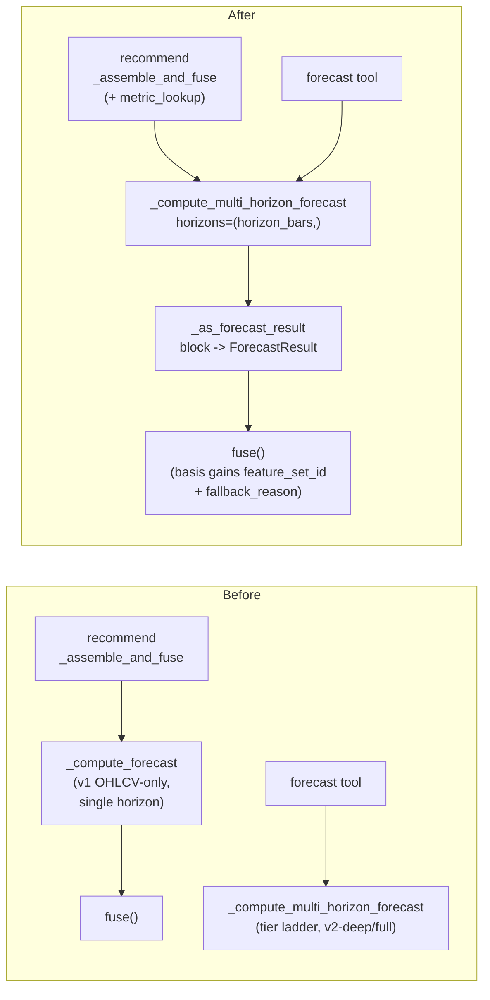

# 0066 — Advisor forecast unification: one tiered forecast for the recommendation

> **Status:** in-progress (2026-07-09, dev session — user "go"). Was approved 2026-07-08 (user — "approve all plans, do not start work").
> **Created:** 2026-07-08
> **Owner skill(s):** dev, ui-builder, human
> **Related ADRs:** [ADR-0057](../adrs/0057-forecast-feature-set-tiers.md) (the tier ladder this brings into the advisor), [ADR-0054](../adrs/0054-exogenous-forecast-features-multi-horizon.md) (the exogenous features the advisor's forecast leg gains), [ADR-0058](../adrs/0058-forecast-recommendation-explainability.md) (the explanation the advice artifact inherits for free), [ADR-0029](../adrs/0029-advisory-recommendation-boundary.md) (the advisory boundary — unchanged; this feeds a better forecast into the same fusion), [ADR-0046](../adrs/0046-mcp-large-result-delivery.md) (small-wire posture the basis enrichment respects)
> **Related plans:** [Plan 0063](done/0063-forecast-recommendation-explainability.md) (its live smoke surfaced the divergence this fixes — recommend's v1 forecast disagreeing with the forecast tool's tiered one at h=1), [Plan 0062](done/0062-tiered-forecast-feature-sets.md) / [Plan 0059](done/0059-forecast-feature-set-v2.md) (the tiered multi-horizon core this reuses)

## TL;DR

The advisor's forecast leg currently runs the single-horizon **v1 OHLCV-only** core (`_compute_forecast`), a path Plan 0059 deliberately left untouched — so `recommend` and the standalone `forecast` tool can disagree at the same horizon (0063's live smoke: forecast said *no-edge* on v2-deep at h=1 while recommend's v1 forecast *marginally beat* baseline and shipped a directional long). This plan points the advisor's forecast leg at the **same tiered core** the forecast tool uses: `recommend` computes its one horizon through `_compute_multi_horizon_forecast` with `metric_lookup` wired, adapts the single block to the `ForecastResult` fusion consumes, and thereby inherits the v2-full → v2-deep → v1 ladder, the stated fallback, and the 0063 explanation with no duplicated logic. The forecast basis gains the tier's `feature_set_id` + `fallback_reason` and the Recommendation panel names which forecast backed the call. First user-visible behavior: `recommend BTC-USD 1d rsi` and `forecast BTC-USD 1d horizons=[1]` return the **same** forecast at h=1 (same tier, same probabilities, same skill), and the recommendation panel shows "forecast ran on v2-deep (…)".

## Context & problem

Plan 0059 shipped the tiered multi-horizon forecast (`_compute_multi_horizon_forecast` + `select_feature_tier`) but explicitly left `_compute_forecast` — the single-horizon v1 core the `recommend` tool consumes — "deliberately untouched" to contain scope. The consequence went unnoticed until Plan 0063's phase-4 live smoke (2026-07-08): on BTC-USD 1d the standalone `forecast` tool trained **v2-deep** and returned an honest *no-edge* at h=1 (skill 0.452 < baseline 0.456), while `recommend` on the same symbol/horizon ran its **v1** forecast, which *marginally* beat baseline (skill 0.485 > 0.484) and produced a directional long. Two tools, two different models, two different verdicts for the same question — the advisor is deciding on a forecast the user can't reconcile with the forecast tab. The seam is clean: `_compute_forecast` is used **only** by `recommend` (grep-confirmed), and `metric_points_repository` is already constructed in `create_mcp_components` and handed to `register_forecast` as `metric_lookup`, so the advisor can be fed the same store with trivial wiring. The forcing constraints: fusion consumes a single-horizon `ForecastResult` (not the multi-horizon shape), the recommendation must keep working when no metric store is wired (v1 fallback, stated), and the basis stays small-wire (ADR-0046).

## Decision

Route the advisor's forecast leg through the existing tiered core rather than duplicating the ladder. `_assemble_and_fuse` calls `_compute_multi_horizon_forecast(bars=closed_bars, horizons=(horizon_bars,), metric_lookup=metric_lookup, …)` and adapts the single returned block to a `ForecastResult` via a small `_as_forecast_result` helper (call-level `symbol`/`timeframe`/`as_of_bar_ts` + the block's probabilities/validation/edge/provenance); a block that could not train (provenance `None`) maps to the same `ValueError` `_compute_forecast` raises today, preserving the recommend contract. `metric_lookup` is threaded `create_mcp_components → register_recommend → _recommend_response → _assemble_and_fuse` exactly as it already is for the forecast tool; with no store wired the ladder yields v1 with the stated reason, so the recommendation still works offline. `_compute_forecast` — now unused — is removed and its determinism/sanity coverage reconciled against the multi-horizon core's equivalent specs. The forecast basis gains two scalars, `feature_set_id` and `fallback_reason` (the `forecast` basis is an open `dict[str, BasisValue]`, so no wire-pin moves), and the Recommendation panel renders which tier backed the call. This **reverses Plan 0059's "deliberately untouched" note** and realizes ADR-0057's ladder in the advisor; no new ADR — the advisory boundary (ADR-0029) is unchanged, this only improves the forecast feeding the same fusion. We rejected extending `_compute_forecast` with its own copy of the tier-selection + explanation wiring (a second code path to keep in sync — the exact drift risk Plan 0063's shared-writer cleanup just removed) and rejected making fusion multi-horizon-aware (a change to the decision logic itself, a separate feature, not this unification).

## Architecture diagram



## Implementation phases

### Phase 1 — Point the advisor's forecast leg at the tiered core
- **Owner skill:** dev
- **What:** Thread `metric_lookup` into `register_recommend` and its body; replace the `_compute_forecast(...)` call in `_assemble_and_fuse` with `_compute_multi_horizon_forecast(…, horizons=(horizon_bars,), metric_lookup=metric_lookup)` plus a new `_as_forecast_result` adapter (single block → `ForecastResult`; untrainable block → the current `ValueError`); remove `_compute_forecast` and reconcile its tests against the multi-horizon core.
- **Files touched:** `src/market_analyser/api/mcp_tools/recommend.py`, `src/market_analyser/api/mcp_tools/forecast.py` (remove `_compute_forecast` + `__all__`), `src/market_analyser/api/mcp_app.py` (pass `metric_lookup=metric_points_repository` to `register_recommend`), `tests/api/test_recommend_tool.py`, `tests/api/test_forecast_tool.py` (relocate/drop the `_compute_forecast` specs).
- **Done when:** With a shared metric store wired, `recommend BTC-USD 1d rsi horizon_bars=1` and `_compute_multi_horizon_forecast(… horizons=(1,))` (the forecast tool's core) produce the **same** h=1 forecast — identical `feature_set_id`, `prob_up/down/flat`, `skill`, `baseline_skill`, `beats_baseline` (asserted directly, the divergence closed); with **no** store wired the recommendation still fuses on the v1 set with the unwired reason (asserted); an untrainable-history call raises the same error as before; the advice explanation artifact's forecast leg now carries the tier's `series_inputs` + the 0063 explanation (round-trip asserted); existing recommend fusion specs stay green.

### Phase 2 — Carry the tier into the forecast basis
- **Owner skill:** dev
- **What:** Add `feature_set_id` and `fallback_reason` to the `forecast` basis dict in `fuse()`'s `_build_basis` (both scalars — the open `dict[str, BasisValue]` needs no schema/wire-pin change), so the tier that backed the call travels on the recommendation itself, not only in the persisted artifact.
- **Files touched:** `src/market_analyser/advisor/fusion.py`, `tests/advisor/test_fusion.py`, `tests/api/test_recommend_tool.py`.
- **Done when:** A directional recommendation's `basis.forecast` contains `feature_set_id` and (when a richer tier was skipped) `fallback_reason` with the real values from the fused `ForecastResult` (spot-pinned against a fixture, not just present); a flat verdict carries them too; the values equal what the forecast tool reports for the same inputs; no wire-pin/parity test moves (the addition is new dict keys, not a field-set change).

### Phase 3 — Show which forecast backed the call
- **Owner skill:** ui-builder
- **What:** Render the tier/fallback on the Recommendation panel's forecast-basis section as a readable line (e.g. "Forecast ran on the v2-deep feature set" + the `fallback_reason` sentence when present), reading only fields already validated by the dispatcher schema; absent fields render exactly today's panel.
- **Files touched:** `desktop/renderer/views/RecommendationsView.tsx` + `.test.tsx`, module CSS as needed.
- **Done when:** A dispatched recommendation whose `basis.forecast` carries `feature_set_id`/`fallback_reason` renders the readable tier line and the fallback sentence (through the real dispatcher); one without them renders exactly today's view (no-regression spec); no new interactive element (the ADR-0025/0029 no-action posture holds, and — until Plan 0065 lands — the panel's checks-table no-interactive spec still passes).

### Phase 4 — Live smoke
- **Owner skill:** human
- **What:** Re-run the 0063 divergence case on the real sidecar and confirm it's gone.
- **Done when:** `forecast BTC-USD 1d horizons=[1]` and `recommend BTC-USD 1d rsi` now report the **same** h=1 forecast (same tier, probabilities, skill, verdict direction consistent with it); the recommendation panel names the tier; the advice `explanation.json` forecast leg shows the exogenous series and drivers; a symbol with no store still yields a v1-based recommendation with the reason stated.

## Data shapes

```python
# illustrative — the single-block adapter, not the final interface
def _as_forecast_result(multi: MultiHorizonForecastResult) -> ForecastResult:
    (block,) = multi.horizons
    if block.provenance is None:  # untrainable — preserve recommend's current failure
        raise ValueError("insufficient labelled history/variation to train a forecast model")
    return ForecastResult(
        symbol=multi.symbol, timeframe=multi.timeframe, as_of_bar_ts=multi.as_of_bar_ts,
        horizon_bars=block.horizon_bars,
        prob_up=block.prob_up, prob_down=block.prob_down, prob_flat=block.prob_flat,
        validation=block.validation, provenance=block.provenance,
        edge_margin=block.edge_margin, edge_strength=block.edge_strength,
    )

# forecast basis dict gains two scalars (open dict[str, BasisValue] — no pin move):
#   "feature_set_id": "3d8643321ac2cec3",
#   "fallback_reason": "v2-full unavailable: 0 of 2746 bars survived the join …; trained v2-deep (1347 rows)"
```

## Risks & open questions

- **Behavior change in the recommendation.** Feeding a different (usually better-validated) forecast will change some verdicts — a v1 marginal beat that became a directional call may now be an honest flat under v2-deep no-edge (exactly the 0063 case). This is the intended correction, not a regression; the live smoke documents the before/after on BTC-USD.
- **`_compute_forecast` test reconciliation.** Its determinism/sanity specs must not simply be deleted — the equivalent guarantees have to hold on the multi-horizon core (they already have specs there; confirm coverage before removing, per the tests-are-acceptance-criteria rule).
- **Cost.** The advisor's forecast leg now builds the tier selection (one exogenous as-of join) it previously skipped — the same cost the forecast tool already pays; acceptable for a single horizon.
- **Basis scalars only.** `series_inputs` and the driver list are structured, not `BasisValue` scalars, so they stay in the persisted advice artifact (which carries the whole `ForecastResult`); the basis surfaces only `feature_set_id` + `fallback_reason`. Rendering the drivers on the recommendation panel is a deferred followup, not this plan.

## What this plan does NOT do

- No change to fusion's decision logic or conviction derivation — the advisor stays single-horizon; only the forecast that feeds it becomes tiered.
- No multi-horizon recommendation (requiring 1/5/21 to agree) — a separate feature if ever wanted.
- No new exogenous sources, feature-set, or model changes — it reuses the existing ladder.
- No driver bars on the Recommendation panel — the tier + fallback line only; drivers stay in the artifact and on the Forecast tab.
- No new ADR — realizes ADR-0057 in the advisor; the advisory boundary is untouched.

## Followups (after this lands)

- Optionally surface the forecast's top drivers on the Recommendation panel (they already ride the persisted artifact; needs a non-scalar basis carrier or reading the summary shape).
- Revisit whether the recommendation should offer a multi-horizon view now that its forecast leg shares the tiered core.
