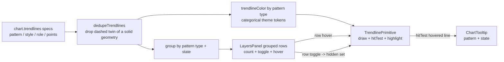

# 0067 — Trendline pattern identification: colour by type, de-clutter, hover + grouped legend

> **Status:** in-progress
> **Created:** 2026-07-08
> **Owner skill(s):** ui-builder
> **Related ADRs:** [0061](../adrs/0061-trendline-pattern-identity-and-colour.md) (proposed, accepts at this plan's close — the colour-model + identity decision), [0049](../adrs/0049-chart-trendline-overlay-primitive.md) (trendline primitive, colour-by-role being amended), [0059](../adrs/0059-trendline-event-channel-and-recompute.md) (delivery channel), [0060](../adrs/0060-glossary-tooltip-interaction-posture.md) (hover-tooltip posture)

## TL;DR

Chart-pattern trendlines now draw (Plan 0064), but a sweep paints 15–35 overlapping lines coloured by *role*, so you can't tell which line is which pattern. Per [ADR-0061](../adrs/0061-trendline-pattern-identity-and-colour.md), make pattern identity legible **entirely in the renderer** (the identity is already on the wire): (1) colour each line by **pattern type** and collapse the redundant forming+confirmed duplicates; (2) a **hover tooltip** naming the line's pattern + state; (3) a **grouped legend** — one row per (pattern type, state) with a count, a show/hide toggle, and hover-to-highlight. No sidecar/wire change. First user-visible win lands in phase 1: lines become colour-coded by type and de-cluttered.

## Context & problem

Diagnosed live on BTC-USD weekly + daily (2026-07-08), after Plan 0064 + the StrictMode draw fix (`b94397f`):

1. **Role colour conflates patterns.** `trendlineColor()` (`desktop/renderer/lib/trendlines.ts`) maps `role` → theme token: neckline=accent-blue, upper=bearish-red, lower=bullish-green. So every triangle upper-bound and every rising-wedge upper-bound reads the same red — colour tells you a line's *job*, not its *pattern*. User's report: "same colour and no indication of what pattern represents what."
2. **Clutter.** A single `detect_chart_patterns` / `scan_chart_patterns` sweep returns 15–35 lines. The detector emits **both** a dashed `forming` and a solid `confirmed` spec for the same geometry (identical `points`) — ~2× redundancy on screen.
3. **No identity affordance.** Nothing surfaces the `pattern`/`label`/`style` already on each `TrendlineSpec`. The legend shows one undifferentiated "Trendlines" row; there is no hover read-out.

The data needed is **already on the wire** (`TrendlineSpec.pattern` / `style` / `label` / `role`, mirrored in `desktop/renderer/types/events.ts`), so this is a pure renderer surfacing — no change to `detect_chart_patterns`, the `chart.trendlines` event, or the wire types.

## Decision

Adopt [ADR-0061](../adrs/0061-trendline-pattern-identity-and-colour.md): colour by **pattern type** (categorical palette, theme tokens), collapse forming+confirmed duplicates, and surface identity via a **hover tooltip** (primitive `hitTest`) plus a **grouped legend** (rows per pattern-type+state, with count, toggle, hover-highlight). Style (solid/dashed) keeps encoding confirmed/forming. This supersedes ADR-0049's role→colour mapping; 0049's primitive and wire model stand. Per-instance colour and a wire instance id were rejected (ADR-0061 alternatives A/D) — per-type grouping is renderer-derivable and sufficient.

## Architecture diagram



## Implementation phases

All phases are `ui-builder` (renderer-only). Phase 1 is an independently shippable win; 2 and 3 layer on.

### Phase 1 — Colour by pattern type + de-duplicate forming/confirmed

- **Owner skill:** ui-builder
- **What:** Replace role-based trendline colour with pattern-type colour, and collapse forming+confirmed duplicates before drawing. Add a categorical pattern palette as theme tokens (dark + light), consulting the `dataviz` skill's palette guidance for 9 legible categorical hues. The legend swatch reflects the type colour.
- **Files touched:** `desktop/renderer/lib/trendlines.ts` (`trendlineColor` keyed by `pattern`; new pure `dedupeTrendlines` helper), `desktop/renderer/styles.css` (pattern-type colour tokens for both themes), `desktop/renderer/components/CandlestickChart.tsx` (feed deduped specs to `useTrendlines`; legend swatch), `desktop/renderer/lib/trendlines.test.ts` (extend).
- **Done when:** A unit test asserts `dedupeTrendlines` drops a `dashed` spec whose `points` match a `solid` spec (keeping the solid) and leaves forming-only / confirmed-only specs intact; a unit test asserts `trendlineColor` returns a distinct colour per `pattern` type (and a stable neutral for an unknown/absent pattern) — pinned against the token set. Manual check: a fresh scan on BTC-USD draws lines coloured by pattern type, with each pattern's own lines (e.g. a triangle's two bounds) sharing one colour, and roughly half the previous line count.

### Phase 2 — Hover tooltip on a trendline

- **Owner skill:** ui-builder
- **What:** Implement `ISeriesPrimitive.hitTest(x, y)` on `TrendlinePrimitive` to return the line under the cursor (nearest segment within a small pixel tolerance), and feed its `pattern` + state into the chart's existing hover tooltip (`ChartTooltip` via the `subscribeCrosshairMove` path / `lib/tooltip.ts`). Tooltip content is pattern + state only (e.g. "Rising wedge — confirmed").
- **Files touched:** `desktop/renderer/lib/trendlines.ts` (`hitTest` + pure point-to-segment distance helper), `desktop/renderer/lib/tooltip.ts` and/or `desktop/renderer/components/CandlestickChart.tsx` (surface the hovered trendline in the tooltip content), `desktop/renderer/components/ChartTooltip.tsx` (only if a new content row shape is needed), tests.
- **Done when:** A unit test drives `hitTest` with stubbed segments and asserts it returns the correct spec for a cursor near a line and `null` when the cursor is far from every line (respecting the pixel tolerance); a component/interaction test asserts that a crosshair over a trendline renders a tooltip showing the pattern name + state. Manual check: hovering any drawn line shows its pattern + state; hovering empty space shows nothing new.

### Phase 3 — Grouped legend: rows per (pattern type, state) with toggle + hover-highlight

- **Owner skill:** ui-builder
- **What:** Expand the single "Trendlines" `LayersPanel` row into one row per **(pattern type, state)** present, each showing name + state + instance count, a show/hide checkbox (drives the `hidden` set at group granularity), and a hover that highlights that group's lines on the chart (emphasise matching lines, dim the rest). The `TrendlinePrimitive` gains a highlight state and draws the visible/deduped specs, emphasising the highlighted group.
- **Files touched:** `desktop/renderer/components/LayersPanel.tsx` (grouped trendline rows + hover callbacks), `desktop/renderer/components/CandlestickChart.tsx` (build the grouped `layers` descriptors; per-group keys in the `hidden` set; thread legend-row hover into a highlight state; feed the visible/deduped specs + highlight to `useTrendlines`), `desktop/renderer/hooks/useTrendlines.ts` (pass the highlight through), `desktop/renderer/lib/trendlines.ts` (`setHighlightedGroup` + emphasis/dim in the draw), tests.
- **Done when:** Reducer/descriptor tests assert one legend row per distinct (pattern type, state) with the correct instance count; a component test asserts unchecking a group's row removes exactly that group's lines (and re-checking restores them) via the `hidden` set; a component test asserts hovering a group's row puts the primitive into a highlight state naming that group (and clearing on mouse-out). Manual check: the legend lists the pattern types present with counts; toggling a row hides/shows that type+state; hovering a row highlights its lines.

## Data shapes

No new wire types. The renderer derives everything from the existing `TrendlineSpec` fields:

```ts
// illustrative — desktop/renderer/lib/trendlines.ts
// Geometry key for the forming/confirmed collapse (identical points ⇒ same geometry).
function geometryKey(s: TrendlineSpec): string // `${s.pattern}|${s.points.map(p => `${p.ts}@${p.price}`).join(';')}`
export function dedupeTrendlines(specs: readonly TrendlineSpec[]): TrendlineSpec[] // drop a dashed spec when a solid of the same geometryKey exists

// Legend grouping key.
function patternStateKey(s: TrendlineSpec): string // `${s.pattern ?? 'unknown'}|${s.style}`  (style ⇒ confirmed/forming)

// Colour: pattern → categorical token (was: role → token).
export function trendlineColor(pattern: string | null | undefined, colors: TrendlineColors): string
```

## Risks & open questions

- **Risk: 9 categorical colours are hard to keep legible on a dark chart.** Mitigation: use the `dataviz` categorical palette guidance; same-type instances are disambiguated by the legend + line hover, not by more colours. If 9 is too many to tell apart, fall back to colouring by pattern *family* (reversals vs triangles vs wedges, ~3–4 hues) — a phase-1 implementer call, noted here.
- **Risk: `hitTest` tolerance.** Too tight → lines are hard to hover; too loose → the wrong pattern shows near a cluster. Mitigation: a small fixed pixel tolerance (e.g. ~4–6px), pinned in the `hitTest` unit test; pick the nearest segment when several are within tolerance.
- **Risk: legend length.** Even grouped by (type, state), a busy chart can show ~10+ rows. Mitigation: the grouping + dedupe already cut it well below the raw 15–35; a scroll in the panel is acceptable. Per-instance rows were rejected (ADR-0061) precisely to bound this.
- **Open question: does hover-highlight dim non-matching lines, or only brighten the matches?** Left to the phase-3 implementer; dimming reads more clearly on a busy chart but costs a second draw style — start with brighten-matches, add dim if it isn't clear enough.

## What this plan does NOT do

- **No per-instance colour** and **no wire instance id** — colour and grouping are by pattern *type*, renderer-derived (ADR-0061 alternatives A/D).
- **No sidecar / wire / detection change** — `detect_chart_patterns`, `scan_chart_patterns`, the `chart.trendlines` event, and `TrendlineSpec` are untouched.
- **No always-on inline labels** on the lines — identity is via hover + the grouped legend (ADR-0061 alternative C).
- **No change to the drawing primitive's geometry or the delivery channel** — ADR-0049's `TrendlineSpec`/`TrendPoint` and ADR-0059's `chart.trendlines` stand; only colour, dedupe, hitTest, and highlight are added.
- **No role read-out by default** — role stays in the data; the tooltip shows pattern + state only (a later enhancement could add role/target/strength).

## Followups (after this lands)

- (fill during implementation)
