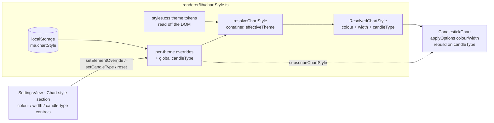

# 0068 — Chart style settings: user-overridable colours, line widths, and candle type

> **Status:** in-progress
> **Created:** 2026-07-08
> **Owner skill(s):** ui-builder
> **Related ADRs:** [0062](../adrs/0062-user-chart-style-overrides.md) (proposed, accepts at this plan's close — the store + persistence + resolution decision), [0039](../adrs/0039-renderer-theming-localstorage.md) (renderer-owned presentation prefs in localStorage — this extends the convention), [0049](../adrs/0049-chart-trendline-overlay-primitive.md) / [0061](../adrs/0061-trendline-pattern-identity-and-colour.md) (trendline colour — deliberately out of scope)

## TL;DR

Give the user a Settings surface to restyle the chart: **per-theme colours** and **line widths** for the built-in series (candles, volume + volume-MA, VWAP, OBV, bull/bear/neutral markers) and the agent overlay lines (EMA, SMA), plus a **candle series-type** switch (candlestick / OHLC bars / line / area). Overrides persist in renderer `localStorage` (key `ma.chartStyle`, extending [ADR-0039](../adrs/0039-renderer-theming-localstorage.md)) and resolve through one typed store ([ADR-0062](../adrs/0062-user-chart-style-overrides.md)) that layers overrides over the existing per-theme CSS default tokens, feeding fully-resolved concrete values to lightweight-charts. No sidecar work — pure `ui-builder`. First user-visible win lands in phase 3 (colour + width controls); phase 4 adds the candle-type switch. Deliberately disjoint from Plan 0067 (trendline pattern colour).

## Context & problem

Requested 2026-07-08: "a settings menu for chart, where I'll be able to change individual line or marker colours, line width, candlestick types." Today none of that is user-controllable:

1. **Colours are fixed theme tokens.** Every colour the chart draws comes from a CSS custom property in `renderer/styles.css` (`--chart-up`, `--marker-bullish`, `--overlay-vwap`, …), resolved off the DOM by `readChartColors` / `overlaySeriesColor` in `CandlestickChart.tsx` because lightweight-charts can't resolve `var()`. There is no override layer — the palette is whatever the active theme dictates.
2. **Line widths are literals.** `lineWidth: 1` / `lineWidth: 2` are hard-coded at each `addLineSeries` / `addHistogramSeries` call.
3. **The candle series-type is fixed.** `addCandlestickSeries` — no way to render OHLC bars, a close line, or an area.

Interview decisions (2026-07-08) that scope this plan:

- **Scope:** the fixed built-in roster **plus** the agent overlay line types (EMA, SMA). Not per-instance; not trendline pattern colours (Plan 0067 owns those).
- **Theme handling:** **per-theme** overrides — a colour set for dark is independent of light (a green legible on one background isn't the other).
- **Persistence:** renderer **`localStorage`** (mirrors theme, ADR-0039). No sidecar change.
- **Properties:** **colour + line width + candle series-type** — exactly the three named. No opacity/line-style/marker-glyph (deferred).
- **Override model:** **one unified typed store** ([ADR-0062](../adrs/0062-user-chart-style-overrides.md) option B) that replaces `readChartColors` / `overlaySeriesColor` — every drawn property resolves through one function.

## Decision

Adopt [ADR-0062](../adrs/0062-user-chart-style-overrides.md): a typed `chartStyle` store (`renderer/lib/chartStyle.ts`, shaped like `theme.ts`) persists per-theme colour + width overrides and a global candle-type in `localStorage['ma.chartStyle']`. `resolveChartStyle(container, effectiveTheme)` reads the theme's default tokens from the DOM (styles.css stays the default-palette source of truth), layers the user overrides on top, fills width defaults, and returns a fully-resolved `ResolvedChartStyle`. `CandlestickChart` consumes that object in place of the token reads and the width literals, subscribes to store changes, and re-applies colour/width via `applyOptions`; a candle-type change rebuilds the chart instance (series type is fixed at creation). Overrides are keyed by element **type**. Supertrend / price-line / span-band ride the bull/bear/neutral marker tokens, so overriding those marker colours recolours them for free — no separate entries.

## Architecture diagram



## Implementation phases

All phases are `ui-builder` (renderer-only). Phases 1–2 are foundational (store + chart wiring); phase 3 is the first user-visible control; phase 4 adds the candle-type switch (the one heavy operation).

### Phase 1 — The typed chart-style store + resolution

- **Owner skill:** ui-builder
- **What:** New `desktop/renderer/lib/chartStyle.ts` mirroring `theme.ts`'s posture: a `localStorage`-backed (`ma.chartStyle`) overrides model + a `resolveChartStyle(container, effectiveTheme)` that reads the theme default tokens off the DOM, layers per-theme overrides, fills width defaults (the current literals), and returns a concrete `ResolvedChartStyle`. Public API: `getChartStyleOverrides()`, `setElementOverride(theme, element, patch)`, `setCandleType(type)`, `resetChartStyle()`, `subscribeChartStyle(cb)`. Every `localStorage` access wrapped in try/catch (degrade to defaults, session-only), exactly as `theme.ts` does.
- **Files touched:** `desktop/renderer/lib/chartStyle.ts` (new), `desktop/renderer/lib/chartStyle.test.ts` (new).
- **Done when:** unit tests assert (a) with no stored overrides, `resolveChartStyle` returns the theme default colours + default widths + `candleType: 'candles'`; (b) a per-theme colour/width override wins for that theme and leaves the other theme's resolution untouched (light and dark resolve independently); (c) `setCandleType` / `resetChartStyle` round-trip through storage and `resetChartStyle` restores defaults; (d) blocked/malformed `localStorage` degrades to defaults without throwing; (e) `subscribeChartStyle` fires on every mutator and the unsubscribe stops it.

### Phase 2 — Wire the chart to the store (colour + width, live-applied)

- **Owner skill:** ui-builder
- **What:** `CandlestickChart` consumes `resolveChartStyle(container, effectiveTheme)` everywhere it currently calls `readChartColors` / `overlaySeriesColor`, and replaces the hard-coded `lineWidth` literals with the resolved widths. Subscribe to `subscribeChartStyle`; on change, re-resolve and push colour/width through `applyOptions` in place (mirror the existing `effectiveTheme` recolor effect — no remount). Candle-type stays `candles` in this phase. `readChartColors` / `overlaySeriesColor` are removed (or reduced to internal helpers of the resolver) per ADR-0062.
- **Files touched:** `desktop/renderer/components/CandlestickChart.tsx` (colour + width read path; a chart-style subscription effect), `desktop/renderer/lib/overlays.ts` (overlay colour/width now sourced via the resolver — keep the registry's fallback colour for non-DOM tests), plus updates to the affected component specs (`CandlestickChart.theme.test.tsx`, `.overlays.test.tsx`).
- **Done when:** a component test drives `setElementOverride('dark', 'ema', { color, lineWidth })` (or the resolver directly) and asserts the EMA series receives the overridden colour **and** width via `applyOptions` with **no chart remount** (the creation effect does not re-run); a test asserts a theme flip still recolours from the (possibly-overridden) tokens; a no-override regression test asserts the chart renders the same colours/widths as today (defaults), and `window.__test_chart_render__` series kinds/count are unchanged.

### Phase 3 — Settings UI: colour + width controls (per active theme) + reset

- **Owner skill:** ui-builder
- **What:** A new **"Chart style"** section in `SettingsView` (below "Appearance"). For each styleable element, a labelled colour control (native `<input type="color">` + hex read-out) editing the **currently-active theme's** override, and — for line elements (volume-MA, VWAP, OBV, EMA, SMA) — a width control (1–4). A clear "Editing <Light|Dark> theme" label so the per-theme model is legible (switch theme to edit the other set). A global **"Reset chart style"** button (`resetChartStyle`). Writes go through the store; a mounted chart reacts live via the phase-2 subscription. Candle-type control is deferred to phase 4.
- **Files touched:** `desktop/renderer/views/SettingsView.tsx` (new section), `desktop/renderer/views/SettingsView.module.css` (controls), `desktop/renderer/views/SettingsView.test.tsx` (extend), possibly a small presentational `ChartStyleControls.tsx` if `SettingsView` grows past ~400 lines.
- **Done when:** a component test asserts changing a colour input writes the override for the active theme (via the store) and the control reflects the new value; a test asserts the width control writes an in-range width; a test asserts "Reset chart style" clears all overrides back to defaults; the controls are keyboard-accessible and labelled (each input has an associated `<label>`; the theme indicator is announced). Manual: pick a candle-up colour on dark, return to the chart, see it applied; switch to light, colour is independent.

### Phase 4 — Candle series-type switch

- **Owner skill:** ui-builder
- **What:** Add a candle-type segmented control (Candles / OHLC bars / Line / Area) to the Chart style section, driving `setCandleType`. `CandlestickChart` **rebuilds the chart instance** on a candle-type change (the creation effect keys on `candleType`): create the chosen series type, re-attach the span + trendline primitives, re-push bars, re-set markers and price lines, re-resolve style. For `line`/`area` the up/down/wick colour controls are inert — the settings UI disables them with a note, and the resolver maps the single line colour from `candleUp` (documented). Because a rebuild is a rare, deliberate action, losing the current zoom/pan is acceptable.
- **Files touched:** `desktop/renderer/components/CandlestickChart.tsx` (series construction keyed on `candleType`; primitive re-attach path), `desktop/renderer/views/SettingsView.tsx` + `.module.css` (segmented control + inert-in-line/area affordance), the affected specs (`SettingsView.test.tsx`, a `CandlestickChart` series-type spec).
- **Done when:** a component test asserts selecting **Line** recreates the main series as a line series — `window.__test_chart_render__` reflects the changed main-series kind — and the span/trendline primitives and markers are re-attached (present after the switch); a test asserts the up/down colour controls are disabled when a non-candle type is active; a test/asserted path confirms the old chart instance is disposed on rebuild (no leaked context — the existing unmount dispose is exercised). Manual: switch through all four types; each redraws correctly; switching back to Candles restores up/down colouring.

## Data shapes

No wire types — everything is renderer-local. Illustrative store model:

```ts
// desktop/renderer/lib/chartStyle.ts (illustrative)
export type ChartStyleElement =
  | 'candleUp' | 'candleDown'
  | 'volume' | 'volumeMa' | 'vwap' | 'obv'
  | 'ema' | 'sma'
  | 'markerBullish' | 'markerBearish' | 'markerNeutral'

export type CandleSeriesType = 'candles' | 'bars' | 'line' | 'area'

interface ElementOverride { color?: string; lineWidth?: number } // lineWidth: line elements only

interface ChartStyleOverrides {
  light: Partial<Record<ChartStyleElement, ElementOverride>>
  dark: Partial<Record<ChartStyleElement, ElementOverride>>
  candleType?: CandleSeriesType // global, theme-independent (a render mode, not a colour)
}

// The concrete object the chart consumes (defaults ⊕ overrides, resolved for one theme).
export interface ResolvedChartStyle {
  colors: Record<ChartStyleElement, string>
  widths: Record<'volumeMa' | 'vwap' | 'obv' | 'ema' | 'sma', number>
  candleType: CandleSeriesType
}

export function resolveChartStyle(container: HTMLElement, theme: EffectiveTheme): ResolvedChartStyle
```

Line elements that take a width: `volumeMa`, `vwap`, `obv`, `ema`, `sma` (defaults: MA/OBV = 1, VWAP/EMA/SMA = 2, matching today's literals). Candles, the volume histogram, and markers take colour only.

## Risks & open questions

- **Risk: candle-type change is a full chart rebuild.** Switching to line/area recreates the instance and loses zoom/pan; primitives + markers must re-attach. Mitigation: rebuild is centralised in the (already comprehensive) creation effect keyed on `candleType`; primitive survival + dispose are pinned in the phase-4 tests. Rare, deliberate action → acceptable.
- **Risk: inert controls in line/area mode.** Up/down/wick colours don't exist for line/area series. Mitigation: the settings UI disables those controls with a note when a non-candle type is active; the resolver maps the single line colour from `candleUp` (documented), so the "candle up" control still does something.
- **Risk: per-theme editing without a live preview of the inactive theme.** Editing dark's colours while viewing light shows only the swatch, not the chart. Mitigation: edit the **active** theme with a clear "Editing <theme>" label; a light/dark sub-tab is a phase-3 implementer call if the single-active-theme model reads as confusing.
- **Risk: colour-read-path rewrite blast radius.** Replacing `readChartColors` / `overlaySeriesColor` touches many call sites in `CandlestickChart`. Mitigation: phase 2 keeps behaviour identical with no overrides (regression test), so the rewrite is verifiable before any control ships.
- **Open question: width range.** 1–4 is proposed (lightweight-charts widths read fine up to ~4 on this chart). If a thicker line is wanted, widen the clamp — a phase-3 call, pinned in the store's width-clamp test.
- **Open question: should the candle-type default be user-visible as "system/auto"?** No — default is `candles` (today's behaviour); no auto mode. Noted so it isn't reintroduced.

## What this plan does NOT do

- **No per-instance overrides.** EMA-50 and EMA-200 share the `ema` style; overrides are keyed by element type (ADR-0062 alternative C rejected — ephemeral instances).
- **No trendline pattern-colour override.** Plan 0067 / ADR-0061 owns the automatic pattern-type palette; this plan doesn't touch trendline colour, tokens, or the trendline legend rows.
- **No sidecar / config.json / route / IPC.** Persistence is renderer `localStorage` only (ADR-0062, extending ADR-0039).
- **No new styleable properties** beyond colour + line width + candle series-type — no opacity, no line style (solid/dashed/dotted), no marker glyph/size. Deferred; the store shape leaves room to add them later.
- **No cross-machine sync or export/import** of a style set. Per-OS-profile, per-install (ADR-0062 negative, called out).
- **No agent control of user style.** The agent keeps pushing overlays; their base style now honours the user's overrides, but the agent cannot set or read the user's style prefs.
- **No change to the default palette.** styles.css tokens stay the defaults; a user who never opens the control sees today's chart exactly.

## Followups (after this lands)

- (fill during implementation)
