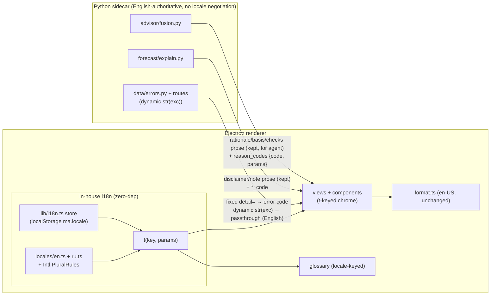

# 0069 — Russian localization (full parity)

> **Status:** in-progress
> **Created:** 2026-07-08
> **Owner skill(s):** ui-builder, dev, human
> **Related ADRs:** [0063-in-house-i18n-and-reason-codes](../adrs/0063-in-house-i18n-and-reason-codes.md)

## TL;DR

Make the whole desktop UI available in Russian, English staying the default. We add a **zero-dependency, in-house `t()`** over typed `en`/`ru` catalogs in the renderer (native `Intl.PluralRules` for Russian's three plural categories, `Intl.NumberFormat` untouched), extract the ~100–150 renderer chrome strings, localize the renderer-owned glossary, and — for the finite authored prose the renderer shows **verbatim** (advisory rationale/basis/gate-checks, the two forecast-explanation constants) — have the sidecar emit structured `{code, params}` **reason-codes** beside its existing English prose so the renderer can translate them. Numbers, dates and currency stay `en-US` by decision. First user-visible behavior: a language segmented control in Settings' *Appearance* section that flips the entire chrome to Russian on the spot.

## Context & problem

The user asked (2026-07-08) how hard it would be to run the whole UI in Russian, then chose **full parity** (chrome + static content + sidecar-generated prose) with **en-US numbers preserved** and an **in-house, zero-dependency + reason-codes** mechanism.

Grounding facts that shape the plan:

- The renderer is small and already anticipates this: **18 non-test components/views, ~4,400 LOC, ~100–150 user-facing strings**, no existing i18n library. `desktop/renderer/lib/format.ts` is centralized and its header comment explicitly defers localization to "a future i18n plan".
- The preference-store pattern already exists: `lib/theme.ts` (a `useSyncExternalStore` + `localStorage` store) + `useThemePref` + a segmented control in `SettingsView`'s *Appearance* block. A locale store mirrors it one-for-one.
- The **primary control surface is the agent** (ADR-0015). When the user converses with Claude Code in Russian, the agent already re-expresses the `recommend` tool's output in Russian for free. So the sidecar-prose problem bites **only** for text the renderer renders *verbatim* — `RecommendationsView`, `ForecastView`, error toasts — not the conversation.
- Sidecar authored prose is highly centralized: essentially **`src/market_analyser/advisor/fusion.py`** (blocker strings, directional rationale, `basis` fragments, ~14 fixed gate-check labels) and **`src/market_analyser/forecast/explain.py`** (two fixed constants). `Signal.reason` is a reserved contract field that **no strategy populates today**. The glossary is **renderer-owned** (`desktop/renderer/glossary/`, zero sidecar involvement).
- A scattered, partly-untranslatable tail exists: ~11 API route files with HTTP `detail=` strings — a mix of fixed constants and dynamic `str(exc)` passthrough authored in `data/errors.py` — plus upstream-passthrough enums (crypto Fear & Greed `classification`, `CryptoRegime`) and external news headlines that **cannot be translated in-house**.

The dependency discipline (ADR-0012 cooldown, ADR-0013 exact-pinning, ADR-0009 in-house ethos) and the two-locale/single-user shape make a hand-rolled `t()` over `Intl` primitives the natural fit — zero new dependencies, full control, in the grain of `format.ts`.

## Decision

We localize **in the renderer** with an in-house, zero-dependency `t(key, params?)` over typed `en`/`ru` catalogs, using native `Intl.PluralRules` for pluralization and leaving `Intl.NumberFormat` at `en-US`. English is both the **default locale** and the **test-suite locale**, so the existing renderer specs stay green unchanged. The **sidecar stays English-authoritative and negotiates no locale**: for the finite authored prose the renderer displays verbatim, `fusion.py` and `forecast/explain.py` additionally emit structured `{code, params}` reason-codes that the renderer translates, while their existing English prose fields are preserved untouched for the agent/MCP consumer. Dynamic upstream text (external headlines, `str(exc)` data-layer errors, raw upstream classification values) stays English **by design** — an accepted, documented seam.

We rejected the **library + Python i18n layer** option (react-i18next + a locale-negotiated gettext-style sidecar) because it adds a pinned dependency under cooldown, two catalogs across two stack languages, and `Accept-Language` plumbing on every route including `data/errors.py` — cost far above benefit for a single-user, two-locale app. We rejected the **renderer-only, sidecar-stays-English** option because it would render `RecommendationsView`/`ForecastView`/error toasts in English verbatim, walking back the full-parity requirement. Number localization to `ru-RU` was rejected as a paired mini-decision (see ADR-0063): traders read `en-US` financial formatting natively and `1 234,56 $` mixes awkwardly with USD.

## Architecture diagram



## Implementation phases

### Phase 1 — i18n foundation (in-house `t()` store)
- **Owner skill:** ui-builder
- **What:** A zero-dependency locale store + `t()` resolver + language toggle, mirroring the existing `theme.ts` pattern. English-only catalog scaffold; app renders identically to today.
- **Files touched:** new `desktop/renderer/lib/i18n.ts`, `desktop/renderer/locales/en.ts`, `desktop/renderer/hooks/useLocalePref.ts`; edit `desktop/renderer/views/SettingsView.tsx` (a *Language* segmented control in the *Appearance* block), `desktop/renderer/main.tsx` (init). New `desktop/renderer/lib/i18n.test.ts`.
- **Done when:** switching the language control persists across a reload (`localStorage` `ma.locale`) and re-renders every subscriber, exactly as `useThemePref` does; with only `en` present the app is visually identical to pre-plan; `t('a.missing.key')` returns the key string and logs a single dev-only warning; a unit test pins `Intl.PluralRules('ru')` selecting the correct category for counts 1, 2, 5 and asserts the resolver picks the matching plural form.

### Phase 2 — Extract renderer chrome into the `en` catalog
- **Owner skill:** ui-builder
- **What:** Replace every hardcoded user-facing string across the 18 components/views with `t()` keys and author the `en` entries. `format.ts` stays `en-US` (numbers/dates NOT localized). Add a guard that fails CI on un-keyed literals.
- **Files touched:** all of `desktop/renderer/views/*.tsx` and `desktop/renderer/components/*.tsx` (non-test); grow `desktop/renderer/locales/en.ts`; new lint script or eslint-rule config + its allowlist.
- **Done when:** the guard reports zero un-keyed user-facing literals (JSX text, `placeholder=`, `aria-label=`, `title=`, `label=`) in `views/` and `components/` outside the allowlist; the full renderer test suite passes in the default `en` locale with assertions unchanged (each catalog `en` value equals the literal the spec greps for — a catalog typo surfaces as a failing existing spec); the `en` app is pixel-identical to pre-plan.

### Phase 3 — Glossary localization
- **Owner skill:** ui-builder
- **What:** Make the renderer-owned glossary locale-aware: each term's `term`/`howComputed`/`whatItMeans` carries `en` + `ru`, with per-field fallback to `en`. Keep the structural keys (`category`, `formulaAnchor`) at the same position so Plan 0065's cross-language formula-anchor test still binds.
- **Files touched:** `desktop/renderer/glossary/glossary.json` (restructure to locale-keyed prose fields), `desktop/renderer/glossary/types.ts`, the glossary loader/`GlossaryTerm` consumer, `desktop/renderer/glossary/glossary.test.ts`; verify the Plan 0065 Python cross-language accuracy test still passes against the new shape.
- **Done when:** with `locale=ru`, `GlossaryTerm` tooltips render the Russian dual-hat text; a term missing a `ru` field falls back to its `en` field (not to the key); Plan 0065's structural formula-anchor test (conviction→`SHARPE_FULL_CREDIT`, `edge_strength`→`EDGE_MARGIN_THRESHOLD`, `indicator`-category ↔ `FEATURE_NAMES*`) still passes.

### Phase 4 — Sidecar structured reason-codes
- **Owner skill:** dev
- **What:** In `advisor/fusion.py`, emit — beside the existing English `rationale`/`basis`/`checks` prose (kept verbatim for the agent/MCP consumer) — a parallel deterministic list of `{code, params}` covering every blocker, directional-rationale line, and gate-check label. In `forecast/explain.py`, add a `*_code` for the two fixed constants (`IMPORTANCE_DISCLAIMER`, `NOTE_NO_SCORED_FOLDS`). Numeric params ride as raw numbers (the renderer formats them with `en-US` `format.ts`). Extend the Pydantic models and the Zod/TS mirrors; preserve determinism and wire-pin discipline.
- **Files touched:** `src/market_analyser/advisor/fusion.py`, `src/market_analyser/advisor/models.py`, `src/market_analyser/forecast/explain.py` (+ its provenance model); `desktop/renderer/schemas/recommendation.ts`, `desktop/renderer/schemas/forecastCompleted.ts`, `desktop/renderer/types/sidecar/*`; the advisor + forecast tests + the pydantic↔Zod parity assertions.
- **Done when:** a `recommend` response carries a `reason_codes` list whose `{code, params}` entries cover every blocker/directional/check line, and a re-run from the same inputs is byte-identical modulo run provenance (`run_id`/`started_at`/`finished_at`); the forecast explanation carries a `disclaimer_code` and (when applicable) a `note_code`; **the English prose fields are unchanged** (existing agent-facing golden tests untouched and green); an invariant test pins `directional ⟺ reason_codes present for every gate` (mirroring the 0063 `directional ⟺ every check passed` invariant); pydantic↔Zod parity assertions extended; `mypy --strict` + ruff clean.

### Phase 5 — Render sidecar codes, enum labels & fixed errors from the renderer catalog
- **Owner skill:** ui-builder
- **What:** `RecommendationsView` + `ForecastView` render from the reason-codes via `t()` (params interpolated, numbers via `en-US` `format.ts`). Add an enum-label catalog for the finite passthrough enums authored as labels — `edge_strength`, `CryptoRegime`, Fear & Greed `classification` (mapped on our side since it's upstream passthrough). A code-map in the toast/error layer translates the **fixed** HTTP `detail=` constants; dynamic `str(exc)` passthrough renders as-is.
- **Files touched:** `desktop/renderer/views/RecommendationsView.tsx`, `desktop/renderer/views/ForecastView.tsx`, the error/toast layer (`components/AlertToaster.tsx` / `Toast.tsx` and the API error mapping in `renderer/api/client.ts`), new enum-label entries in `locales/en.ts`; their specs.
- **Done when:** with `locale=ru`, `RecommendationsView` renders Russian rationale/basis/gate-checks and `ForecastView` renders the Russian disclaimer/note; the three enums render Russian labels; a known fixed error (`"agent mode is off"`) renders Russian in the toast while a dynamic data-layer error (`str(exc)`) renders its upstream English text unchanged; the `en` locale is unchanged.

### Phase 6 — Author the Russian catalog + parity audit
- **Owner skill:** ui-builder
- **What:** Fill `ru.ts` for chrome + reason-codes + enum labels + fixed errors, and the glossary `ru` fields. Add a catalog-parity test so `en`/`ru` key sets can't drift. Document the accepted English residue.
- **Files touched:** new `desktop/renderer/locales/ru.ts`; `ru` fields in `glossary.json`; new `desktop/renderer/locales/parity.test.ts`; a short "accepted English residue" note in the plan's Followups / an ADR-0063 pointer.
- **Done when:** the parity test passes (the `en` and `ru` key sets are identical, both directions); switching to `ru` shows no English leakage except the documented non-goals (external headlines, symbol names, dynamic `str(exc)` errors, upstream news/classification raw text); an `en → ru → en` round-trip leaves no console warnings.

### Phase 7 — Full-app manual smoke
- **Owner skill:** human
- **What:** Drive the running app in Russian end to end.
- **Done when:** the user confirms every tab reads correctly in Russian with **no clipping or overflow** from longer Russian strings, numbers/dates/currency remain `en-US`, and the accepted-English residue matches the documented list.

## Data shapes

```python
# illustrative — not the final interface

# advisor/models.py — additive; English prose fields unchanged
class ReasonCode(BaseModel):
    code: str                      # e.g. "blocker.forecast_no_edge", "gate.directional_vote"
    params: dict[str, float | str | int] = {}   # numbers raw; renderer formats en-US

class Recommendation(BaseModel):
    ...
    rationale: list[str]           # UNCHANGED — English, for the agent/MCP consumer
    basis: Basis                   # UNCHANGED
    reason_codes: list[ReasonCode] # NEW — the finite authored surface, for the renderer
```

```typescript
// desktop/renderer/lib/i18n.ts — illustrative
type Catalog = Record<string, string>            // "nav.forecast" -> "Forecast" | "Прогноз"
type Params = Record<string, string | number>
function t(key: string, params?: Params): string // Intl.PluralRules for `{count, plural, ...}`-style keys
```

```json
// glossary.json — locale-keyed prose, structural keys fixed in place
{
  "edge_strength": {
    "category": "forecast",
    "formulaAnchor": "edge_margin_threshold",
    "term":        { "en": "Edge strength", "ru": "Сила преимущества" },
    "howComputed": { "en": "no_edge when …",  "ru": "no_edge, когда …" },
    "whatItMeans": { "en": "How comfortably …", "ru": "Насколько уверенно …" }
  }
}
```

## Risks & open questions

- **Russian strings run ~15–30% longer than English** → button/nav/segmented-control overflow. Mitigation: the phase-7 manual smoke is a real gate, not a formality; audit `min-width`/`text-overflow` on the toggles and nav during phase 2.
- **Reason-code / prose drift** — each authored fact now has two representations (English prose + code) in `fusion.py`. Mitigation: co-generate the code beside the prose in the same function, and pin the `directional ⟺ reason_codes present` invariant test in phase 4.
- **Pluralization** — counts like "N alerts / N headlines / N trades" need Russian's three-form plural. Mitigation: `Intl.PluralRules` is native (no dep); pin category selection for 1/2/5 in phase 1.
- **Test coupling** — keeping `en` as the default and test locale keeps ~50 renderer specs green; a catalog value that drifts from the literal a spec greps for surfaces as a failing existing spec (a feature, not a hazard).
- **Glossary restructure vs Plan 0065** — the locale-keying must not move `category`/`formulaAnchor`, or the cross-language formula-anchor test breaks. Mitigation: only the three prose fields become locale-keyed; verify in phase 3.
- **Open question:** does the header want a language toggle too, or is Settings-only enough? Default to Settings-only (mirrors where the theme control is canonical); revisit if the user wants faster switching.

## What this plan does NOT do

- **Localize external / dynamic content:** news headlines (RSS/Reddit), symbol names, upstream `str(exc)` data-layer error text, and raw upstream classification values (Fear & Greed source string) stay English — they are not authored in-repo.
- **Add locale negotiation to the sidecar** (no `Accept-Language` on HTTP/MCP). The sidecar stays English-authoritative; localization is renderer-side.
- **Localize numbers, dates or currency** — `en-US` retained by decision (ADR-0063); `format.ts` untouched.
- **Localize agent-facing text** — MCP tool `description=` strings and strategy `META` are read by the Claude model, not the desktop UI, and stay English.
- **Add a third language or a language-pack/plugin system** — `en` + `ru` only, hand-authored catalogs. A future plan owns any third locale.
- **RTL support** — not needed for Russian.

## Followups (after this lands)

- Maintain the "accepted English residue" list as the app grows (new external feeds, new `str(exc)` sites).
- If `Signal.reason` ever gets populated by a strategy, it joins the reason-code surface (today it is a reserved, unused field).
