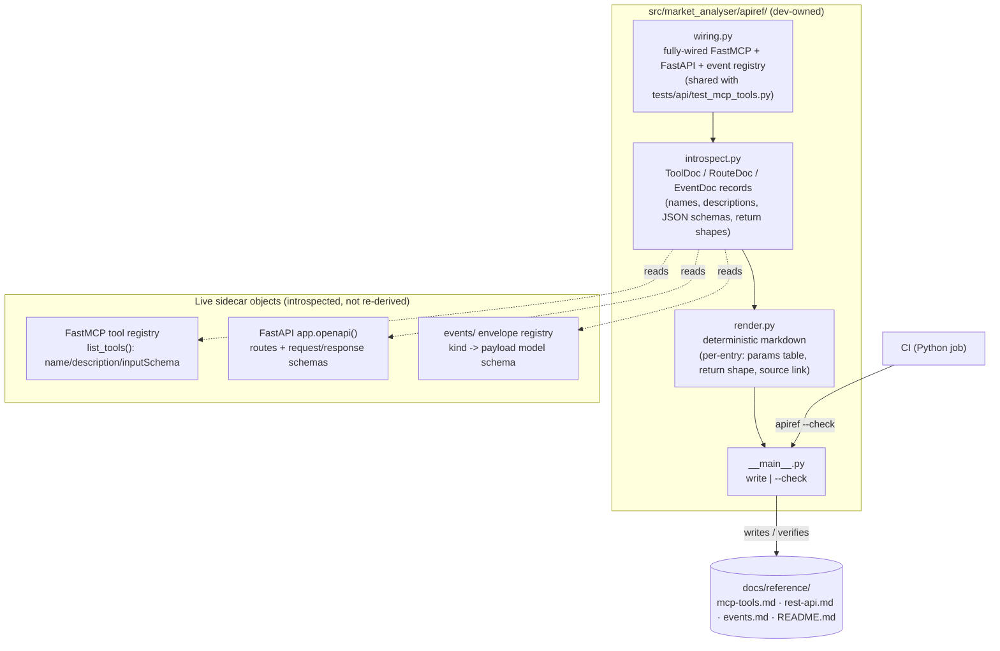

# 0070 — Sidecar API reference generator

> **Status:** in-progress
> **Created:** 2026-07-09
> **Owner skill(s):** dev
> **Related ADRs:** [0064-generated-sidecar-api-reference](../adrs/0064-generated-sidecar-api-reference.md) (paired — accepts at this plan's close), [0014](../adrs/0014-mcp-as-second-sidecar-protocol.md), [0017](../adrs/0017-live-ui-updates-via-sse.md), [0046](../adrs/0046-mcp-large-result-delivery.md)

## TL;DR

We build a Python generator that boots the fully-wired sidecar in memory, introspects its three surfaces — the ~41 MCP tools, the ~16 REST route groups, and the SSE event vocabulary — and renders them into deterministic, full-detail, human-readable markdown under `docs/reference/` (one entry per command: name, summary, description, a parameters table, the return/payload shape, a source link). A `--check` mode re-renders and fails on any drift, wired into CI exactly like the existing `gen-types:check`. First user-visible win: after phase 3, `docs/reference/mcp-tools.md` exists and browsably documents every MCP tool the agent can call, generated from the real registry so it can't be wrong.

## Context & problem

There is no single comprehensive, human-readable reference for the sidecar's contract. The authoritative descriptions live as docstrings/`description=` strings + Pydantic/FastMCP-derived JSON schemas in ~40 `mcp_tools/` modules, the FastAPI `routes/`, and the `events/` envelope models — visible to the agent at call time and to anyone willing to read source, but never collected into browsable documentation. What prose exists (`README.md`, `docs/onboarding/claude-code-setup.md`) is a high-level overview plus two deep-dived tools; the rest of the surface is undocumented for a human reader.

The user asked for documentation that is **durable, automatic, and human-readable** at the same time. That rules out both a hand-written catalog (rots on the first unmirrored field change) and a bare tool list (not a real per-command reference). It points at generation from the code's own metadata, kept fresh by a CI gate — the pattern the repo already uses for the renderer's TypeScript types (`gen-types` / `gen-types:check`). ADR-0064 records the decision and the rejected alternatives (static AST parsing, Swagger-only, hand-written, ungated).

## Decision

Generate the reference by **introspecting the live, fully-wired app** (ADR-0064): a Python package `src/market_analyser/apiref/` constructs the real `FastMCP` server, FastAPI app, and event registry; reads their computed metadata (tool registry, OpenAPI document, envelope schemas); and renders deterministic markdown under `docs/reference/`. A `--check` mode gates freshness in CI. The generator shares the fully-wired construction the test suite already uses (`tests/api/test_mcp_tools.py`'s `EXPECTED_FULL_TOOLSET` path) so the "conditional registration" wrinkle — tools appear only when their deps are wired — is solved once, in one place.

We rejected static AST/docstring parsing (re-derives schemas, fragile against dynamic descriptions like `FORECAST_DESCRIPTION`), Swagger-`/docs`-only (REST-only, live endpoint not an in-repo artifact), a hand-written catalog (rots), and generation without a CI gate (drifts silently) — see ADR-0064 for the full reasoning.

## Architecture diagram



## Implementation phases

Each phase ships as its own commit. All phases are `dev` (Python generator, tooling, CI). Phases 1–3 stand alone in sequence (introspection → rendering → committed docs + CLI); phase 4 wires the gate and discoverability.

### Phase 1 — Wiring + introspection core

- **Owner skill:** dev
- **What:** A new `src/market_analyser/apiref/` package with `wiring.py` (a fully-wired `create_mcp_components` + `create_app` + event-registry construction, extracted so both this generator and `tests/api/test_mcp_tools.py` consume one wiring source of truth) and `introspect.py` (pure functions returning ordered, structured `ToolDoc` / `RouteDoc` / `EventDoc` records from the live objects).
- **Files touched:** `src/market_analyser/apiref/__init__.py`, `src/market_analyser/apiref/wiring.py`, `src/market_analyser/apiref/introspect.py`, `tests/apiref/test_introspect.py`; refactor `tests/api/test_mcp_tools.py` to import the shared wiring helper (behavior-preserving).
- **Done when:**
  - `introspect_tools()` returns records whose name set is **exactly** the 41-name `EXPECTED_FULL_TOOLSET` (same assertion the existing full-toolset test makes), each with a non-empty description and an `inputSchema` dict — asserted against the live fully-wired server, not a fixture.
  - `introspect_routes()` returns one record per bearer-gated REST route group present in `app.openapi()` (path, method, params, request/response schema refs), and excludes the public `/healthz` only if we choose to (documented either way).
  - `introspect_events()` returns one record per registered SSE envelope kind with its payload schema; if the `events/` core has no centrally-enumerable registry, this phase adds a thin enumerable registry there (behavior-preserving) rather than hard-coding a list — the open question below.
  - Records sort deterministically (tools alphabetical by name; routes by path then method; events by kind), so downstream rendering is stable.

### Phase 2 — Deterministic markdown renderer

- **Owner skill:** dev
- **What:** `render.py` — pure functions turning the phase-1 records into full-detail markdown: per entry a heading (name), one-line summary, full description, a parameters table (name / type / required / default, read from the JSON schema), the return-or-payload shape, and a source-file link (module path, no line number so it doesn't churn). Each output file carries a "generated — do not edit by hand" banner naming the regenerate command.
- **Files touched:** `src/market_analyser/apiref/render.py`, `tests/apiref/test_render.py`.
- **Done when:**
  - Feeding a small known fixture record through `render_tool()` produces the exact expected markdown block — the params table renders type/required/default correctly (including a `= None` optional and a required positional), and a no-params tool renders an explicit "No parameters" line rather than an empty table.
  - Rendering is **byte-identical across two runs** of the same records (no wall-clock, no host paths, no set-ordering) — asserted directly, since the CI `--check` gate depends on it.
  - The return-shape section renders from the tool's output schema when present and falls back to the function's return annotation model when the registry carries no output schema (whichever the mcp library version exposes — pinned by the test).

### Phase 3 — CLI + committed reference docs

- **Owner skill:** dev
- **What:** `__main__.py` exposing `python -m market_analyser.apiref` (write mode: renders and writes `docs/reference/mcp-tools.md`, `rest-api.md`, `events.md`, and an index `README.md`) and `--check` mode (renders in memory, diffs against the committed files, prints a unified diff and exits 1 on any drift, exits 0 clean). Run it once to create the committed `docs/reference/` tree.
- **Files touched:** `src/market_analyser/apiref/__main__.py`, `docs/reference/README.md`, `docs/reference/mcp-tools.md`, `docs/reference/rest-api.md`, `docs/reference/events.md`, `tests/apiref/test_cli.py`.
- **Done when:**
  - `uv run python -m market_analyser.apiref` writes the four files; running it a **second time immediately** leaves the git working tree clean (idempotent — proves determinism end to end).
  - `uv run python -m market_analyser.apiref --check` exits **0** on the freshly-committed tree, and exits **1** with a readable diff after a manual one-character edit to any generated file (both directions asserted in `test_cli.py`, which runs `--check` in-process against the committed files so a dev who forgets to regenerate gets a red *local* test, not only red CI).
  - The generated `docs/reference/mcp-tools.md` contains a full-detail entry for every one of the 41 tools (a spot-checked entry — e.g. `forecast` — carries its real description, its `symbol/timeframe/range_start/range_end/horizons/...` params with types and defaults, and its `MultiHorizonForecastResult` return shape).

### Phase 4 — CI gate + discoverability

- **Owner skill:** dev
- **What:** Wire `apiref --check` into CI next to `mypy`/`ruff`/`gen-types:check`; add a convenience alias for discoverability (a root `package.json` `gen:api-docs` + `gen:api-docs:check` mirroring the `gen-types` pair, delegating to `uv run python -m market_analyser.apiref`); and link the new reference from `README.md` (the Capabilities section) and `docs/onboarding/claude-code-setup.md` so humans find it.
- **Files touched:** the Python CI workflow under `.github/workflows/`, root `package.json`, `README.md`, `docs/onboarding/claude-code-setup.md`.
- **Done when:**
  - CI fails on a drifted reference — demonstrated by a deliberately-drifted branch (or an equivalent test) turning the check red — and passes on the committed tree.
  - `pnpm gen:api-docs:check` runs the Python `--check` and returns its exit code; `pnpm gen:api-docs` regenerates the tree.
  - `README.md` and the onboarding page link to `docs/reference/` (the links resolve to committed files), and mypy `--strict` + ruff are clean over `src/market_analyser/apiref/`.

## Data shapes

```python
# illustrative — not the final interface. Deterministic, JSON-schema-backed records.

@dataclass(frozen=True)
class ParamDoc:
    name: str
    type_str: str          # rendered from the JSON schema (e.g. "string", "integer", "array[int]")
    required: bool
    default: str | None    # rendered default, None when required

@dataclass(frozen=True)
class ToolDoc:
    name: str
    summary: str           # first sentence of the description
    description: str       # full registered description (the string the agent sees)
    params: tuple[ParamDoc, ...]
    return_shape: str      # rendered from output schema / return annotation model
    source_module: str     # e.g. "market_analyser.api.mcp_tools.forecast" -> repo-relative link

# RouteDoc (path, method, params, request/response schema) and
# EventDoc (kind, version, payload schema) follow the same frozen-record shape.
```

Generated tree:

```
docs/reference/
├── README.md        # index: what this is, the regenerate command, links to the three files
├── mcp-tools.md     # ~41 tools, full detail
├── rest-api.md      # ~16 REST route groups, from OpenAPI
└── events.md        # SSE event vocabulary + payload schemas
```

## Risks & open questions

- **The `events/` core may lack a centrally-enumerable envelope registry.** README calls it a "typed envelope registry", but if event kinds are only discoverable by importing each `*PayloadV1` class, phase 1 must add a thin enumerable registry (kind → payload model) in `events/` rather than hard-coding a list that would itself drift. Resolve in phase 1; keep the addition behavior-preserving. If a registry already exists, use it as-is.
- **Output-schema availability varies by `mcp` library version.** Some FastMCP versions expose `outputSchema` on registered tools; others don't. Phase 2 pins which surface this repo's pinned `mcp` version offers and renders the return shape from the function return annotation as the fallback. The pinned test documents the choice so a future `mcp` bump that changes it reddens deliberately.
- **Generator coupling to `create_mcp_components`' signature.** When a future plan adds a new dependency to the wiring, the shared `wiring.py` must keep up or introspection under-counts tools. Mitigation: the shared wiring helper is the *same* one the full-toolset test asserts against, so an unwired new tool already fails `test_mcp_tools.py` — the generator can't silently miss it.
- **Determinism is load-bearing for the gate.** Any host-specific path, wall-clock, or set-ordering in the output makes `--check` flap. Phase 2's byte-identical-across-runs test is the guard; source links are file-level (no line numbers) to avoid churn on unrelated edits.
- **Bundle footprint.** `apiref/` ships inside `src/market_analyser/` (bundled as `extraResources`), adding dev-only code to installers. It is pure-Python, no new deps, negligible size; accepted rather than adding a separate `tools/` path with import-path friction. Noted so it's a conscious choice.

## What this plan does NOT do

- **No new runtime behavior.** The generator is a dev/CI tool; it adds no endpoint, no tool, and nothing to the shipped app's request paths.
- **No hand-authored prose per tool.** The doc renders the descriptions/schemas that exist in code; improving thin descriptions is a code change in the owning module, not a docs edit here (and is the intended forcing function).
- **No versioned/published API docs site.** Output is committed in-repo markdown; publishing it (GitHub Pages, a docs site) is a separate future plan if ever wanted.
- **No auto-regeneration on commit.** We gate with `--check` in CI (and a local test), not a pre-commit hook that rewrites files — the user chose the hard-gate posture over silent local rewrites.

## Followups (after this lands)

- (fill during implementation)
