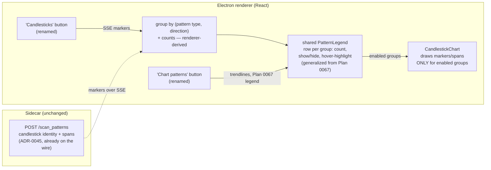

# 0071 — Candlestick pattern legend + declutter, and disambiguate the two scan buttons

> **Status:** draft
> **Created:** 2026-07-09
> **Owner skill(s):** ui-builder, human
> **Related ADRs:** none new (renderer-only UX; reuses [ADR-0061](../adrs/0061-trendline-pattern-identity-and-colour.md)'s grouped-legend interaction and consumes [ADR-0045](../adrs/0045-candlestick-pattern-span-delivery.md)'s already-first-class candlestick identity; no ADR is reversed)

## TL;DR

The Chart view has two look-alike buttons — **"Scan patterns"** (candlestick formations, drawn as red/green/gray arrow markers + span dots) and **"Scan chart patterns"** (classical H&S/triangle/wedge geometry, drawn as trendlines) — and the first one paints *every* in-view candlestick pattern at once (104 markers on ~520 daily AERO bars), burying the candles under a wall of arrows (observed live 2026-07-09 on `AERO29270-USD` 1d). This plan (1) **renames the buttons** to "Candlesticks" and "Chart patterns" so their jobs are legible, and (2) replaces the always-on candlestick-marker dump with a **grouped legend + draw-on-select** — one row per (pattern type, direction) with a count and a show/hide toggle, markers drawn only for the groups you enable — the same de-clutter interaction Plan 0067 brings to trendlines, generalized to serve both pattern systems. First user-visible behavior: after clicking **Candlesticks**, the chart stays readable (markers no longer all drawn at once) and a legend lists the found formations by type with counts, each toggle-able onto the chart.

## Context & problem

Two Plans built the two scan surfaces independently: Plan 0049 (ADR-0045) shipped `scan_patterns` + first-class candlestick-pattern identity and multi-bar **span** rendering (arrow markers + gray span dots); Plan 0064 (ADR-0059) shipped the `scan_chart_patterns` trendline recompute. Both hang off `CandlestickChart.tsx`, and their buttons — "Scan patterns" and "Scan chart patterns" — sit side by side reading almost identically. The user clicked both, couldn't tell them apart, and found the result "not really readable" (2026-07-09 live session, AERO 1d): 104 candlestick markers over a year-and-a-half of daily bars is roughly a marker per candle, so the price action disappears under arrows and span dots.

Two problems, one root: two pattern systems whose labels don't distinguish them, and one of them (candlesticks) renders every hit always-on. The coarse **LAYERS** toggles (Bearish / Neutral / Bullish markers, Pattern spans) only let you turn whole marker classes off — not "show me just the engulfings near the recent low." The forcing constraints: the fix is **renderer-only** (candlestick identity — pattern name, direction, span — is already on the wire per ADR-0045, so grouping is derivable client-side; no sidecar/wire change), and it must stay **consistent with Plan 0067**, which is already introducing exactly this grouped-legend + show/hide + hover interaction for the *trendline* side. Building a second, divergent legend would be the wrong answer.

## Decision

Rename the buttons to **"Candlesticks"** (the `scan_patterns` sweep) and **"Chart patterns"** (the `scan_chart_patterns` trendline sweep), dropping the redundant "Scan" verb that made them collide. Replace the always-on candlestick-marker rendering with a **grouped legend**: after a Candlesticks sweep, the renderer groups the returned markers by (pattern type, direction) — derivable from the ADR-0045 identity already on each marker — and shows one legend row per group with an instance **count**, a **show/hide toggle**, and **hover-to-highlight**; markers (and their spans) draw **only for enabled groups**, not all at once. This is the same interaction Plan 0067 defines for trendlines, so this plan **reuses and generalizes the grouped-legend component 0067 introduces** rather than writing a parallel one — one legend model for both pattern systems, keyed by whatever identity each carries (trendline: pattern type × state; candlestick: pattern type × direction). The coarse per-class marker rows in the LAYERS panel fold into (or become the master switch above) the finer grouped legend. We rejected a **strength/recency filter** (a threshold that hides weaker/older patterns — simpler, but candlestick markers don't all carry a comparable strength score, and a hidden-by-threshold pattern is less discoverable than one listed-but-toggled-off) and **per-type checkboxes + a density slider bolted onto LAYERS** (thins the wall but keeps every marker always-on and doesn't match the 0067 trendline interaction, leaving two inconsistent mental models on one chart).

## Architecture diagram



## Implementation phases

### Phase 1 — Rename the two scan buttons

- **Owner skill:** ui-builder
- **What:** Rename the candlestick button label "Scan patterns" → **"Candlesticks"** and the trendline button "Scan chart patterns" → **"Chart patterns"**; keep the `data-testid`s (`scan-patterns-button`, and the trendline button's id) stable as behavioral anchors, updating only the visible text and any label-based queries. No behavior change.
- **Files touched:** `desktop/renderer/components/CandlestickChart.tsx` (the two button labels + their scanning-state text), `desktop/renderer/components/CandlestickChart.scan.test.tsx` and `CandlestickChart.recompute.test.tsx` (label-based assertions).
- **Done when:** the candlestick-sweep button renders **"Candlesticks"** (and "Scanning…" while in flight), the trendline-sweep button renders **"Chart patterns"**; both `data-testid`s are unchanged so existing wiring/tests still resolve; the scan specs query the new labels and pass; no other behavior changed.

### Phase 2 — Grouped legend + draw-on-select for candlestick markers

- **Owner skill:** ui-builder
- **What:** After a Candlesticks sweep, group the returned markers by (pattern type, direction) using the ADR-0045 identity, and render them through the **shared grouped-legend component introduced by Plan 0067** (generalized so it serves both trendline groups and candlestick-marker groups): one row per group with an instance count, a show/hide toggle, and hover-to-highlight. Gate marker + span drawing so only **enabled** groups paint — the 104-at-once wall is gone. Reconcile with the LAYERS panel: the coarse Bearish/Neutral/Bullish-marker + Pattern-spans rows become the master on/off for the candlestick layer, with the grouped legend doing per-group selection beneath it (no two controls silently fighting over the same markers).
- **Files touched:** `desktop/renderer/components/CandlestickChart.tsx` (marker-draw gating by enabled group), the shared pattern-legend component from Plan 0067 (generalize its props to accept candlestick groups) + its test, `desktop/renderer/components/LayersPanel.tsx` (+ `.test.tsx`) for the master/detail reconciliation, `CandlestickChart.scan.test.tsx`.
- **Done when:** a Candlesticks sweep that returns N markers across K (type, direction) groups does **not** paint all N markers at once — the drawn-marker count equals the sum over *enabled* groups only (asserted, e.g. default state draws a bounded subset or none, never all N); the legend shows exactly K rows each with its correct count; toggling a row on draws that group's markers **and** its spans and nothing else; toggling it off removes them; hovering a row highlights that group's markers on the chart; the existing "No patterns in view" / error / count states still render; the LAYERS master toggle hides/shows the whole candlestick layer without desyncing the per-group toggles.

### Phase 3 — Live smoke

- **Owner skill:** human
- **What:** Run the viewer on a marker-dense symbol and confirm the chart is readable and the controls make sense.
- **Done when:** on `AERO29270-USD` 1d (or `ETHBTC` 4h), clicking **Candlesticks** no longer buries the candles; the legend lists the found formations by type with counts; toggling a group draws only that group (markers + spans); hovering highlights it; the **Candlesticks** vs **Chart patterns** buttons are now unambiguous; the LAYERS master toggle behaves.

## Data shapes

No new persisted or wire data — grouping is derived in the renderer from markers already delivered by `scan_patterns` (ADR-0045). Illustrative renderer-side group shape:

```typescript
// illustrative — a candlestick-marker group derived client-side, not a wire type
interface CandlestickPatternGroup {
  patternType: string          // e.g. 'bullish_engulfing', 'doji', 'hammer'
  direction: 'bullish' | 'bearish' | 'neutral'
  count: number                // instances in the current sweep
  markerIds: string[]          // the markers (+ their spans) this row gates
  enabled: boolean             // show/hide toggle; drives whether they draw
}
```

## Risks & open questions

- **Coordination with Plan 0067 (the shared legend).** This plan reuses the grouped-legend component 0067 introduces, so it should **sequence after 0067** (or be built in the same `ui-builder` stream). Both touch `CandlestickChart.tsx` — they are **serial on that file**, never parallel worktrees. If 0067's legend lands first, this generalizes it; if they're built together, design the component to accept both group kinds from the start. Mitigation: the plans/README execution-order note pins the sequencing.
- **Default visible state after a sweep.** Draw-on-select could mean "scan shows an empty chart until you pick a group," which may feel broken. Open question (implementer's call, lean toward the readable default): after a sweep, default to showing **only the most recent group** (or the single most recent instance of each direction) with everything else listed-but-off, so the chart is populated yet not walled. The done-when asserts "not all N at once," which holds under either default.
- **LAYERS master/detail desync.** The coarse LAYERS marker toggles and the new per-group toggles must not fight. Mitigation: make LAYERS the master (whole candlestick layer on/off) and the legend the detail; phase-2 done-when asserts they don't desync.
- **Chart is already a god-component.** `CandlestickChart.tsx` is ~900+ lines (the standing 0049 decomposition follow-up). Adding group-gating risks growing it further. Mitigation: put the grouping/gating logic in a hook (the `useTrendlines` precedent) and keep the component change to wiring.

## What this plan does NOT do

- **No sidecar or wire change.** Candlestick identity + spans are already delivered by `scan_patterns` (ADR-0045); grouping is renderer-only. No new tool, route, or event.
- **No trendline behavior change.** The "Chart patterns" (trendline) side is Plan 0067's domain; this plan only renames its button and reuses its legend component — it does not alter trendline colouring, hit-testing, or recompute.
- **No strength/recency filtering or a density slider** — the rejected alternatives; the legend's per-group show/hide is the declutter mechanism.
- **No persistence of legend selections** across sessions/symbol switches — selections are ephemeral per sweep (a later plan can persist them if wanted).
- **No change to the `scan_patterns` sweep semantics** (still the current visible range) or to the marker/span glyphs themselves.

## Followups (after this lands)

- Persist per-symbol legend selections (which groups are enabled) across reloads, if the ephemeral default proves annoying.
- If the god-component grows further, lift the candlestick-marker reconciler into its own hook alongside `useTrendlines` (the standing 0049 decomposition follow-up).
