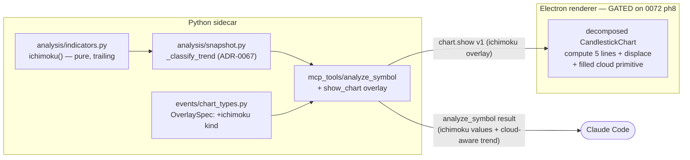

# 0073 — Ichimoku Cloud indicator: analysis surface, trend-classification input, and chart render

> **Status:** approved
> **Created:** 2026-07-09
> **Owner skill(s):** dev, ui-builder, human
> **Related ADRs:** [0067](../adrs/0067-ichimoku-in-trend-classification.md) (Ichimoku in trend classification — accepts at close), refines [0023](../adrs/0023-technical-analysis-surface.md); consumes [0017](../adrs/0017-live-ui-updates-via-sse.md) (overlay events), [0059](../adrs/0059-trendline-event-channel-and-recompute.md)/[0049](../adrs/0049-chart-trendline-overlay-primitive.md) (off-grid render precedent)

## TL;DR

Add Ichimoku Kinkō Hyō (the "Cloud") to the analysis stack. A pure trailing `ichimoku()` in `analysis/indicators.py` computes the five lines (Tenkan, Kijun, Senkou A/B, Chikou) with tunable periods defaulting to the classic 9/26/52/26. Those values (correctly displaced) feed the composed trend classifier so `market-analyst`/advisor reads reflect price-vs-cloud ([ADR-0067](../adrs/0067-ichimoku-in-trend-classification.md)), and land in the `analyze_symbol` snapshot. A new `ichimoku` overlay kind lets the agent ask the viewer to draw it. The first user-visible behavior is `analyze_symbol` returning Ichimoku values and a cloud-aware trend within one dev session; the faithful **displaced, filled cloud** render is a `ui-builder` phase deliberately **sequenced after Plan 0072 phase 8** (the `CandlestickChart.tsx` decomposition) so it doesn't fight three in-flight edits in that file.

## Context & problem

The technical-analysis surface ([ADR-0023](../adrs/0023-technical-analysis-surface.md)) exposes EMA/SMA/RSI/Bollinger/MACD/ATR/Supertrend/Donchian/ADX plus candlestick and classical chart patterns and support/resistance levels. Ichimoku — one of the most-watched regime indicators, especially in crypto — is absent. The user asked to add it: both the analysis surface (the five components and the cloud) and a faithful chart render.

Two things make Ichimoku unlike every existing overlay:

1. **Time displacement.** Senkou A/B are plotted **`displacement` (26) bars into the future** — the cloud extends past the last candle into empty space — and Chikou is plotted **`displacement` bars into the past**. Every existing overlay is aligned 1:1 to its bar. This is the hard part of the render (the time axis must extend beyond the loaded bars) and the subtle part of the decision path (the cloud *under the current bar* is Senkou computed 26 bars ago).

2. **It is a regime classifier.** Price-above/below/inside the cloud answers the same question `snapshot.py::_classify_trend` answers with the EMA stack + ADX. The user chose to let Ichimoku **feed** that classification — a behavior change to advisor/analyst output, hence [ADR-0067](../adrs/0067-ichimoku-in-trend-classification.md).

The in-flight contention also shapes sequencing: `CandlestickChart.tsx` is modified in the working tree right now, and Plans 0068/0071 (and the just-closed 0067) all edit it, with **Plan 0072 phase 8** decomposing it into per-concern hooks + a toolbar. A new overlay draw lands squarely in that hot file.

## Decision

We build Ichimoku in three dev-owned layers then one gated ui-builder render, per the interview:

- **Full render fidelity** — displaced Senkou A/B into future whitespace, lagging Chikou, and a **filled cloud** shaded green/red by A-vs-B.
- **Feeds trend classification** — via [ADR-0067](../adrs/0067-ichimoku-in-trend-classification.md)'s conjunctive-veto rule (Ichimoku can turn an EMA-stack trend into `SIDEWAYS` when the cloud disagrees, but cannot manufacture a directional call on its own).
- **Tunable params, classic defaults** — `ichimoku(bars, conversion=9, base=26, span_b=52, displacement=26)`, matching how `bollinger`/`supertrend` take params. No chart-style-settings coupling (rejected to avoid entangling this plan with in-flight Plan 0068).
- **Ship analysis now, gate the render** — dev phases 1–3 land immediately (they touch no contended file); the ui-builder render (phase 4) is sequenced after Plan 0072 phase 8.

The overlay follows the existing **thin-descriptor** convention: `OverlaySpec` carries only `{kind: "ichimoku", …periods}` and the **renderer computes and draws** the lines from bars it already holds (the same display-side recomputation ADR-0023 already accepts for `ema`/`bbands`/`supertrend`). The sidecar's `ichimoku()` serves the **decision** path (the classifier); the renderer's copy serves the **display** path. This is the accepted ADR-0023 duplication, not new coupling.

We rejected the additive-only snapshot role (leaves a canonical regime signal computed-but-ignored — see ADR-0067), the fixed-periods signature (a second call site wanting crypto 20/60/120 forces a rework), the chart-style-settings coupling (entangles with in-flight Plan 0068), and building the render in parallel with 0068/0071 (real merge contention on `CandlestickChart.tsx`).

## Architecture diagram



## Implementation phases

### Phase 1 — `ichimoku()` pure trailing indicator
- **Owner skill:** dev
- **What:** A pure, trailing `ichimoku()` in `analysis/indicators.py` returning a frozen `IchimokuValue` value object per bar, with tunable periods (classic defaults) and no module state / clock / RNG.
- **Files touched:** `src/market_analyser/analysis/indicators.py`, `tests/analysis/test_indicators.py` (add), `__init__.py` re-exports.
- **Design notes:**
  - `IchimokuValue(tenkan, kijun, senkou_a, senkou_b, chikou)` — all fields **as computed at bar `i` from `bars[0..=i]`**. Displacement is a *consumption/display* concern applied by callers, not baked into the series (keeps the function purely trailing). Document the as-computed-vs-as-plotted distinction in the docstring, mirroring the Donchian inclusive-window note.
    - `tenkan[i]` = midpoint of the trailing `conversion`-bar high/low; `kijun[i]` = midpoint over `base`; `senkou_a[i]` = `(tenkan[i]+kijun[i])/2`; `senkou_b[i]` = midpoint over `span_b`; `chikou[i]` = `close[i]`.
  - Emit `IchimokuValue` only once **all** components at `i` are defined (the value object never holds a `None` field, per the module convention) — i.e. from index `span_b - 1` onward. `chikou` is `close[i]` (always defined); its *plotting* lag is the caller's job.
  - Validate `conversion, base, span_b, displacement >= 1`.
- **Done when:** `ichimoku(bars)` on a fixture returns `None` for `i < span_b - 1` and dense `IchimokuValue`s after, with each field equal to the hand-computed trailing midpoint; a **truncation-invariance** test confirms `ichimoku(bars[:k])[k-1] == ichimoku(bars)[k-1]` for several `k` (no lookahead); custom periods (e.g. 20/60/120) shift the defined-from index accordingly; `period < 1` raises.

### Phase 2 — Feed the composed trend classifier (ADR-0067)
- **Owner skill:** dev
- **What:** Surface Ichimoku scalars in the `condition_snapshot` `indicators` dict and combine Ichimoku into `_classify_trend` per [ADR-0067](../adrs/0067-ichimoku-in-trend-classification.md)'s conjunctive-veto rule.
- **Files touched:** `src/market_analyser/analysis/snapshot.py`, `tests/analysis/test_snapshot.py`, `analysis/types.py` if the indicators-dict keys need documenting.
- **Design notes:**
  - Add to `indicators`: `ichimoku_tenkan`, `ichimoku_kijun`, and the **cloud under the current bar** `ichimoku_cloud_a`/`ichimoku_cloud_b` = `senkou_a[i - displacement]` / `senkou_b[i - displacement]` (trailing read; `None` when `i < displacement` or Ichimoku undefined).
  - `_classify_trend` derives the Ichimoku regime from those displaced values (bullish = close above cloud **and** tenkan>kijun; bearish = mirror; else neutral) and applies the veto: `UP` needs EMA/ADX-up **and** not-bearish; `DOWN` needs EMA/ADX-down **and** not-bullish; disagreement → `SIDEWAYS`. When Ichimoku is undefined, behavior is the pre-0073 EMA/ADX path **unchanged**.
- **Done when:** a fixture where the EMA stack reads up but `close` sits below the displaced cloud now classifies `SIDEWAYS` (was `UP`); a fixture with EMA-up **and** price above cloud **and** tenkan>kijun classifies `UP`; a short fixture (Ichimoku undefined) yields the identical `Trend` the pre-0073 classifier gave (fallback proven); a snapshot truncation-invariance test still holds with the new displaced read; the `indicators` dict carries the four Ichimoku keys with the cloud fields reading `senkou_*[i-displacement]`. Re-tuned existing `_classify_trend` expectations are updated in the same commit with each change traced to the ADR-0067 rule.

### Phase 3 — Agent overlay descriptor (`ichimoku` kind)
- **Owner skill:** dev
- **What:** Add `ichimoku` to `OverlaySpec` (additive, no payload version bump) with optional tunable period fields, so the agent can request the overlay via `show_chart`/`update_chart`; document it in the `analyze_symbol`/`show_chart` tool surface.
- **Files touched:** `src/market_analyser/events/chart_types.py` (`OverlaySpec`), `tests/events/…`, tool descriptions in `mcp_tools/show_chart.py`/`update_chart.py`/`analyze_symbol.py` as needed, generated `docs/reference/` via `pnpm gen:api-docs` (ADR-0064).
- **Design notes:**
  - Extend the `kind` `Literal` with `"ichimoku"`; add optional `conversion: int | None`, `base: int | None`, `span_b: int | None`, `displacement: int | None` (all `None` on other kinds, `exclude_none` keeps existing overlays byte-unchanged on the wire).
  - Extend `_validate_kind_fields`: `ichimoku` accepts the four period fields and rejects `price`/`label`/`role` (like the other indicator kinds). Absent periods mean the renderer applies the classic defaults.
- **Done when:** `OverlaySpec.model_validate({"kind": "ichimoku", "conversion": 20, "base": 60, "span_b": 120})` succeeds and dumps to exactly those set fields; `{"kind": "ichimoku", "price": 100}` raises; an existing `{"kind": "ema", "period": 20}` overlay is byte-identical on the wire; the generated API reference lists the new kind; `--check` passes.

### Phase 4 — Render the displaced, filled cloud  *(SEQUENCE AFTER Plan 0072 phase 8)*
- **Owner skill:** ui-builder
- **What:** In the **decomposed** `CandlestickChart`, compute the five Ichimoku lines from the loaded bars, apply the +/- displacement, and draw the filled cloud shaded by A-vs-B.
- **Files touched:** the post-0072-ph8 chart hook/overlay modules under `desktop/renderer/…`, the overlay Zod schema, `lib/` helpers + their `.test.ts`.
- **Design notes:**
  - Compute Tenkan/Kijun/Senkou A/B/Chikou client-side from bars (mirroring the existing `ema`/`bbands`/`supertrend` display recomputation) using the descriptor's periods or the classic defaults.
  - **Displacement / future axis:** Senkou A/B points are placed at `time + displacement × interval` (renderer knows the timeframe → bar interval), extending the time scale past the last candle; Chikou at `time − displacement × interval`. Reuse the off-grid time→x approach the trendline primitive already established (`resolveTimeX` bar-grid logical-scale extrapolation, Plan 0064/ADR-0059) so points beyond the loaded bars resolve rather than drop.
  - **Filled cloud:** recommended as a custom canvas primitive (consistent with the existing trendline primitive) drawing the polygon between the two displaced span lines, green where `senkou_a > senkou_b`, red where below. Stacked baseline/area series is an acceptable fallback if the primitive route proves heavy.
  - Add the `ichimoku` variant to the overlay Zod schema (loud drop on malformed, per the SSE-validation posture).
- **Done when:** requesting an `ichimoku` overlay on a loaded chart draws all five lines with the cloud filled and **projected `displacement` bars past the last candle** into previously-empty axis space, Chikou lagging `displacement` bars behind price, cloud colour flipping green/red at A-B crossovers; toggling the overlay off removes all of it; a `lib` unit test pins the displaced time mapping (a span point at bar `i` maps to axis time `i + displacement`) and the cloud colour rule; custom periods change the geometry; renderer jest + typecheck + lint green.

### Phase 5 — Live smoke
- **Owner skill:** human
- **What:** Drive the running sidecar to confirm the end-to-end feature.
- **Done when:** `analyze_symbol BTC-USD 1d` returns Ichimoku values and a trend consistent with the visible price-vs-cloud (e.g. a mid-cloud chop reads `SIDEWAYS`); a `show_chart` with an `ichimoku` overlay on BTC-USD 1d **and** a TradFi symbol (e.g. SPY 1d) renders the projected cloud + lagging Chikou; a crypto-retuned `{20,60,120}` overlay visibly differs; observations recorded for the close ceremony.

## Data shapes

```python
# illustrative — analysis/indicators.py
@dataclass(frozen=True)
class IchimokuValue:
    """One Ichimoku reading, all fields as COMPUTED at bar i from bars[0..=i].
    Displacement (Senkou +N, Chikou -N) is applied by the consumer/renderer,
    not baked in — keeps the series purely trailing."""
    tenkan: float      # (max_high + min_low)/2 over `conversion` bars
    kijun: float       # ...over `base` bars
    senkou_a: float    # (tenkan + kijun)/2 — PLOTTED at i + displacement
    senkou_b: float    # midpoint over `span_b` bars — PLOTTED at i + displacement
    chikou: float      # close[i] — PLOTTED at i - displacement

def ichimoku(bars, conversion=9, base=26, span_b=52, displacement=26) -> list[IchimokuValue | None]: ...
```

```python
# illustrative — events/chart_types.py OverlaySpec additions
kind: Literal[..., "ichimoku"]
conversion: int | None = None
base: int | None = None
span_b: int | None = None
displacement: int | None = None
# ichimoku accepts these four; rejects price/label/role (like other indicator kinds)
```

## Risks & open questions

- **Displacement index bug = lookahead.** Reading `senkou_*[i]` instead of `senkou_*[i - displacement]` for the cloud-under-price would read future-projected data. Mitigation: the phase-1/2 truncation-invariance tests are the gate; the ADR-0067 decision path pins the `i - displacement` read explicitly.
- **Re-tuned classifier shifts downstream output.** Phase 2 changes `ConditionSnapshot.trend` for some symbols, moving `market-analyst`/advisor reads. This is intended (ADR-0067) but must be landed with the existing `_classify_trend` tests updated and each change traced to the rule — not silently.
- **Future-axis extension is the novel render capability.** lightweight-charts must plot points beyond the last bar. Mitigation: the trendline primitive already extrapolates off-grid via the logical scale (Plan 0064/ADR-0059) — reuse it rather than inventing axis handling. Residual risk is the filled-cloud fill technique; the custom-primitive route is recommended with a stacked-series fallback.
- **Sidecar/renderer Ichimoku copies can drift.** Two computations (decision vs display) is the accepted ADR-0023 duplication. Low stakes for a visual overlay; if it ever matters, the reconciliation is the same tracked follow-up ADR-0023 already names.
- **Sequencing dependency.** Phase 4 is gated on Plan 0072 phase 8, which is itself blocked on Plans 0068 + 0071. If those slip, the render slips; the analysis surface (phases 1–3) is unaffected and ships independently.

## What this plan does NOT do

- **No chart-style settings integration.** Ichimoku display prefs are not added to the Plan 0068 `ma.chartStyle` store; the overlay uses descriptor periods or classic defaults. A future plan can wire persisted Ichimoku prefs once 0068 lands.
- **No Ichimoku-based strategy or backtest.** No `strategies/ichimoku.py`, no signal generation — that is `strategy-author`/`backtester` work for a separate plan (the classifier change here is analysis, not a tradeable signal).
- **No Ichimoku watch/alert kind.** The alerting scheduler (ADR-0055) is not extended to Ichimoku conditions here.
- **No momentum-classification change.** `_classify_momentum` (RSI/MACD) is untouched.

## Followups (after this lands)

- Consider an Ichimoku entry/exit strategy (TK cross gated by cloud) for `strategy-author` + a walk-forward from `backtester`.
- If a second future-projecting overlay appears (projected levels, forecast cones), extract the renderer's future-axis extension into a shared helper.
- Optional: wire persisted Ichimoku display prefs into the chart-style settings store once Plan 0068 is closed.
