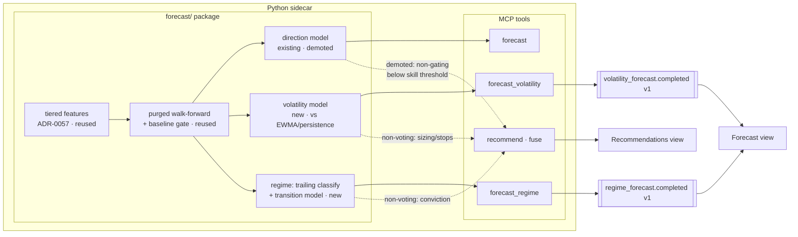

# 0077 — Forecast pivot: volatility + regime-transition forecasting, direction demoted

> **Status:** approved
> **Created:** 2026-07-10
> **Owner skill(s):** dev, backtester, ui-builder, human
> **Related ADRs:** [0070](../adrs/0070-non-directional-forecast-targets.md) (non-directional forecast targets), [0071](../adrs/0071-advisor-non-directional-inputs-and-direction-demotion.md) (advisor non-voting inputs + direction demotion); extends [0030](../adrs/0030-forecasting-subsystem.md)/[0040](../adrs/0040-forecasting-model-artifacts.md), amends [0029](../adrs/0029-advisory-recommendation-boundary.md), relates [0027](../adrs/0027-crypto-macro-regime-classification.md)/[0057](../adrs/0057-forecast-feature-set-tiers.md)/[0058](../adrs/0058-forecast-recommendation-explainability.md)

## TL;DR

The direction forecaster has no reliable edge (near-random target). We pivot the forecasting subsystem to two **non-directional** targets where an honest edge is attainable: a **volatility forecast** (predict next-N-bar realized vol, beat a deterministic EWMA/persistence baseline) and a **regime-transition forecast** (trailing rule-based regime classification + a persistence-baselined next-period-regime classifier). Both ship as distinct forecast *kinds* reusing the existing walk-forward / determinism / explainability harness, validated **cross-asset on BTC-USD and ETH-USD** so an apparent edge must replicate. The existing direction forecaster stays but is **demoted** — surfaced only where it beats baseline and no longer able to veto or solely decide a recommendation. In the advisor, volatility and regime feed **conviction, sizing, and stop distance as non-voting inputs**; they never cast a directional vote, so ADR-0029's directional-agreement invariant stays intact. First user-visible behavior: `forecast_volatility BTC-USD 1d` returns a predicted realized-vol band with its baseline and an honest beats-baseline verdict.

## Context & problem

The forecasting subsystem forecasts next-period **direction** as an up/down/flat probability behind a walk-forward-beats-baseline gate ([ADR-0030](../adrs/0030-forecasting-subsystem.md)). Its own honesty artifacts show the target is near-random: v1 (OHLCV-only) beats no baseline at any horizon on 11.4y of BTC-USD; v2-deep clears the gate only at h=21 and only in some fold layouts ([Plan 0062](done/0062-forecast-feature-set-tiers.md)). Because `recommend`'s fuse is all-legs-agree and its forecast leg is this same direction output ([Plan 0066](done/0066-advisor-tiered-forecast-unification.md)), the weakest, least-reliable leg governs the advisor: a no-edge direction forecast vetoes corroborated setups, and a marginal one can be the deciding vote.

The problem is the **target**, not the harness. Volatility clusters (predictable in a way returns are not) and regime/transition are both more forecastable and directly actionable for the crypto-first ([ADR-0069](../adrs/0069-crypto-first-asset-class-positioning.md)) trader this tool serves. The subsystem already owns everything these need — purged walk-forward, tiered features, determinism, OOS explainability.

## Decision

Add two non-directional forecast kinds — **volatility** (regression vs deterministic EWMA/persistence baseline) and **regime-transition** (trailing rule-based current-regime classification + a next-period-regime classifier vs a persistence baseline) — as **two independent forecasters sharing the existing harness** (chosen over a single unified market-state artifact, which would couple two validation stories, and over supervised regime labels, which are lookahead-prone). Both reuse the pinned sklearn stack (`HistGradientBoostingRegressor`/`Classifier`) — **no new dependency**; GARCH/HMM are out of scope. Keep the direction forecaster but **demote** it. Validate cross-asset on **BTC-USD + ETH-USD** so an edge must replicate. Wire volatility and regime into `recommend` as **non-voting** conviction/sizing/stop inputs, and make the direction leg non-gating below a skill-margin threshold ([ADR-0071](../adrs/0071-advisor-non-directional-inputs-and-direction-demotion.md)). We rejected shipping volatility-first with regime as a follow-on (user wants both; shared-infra design is done once here), a unified market-state model, and supervised regime labels.

## Architecture diagram



## Implementation phases

Phases 1–3 build and expose the forecasters; phase 4 is the empirical edge verdict (the checkpoint that says whether the pivot worked); phases 5–6 wire and render; phase 7 is the human live verdict. The honesty contract means phases 5–6 render truthfully even if phase 4 finds weak edge — a below-baseline forecast surfaces as "no edge," it does not fabricate.

### Phase 1 — Volatility forecaster + deterministic baseline
- **Owner skill:** dev
- **What:** A volatility forecast kind: predict realized volatility over the horizon, scored against deterministic baselines, behind the reused walk-forward gate.
- **Files touched:** `src/market_analyser/forecast/volatility.py` (new: forward-realized-vol label, EWMA + naive-persistence baselines, `HistGradientBoostingRegressor` fit over the shared feature matrix), `forecast/__init__.py`, wiring into the existing walk-forward/validation module, `tests/forecast/test_volatility.py`.
- **Done when:** A unit test drives the volatility forecaster on a fixture and asserts: (a) the forward-realized-vol **label uses only bars t+1..t+N and features only bars ≤ t** (a truncation/perturbation test proves a future bar cannot change a past prediction — no lookahead); (b) the result carries a predicted vol, the deterministic baseline value, and a `beats_baseline` verdict computed by the **pinned scoring rule** (QLIKE or MSE on log-vol, stated in the module) over OOS folds; (c) two runs on the same fixture are byte-identical modulo run provenance. A no-edge fixture yields `beats_baseline=false` with the baseline surfaced, not an error.

### Phase 2 — Regime classification (trailing) + transition-probability forecaster
- **Owner skill:** dev
- **What:** A deterministic trailing current-regime classifier plus a classifier that forecasts the next-period regime, scored against a persistence baseline.
- **Files touched:** `src/market_analyser/forecast/regime.py` (new: rule-based regime taxonomy from trailing trend + volatility (ATR%) reusing `analysis/indicators.py`; next-period-regime `HistGradientBoostingClassifier`; persistence baseline), `forecast/__init__.py`, `tests/forecast/test_regime.py`.
- **Design note — do not invent a third trend concept.** The regime taxonomy's **trend axis must reuse `snapshot._classify_trend`** (the existing UP/DOWN/SIDEWAYS classifier, which [Plan 0073](0073-ichimoku-cloud-indicator.md) ph2 extends with Ichimoku) rather than re-deriving trend from EMA/ADX inline; this phase adds only the **volatility axis** (e.g. ATR%-bucketed quiet/volatile) on top. One trend definition, extended — so if 0073 lands first, the regime inherits the cloud-aware trend by construction, and there is no drift between `_classify_trend` and the regime forecaster. Distinctness from [ADR-0027](../adrs/0027-crypto-macro-regime-classification.md)'s crypto-macro nowcast (per-symbol technical regime + transition vs whole-market current-state) is documented in the module docstring per ADR-0070.
- **Done when:** A unit test asserts: (a) the trailing regime label at bar `i` reads only bars ≤ i (no lookahead — truncation-invariance); (b) the transition forecast returns the current regime plus a probability over next-period regimes, with a `beats_baseline` verdict vs a **persistence** baseline (P(regime unchanged)) via multiclass log-loss/Brier over OOS folds; (c) determinism holds across runs; (d) the current-regime label's trend component **equals `_classify_trend`'s output** for the same bar (the reuse is pinned, not re-implemented), and the taxonomy's distinctness from ADR-0027 is documented. A regime that never transitions in the fixture yields an honest "no edge over persistence."

### Phase 3 — Forecast kinds surfaced: MCP tools + SSE events + explainability
- **Owner skill:** dev
- **What:** Expose both forecasters as read-only MCP tools with their own SSE events, reusing the OOS permutation-importance explainability.
- **Files touched:** `src/market_analyser/api/mcp_tools/forecast_volatility.py`, `.../forecast_regime.py` (new), `forecast/explain.py` (extend to both kinds), `events/payloads.py` (new `volatility_forecast.completed v1` + `regime_forecast.completed v1` payloads + `TYPE_REGISTRY` entries — note the events core was split into `payloads.py`/`bus.py` by the already-landed [Plan 0072](0072-codebase-remediation-audit-2026-07.md) ph2), the full-toolset test (`EXPECTED_FULL_TOOLSET` bump), `docs/reference/` regen.
- **Coordination note — in-flight [Plan 0074](0074-technical-read-advisory-tier.md).** 0074 also adds an MCP tool + a `technical_read.completed v1` payload + an `EXPECTED_FULL_TOOLSET` bump. These are additive and non-conflicting; whichever plan lands second rebases the toolset count and the `TYPE_REGISTRY` (a trivial merge, not a redesign).
- **Advisory-only source scan (mirror 0074).** Both new tools are **read-only forecasts** — the same no-key/no-secret-store/no-order/no-network-write source scan that `recommend` and the advisor package carry applies here too; assert it, matching Plan 0074 phase 2's pin.
- **Done when:** Both tools register (tool-name set == updated `EXPECTED_FULL_TOOLSET`); each publishes its `*.completed` event **exactly once per successful run, strictly after the result is built** (asserted: every raise above the publish leaves the bus untouched); each result carries provenance + an explanation summary (top drivers) per the [ADR-0058](../adrs/0058-forecast-recommendation-explainability.md) shape; the read-only source scan passes; `docs/reference/` regenerates to include the two tools and two events (apiref `--check` clean).

### Phase 4 — Cross-asset edge verdict (BTC + ETH) honesty artifact
- **Owner skill:** backtester
- **What:** Run the walk-forward comparison for both new kinds on BTC-USD **and** ETH-USD, at horizons {1, 5, 21} on 1d, ML tier vs deterministic baseline, and record the honest verdict.
- **Files touched:** `runs/analysis/2026-MM-DD-plan-0077-vol-regime-edge/` (artifact + a short README stating method + per-asset/per-horizon verdict). No `src/` change.
- **Done when:** The artifact records, for volatility and for regime-transition, on **both assets**: baseline score, ML score, the beats-baseline margin, and whether the edge **replicates across BTC and ETH** (the overfit guard). The written verdict claims no more than the numbers support — a one-asset-only or fold-fragile result is labeled as such, not as an edge. This phase is the empirical checkpoint; a null result here is a legitimate, publishable outcome.

### Phase 5 — Advisor: non-voting vol/regime inputs + direction demotion
- **Owner skill:** dev
- **What:** Wire volatility and regime into `recommend` as non-voting conviction/sizing/stop inputs, and make the direction leg non-gating below a skill-margin threshold.
- **Files touched:** `src/market_analyser/advisor/fusion.py` (non-voting inputs: vol → sizing (inverse-vol) + stop distance, regime → conviction/context; direction leg conditional-gating with a pinned `DIRECTION_SKILL_MARGIN` threshold), `advisor/models.py` (recommendation gains sizing/stop-basis + the new non-voting inputs in its basis/checks trace), `tests/advisor/`.
- **Build on the landed [Plan 0072](0072-codebase-remediation-audit-2026-07.md) ph3 fuse().** 0072 ph3 already reshaped `fusion.fuse()` to **derive its blockers from `_build_checks`**; express the direction-leg demotion *through that structure* — the demotion is a check whose gating flag flips, recorded in the [ADR-0058](../adrs/0058-forecast-recommendation-explainability.md) trace as "direction leg present but non-gating (skill below threshold)", not a bespoke branch bolted beside it. `advisor/models.py` is also touched by in-flight [Plan 0074](0074-technical-read-advisory-tier.md) (adds `TechnicalRead`); the two are additive (different models) and merge cleanly.
- **Done when:** Tests assert: (a) the **directional-agreement invariant still holds** — a directional call still requires the *voting* legs (conditions + backtested edge + live signal) to agree, and vol/regime **can never flip or manufacture a direction** (a bullish setup with an adverse vol/regime forecast is smaller/wider-stopped/lower-conviction, never short); (b) with the direction leg below the skill-margin threshold, a corroborated call is **no longer vetoed** by it and the demotion is recorded in the [ADR-0058](../adrs/0058-forecast-recommendation-explainability.md) gate trace ("direction leg present but non-gating"); (c) above the threshold the direction leg votes as before; (d) degenerate/absent vol forecasts do not produce dangerous sizing (bounded); (e) determinism preserved.

### Phase 6 — Forecast + Recommendations views: render all three kinds honestly
- **Owner skill:** ui-builder
- **What:** Render the volatility and regime forecasts and the demoted-direction state; show the new non-voting advisor inputs.
- **Files touched:** `desktop/renderer/views/ForecastView.tsx` (vol band + baseline + beats-baseline; regime current + transition probabilities; direction with an explicit "no reliable edge" state where applicable), `RecommendationsView.tsx` (sizing/stop-basis + non-voting vol/regime inputs + the direction-demotion note), Zod schemas for the two new events (`.strict()`, parity-pinned to the pydantic mirrors), `t()` catalog keys (en + ru per [ADR-0063](../adrs/0063-in-house-i18n-and-reason-codes.md)).
- **Not gated on [Plan 0072](0072-codebase-remediation-audit-2026-07.md) ph8.** Unlike the render phases of Plans 0073/0076, this phase touches `ForecastView.tsx`/`RecommendationsView.tsx`, **not** `CandlestickChart.tsx` — so it carries no dependency on the chart decomposition and need not be serialized behind it.
- **Done when:** Renderer specs assert: the volatility view renders a predicted band with its baseline and a `beats_baseline=false` case showing an explicit no-edge state (zero misleading precision); the regime view renders current regime + transition bars; a demoted direction renders "no reliable edge" rather than a confident probability; the Recommendations view shows the sizing/stop basis and labels the vol/regime inputs as non-voting; both new event payloads pass `safeParse` and are parity-pinned. No auto-switch on forecast arrival (the ADR-0037 posture — a probability must not grab the screen).

### Phase 7 — Live smoke + edge verdict
- **Owner skill:** human
- **What:** Exercise the two tools + the advisor through the running sidecar on BTC-USD and ETH-USD; judge whether the edge is real enough to keep the advisor wiring active.
- **Done when:** The user confirms the tools return coherent, honest output live on both assets, the Forecast/Recommendations views render the three kinds correctly, and records a go/no-go on the advisor wiring (with the option to leave the tools shipped but the advisor inputs off if the edge is unconvincing).

## Data shapes

```python
# illustrative — not the final interface

class VolatilityForecast(BaseModel):
    symbol: str
    timeframe: str
    horizon_bars: int
    predicted_vol: float            # realized-vol units (e.g. stdev of log returns over horizon)
    band: tuple[float, float]       # honest uncertainty, not false precision
    baseline_vol: float             # EWMA / persistence
    baseline_kind: Literal["ewma", "persistence"]
    beats_baseline: bool            # via the pinned scoring rule (QLIKE / MSE on log-vol), OOS
    score_margin: float             # ml_score - baseline_score, OOS
    provenance: ForecastProvenance  # reused; feature_set_id, series_inputs, explanation summary

class RegimeForecast(BaseModel):
    symbol: str
    timeframe: str
    horizon_bars: int
    current_regime: str             # trailing, rule-based (e.g. "trend_up_quiet")
    transition_probs: dict[str, float]   # P(next-period regime) over the taxonomy
    baseline_kind: Literal["persistence"]
    beats_baseline: bool            # multiclass log-loss / Brier vs persistence, OOS
    provenance: ForecastProvenance

# advisor (phase 5): non-voting inputs on the recommendation's basis/checks
#   sizing_basis: predicted vol -> inverse-vol size hint (advisory number, no order)
#   stop_basis:   predicted vol -> stop distance
#   direction_leg: {present: bool, gating: bool, skill_margin: float}  # non-gating below DIRECTION_SKILL_MARGIN
```

## Interaction with in-flight plans (0072–0076)

Cross-checked at approval; **no blocking overlaps, no file-level conflicts.** The coordination points are folded into the phases above:

- **[Plan 0074](0074-technical-read-advisory-tier.md) (technical-read tier)** — the largest interaction, and complementary: 0074 works *around* the no-edge direction forecast with a parallel single-indicator tier (`fuse()` untouched); this plan fixes the root cause by *demoting* the direction leg inside `fuse()`. Both remain valid regardless of order. Mechanical coordination (both add a tool + SSE event + `EXPECTED_FULL_TOOLSET` bump, both touch `advisor/models.py` additively; both pin an advisory/read-only source scan) is noted in phases 3 and 5 — trivial rebase for whichever lands second.
- **[Plan 0072](0072-codebase-remediation-audit-2026-07.md)** — ph3 (landed) reshaped `fuse()` to derive blockers from `_build_checks`; phase 5 here builds on that. ph8 (chart decompose, pending) gates 0073/0076 render phases but **not** phase 6 here (which touches the advisory views, not `CandlestickChart.tsx`).
- **[Plan 0073](0073-ichimoku-cloud-indicator.md)** — file-disjoint; the one touch-point is conceptual: phase 2 here **reuses** `_classify_trend` (which 0073 extends with Ichimoku) as its regime trend axis rather than inventing a third trend concept.
- **[Plan 0075](0075-ichimoku-strategy.md) / [0076](0076-obv-chart-overlay.md)** — disjoint. 0075 (`strategies/` + backtest) is complementary (it supplies a corroborated *voting* leg; this plan reweights the *forecast* leg); 0076 (`OverlaySpec` + chart pane) shares no files with this plan.

## Risks & open questions

- **Risk: volatility scoring rule flatters or buries the model.** A regression edge over EWMA is sensitive to the metric. Mitigation: pin the scoring rule (QLIKE or MSE on log-vol) in phase 1 and assert the beats-baseline verdict against it, not raw MSE on levels.
- **Risk: the regime taxonomy is well-forecast but unhelpful.** A deterministic rule-based regime is non-circular but its boundaries are chosen. Mitigation: keep the taxonomy small and legible (trend × vol), document boundaries, and let phase 4/7 judge usefulness — a well-validated forecast of a useless label is a phase-7 no-go, not a silent ship.
- **Risk: no edge on either target (a real possibility).** Volatility is more forecastable than direction but the ML tier may still not beat a strong EWMA baseline. Mitigation: this is exactly what phase 4 is for; a null result is publishable and the honesty contract renders it truthfully. The deterministic baseline is itself a useful shipped output even if ML adds nothing.
- **Risk: the direction-demotion threshold is set wrong.** Too low changes nothing; too high demotes a genuine edge. Mitigation: pin `DIRECTION_SKILL_MARGIN` with a boundary test (phase 5) and expose the leg's gating status in the trace so the behavior is auditable.
- **Risk: this is a large plan (7 phases, 3 owners, 2 ADRs).** Mitigation: the phase ordering makes the edge verdict (phase 4) precede the wiring, and each forecaster is independently valuable; if scope proves too large mid-flight, the natural cut is to land phases 1–4 (+6 for the tools' views) and defer phase 5 advisor wiring to a follow-on — the tools stand alone.
- **Open question:** ETH-USD 1d history depth vs the exogenous metric series (funding/OI/MVRV are BTC-centric). ETH may only support the OHLCV+cycle tiers, not the full exogenous set. Phase 4 should state which tier each asset actually trained, per the [ADR-0057](../adrs/0057-forecast-feature-set-tiers.md) fallback-reason discipline.

## What this plan does NOT do

- **GARCH volatility / HMM regime models** — both add dependencies; deterministic EWMA/persistence baselines + rule-based regime are the scope here. Possible later baselines, separate plan.
- **Retire the direction forecaster** — it stays (demoted), not removed. A future plan may retire it if vol/regime fully subsume its advisory value.
- **Loosen ADR-0029's directional-agreement invariant** — the voting-leg set is unchanged; only the direction leg's gating status changes and non-voting inputs are added ([ADR-0071](../adrs/0071-advisor-non-directional-inputs-and-direction-demotion.md)).
- **Multi-timeframe or beyond-crypto validation** — 1d, BTC + ETH only for v1. Other timeframes/assets are follow-ups.
- **Volatility-driven order sizing that places orders** — advisory sizing numbers only; execution remains untaken ([ADR-0025](../adrs/0025-trade-execution-feasibility.md)).

## Followups (after this lands)

- (empty at draft time)
