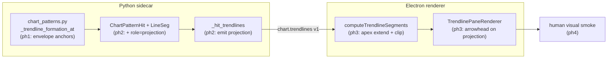

# 0083 — Chart-pattern visual fidelity (pattern-by-pattern)

> **Status:** draft
> **Created:** 2026-07-11
> **Owner skill(s):** dev, ui-builder, human
> **Related ADRs:** [0078](../adrs/0078-chart-pattern-visual-fidelity.md) (gates this plan; refines [0048](../adrs/0048-classical-chart-pattern-detection.md), extends [0049](../adrs/0049-chart-trendline-overlay-primitive.md) / [0061](../adrs/0061-trendline-pattern-identity-and-colour.md))

## TL;DR

Classical chart patterns don't render as their textbook shapes. A symmetrical triangle's lower boundary anchors on a single spike-low pivot and dives into a "big V" instead of tracing the higher-lows envelope; the two boundaries never converge to an apex on screen; and the breakout/measured-move projection the detector already computes is never drawn. This plan fixes the visual representation **pattern by pattern**, starting with the symmetrical triangle. The foundation (converging-envelope anchor selection + apex/breakout rendering) is shared machinery that makes the symmetrical triangle correct end-to-end as its first beneficiary; subsequent patterns are appended as phases as the user reviews each against a reference drawing. First user-visible behavior: on the same symbol/window as the reported screenshot, the symmetrical triangle draws two converging boundaries meeting at an apex, no spike-driven V, and a breakout arrow once confirmed.

## Context & problem

The user is auditing the chart's rendering of classical patterns against textbook reference drawings, one pattern at a time. The symmetrical triangle is first and exhibits three defects, all traced in the code:

1. **Bad lower-boundary anchor ("big V").** `analysis/chart_patterns.py:346-353` selects boundary anchors as the *two highest highs* and *two lowest lows* in the window. The lowest-priced low pivot is often an outlier spike, so it becomes an anchor and pulls the lower line into a deep V instead of the rising higher-lows boundary. ADR-0048 explicitly flagged this outlier sensitivity as a known cost.
2. **No apex.** `desktop/renderer/lib/trendlines.ts::computeTrendlineSegments` draws each boundary only between its two anchors; the lines stop short and never visibly converge.
3. **No breakout projection.** The detector computes a breakout line + measured `target` (`_Formation.break_*`, `measured_height`; `ChartPatternHit.target`), but `_hit_trendlines` (`api/mcp_tools/_shared/chart_patterns_response.py:33-54`) sends only the two boundary lines. No arrow reaches the chart.

Decisions (see [ADR-0078](../adrs/0078-chart-pattern-visual-fidelity.md)): fix detection **and** rendering (not render-only); add the apex + breakout arrow to match the reference; structure as one plan, phased per pattern.

## Decision

Refine the trendline-family anchor selection to a **converging-envelope with outlier tolerance** (real pivots, no regression — ADR-0048's core stands), plumb the existing breakout/measured-move geometry to the renderer, and extend the renderer to draw a clipped apex plus a confirmed-only breakout arrow. Symmetrical triangle is the walking skeleton; the same shared machinery is then verified against each subsequent pattern's reference, appended as phases. We rejected render-only polish (leaves the anchor-driven V) and regression-fit boundaries (line floats off real prices).

## Architecture diagram



## Implementation phases

### Phase 1 — Converging-envelope anchor selection
- **Owner skill:** dev
- **What:** Replace the two-global-extremes anchor pick in `_trendline_formation_at` with an envelope-with-outlier-tolerance selection for the trendline family (symmetrical / ascending / descending triangle, rising / falling wedge): upper boundary = the pivot-high pair forming the descending envelope keeping (nearly) all window highs at/below it; lower boundary = the pivot-low pair forming the ascending envelope keeping (nearly) all window lows at/above it, with a bounded outlier tolerance rejecting spike pivots.
- **Files touched:** `src/market_analyser/analysis/chart_patterns.py` (the anchor-selection block ~lines 346-373, a new named tolerance constant), `tests/analysis/test_chart_patterns.py`.
- **Done when:** on a constructed symmetrical-triangle fixture that contains a spike-low pivot *below* the higher-lows envelope, the emitted lower trendline anchors on the higher-lows envelope (not the spike) and the two boundaries converge; the existing `test_symmetrical_triangle_reports_converging_extreme_lines`, `test_ascending_triangle_flat_upper_rising_lower`, `test_descending_triangle_and_wedges_classify`, the per-pattern truncation-invariance test, and the determinism test all still pass (adjust their fixtures only where the envelope legitimately changes the chosen anchors, and assert the new anchor identity explicitly); a new test asserts the spike pivot is rejected as an anchor.

### Phase 2 — Expose breakout/measured-move projection on the hit + wire
- **Owner skill:** dev
- **What:** Surface the detector's breakout direction + measured target as a drawable `projection` segment on confirmed hits and carry it over the wire. Add a `"projection"` value to `LineSeg.role` and `TrendlineSpec.role`; build the projection segment (from the breakout anchor toward `target` in the break direction) in `_hit`/`_Formation` mapping for `confirmed` hits only; emit it in `_hit_trendlines`.
- **Files touched:** `src/market_analyser/analysis/types.py` (`LineSeg.role` literal), `src/market_analyser/analysis/chart_patterns.py` (`_hit` / formation→hit mapping), `src/market_analyser/events/chart_types.py` (`TrendlineSpec.role` literal), `src/market_analyser/api/mcp_tools/_shared/chart_patterns_response.py` (`_hit_trendlines`), `tests/analysis/test_chart_patterns.py`, `tests/api/test_detect_chart_patterns.py`.
- **Done when:** a `confirmed` symmetrical-triangle hit carries exactly one `projection` `LineSeg` whose endpoint price equals the hit's measured `target` and whose direction matches the confirmed break; a `forming` hit carries **no** projection segment; `detect_chart_patterns` publishes the projection spec on `chart.trendlines v1` (asserted in the tool test). No lookahead: the projection exists only once the confirming bar is in `bars[0..=i]`.

### Phase 3 — Apex convergence + breakout-arrow rendering
- **Owner skill:** ui-builder
- **What:** In the trendline renderer, extend a pattern's two boundary segments to their intersection and clip at the apex (omit the extension when the apex is near-parallel / beyond a max forward horizon), and draw `role === "projection"` segments with an arrowhead and distinct weight so the pattern reads as a coil with a breakout arrow.
- **Files touched:** `desktop/renderer/lib/trendlines.ts` (`computeTrendlineSegments` apex extension + clip; `TrendlinePaneRenderer.draw` arrowhead for projection role), `desktop/renderer/lib/trendlines.test.ts`; if a weight/token is needed, `desktop/renderer/components/CandlestickChart.tsx`.
- **Done when:** a unit test feeds two converging boundary specs whose anchors stop short of their intersection and asserts the computed segments meet at the apex point (within tolerance); a `projection` spec renders a segment terminated by an arrowhead; a near-parallel pair falls back to plain segments (no off-screen shoot); a `forming` pattern (boundaries only, no projection) renders apex + dashed and no arrow. Existing `trendlines.test.ts` and `CandlestickChart.trendlines*.test.tsx` stay green.

### Phase 4 — Human visual smoke: symmetrical triangle + rising wedge
- **Owner skill:** human
- **What:** Launch the app and compare two trendline-family patterns against their references: a **symmetrical triangle** (either-direction break) and a **rising wedge** (down-break). The rising wedge is the same trendline family (`_classify_trendlines` → `("rising_wedge", "bearish", -1)`) so phases 1-3 already cover it; it is smoked here as the second case because it exercises the `break_direction = -1` **downward** projection path the symmetrical triangle doesn't. The reported rising-wedge app render showed the same three defects (spike-anchored lower boundary, no apex, no downward target).
- **Files touched:** none (manual).
- **Done when:** the user confirms (a) the symmetrical triangle draws two converging boundaries meeting at an apex, no spike-driven V, and a breakout arrow on a confirmed hit; **and** (b) the rising wedge draws two both-rising converging boundaries (lower anchored on the higher-lows envelope, not the spike), and its confirmed breakout arrow points **down** to the measured-move target — GO — or files specific visual deltas to fold back into phases 1-3.

### Phase 5 — Head & shoulders: skeleton spec + downward projection
- **Owner skill:** dev
- **What:** Emit the H&S pattern outline and its measured-move target as drawable geometry. Add a `"skeleton"` value to `LineSeg.role` / `TrendlineSpec.role`; `_match_head_shoulders` emits a skeleton `LineSeg` whose `points` are the ordered pivots `LS → t1 → head → t2 → RS` (a multi-point spec — `computeTrendlineSegments` already walks consecutive pairs, so no new pixel math). Ensure the pivot-matched family also produces the ph2 `projection` segment on `confirmed` hits: for H&S the projection anchors at the **neckline-break point** and drops by the measured head-to-neckline height to `hit.target` (bearish → downward; inverse H&S → upward). The neckline `LineSeg` (already emitted) is unchanged.
- **Files touched:** `src/market_analyser/analysis/types.py` (`LineSeg.role` += `"skeleton"`), `src/market_analyser/analysis/chart_patterns.py` (`_match_head_shoulders` skeleton line; projection anchor for pivot-matched formations in `_hit`), `src/market_analyser/events/chart_types.py` (`TrendlineSpec.role`), `src/market_analyser/api/mcp_tools/_shared/chart_patterns_response.py` (`_hit_trendlines` passes the skeleton + projection through), `tests/analysis/test_chart_patterns.py`, `tests/api/test_detect_chart_patterns.py`.
- **Done when:** a `confirmed` head & shoulders hit carries (a) a neckline `LineSeg` through the two troughs, (b) a `skeleton` `LineSeg` whose points are exactly `LS, t1, head, t2, RS` in order, and (c) one `projection` `LineSeg` ending at `hit.target` in the neckline-break direction (down for H&S, up for inverse); a `forming` hit carries the neckline + skeleton but **no** projection. No lookahead: the projection appears only once the neckline-break bar is in `bars[0..=i]`. The tool publishes all three on `chart.trendlines v1`.

### Phase 6 — Head & shoulders: skeleton + shaded-hump rendering
- **Owner skill:** ui-builder
- **What:** Render the skeleton polyline as the pattern outline (distinct weight, pattern colour) and **fill the humps** — the region bounded above by the skeleton and below by the neckline. Fill is a new pass in the trendline renderer (`TrendlinePaneRenderer` currently only strokes). Scope: H&S only — triangles/wedges (no skeleton, no fill) and double top/bottom (drawn with plain horizontals, no fill — see phase 8) are all unaffected.
- **Files touched:** `desktop/renderer/lib/trendlines.ts` (fill pass keyed on `role === "skeleton"` + its neckline; skeleton stroke styling), `desktop/renderer/lib/trendlines.test.ts`; a low-alpha fill token in `desktop/renderer/components/CandlestickChart.tsx` if needed.
- **Done when:** a unit test feeds a 5-point skeleton + a neckline spec and asserts (a) the skeleton renders as four connected segments through the five pivots, (b) a semi-transparent fill is emitted for the region between the skeleton and the neckline, (c) a spec set with no `skeleton` role (a triangle) emits **no** fill. Existing `trendlines.test.ts` and `CandlestickChart.trendlines*.test.tsx` stay green.

### Phase 7 — Human visual smoke: head & shoulders
- **Owner skill:** human
- **What:** Launch the app on a symbol/window containing a head & shoulders and compare against the reference.
- **Files touched:** none (manual).
- **Done when:** the user confirms the H&S draws the neckline, the LS/head/RS skeleton with shaded humps, and the downward measured-move projection on a confirmed break — GO — or files deltas to fold back into phases 5-6.

### Phase 8 — Double top / bottom: support line + measured-move projection
- **Owner skill:** dev
- **What:** `_match_double` today emits only the neckline (a horizontal `LineSeg` at the middle-pivot price — the peak between the troughs for a bottom, the trough between the peaks for a top). Add a second **horizontal line through the two matching extremes** — the two troughs for a double bottom, the two peaks for a double top (a new `"base"` role) — and emit the pivot-matched `projection` (up through the neckline for a bottom, down for a top) to `hit.target`, building on the phase-5 pivot-matched projection mechanism. **No fill, no skeleton** for doubles (per the reference — two horizontals only). Verify the neckline renders horizontally (it is priced at the mid pivot): if the reported diagonal was the double's *own* neckline drawn wrong it is fixed here; if it was a *co-detected coil* bleeding in, that is the overlapping-formations followup (out of scope), which the phase-9 smoke disambiguates. No hand renderer change — `computeTrendlineSegments` already strokes both horizontals and phase 3 draws the projection arrow; the `"base"` role reaches the renderer via `gen-types` regeneration.
- **Files touched:** `src/market_analyser/analysis/types.py` (`LineSeg.role` += `"base"`), `src/market_analyser/analysis/chart_patterns.py` (`_match_double` base line + pivot-matched projection), `src/market_analyser/events/chart_types.py` (`TrendlineSpec.role`), `src/market_analyser/api/mcp_tools/_shared/chart_patterns_response.py` (`_hit_trendlines` passes base + projection), regenerated renderer types (`pnpm gen-types`), `tests/analysis/test_chart_patterns.py`, `tests/api/test_detect_chart_patterns.py`.
- **Done when:** a `confirmed` double bottom carries (a) a horizontal neckline `LineSeg` at the middle-peak price, (b) a horizontal `base` `LineSeg` through the two troughs at (near-)equal price, and (c) one **upward** `projection` `LineSeg` ending at `hit.target`; a double top mirrors it (base through the two peaks, **downward** projection); a `forming` double carries neckline + base but **no** projection, and **no** `skeleton`/fill role is ever emitted for a double. No lookahead: the projection appears only once the neckline-break bar is in `bars[0..=i]`. Published on `chart.trendlines v1`; `gen-types:check` clean.

### Phase 9 — Human visual smoke: double bottom
- **Owner skill:** human
- **What:** Launch the app on a symbol/window containing a double bottom and compare against the reference; in particular report whether the stray diagonal from the reported render is gone (its own neckline corrected) or still present (a co-detected pattern → the overlapping-formations followup).
- **Files touched:** none (manual).
- **Done when:** the user confirms the double bottom draws a horizontal neckline through the middle peak, a horizontal support line through the two troughs, and an upward target arrow on a confirmed break — and reports whether any stray diagonal remains — GO — or files deltas to fold back into phase 8.

### Pattern backlog — appended as each pattern is reviewed

Not yet phases. As the user sends the app-vs-reference screenshots for each remaining pattern, architect appends a numbered phase here (owner: `dev` for geometry/tuning, `ui-builder` if a new render capability surfaces, `human` for its smoke). Expected candidates, each to be grounded on its own screenshot before it becomes a phase:

- Ascending triangle — flat upper boundary along equal highs, rising lower envelope.
- Descending triangle — flat lower boundary along equal lows, falling upper envelope.
- Falling wedge — both boundaries falling, converging, breaks up.
- Inverse head & shoulders — mirror of H&S; expected to reuse phases 5-6 (skeleton + hump fill) with an **upward** projection.

Four patterns reviewed so far are placed: **symmetrical triangle** (1st) is the foundation ph1-4; **head & shoulders** (2nd) is phases 5-7; the **rising wedge** (3rd) needs no new phase — a foundation-covered coil verified in the phase-4 smoke as the down-break case; **double bottom / top** (4th) is phases 8-9 (two horizontals + projection, no fill/skeleton). The remaining backlog above needs no new anchor logic: the falling wedge and both directional triangles are foundation-covered coils (a screenshot each just confirms the flat-side classification renders right); inverse H&S reuses the phases 5-6 machinery.

## Data shapes

Additive wire/geometry change (no persisted schema — patterns stay derived per ADR-0048):

```python
# analysis/types.py — LineSeg.role gains "projection"
role: Literal["neckline", "upper_trendline", "lower_trendline", "projection"]

# events/chart_types.py — TrendlineSpec.role mirrors it
role: Literal["neckline", "upper_trendline", "lower_trendline", "projection"] | None

# A confirmed hit's projection segment (illustrative):
#   start = breakout anchor (where the confirming close cleared the boundary)
#   end   = (start.ts advanced by the measured-move horizon, price = hit.target)
```

The outlier tolerance is a **new named module constant** in `chart_patterns.py` (alongside `PIVOT_RIGHT`, `TRENDLINE_WINDOW_BARS`, `FLAT_SLOPE_TOL_PER_BAR`, …), not a magic literal.

## Risks & open questions

- Risk: changing anchor selection shifts *which* formations classify, so some existing fixtures may pick different anchors. Mitigation: phase 1 re-reads each affected fixture assertion and pins the new anchor identity explicitly (not "still fires" — the exact pivots), per the tests-are-acceptance-criteria rule.
- Risk: apex extension for near-parallel boundaries shoots a line off-screen or produces a distant apex. Mitigation: max-forward-horizon clip with a plain-segment fallback (named constant), unit-tested.
- Risk: the projection arrow could read as a recommendation. Mitigation: it is the measured-move *geometry* only (ADR-0048 Notes; ADR-0029 boundary unchanged), confirmed-only, no action field.
- Open question (deferred): multiple overlapping formations in one region render as several coloured shapes (visible as the stray extra line in the screenshot). The layers legend already lets the user hide groups; whether to additionally show only the highest-strength / most-recent formation per region is a followup, not this plan.
- Open question: exact measured-move horizon (how many bars forward the arrow projects) — a render/geometry heuristic to settle in phase 2/3; the *target price* is fixed by the detector, only the arrow's x-length is a presentation choice.

## What this plan does NOT do

- Does not fill/shade the converging **coil** patterns (triangle / wedge) or the **double top/bottom** (drawn as two horizontals per its reference) — reference is lines + arrow only (ADR-0078 Alternative C). Hump fill *is* drawn for the head & shoulders / inverse (phase 6) where the reference fills each hump.
- Does not draw pivot text labels (LS / Head / RS / Target) — deferred to the hover tooltip as a followup.
- Does not change pattern *detection thresholds* (symmetry, convergence, `k·ATR` breakout margin) — only anchor *selection* and rendering.
- Does not touch the candlestick-pattern marker path (`scan_patterns` / `highlight_pattern` / `chart.highlight`) — that is a different family and renders markers, not trendlines.
- Does not add persistence — patterns remain derived and recomputed (ADR-0048 / ADR-0045).

## Followups (after this lands)

- Consider de-cluttering overlapping formations (highest-strength / most-recent per region).
- Consider the coil fill/shade as an opt-in style if the user wants it later.
