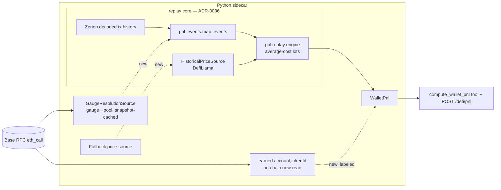

# 0084 — DeFi P&L completeness: Aerodrome gauge events, swap booking, unclaimed rewards

> **Status:** approved
> **Created:** 2026-07-11
> **Owner skill(s):** dev, human
> **Related ADRs:** [ADR-0079](../adrs/0079-defi-pnl-gauge-swaps-unclaimed.md) (paired — refines [ADR-0036](../adrs/0036-defi-pnl-transaction-replay.md))

## TL;DR

`compute_wallet_pnl` returns `null` (honestly `incomplete`) for gauge-staked Aerodrome positions — the dominant DeFi shape on Base. A live re-run on the test wallet on 2026-07-11 reproduced **4 of 5 positions incomplete**: 35 unbooked *gauge* events (where the rewards live), 23 unbooked *swap* events, 1 missing price. This plan closes all three replay gaps and adds a bounded on-chain read of **unclaimed** gauge rewards, so the tool returns real per-position fees + rewards + P&L (and owed-but-unclaimed emissions) for Aerodrome LPs — turning the ad-hoc manual reconstruction done this session into a first-class tool path. First user-visible behavior: `POST /defi/pnl` on `0xae5b…9790` returns 5/5 complete positions with non-null realized/unrealized totals and an `unclaimed_rewards` figure on the open position.

## Context & problem

`compute_wallet_pnl` (Plan 0035 / ADR-0036, done 2026-07-05) reconstructs DeFi P&L by replaying decoded on-chain transactions, pricing every leg at its own block time, under average-cost lots. It books `fee_claim` and `reward_claim` as income and reports LP vs-HODL (impermanent loss + fees as one fact). It shipped with a known gap: its own gating smoke reconstructed only 1 of 5 positions.

A live re-run of the tool on 2026-07-11 (`POST /defi/pnl`, `0xae5b…9790`, cached path) reproduced the state exactly:

- **5 positions, 4 incomplete** → wallet `realized_usd` / `unrealized_usd` are `null` (ADR-0036: any incomplete position nulls the total).
- Note breakdown: **35 `unbooked unclassified event`**, **23 `unbooked swap event`**, **1 `no block-time price`**.
- Zerion advisory cross-check total: $29,582 (no gross-divergence warning).

Root causes, confirmed against the code:

1. **Gauge indirection breaks the position join** (`src/market_analyser/defi/pnl_events.py`). The `reward_claim` vocabulary already includes `getreward`/`claimrewards` and the add/remove hints include `stake`/`unstake`, so this is **not** a vocabulary miss. A gauge `getReward` tx carries `contract_address = <gauge>` ≠ the position's `pool_address` (join rule step 1 fails), and its AERO-only inbound transfer is contained by several of the wallet's positions at once (AERO/WETH ×2, USDC/AERO, loose AERO), so the token fallback is ambiguous → joins nothing / surfaces as `unclassified`. Aerodrome pays emissions through a per-pool gauge distinct from the pool; without a gauge→pool map, rewards can't be attributed. This session's manual run resolved exactly this by calling `gauge.pool()` on-chain, then `pool.token0()/token1()`.
2. **Swaps are deliberately unbooked** (`src/market_analyser/defi/pnl.py:37-43`): `swap`/`liquidation`/`unclassified` are in the loud-fail set. LP zap in/out routes value through swaps, so one unbooked swap fails the position.
3. **One long-tail token has no DefiLlama block-time price**, nulling the wallet total by itself.
4. **Unclaimed rewards are invisible to replay.** Currently-owed emissions (e.g. 34.2 AERO on the open AAVE/WETH position, read via `earned()`) have no claim tx, so tx-replay structurally cannot see them.

## Decision

Close the three replay gaps and add one bounded current-state augmentation, per ADR-0079, preserving every ADR-0036 invariant (block-time pricing, average-cost lots, determinism-by-snapshot, loud-failure-never-zero):

1. A **snapshot-cached gauge→pool resolution seam** (on-chain, reusing the `lp_detail.py` RPC path) that the classifier consults so gauge txs join the right position.
2. **Swap booking** as average-cost lot conversions in the replay engine.
3. A **fallback `HistoricalPriceSource`** behind DefiLlama.
4. A labeled, current-state **`unclaimed_rewards`** field (per position + wallet roll-up) read via the gauge's `earned()`, kept out of the deterministic replay figures.

We rejected leaving swaps/prices as accepted incompletes (one unbooked leg nulls the total) and rejected token-set-only gauge attribution (ambiguous by construction — AERO is in several positions). Full rationale in ADR-0079.

## Architecture diagram



## Implementation phases

### Phase 1 — Gauge→pool resolution seam
- **Owner skill:** dev
- **What:** A `GaugeResolutionSource` Protocol + on-chain adapter (gauge address → pool address; reuse `lp_detail.py`'s JSON-RPC `eth_call` and the same snapshot-cache discipline as the price source) so gauge identity is a deterministic, replayable input.
- **Files touched:** `src/market_analyser/data/sources.py` (new Protocol), `src/market_analyser/data/adapters/gauge_resolution.py` (new), `src/market_analyser/data/adapters/lp_detail.py` (share the `pool()`/`token0()`/`token1()` selectors already used for Slipstream gauge-indirection), snapshot-cache wiring.
- **Done when:** given the AERO/WETH gauge `0x9564…88f1` the source returns pool `0x4e50…ce51`; a cold call hits RPC and a warm call reads the snapshot with zero RPC; an unresolvable gauge returns `None` (not a raise). A unit test asserts the mapping for the two AERO/WETH gauges and the AAVE/WETH gauge against recorded fixtures.

### Phase 2 — Gauge-aware event classification
- **Owner skill:** dev
- **What:** Thread the resolver into `map_events` so a gauge tx joins the pool position it belongs to: `getReward` → `reward_claim`; stake/unstake NFT transfer → position custody move with no basis change; ambiguity still yields honest `unclassified`.
- **Files touched:** `src/market_analyser/defi/pnl_events.py`, `src/market_analyser/defi/pnl_job.py` (pass the resolver through), `tests/defi/test_pnl_events*.py`.
- **Done when:** on a fixture of the wallet's gauge `getReward` txs, `map_events` emits `reward_claim` events joined to the correct AERO/WETH position (not the USDC/AERO or AAVE/WETH one); the count of `unclassified` events attributable to gauge interactions drops to zero on the fixture. Test asserts the specific tx→position→`reward_claim` attribution, not just "no unclassified".

### Phase 3 — Swap booking in the replay engine
- **Owner skill:** dev
- **What:** Book `swap` as an average-cost lot conversion — realize P&L on the sold leg against its average cost, open a new lot on the bought leg at block-time value; remove `swap` from the loud-fail set (keep `liquidation`/`unclassified` loud).
- **Files touched:** `src/market_analyser/defi/pnl.py`, `tests/defi/test_pnl*.py`.
- **Done when:** a fixture position containing a swap reconstructs to a non-`None` realized figure with `incomplete=False`; a golden replay test pins the swap-inclusive P&L and re-runs byte-identical; a position with a `liquidation` or genuine `unclassified` event still fails loud.

### Phase 4 — Fallback historical-price source
- **Owner skill:** dev
- **What:** A secondary `HistoricalPriceSource` behind DefiLlama, consulted only on a primary miss, snapshot-cached identically so the merged result stays deterministic. Prefer extending the existing keyless CoinGecko adapter to block-time history; if it cannot serve block-time prices, add one pinned dependency under the cooldown policy (ADR-0012/0013) and name the CVE-free version in the manifest commit.
- **Files touched:** `src/market_analyser/data/adapters/` (fallback adapter), `src/market_analyser/data/sources.py` / composition root (chain primary→fallback), snapshot-cache, `tests/defi/test_*price*`.
- **Done when:** the long-tail token that returned `no block-time price` now resolves via the fallback; a unit test asserts primary-hit uses DefiLlama and primary-miss falls through to the secondary; determinism test re-runs byte-identical from the snapshot.

### Phase 5 — Unclaimed-reward augmentation on the P&L output
- **Owner skill:** dev
- **What:** Add a labeled current-state `unclaimed_rewards` field to `PositionPnl` and a wallet roll-up on `WalletPnl`, read on-chain via the CL gauge's `earned(account, tokenId)` (reuse phase-1 resolver + `lp_detail.py`). Keep it out of realized/unrealized and out of the byte-identical guarantee (extend `model_dump(exclude=...)` like run-provenance); surface it in the tool + route + regenerated docs.
- **Files touched:** `src/market_analyser/defi/pnl.py` (model fields), `src/market_analyser/defi/enrichment.py` (or a sibling for the `earned()` read), `src/market_analyser/defi/pnl_job.py`, `src/market_analyser/api/mcp_tools/compute_wallet_pnl.py`, `src/market_analyser/api/routes/defi.py` (`PnlResponse`), `docs/reference/` (regen via `pnl:api-docs`), `tests/defi/test_pnl_route.py`, `tests/api/test_compute_wallet_pnl_tool.py`.
- **Done when:** `POST /defi/pnl` on the wallet returns an `unclaimed_rewards` figure (~34.2 AERO / ~$18) on the open AAVE/WETH position, `null`/empty on exited ones; the field is documented in `docs/reference/mcp-tools.md`; the determinism test still passes with the field excluded; the full-toolset registration test still counts the tool.

### Phase 6 — Human live smoke
- **Owner skill:** human
- **What:** Run `POST /defi/pnl` (with `refresh=true`) on `0xae5b…9790` and confirm the numbers against this session's manual reconstruction.
- **Files touched:** none (verification).
- **Done when:** all 5 positions report `incomplete=false`; wallet `realized_usd`/`unrealized_usd` are non-null; the AERO/WETH position's reward income reconciles to the manual ≈ $1,317 (2,830 AERO) realized figure within a small tolerance; the open AAVE/WETH position shows ~$130 past-week realized plus ~$18 unclaimed; the Zerion FIFO cross-check shows no gross-divergence warning. Record the verdict in the plan close notes.

## Data shapes

```python
# illustrative — not the final interface
class PositionPnl(BaseModel):
    position_id: str
    realized_usd: float | None
    unrealized_usd: float | None
    cost_basis_usd: float | None
    vs_hodl_usd: float | None            # LP only (ADR-0036)
    unclaimed_rewards: list[RewardAmount] | None   # NEW — current-state, on-chain earned(); excluded from determinism guarantee
    incomplete: bool
    notes: list[str]

class RewardAmount(BaseModel):
    symbol: str
    amount: float
    usd_value: float | None              # current price, provenance-tagged (not block-time)
```

## Risks & open questions

- Risk: **classifier is no longer a pure function** — it gains the gauge_map input. Mitigation: fetch-then-snapshot so replay stays deterministic; keep `map_events` pure over `(txs, positions, gauge_map)` and do the I/O in the job layer (phase 1/2 boundary).
- Risk: **swap mis-booking corrupts basis** across a position. Mitigation: golden replay tests on fixture wallets + the vs-HODL and Zerion FIFO cross-checks catch order-of-magnitude drift.
- Risk: **public Base RPC is rate-limited/flaky** (this session saw 10k-block `getLogs` caps and 503s; `eth_call` was reliable). The resolver and `earned()` use only `eth_call`, which held up — but resolution failures must degrade to honest `unclassified`/absent, never a guess or a crash.
- Risk: **fallback price dependency** may trip the cooldown policy. Mitigation: prefer the already-vendored CoinGecko adapter; only add a pinned dep if block-time history isn't reachable otherwise, in a single manifest+lock commit.
- Open question: do staked-CL **stake/unstake** NFT transfers ever carry a value delta that should touch basis, or are they always pure custody moves? Phase 2 assumes pure custody; the fixture test must confirm.

## What this plan does NOT do

- **Pool/LP screener, lending health-factor/liquidation, standalone IL metric** — those are Plans 0042/0043 (approved, unbuilt) and the absent screener; out of scope here.
- **CEX/manual-leg realized P&L** — a Plan 0041 followup, unchanged.
- **General whole-wallet token accounting** — the engine stays per-position (ADR-0036).
- **Booking `liquidation` events** — remains a loud failure; no fixture demands it yet.
- **Any execution / rebalance action** — read-only, per ADR-0025/0029.

## Followups (after this lands)

- Revisit ADR-0041's cross-venue portfolio to surface `unclaimed_rewards` in `portfolio_summary`.
- If CoinGecko can't serve block-time history, evaluate an Alchemy price fallback as a separate dependency decision.
