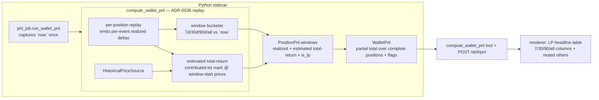

# 0088 — DeFi P&L: per-LP time-windowed profitability + partial wallet totals

> **Status:** draft
> **Created:** 2026-07-12
> **Owner skill(s):** dev, ui-builder, human
> **Related ADRs:** [ADR-0082](../adrs/0082-defi-pnl-partial-totals-and-windowed-lp-profitability.md) (paired — amends [ADR-0036](../adrs/0036-defi-pnl-transaction-replay.md); builds on [ADR-0079](../adrs/0079-defi-pnl-gauge-swaps-unclaimed.md)/[ADR-0081](../adrs/0081-defi-pnl-wallet-total-gap.md))

## TL;DR

The DeFi P&L tool reconstructs LP positions well (Plans 0084/0087) but answers the wrong question and hides good data: it reports **all-time** figures only, and one unpriceable exotic token nulls the entire wallet total. The user's primary need is *per-LP profitability over a time window*. This plan makes `compute_wallet_pnl` report, per position, **realized P&L over 7d/30d/90d/all** (exact) plus a **labeled estimated total-return** over the same windows, and replaces the null-everything rule with an honest **partial total** (sum over complete positions, flagged). LP positions are the headline; non-LP positions (including the unpriceable Wanderers) are muted and never suppress the LP view. First user-visible behavior: `POST /defi/pnl` on `0xae5b…9790` returns each LP position's 7/30/90/all realized figures and a non-null `partial` wallet total that excludes the one incomplete position.

## Context & problem

Per [ADR-0082](../adrs/0082-defi-pnl-partial-totals-and-windowed-lp-profitability.md): a live smoke (2026-07-12) showed 4/5 positions reconstruct cleanly, but (a) the fifth — a non-LP "Wanderers" position on unpriceable token `0xef0fd52e…` — nulls the wallet `realized_usd`/`unrealized_usd` under ADR-0036's "any incomplete ⇒ null" rule, and (b) the tool has no time-windowed view, while the user's stated priority is LP-position profitability *within a certain amount of time*. Zeroing the unpriceable leg is unsafe (ADR-0036 loud-failure); the fix is a partial total plus windowed per-position views. The exact windowed-realized is tractable from the existing replay (`PositionEvent.mined_at` + the per-event realized accumulation); total return over a window needs a window-start mark and is inherently estimated for concentrated-liquidity positions.

## Decision

Extend `compute_wallet_pnl` (not a new tool) per ADR-0082:

1. Partial wallet totals over complete positions + `partial`/`incomplete_position_count` — never zero.
2. Per-position rolling-window **realized** (7d/30d/90d/all), exact, anchored to a per-run `now` input.
3. Per-position rolling-window **estimated total return** over the same windows, labeled, honest per-window gap when the window-start mark is unpriceable.
4. `is_lp` signal + LP-first ordering; non-LP positions muted and never suppressing LP figures.

We rejected zeroing the leg, the null-everything status quo, a separate tool, and anchoring windows to the last-tx `as_of` (rationale in ADR-0082).

## Architecture diagram



## Implementation phases

### Phase 1 — Partial wallet totals (never null-everything)
- **Owner skill:** dev
- **What:** Replace ADR-0036's "any incomplete ⇒ null total" with a partial total. `WalletPnl.realized_usd`/`unrealized_usd` = sum over the **complete** positions only; add `partial: bool` (true iff any position is incomplete) and `incomplete_position_count: int`. An incomplete position is excluded from the sum, never zeroed. Mirror the new fields onto `PnlResponse` (route) and the tool output; regenerate `docs/reference/`.
- **Files touched:** `src/market_analyser/defi/pnl.py` (`WalletPnl` model + the roll-up in `compute_wallet_pnl`, currently lines ~154-166), `src/market_analyser/api/routes/defi.py` (`PnlResponse`), `src/market_analyser/api/mcp_tools/compute_wallet_pnl.py`, `docs/reference/` (regen), `tests/defi/test_pnl.py`, `tests/api/test_pnl_route.py`, `tests/api/test_compute_wallet_pnl_tool.py`.
- **Done when:** a wallet with 1 incomplete + N complete positions returns `realized_usd`/`unrealized_usd` = the sum over the N complete ones (asserted equal to the hand-summed value, **not** `None`, **not** including a `0` for the incomplete one), `partial=true`, `incomplete_position_count=1`; a fully-complete wallet returns `partial=false` and the same totals as before this change (no regression to the all-complete path); the determinism golden still re-runs byte-identical. A test asserts the incomplete position contributes nothing (removing it from a complete wallet leaves the total unchanged).

### Phase 2 — Per-position rolling-window realized P&L (exact)
- **Owner skill:** dev
- **What:** Add a `now: datetime` analysis anchor to `compute_wallet_pnl`, captured once by `run_wallet_pnl` (a wall-clock read at analysis time, passed as an input — never read inside the engine, mirroring `as_of`). During replay, emit a per-event **realized delta** (the fee/reward claim value; the `extracted - released` on an extraction; the block-time execution delta on a swap), each tagged with the event's `mined_at`. Add a `windows` structure to `PositionPnl` reporting realized P&L for `7d`/`30d`/`90d`/`all`, where a window's figure sums the deltas whose `mined_at ≥ now - window` (`all` = every delta). Exact and deterministic given `(events, now)`.
- **Files touched:** `src/market_analyser/defi/pnl.py` (`PositionPnl` gains `windows`; `_replay_position` emits per-event realized deltas; `compute_wallet_pnl` gains `now`), `src/market_analyser/defi/pnl_job.py` (capture + pass `now`), `src/market_analyser/api/routes/defi.py`, `src/market_analyser/api/mcp_tools/compute_wallet_pnl.py`, `docs/reference/` (regen), `tests/defi/test_pnl.py`, `tests/defi/test_pnl_job.py`.
- **Done when:** a hand-built position with realized events dated across several months reports per-window realized figures that match the hand-summed deltas for each of 7d/30d/90d/all relative to a **fixed** `now` (worked on paper in the test); the `all` window equals the existing all-time realized; a re-run with the same `now` is byte-identical (`model_dump_json` equality with `now` fixed). The engine never reads the wall clock (a grep/test asserts `now` flows only as an argument).

### Phase 3 — Per-position rolling-window estimated total return (labeled)
- **Owner skill:** dev
- **What:** For the same windows, add an **estimated** total-return figure per window: `realized_in_window + (unrealized_now − unrealized_at_window_start)`, where `unrealized_at_window_start = value(contributed lots as of window-start) at window-start block-time prices − basis as of window-start`. Compute the window-start basis + contributed lots by replaying events with `mined_at ≤ window_start`. Every total-return figure is tagged `estimated`; a window whose start-mark cannot be priced reports `None` for that window's total-return (an honest per-window gap that does **not** set the position `incomplete` and does **not** affect its exact realized figures). Keep it inside the byte-identical guarantee (deterministic given `now` + price snapshots).
- **Files touched:** `src/market_analyser/defi/pnl.py` (the window structure gains `total_return_usd` + an `estimated` marker; a window-start mark helper), `tests/defi/test_pnl.py`.
- **Done when:** a fixture LP position with a known contributed history and a priced window-start reports a total-return equal to the hand-computed `realized_in_window + unrealized drift` for that window; a window whose start-mark token is unpriceable reports `total_return_usd=None` for that window while its `realized` figure and the position's `incomplete=False` are unaffected; the figure is labeled estimated in the model; determinism holds with fixed `now`.

### Phase 4 — LP-first reporting + surfacing
- **Owner skill:** dev
- **What:** Add `is_lp: bool` to `PositionPnl` (derived from `position.kind == "lp"`), and order the response with LP positions first (stable, deterministic order). Ensure the tool description + route docs explain the windows, the estimated-total-return label, and the partial-total flags; regenerate the apiref. Confirm the full-toolset registration + route contract tests still pass with the widened shape.
- **Files touched:** `src/market_analyser/defi/pnl.py` (`is_lp` + ordering), `src/market_analyser/api/mcp_tools/compute_wallet_pnl.py` (tool description), `src/market_analyser/api/routes/defi.py`, `docs/reference/` (regen via the apiref generator), `tests/api/test_pnl_route.py`, `tests/api/test_compute_wallet_pnl_tool.py`.
- **Done when:** the response lists LP positions before non-LP ones deterministically; `is_lp` is correct per position; a non-LP incomplete position (the Wanderers shape) leaves every LP position's figures and the partial total intact; `docs/reference/` regenerates clean (apiref gate green); the full-toolset count test still passes.

### Phase 5 — Renderer view (LP-headline table)
- **Owner skill:** ui-builder
- **What:** A read-only DeFi P&L view that headlines LP positions in a table with columns for 7d/30d/90d/all realized P&L and the estimated total-return (visually marked as an estimate), a muted section for non-LP positions, and a prominent "partial — N position(s) excluded" banner when `partial=true`. Consumes the tool/route via the typed fetch client; no new sidecar calls.
- **Files touched:** `desktop/renderer/` (a DeFi P&L view + its data hook), `desktop/renderer/api/` (types for the widened response, if the shared types are regenerated), renderer tests.
- **Done when:** the view renders per-LP window columns from a fixture response, distinguishes the estimated total-return from the exact realized figures, mutes non-LP rows, and shows the partial banner with the excluded count; renderer test suite green. (The MCP tool output is the primary agent surface per ADR-0015; this view is the human-scan surface.)

### Phase 6 — Human live smoke
- **Owner skill:** human
- **What:** Run `POST /defi/pnl` (with `refresh=false` after the sidecar reload) on `0xae5b…9790` and confirm the windowed LP figures + partial total against the known reconstruction.
- **Files touched:** none (verification).
- **Done when:** each LP position reports 7d/30d/90d/all realized figures (the `all` matching the current all-time value); the wallet reports a **non-null `partial` total** excluding the one incomplete Wanderers position (`incomplete_position_count=1`); the estimated total-return is present and labeled where the window-start priced, `None` where it didn't; the Wanderers position no longer nulls the LP view. Record the verdict in the plan close notes.

## Data shapes

```python
# illustrative — not the final interface
Window = Literal["7d", "30d", "90d", "all"]

class WindowPnl(BaseModel):
    window: Window
    realized_usd: float            # exact, from per-event deltas in the window
    total_return_usd: float | None # ESTIMATED (realized + unrealized drift); None if window-start unpriceable
    estimated: bool                # always True for total_return_usd; labels the estimate

class PositionPnl(BaseModel):
    position_id: str
    is_lp: bool                    # NEW — headline vs muted
    realized_usd: float | None     # all-time (unchanged)
    unrealized_usd: float | None
    cost_basis_usd: float | None
    vs_hodl_usd: float | None
    windows: list[WindowPnl]       # NEW — 7d/30d/90d/all
    unclaimed_rewards: list[RewardAmount] | None
    incomplete: bool
    notes: list[str]

class WalletPnl(BaseModel):
    # ... realized_usd/unrealized_usd now SUM OVER COMPLETE positions (partial), never null-everything
    partial: bool                  # NEW — true iff any position incomplete
    incomplete_position_count: int # NEW
```

## Risks & open questions

- Risk: **the estimated total-return misread as exact.** Mitigation: the `estimated` flag on every figure, per-window `None` when unpriceable, prominent UI marking; the exact windowed-realized is the headline. If review deems it too approximate, phase 3 is cuttable without touching 1/2/4.
- Risk: **CL composition at a past date is unmodeled**, so the window-start mark uses contributed lots, not the true on-chain amounts — the estimate diverges for out-of-range positions. Documented in ADR-0082; the label carries the honesty.
- Risk: **determinism relaxation.** Windowed figures are deterministic only given the run's captured `now`. Mitigation: `now` is an injected input (never a wall-clock read in the engine); the cross-process golden fixes `now`. Same category as `usd_value`.
- Risk: **`now` vs `as_of` confusion.** They are different anchors (`now` = analysis time for windows; `as_of` = last-tx time for the vs-HODL mark). The plan keeps both; a comment/test pins the distinction.
- Open question: are 7/30/90/all the right windows, or should the set be configurable? Fixed set first (matches the chosen "standard rolling set"); a configurable window is a possible follow-up.

## What this plan does NOT do

- **A configurable/arbitrary date-range window** — fixed 7/30/90/all only (the chosen shape); explicit ranges are a follow-up.
- **Exact total return** — impossible without historical CL composition; the windowed total-return is a labeled estimate (ADR-0082).
- **A new price source for the Wanderers token** — `0xef0fd52e…` stays unpriceable; this plan makes it *not block* the LP view, it does not price it (that remains the separate follow-up from Plan 0087).
- **Any execution / rebalance action** — read-only, per ADR-0025/0029.
- **A persisted-schema/migration change** — the tx cache + price snapshots are unchanged; this is a response-shape enrichment only.

## Followups (after this lands)

- Configurable/arbitrary-range windows if the fixed set proves limiting.
- A third/keyed price source for exotic tokens like `0xef0fd52e…` (carried from Plan 0087) — would let the Wanderers position complete and re-enter the total.
- If the estimated total-return proves valuable, revisit whether historical CL composition can be reconstructed (subgraph / on-chain event log) to make it exact.
