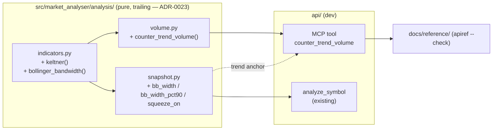

# 0090 — Squeeze metric + counter-trend volume decomposition

> **Status:** in-progress
> **Created:** 2026-07-12
> **Owner skill(s):** dev, human
> **Related ADRs:** [0083-squeeze-and-counter-trend-volume-semantics](../adrs/0083-squeeze-and-counter-trend-volume-semantics.md) (paired; accepts at close), [0023-technical-analysis-surface](../adrs/0023-technical-analysis-surface.md), [0067-ichimoku-in-trend-classification](../adrs/0067-ichimoku-in-trend-classification.md), [0064-generated-sidecar-api-reference](../adrs/0064-generated-sidecar-api-reference.md)

## TL;DR

Two gaps surfaced from real `market-analyst` reads on BTC-USD and ETH-USD (2026-07-12): (1) there is no canonical Bollinger-squeeze metric, and the only compression signal the snapshot exposes — `atr_pct90` — flatly contradicts the true band-width (ETH: `atr_pct90` 3.3rd pct "extreme squeeze" vs band-width 73rd pct and *expanding*); (2) counter-trend volume is only a single aggregate `volume_confirmation` score that hides which bars carried the opposing volume, and it anchors "trend" to net-move rather than the snapshot's trend. This plan adds a **Keltner channel + Bollinger band-width** to the indicator surface, surfaces **`bb_width`, `bb_width_pct90`, and a `squeeze_on` flag** on the condition snapshot, and ships a new **`counter_trend_volume` MCP tool** that decomposes the trailing window bar-by-bar, anchored to the snapshot's canonical `trend` (per [ADR-0083](../adrs/0083-squeeze-and-counter-trend-volume-semantics.md)). First user-visible behavior: `analyze_symbol ETH-USD 1d` returns `bb_width_pct90` ≈ 73 alongside `atr_pct90` ≈ 3 (the contradiction now visible and resolvable), and a new `counter_trend_volume ETH-USD 1d` call lists the recent counter-trend bars and their relative volume.

## Context & problem

The `market-analyst` skill ran a full BTC-USD/ETH-USD 1d read and hand-computed the two probes the backend could not provide, confirming both gaps are real and symbol-independent:

- **Squeeze.** The snapshot gives `bb_upper/middle/lower` and `bb_pct_b` but never band-width or its ranking. The only compression proxy is `atr_pct90`, which is dominated by the February crash's large ranges and therefore reads "extreme squeeze" (BTC 4.4th pct, ETH 3.3rd pct) even when the actual Bollinger band-width is mid-range or expanding (BTC 36th pct; ETH 73rd pct and rising 18.5%→21.9% over 10 bars). The two lenses reach opposite conclusions.
- **Counter-trend volume.** `volume_confirmation` returned 0.53/0.55 (both unconfirmed) while the per-bar decomposition showed the classic bearish divergence — down-bars 07-07/08 on ~1.0+ relative volume, rallies 07-09/10/12 on thin 0.3–0.9 relative volume. The aggregate hides the shape, and its net-move trend anchor can disagree with the snapshot's `trend` label and Supertrend/Ichimoku.

The definitional decisions (band-width, not ATR, is the squeeze anchor; counter-trend is anchored to the snapshot trend) are recorded in [ADR-0083](../adrs/0083-squeeze-and-counter-trend-volume-semantics.md). This plan implements them.

## Decision

We add, all inside the existing pure/trailing analysis surface (ADR-0023):

1. A **`keltner()`** channel indicator and a **`bollinger_bandwidth()`** primitive in `analysis/indicators.py`.
2. Three new snapshot `indicators` keys — **`bb_width`**, **`bb_width_pct90`** (via the existing `_percentile_rank`), and **`squeeze_on`** (`1.0`/`0.0`, TTM Bollinger-inside-Keltner on the latest bar).
3. A **`counter_trend_volume()`** pure function + `CounterTrendVolume`/`CounterTrendBar` models in `analysis/volume.py`/`types.py`, anchored to the snapshot's `trend`, and a new **`counter_trend_volume` MCP tool** with regenerated `docs/reference/`.

We rejected keeping `atr_pct90` as the squeeze proxy (it is the bug), shipping `bb_width_pct90` without Keltner/`squeeze_on` (leaves the canonical TTM form unrepresented, and ATR is already available so Keltner is cheap), and anchoring counter-trend to net-move or making the anchor a caller-chosen parameter (both re-admit the cross-tool ambiguity ADR-0083 removes).

## Architecture diagram



## Implementation phases

### Phase 1 — Keltner channel + Bollinger band-width primitives

- **Owner skill:** dev
- **What:** Add `keltner()` and `bollinger_bandwidth()` to the indicator surface, mirroring the existing `bollinger()` conventions (length-aligned, `None`-prefixed, trailing).
- **Files touched:** `src/market_analyser/analysis/indicators.py`, `tests/analysis/test_indicators.py`.
- **Details:**
  - `keltner(bars, period=20, atr_period=20, multiplier=1.5)` → `list[KeltnerValue | None]` where `middle = ema(closes, period)`, `upper/lower = middle ± multiplier * atr(bars, atr_period)`. Reuse the existing `ema` and `atr`; add a `KeltnerValue(upper, middle, lower)` value object beside `BollingerValue`. `None` until both the EMA and ATR are defined.
  - `bollinger_bandwidth(closes, period=20, num_std=2.0)` → `list[float | None]` = `(upper − lower) / middle` from the existing `bollinger()` values; `None` where the band is undefined or `middle == 0`.
- **Done when:** `test_indicators.py` pins (a) `keltner` and `bollinger_bandwidth` against a hand-worked fixture within `1e-9`; (b) a **truncation-invariance** test for each — computing on `bars[0..=k]` equals the full-series value at every `i <= k` (the ADR-0023 no-lookahead guarantee); (c) the `None`-prefix length alignment matches the input length. `mypy --strict` + `ruff` clean.

### Phase 2 — Snapshot squeeze fields

- **Owner skill:** dev
- **What:** Surface `bb_width`, `bb_width_pct90`, and `squeeze_on` in the condition snapshot.
- **Files touched:** `src/market_analyser/analysis/snapshot.py`, `src/market_analyser/analysis/types.py` (docstring only — `indicators` stays `dict[str, float | None]`), the snapshot field-set test in `tests/analysis/test_snapshot.py`.
- **Details:**
  - Compute the `bollinger_bandwidth` series → latest value as `bb_width`, and `bb_width_pct90 = _percentile_rank(bandwidth_series, PERCENTILE_WINDOW)` (reuse the existing helper and the existing `PERCENTILE_WINDOW = 90`).
  - Compute `keltner` on the latest bar; `squeeze_on = 1.0` when `bb_upper <= kc_upper and bb_lower >= kc_lower` (Bollinger inside Keltner), else `0.0`; `None` when either band is undefined. Encode as a float in the `indicators` dict, matching the `supertrend_direction` precedent.
- **Done when:** `test_snapshot.py`'s pinned `indicators` key-set is updated to include exactly `bb_width`, `bb_width_pct90`, `squeeze_on` (the frozen-field guard fails on a missing or extra key); a fixture where the Bollinger band is provably inside the Keltner channel yields `squeeze_on == 1.0` and a wide-band fixture yields `0.0`; `bb_width_pct90` on a constructed series matches an independent percentile computation; the snapshot remains `conditions-only` (no action field — existing guard still passes).

### Phase 3 — Counter-trend volume core + models

- **Owner skill:** dev
- **What:** A pure `counter_trend_volume()` decomposition anchored to a supplied trend, plus its frozen result models.
- **Files touched:** `src/market_analyser/analysis/volume.py`, `src/market_analyser/analysis/types.py`, `tests/analysis/test_volume.py`.
- **Details:**
  - `CounterTrendBar(ts, direction: Direction, relative_volume: float | None, is_counter_trend: bool)` and `CounterTrendVolume(symbol, trend, lookback, anchored_to_sideways: bool, bars: list[CounterTrendBar], counter_trend_volume_share: float | None)` — both frozen, `extra="forbid"`, conditions-only (no buy/sell field).
  - `counter_trend_volume(bars, trend: Trend, lookback=20)` classifies each of the trailing `lookback` bars: `direction` up/down by close-vs-open (or close-vs-prev-close — pin one and document), `relative_volume` = bar volume ÷ trailing volume MA, `is_counter_trend` = the bar's direction opposes `trend` (`up`-bar counter to `DOWN`, `down`-bar counter to `UP`). When `trend is SIDEWAYS`: `anchored_to_sideways = True`, every `is_counter_trend = False`, and `counter_trend_volume_share = None` (no trend to run counter to — honest, not forced onto net-move).
- **Done when:** `test_volume.py` pins (a) on a fixture with `trend=UP`, the down-bars are flagged `is_counter_trend` and the share equals a hand-computed value; (b) the mirror for `trend=DOWN`; (c) `trend=SIDEWAYS` sets `anchored_to_sideways` and `counter_trend_volume_share=None` with no bar flagged; (d) **truncation-invariance** — the decomposition over the last `lookback` bars of `bars[0..=k]` is unaffected by appending future bars; (e) `extra="forbid"` rejects an added field at construction. The BTC probe shape (down-bars 07-07/08 counter-trend on ≥1.0 rel-vol, up-bars thin) reproduces given `trend=UP`.

### Phase 4 — `counter_trend_volume` MCP tool + apiref

- **Owner skill:** dev
- **What:** Expose the decomposition as a registered MCP tool that anchors to the symbol's snapshot trend.
- **Files touched:** the MCP tool module under `src/market_analyser/api/mcp_tools/`, the tool registry + `EXPECTED_FULL_TOOLSET`, `tests/**` for the tool, regenerated `docs/reference/`.
- **Details:**
  - `counter_trend_volume(symbol, timeframe, lookback=20, as_of=None)` reads cached bars (same path as `analyze_symbol`; honest `no_bars` miss when the cache is empty — never a silent fetch), classifies the trend via the snapshot's trend classifier, runs `counter_trend_volume()`, returns `{result, partial_reason, scanned_at}` mirroring the `volume_confirmation` tool envelope. The tool's docstring states the anchor is the snapshot trend and that `sideways` yields no counter-trend read.
  - Register in the toolset; bump `EXPECTED_FULL_TOOLSET` to match; regenerate `docs/reference/` (`apiref --check` exit 0, per ADR-0064).
- **Done when:** a test drives the registered tool and asserts (a) a populated symbol returns the per-bar decomposition with the trend anchor matching `analyze_symbol`'s `trend`; (b) an empty-cache symbol returns `partial_reason="no_bars"` with `result=None` (no fabrication); (c) `as_of` replay is trailing (no future leak); (d) the tool is a member of `EXPECTED_FULL_TOOLSET` and `apiref --check` passes. `mypy --strict` + `ruff` clean.

### Phase 5 — Live smoke (human)

- **Owner skill:** human
- **What:** Confirm the two gaps are closed on the exact reads that surfaced them.
- **Done when (user-run):**
  - `analyze_symbol BTC-USD 1d` and `ETH-USD 1d` return `bb_width_pct90` that tracks the true band-width (ETH ≈ upper-half/expanded, **not** matching `atr_pct90`'s bottom-decile reading), and `squeeze_on` reads `0.0` on both today (neither is actually TTM-squeezed) — i.e. the ATR-vs-band-width contradiction is now visible and resolvable in one snapshot.
  - `counter_trend_volume BTC-USD 1d` and `ETH-USD 1d` surface the recent counter-trend bars (the 07-07/08 heavier down-bars) against the thin up-bars, anchored to the snapshot `trend`; a `sideways`-trend symbol returns the explicit no-counter-trend result.
  - Nothing in either output reads as a buy/sell call.
  - A null/absent squeeze or empty decomposition on a symbol with no cached bars is a documented honest miss, not a phase failure.

## Data shapes

```python
# illustrative — not the final interface

# analysis/indicators.py
class KeltnerValue(BaseModel):   # frozen, mirrors BollingerValue
    upper: float
    middle: float
    lower: float

# snapshot indicators dict gains (flat dict[str, float | None]):
#   "bb_width": 0.1157, "bb_width_pct90": 36.2, "squeeze_on": 0.0

# analysis/types.py
class CounterTrendBar(BaseModel):        # frozen, extra="forbid"
    ts: datetime
    direction: Direction                 # "bullish"/"bearish"/"neutral"
    relative_volume: float | None
    is_counter_trend: bool

class CounterTrendVolume(BaseModel):     # frozen, extra="forbid", conditions-only
    symbol: str
    trend: Trend                         # the anchor (snapshot trend)
    lookback: int
    anchored_to_sideways: bool
    bars: list[CounterTrendBar]
    counter_trend_volume_share: float | None   # None when anchored_to_sideways
```

## Risks & open questions

- Risk: **Keltner constants are a convention, not a law** (period/multiplier/ATR period). TTM's 20/2.0/1.5 is the default; a different multiplier changes `squeeze_on`. Mitigation: name them as module constants (like `HEAVY_MULT` in `volume.py`), document the TTM lineage, keep them tunable. ADR-0083 accepts we own them.
- Risk: `squeeze_on` as `1.0`/`0.0` in a `dict[str, float | None]` is a categorical-as-float. Mitigation: it matches the existing `supertrend_direction` precedent; documented in the snapshot docstring. If a future consumer needs richer squeeze state (forming/firing/duration), that is a followup, not this plan.
- Open question: bar direction basis for the decomposition — close-vs-open vs close-vs-prev-close. The probe used close-vs-open; pin one in phase 3 and document. Either is trailing; consistency matters more than the choice.
- Risk: `EXPECTED_FULL_TOOLSET` count is a moving baseline (intervening plans add tools). Mitigation: phase 4 bumps it to whatever the actual post-add count is, not a hard-coded target — same note that applied to Plans 0074/0078.

## What this plan does NOT do

- **No chart rendering.** Keltner channel overlay, a squeeze marker on the chart, or a counter-trend-volume visual are renderer work (`ui-builder`) and out of scope — this plan is the analysis + MCP surface only. Followup if wanted.
- **No change to `volume_confirmation`.** Its net-move anchor and aggregate score stay exactly as they are (ADR-0083 keeps it); the new tool is the trend-anchored answer.
- **No squeeze *strategy* or alert.** Encoding a squeeze-breakout entry is `strategy-author`; a squeeze `create_watch` alert is a separate plan.
- **No squeeze trajectory/history field** (e.g. "band-width contracting N bars straight"). The snapshot stays a point-in-time read; a trajectory read is a followup.
- **No `advisor` consumption.** Whether a squeeze or counter-trend divergence feeds the fused recommendation is an ADR-0029 question for later.

## Followups (after this lands)

- Renderer: Keltner overlay + a squeeze indicator on the chart (`ui-builder`).
- A squeeze-trajectory read (contracting/expanding over the last N bars) — the "10 bars straight" signal the point-in-time snapshot can't express.
- Feed counter-trend divergence / squeeze state to the `advisor` as a basis input (ADR-0029 scope).
- Squeeze-breakout strategy (`strategy-author`) and/or a squeeze `create_watch` alert.
