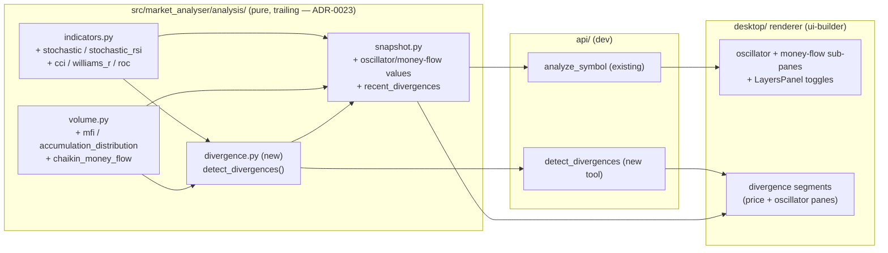

# 0091 — Momentum, divergence & money-flow analysis layer

> **Status:** in-progress
> **Created:** 2026-07-12
> **Owner skill(s):** dev, ui-builder, human
> **Related ADRs:** [0023-technical-analysis-surface](../adrs/0023-technical-analysis-surface.md) (realizes; no new ADR), [0060-glossary-tooltip-interaction-posture](../adrs/0060-glossary-tooltip-interaction-posture.md) (glossary), [0077-user-originated-display-overlays](../adrs/0077-user-originated-display-overlays.md) (client-computable overlays), [0049-chart-trendline-overlay-primitive](../adrs/0049-chart-trendline-overlay-primitive.md) / [0061-trendline-pattern-identity-and-colour](../adrs/0061-trendline-pattern-identity-and-colour.md) (divergence segment rendering), [0046-mcp-large-result-delivery](../adrs/0046-mcp-large-result-delivery.md) + [0064-generated-sidecar-api-reference](../adrs/0064-generated-sidecar-api-reference.md) (tool surface)

## TL;DR

From the 2026-07-12 capability audit: the analysis surface is strong on trend, candlesticks, and chart patterns but thin on **momentum oscillators**, has **no divergence detection at all** (we compute every input — RSI, MACD, OBV — but never detect price↔oscillator divergence), and lacks the **volume-weighted money-flow family** (MFI, A/D line, Chaikin Money Flow). This plan adds those three in-house, trailing, and lookahead-safe (ADR-0023), surfaces them on the condition snapshot and as MCP tools, and — the explicit requirement — **renders each in the UI**: new oscillator sub-panes with layer toggles, money-flow panes, and divergence drawn as connecting segments on the price and oscillator panes with glossary tooltips. First user-visible behavior: `analyze_symbol` carries stochastic/CCI/Williams %R/ROC/MFI/CMF values plus any active price↔RSI divergence, a new `detect_divergences` tool answers focused divergence queries, and the chart can toggle a Stochastic pane and show a highlighted bearish RSI divergence.

## Context & problem

The audit (grounded by reading `analysis/indicators.py` + `analysis/volume.py`) confirmed three genuine, verified-absent gaps — no `stochastic`/`cci`/`williams`/`mfi`/`chaikin`/`accumulation` anywhere in `src/`, and no divergence detector (every "divergence" string in the tree is either a doc comment or the Plan-0090 counter-trend note):

1. **Momentum oscillators.** We have RSI + MACD only. Range-bound momentum turns and overbought/oversold *in the absence of trend* are under-covered without Stochastic, Stochastic RSI, CCI, Williams %R, and ROC.
2. **Divergence detection.** The single highest-leverage missing piece for trend/reversal warning. We already own the inputs (price swings via `swing_pivots`, RSI/MACD/OBV series); we simply never pair price pivots against oscillator pivots to detect regular/hidden divergence.
3. **Money-flow family.** OBV is binary (up-volume vs down-volume). MFI (volume-weighted RSI), the Accumulation/Distribution line, and Chaikin Money Flow grade *conviction* and catch accumulation/distribution the current volume tools miss.

The user's directive: implement the complete picture, and **pair every backend addition with UI** (panes, overlays, divergence visualization) — not a headless analysis-only drop.

## Decision

We add, all inside the pure/trailing analysis surface (ADR-0023) and each paired with a renderer surface:

1. **Oscillators** in `analysis/indicators.py`: `stochastic()` (%K/%D), `stochastic_rsi()`, `cci()`, `williams_r()`, `roc()`.
2. **Money-flow** in `analysis/volume.py` (price+volume): `mfi()`, `accumulation_distribution()`, `chaikin_money_flow()`.
3. **Divergence detection** in a new `analysis/divergence.py`: `detect_divergences(bars, oscillator, ...)` pairing recent price `swing_pivots` against the oscillator's own pivots to classify regular/hidden bullish/bearish divergence, returning a `Divergence` model.
4. **Snapshot + tools**: the new oscillator/money-flow latest values ride the snapshot `indicators` dict; the snapshot gains a `recent_divergences` list; a dedicated `detect_divergences` MCP tool serves focused queries; `docs/reference/` is regenerated.
5. **UI**: oscillator sub-panes with LayersPanel toggles + client-compute parity (the Plan-0082 `computeBbands` precedent), money-flow panes, and **divergence rendering** as color-coded connecting segments on the price + oscillator panes, all with glossary entries (ADR-0060) and en/ru parity (ADR-0063).

No new ADR: these are new indicator consumers on the ADR-0023 surface (its "new indicators get a home here, thresholds are ours to own" clause), overlays follow ADR-0077/0049, glossary follows ADR-0060. The divergence pivot-pairing heuristic and its constants are owned like the candlestick thresholds ADR-0023 already covers; the method is pinned in the plan's Data-shapes + Done-when, not a separate decision record.

## Architecture diagram



## Implementation phases

### Phase 1 — Oscillator indicators
- **Owner skill:** dev
- **What:** `stochastic(bars, k_period=14, d_period=3)` (%K/%D value object), `stochastic_rsi(closes, ...)`, `cci(bars, period=20)`, `williams_r(bars, period=14)`, `roc(closes, period=12)` in `analysis/indicators.py`, mirroring the existing length-aligned/`None`-prefixed/trailing conventions.
- **Files touched:** `src/market_analyser/analysis/indicators.py`, `tests/analysis/test_indicators.py`.
- **Done when:** each new indicator matches a hand-worked fixture within `1e-9`; each has a **truncation-invariance** test (compute on `bars[0..=k]` == full-series value at every `i <= k`, the ADR-0023 no-lookahead guarantee); `None`-prefix length alignment matches input length. `mypy --strict` + `ruff` clean.

### Phase 2 — Money-flow indicators
- **Owner skill:** dev
- **What:** `mfi(bars, period=14)` (money-flow index), `accumulation_distribution(bars)` (cumulative A/D line), `chaikin_money_flow(bars, period=20)` in `analysis/volume.py`.
- **Files touched:** `src/market_analyser/analysis/volume.py`, `tests/analysis/test_volume.py`.
- **Done when:** each matches a hand-worked fixture within `1e-9`; truncation-invariance test each; the degenerate zero-range / zero-volume bars are handled (`None`, never divide-by-zero, matching the existing `vwap`/`relative_volume` guards). `mypy --strict` + `ruff` clean.

### Phase 3 — Snapshot integration
- **Owner skill:** dev
- **What:** surface the latest oscillator + money-flow values in the snapshot `indicators` dict (`stoch_k`, `stoch_d`, `stoch_rsi`, `cci`, `williams_r`, `roc`, `mfi`, `ad_line`, `cmf`). The `momentum` classifier is left unchanged (RSI-zone + MACD, ADR-0023) — the new values are reported facts, not a re-vote.
- **Files touched:** `src/market_analyser/analysis/snapshot.py`, `analysis/types.py` (docstring), `tests/analysis/test_snapshot.py`.
- **Done when:** the pinned `indicators` key-set test is updated to include exactly the nine new keys (frozen-field guard fails on a missing/extra key); each new value equals the standalone indicator's latest defined value on a fixture; the snapshot stays conditions-only (no action field — existing guard passes).

### Phase 4 — Divergence detection core
- **Owner skill:** dev
- **What:** `analysis/divergence.py` with `detect_divergences(bars, oscillator, lookback=60, pivot_window=SR_PIVOT_WINDOW)` and a `Divergence` model. Pairs the two most recent confirmed price `swing_pivots` of a kind against the oscillator's own pivots over the same bars and classifies: **regular bearish** (price higher high, oscillator lower high), **regular bullish** (price lower low, oscillator higher low), **hidden bearish** (price lower high, oscillator higher high), **hidden bullish** (price higher low, oscillator lower low). `oscillator` selects the series (`rsi`, `macd_hist`, `obv`, `mfi`). Reuses `swing_pivots` (confirmed-only → trailing).
- **Files touched:** `src/market_analyser/analysis/divergence.py`, `analysis/types.py`, `tests/analysis/test_divergence.py`.
- **Done when:** a constructed higher-high-price / lower-high-RSI fixture yields exactly one `regular_bearish` divergence with the right pivot anchors; the bullish mirror; a hidden-divergence fixture; a no-divergence fixture yields `[]`; **truncation-invariance** (a divergence reported at bar `i` is byte-identical on `bars[0..=i]` — no future pivot leaks in); `extra="forbid"` rejects an added field at construction.

### Phase 5 — Divergence + oscillator MCP surface
- **Owner skill:** dev
- **What:** `recent_divergences: list[Divergence]` added to the snapshot (scoped to the recent-activity window, like `recent_patterns`), and a dedicated `detect_divergences(symbol, timeframe, oscillator="rsi", lookback=60, as_of=None)` MCP tool returning `{result, partial_reason, scanned_at}` (honest `no_bars` on empty cache — never a silent fetch). Register in the toolset, bump `EXPECTED_FULL_TOOLSET`, regenerate `docs/reference/` (ADR-0064).
- **Files touched:** `analysis/snapshot.py`, the MCP tool module under `api/mcp_tools/`, tool registry + `EXPECTED_FULL_TOOLSET`, `tests/**`, `docs/reference/**`.
- **Done when:** the tool drives end-to-end on a populated symbol (returns the divergence with anchors matching the standalone detector), returns `partial_reason="no_bars"`/`result=None` on empty cache, replays trailing under `as_of`; snapshot `recent_divergences` matches the detector over the recent window; the tool is in `EXPECTED_FULL_TOOLSET` and `apiref --check` exits 0.

### Phase 6 — Oscillator sub-panes + toggles (UI)
- **Owner skill:** ui-builder
- **What:** render Stochastic (%K/%D), Stochastic RSI, CCI, Williams %R, ROC as toggleable bottom **sub-panes**, extending the existing OBV bottom-strip/`buildChartLayers` layer system (the Plan-0076 precedent) into a reusable oscillator-pane component — if a general oscillator-pane framework doesn't yet exist, building it is the actual first deliverable here (reconcile plan-vs-reality, like Plan 0076 did). Add client-computable `OverlayKind`s so users can add them (ADR-0077 user-overlay path) and the agent can request them; client-compute functions mirror the Python indicators with a Python-generated fixture parity test within `1e-6` **and** a truncation-invariance test (the `computeBbands` precedent). LayersPanel toggle rows + glossary entries (ADR-0060) + en/ru keys (ADR-0063).
- **Files touched:** `desktop/renderer/` chart lib + `CandlestickChart` + `buildChartLayers` + LayersPanel + `lib/` compute mirrors + glossary + locales + `events.test.ts` parity guard + jest suites.
- **Done when:** each oscillator pane draws from a fixture within `1e-6` of the Python series; the truncation-invariance (no-lookahead) test passes on each mirror; a LayersPanel toggle shows/hides each pane (`applyOptions({visible})`); the TS↔pydantic `OverlayKind` literal-parity guard carries the new kinds; each new term has a glossary entry with symmetric en/ru keys; typecheck + lint + jest green.

### Phase 7 — Money-flow rendering (UI)
- **Owner skill:** ui-builder
- **What:** MFI as a 0–100 oscillator pane, Chaikin Money Flow as a zero-centered oscillator pane, and the Accumulation/Distribution line as a cumulative-line pane — each toggleable, each with client-compute parity + glossary + locales, same discipline as phase 6.
- **Files touched:** as phase 6 (`lib/volume.ts` mirrors for A/D + CMF + MFI, panes, LayersPanel, glossary, locales, tests).
- **Done when:** each money-flow pane draws within `1e-6` of the Python series on a fixture; truncation-invariance passes; toggles work; parity guard + glossary + en/ru symmetric; jest green.

### Phase 8 — Divergence visualization (UI)
- **Owner skill:** ui-builder
- **What:** draw each active `Divergence` as two connecting segments — one across the price pivots on the price pane, one across the oscillator pivots on that oscillator's pane — reusing the trendline overlay primitive (ADR-0049/0061), color-coded by class (regular vs hidden) and direction (bullish vs bearish), with a label and a glossary tooltip explaining the divergence type. Consume `recent_divergences` from the snapshot and/or the `detect_divergences` tool result via the existing dispatch→Zod→render path. `.strict()` Zod drop + TS↔pydantic parity guard over the `Divergence` shape.
- **Files touched:** `desktop/renderer/` chart + trendline/annotation primitives + tooltip + glossary (`divergence` category: regular/hidden × bullish/bearish) + locales + Zod mirror + jest.
- **Done when:** a real dispatch renders a bearish RSI divergence as the two labeled segments (price higher-high line + RSI lower-high line) in the divergence colour; a hidden-bullish case renders distinctly; the glossary tooltip shows the meaning on hover; a malformed payload is Zod-dropped with a loud `console.warn`; the parity guard asserts the `Divergence` field set; jest green.

### Phase 9 — Live smoke (human)
- **Owner skill:** human
- **Done when (user-run):** `analyze_symbol BTC-USD 1d` / `ETH-USD 1d` return the new oscillator + money-flow values; on a symbol/timeframe where price prints a higher high while RSI prints a lower high, `detect_divergences` (and the snapshot `recent_divergences`) flags a regular bearish divergence with sane anchors; the chart toggles each new pane, and the divergence renders as the connecting segments with a working glossary tooltip; money-flow panes track accumulation/distribution; nothing in any output or tooltip reads as a buy/sell call; an empty-cache symbol is an honest miss, not a fabricated result.

## Data shapes

```python
# illustrative — not the final interface

# analysis/indicators.py value objects (mirror BollingerValue/AdxValue shape)
class StochasticValue(BaseModel):   # frozen
    k: float
    d: float

# snapshot indicators dict gains (flat dict[str, float | None]):
#   stoch_k, stoch_d, stoch_rsi, cci, williams_r, roc, mfi, ad_line, cmf

# analysis/types.py
DivergenceKind = Literal["regular_bullish", "regular_bearish",
                         "hidden_bullish", "hidden_bearish"]

class Divergence(BaseModel):          # frozen, extra="forbid", conditions-only
    oscillator: Literal["rsi", "macd_hist", "obv", "mfi"]
    kind: DivergenceKind
    price_pivots: list[PivotPoint]    # the two price anchors (reused geometry shape)
    oscillator_pivots: list[PivotPoint]
    bar_index: int                    # the confirming bar (trailing knowability)
    strength: float                   # 0..1, detector-defined — not a probability
```

## Risks & open questions

- Risk: **divergence detection is heuristic** (which pivots to pair, how far back, minimum pivot separation). Bad pairing yields noise. Mitigation: name the constants (pivot window, lookback, min separation) as module constants; pin the pairing rule with fixtures; default to the two most-recent confirmed pivots of a kind. Owned like candlestick thresholds (ADR-0023).
- Risk: **oscillator panes may need a framework that doesn't exist yet.** The renderer draws overlays on the price pane + the OBV bottom strip; a general multi-oscillator-pane system may be net-new. Mitigation: phase 6 explicitly reconciles plan-vs-reality and builds the reusable pane component if absent (the Plan 0076 pattern) — flagged, not assumed.
- Risk: client-compute drift between the TS mirrors and the Python indicators. Mitigation: Python-generated fixtures + `1e-6` parity tests per indicator (the established `computeBbands` guard), plus truncation-invariance on each mirror.
- Open question: exact oscillator set to *surface in the snapshot* vs *tool/overlay only*. Default: all nine values in the snapshot (cheap floats), divergence as a list. Trim in phase 3 if the snapshot grows unwieldy.
- Risk: `EXPECTED_FULL_TOOLSET` is a moving baseline. Mitigation: phase 5 bumps to the actual post-add count, not a hard-coded target (the Plan 0074/0078 note).

## What this plan does NOT do

- **No new momentum *vote*.** The `momentum` stance stays RSI-zone + MACD (ADR-0023); the new oscillators are reported facts, not a re-classification. Changing the stance is a separate decision.
- **No divergence *strategy* or alert.** Encoding a divergence entry is `strategy-author`; a divergence `create_watch` alert is a separate plan.
- **No structural/price-action trend, Fibonacci, or pivots** — those are Plan 0092.
- **No `advisor` consumption** of oscillators/divergence — an ADR-0029 question for later.
- **No multi-timeframe divergence** (divergence across timeframes) — a followup.

## Followups (after this lands)
- Feed divergence / money-flow into the `advisor` as a basis input (ADR-0029 scope).
- Divergence-based `create_watch` alert and/or a divergence-entry strategy (`strategy-author`).
- Multi-timeframe divergence confluence.
- Refine the `momentum` stance to optionally weigh Stochastic/MFI.
