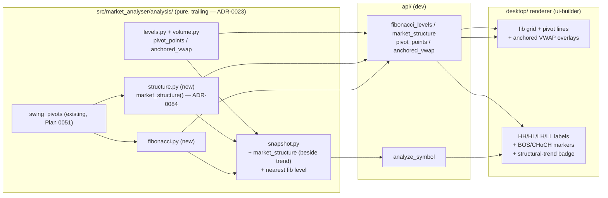

# 0092 — Price-structure & levels: Fibonacci, market structure, pivots, anchored VWAP

> **Status:** in-progress
> **Created:** 2026-07-12
> **Owner skill(s):** dev, ui-builder, human
> **Related ADRs:** [0084-market-structure-as-distinct-trend-read](../adrs/0084-market-structure-as-distinct-trend-read.md) (paired; accepts at close), [0023-technical-analysis-surface](../adrs/0023-technical-analysis-surface.md), [0067-ichimoku-in-trend-classification](../adrs/0067-ichimoku-in-trend-classification.md) (the existing `trend` this sits beside), [0049-chart-trendline-overlay-primitive](../adrs/0049-chart-trendline-overlay-primitive.md) / [0061-trendline-pattern-identity-and-colour](../adrs/0061-trendline-pattern-identity-and-colour.md) (structure/level rendering), [0077-user-originated-display-overlays](../adrs/0077-user-originated-display-overlays.md) (overlays), [0060-glossary-tooltip-interaction-posture](../adrs/0060-glossary-tooltip-interaction-posture.md) (glossary), [0064-generated-sidecar-api-reference](../adrs/0064-generated-sidecar-api-reference.md) (tool surface)

## TL;DR

From the 2026-07-12 capability audit: the surface has clustered swing support/resistance but no **Fibonacci retracement/extension**, no **price-action market-structure trend** (HH/HL/LH/LL, break-of-structure, change-of-character), and no **classic pivot points** or **anchored VWAP**. This plan adds all four as pure/trailing analysis, surfaces them on the snapshot and as MCP tools, and — the explicit requirement — **renders each in the UI**: Fibonacci levels and pivot lines and anchored-VWAP as labeled price-pane overlays, and market structure as HH/HL/LH/LL swing labels + BOS/CHoCH markers with a structural-trend read-out. The one genuine decision — that market structure is a *second, distinct* trend read reported **alongside** the ADR-0067 `trend`, never merged into it — is captured in [ADR-0084](../adrs/0084-market-structure-as-distinct-trend-read.md). First user-visible behavior: `analyze_symbol` carries `market_structure.structural_trend` beside `trend`, a `fibonacci_levels` tool auto-anchors to the dominant swing, and the chart draws the fib grid, pivot lines, structure labels, and an anchored VWAP.

## Context & problem

The audit (grounded by reading `analysis/levels.py` + `indicators.py`, and confirming no `fibonacci`/`pivot_points`/`market_structure`/`anchored_vwap`/`break_of_structure` anywhere in `src/`) found four verified-absent price-structure gaps, all buildable on the existing `swing_pivots` primitive (Plan 0051):

1. **Fibonacci retracement / extension** — the canonical "where does a pullback-in-trend find support / where does the move extend" grid. No coverage.
2. **Market-structure trend** — the HH/HL vs LH/LL swing sequence, plus break-of-structure (BOS) and change-of-character (CHoCH). This is a *price-action* trend read, distinct from the indicator-derived `trend`; see ADR-0084 for why it sits beside, not inside, that field.
3. **Classic pivot points** — floor-trader / Camarilla / Woodie P·R1-3·S1-3 static levels.
4. **Anchored VWAP** — a VWAP anchored to a swing or event, as dynamic support/resistance (our existing VWAP is rolling-window only, per `volume.py`).

The user's directive: implement the complete picture and **pair every backend addition with UI overlays** — not headless.

## Decision

We add, all inside the pure/trailing analysis surface (ADR-0023) and each paired with a renderer overlay:

1. **Fibonacci** (`analysis/fibonacci.py`): `fibonacci_retracement(high_anchor, low_anchor)` + `fibonacci_extension(...)` over standard ratios, with a dominant-swing auto-anchor from `swing_pivots` and an explicit-anchor override. `FibonacciLevels` model.
2. **Market structure** (`analysis/structure.py`): `market_structure(bars)` labeling the confirmed swing sequence HH/HL/LH/LL, deriving `structural_trend` (up = HH+HL, down = LH+LL, else range) and detecting BOS/CHoCH events. `MarketStructure` model — the ADR-0084 second-trend read.
3. **Pivots + anchored VWAP** (`analysis/levels.py` / `volume.py`): `pivot_points(bars, method)` (floor/Camarilla/Woodie) and `anchored_vwap(bars, anchor_index)`. Models for each.
4. **Snapshot + tools**: the snapshot gains `market_structure` (beside the untouched `trend`) and the nearest fib level; dedicated `fibonacci_levels`, `market_structure`, `pivot_points`, `anchored_vwap` MCP tools; `docs/reference/` regenerated.
5. **UI**: Fibonacci grid, pivot lines, and anchored-VWAP as labeled price-pane overlays (new `OverlayKind`s, ADR-0077 + agent path); market structure as HH/HL/LH/LL swing labels + BOS/CHoCH markers reusing the trendline/annotation primitives (ADR-0049/0061); a structural-trend badge shown next to the indicator trend; glossary (ADR-0060) + en/ru parity (ADR-0063).

We rejected folding structure into the single `trend` field and letting it override the Ichimoku veto (ADR-0084, alternatives A/B); the geometry pieces (fib/pivots/anchored VWAP) need no ADR — they are chart-geometry facts like clustered S/R (ADR-0084 notes).

## Architecture diagram



## Implementation phases

### Phase 1 — Fibonacci retracement / extension
- **Owner skill:** dev
- **What:** `analysis/fibonacci.py` — `fibonacci_retracement(high, low)` over `{0.236, 0.382, 0.5, 0.618, 0.786}` and `fibonacci_extension(high, low, pullback)` over `{1.272, 1.618, 2.0, 2.618}`, plus a `dominant_swing(bars)` helper that picks the anchoring swing from `swing_pivots` (largest recent confirmed high↔low leg). `FibonacciLevels` model (frozen, `extra="forbid"`, conditions-only).
- **Files touched:** `src/market_analyser/analysis/fibonacci.py`, `analysis/types.py`, `tests/analysis/test_fibonacci.py`.
- **Done when:** the level prices match a hand-computed grid for a known high/low within `1e-9`; direction is correct for an up-swing vs a down-swing anchor; the auto-anchor picks the intended dominant swing on a fixture and is **trailing** (uses only confirmed pivots — a truncation test shows appending future bars doesn't change a level already reported); `extra="forbid"` rejects an added field.

### Phase 2 — Market-structure trend (ADR-0084)
- **Owner skill:** dev
- **What:** `analysis/structure.py` — `market_structure(bars, pivot_window=SR_PIVOT_WINDOW, bos_margin_atr=...)` labeling the confirmed `swing_pivots` sequence as HH/HL/LH/LL, deriving `structural_trend` (`up`/`down`/`range`), and emitting BOS (extreme taken out in-trend) and CHoCH (first counter-trend break) events with the bar at which each is first knowable. `MarketStructure` + `StructureEvent` models.
- **Files touched:** `src/market_analyser/analysis/structure.py`, `analysis/types.py`, `tests/analysis/test_structure.py`.
- **Done when:** a constructed HH/HL fixture yields `structural_trend="up"` with the right labels; the LH/LL mirror yields `"down"`; a choppy fixture yields `"range"`; a fixture that takes out a prior swing low after an uptrend emits a `CHoCH` at the correct bar; **truncation-invariance** (every label/event reported at bar `i` is byte-identical on `bars[0..=i]` — confirmed-pivot-only, no future leak); `extra="forbid"` rejects an added field. This is the ADR-0084 second-trend read — a test asserts it is a **separate** value and does not alter the ADR-0067 `trend`.

### Phase 3 — Classic pivot points + anchored VWAP
- **Owner skill:** dev
- **What:** `pivot_points(bars, method="floor")` computing P·R1-3·S1-3 for `floor`/`camarilla`/`woodie` from the prior completed period's HLC; `anchored_vwap(bars, anchor_index)` — VWAP of the typical price accumulated from a supplied anchor bar (a swing or event), distinct from the existing rolling `vwap`. `PivotPoints` + `AnchoredVwapValue` models.
- **Files touched:** `src/market_analyser/analysis/levels.py` (or a new `pivots.py`), `analysis/volume.py`, `analysis/types.py`, `tests/analysis/**`.
- **Done when:** each pivot method matches a hand-computed set within `1e-9`; anchored VWAP from a given anchor matches a hand-computed accumulation and is trailing (value at bar `i` uses only `anchor..i`); degenerate zero-volume windows yield `None` (no divide-by-zero, matching existing guards); models reject extra fields.

### Phase 4 — Snapshot + MCP integration
- **Owner skill:** dev
- **What:** the snapshot gains `market_structure: MarketStructure` (beside the **untouched** `trend`) and `nearest_fib_level` (the fib level framing the last close); dedicated `fibonacci_levels`, `market_structure`, `pivot_points`, `anchored_vwap` MCP tools (each `{result, partial_reason, scanned_at}`, honest `no_bars` on empty cache, `as_of` trailing replay). Register the tools, bump `EXPECTED_FULL_TOOLSET`, regenerate `docs/reference/` (ADR-0064).
- **Files touched:** `analysis/snapshot.py`, `analysis/types.py`, MCP tool modules under `api/mcp_tools/`, tool registry + `EXPECTED_FULL_TOOLSET`, `tests/**`, `docs/reference/**`.
- **Done when:** the snapshot field-set test is updated (adds `market_structure`, `nearest_fib_level`) and a test asserts `trend` is byte-identical to its pre-plan value on a shared fixture (ADR-0084: structure does not touch it); each tool drives end-to-end on a populated symbol and returns `no_bars`/`None` on empty cache; all four tools are in `EXPECTED_FULL_TOOLSET`; `apiref --check` exits 0.

### Phase 5 — Fibonacci + pivots + anchored-VWAP overlays (UI)
- **Owner skill:** ui-builder
- **What:** render the Fibonacci grid (labeled 0.382/0.5/0.618… lines between the anchor high/low), classic pivot lines (P·R1-3·S1-3), and anchored VWAP as labeled price-pane overlays. New `OverlayKind`s (`fibonacci`, `pivot_points`, `anchored_vwap`) with anchor/method params on the wire (pydantic `OverlaySpec` + Zod mirror + TS↔pydantic parity guard); client-computable where cheap (ADR-0077 user path) and agent-drawable via `show_chart`/`update_chart`. Glossary entries (fib ratios, pivot levels, anchored VWAP) + en/ru keys.
- **Files touched:** `desktop/renderer/` chart + overlay draw hooks + `OverlaySpec`/`OverlayKind` + `lib/` compute mirrors + LayersPanel legend + glossary + locales + `events.test.ts` parity + jest; `api/` `OverlaySpec` kind additions + apiref.
- **Done when:** a `show_chart` with a `fibonacci` overlay draws the labeled grid at the right prices; pivot lines and anchored VWAP render and toggle in the LayersPanel; the OverlaySpec `kind` literal-parity guard (TS↔pydantic) carries the three new kinds; each new term has a glossary entry with symmetric en/ru keys; typecheck + lint + jest green.

### Phase 6 — Market-structure annotations (UI)
- **Owner skill:** ui-builder
- **What:** draw HH/HL/LH/LL labels at the confirmed swing pivots and BOS/CHoCH markers at their events (reusing the marker + trendline/annotation primitives, ADR-0049/0061), color-coded by structural direction; show a **structural-trend badge** in the chart read-out *next to* the indicator-trend readout, so the two lenses are visibly distinct (the ADR-0084 posture). Consume `market_structure` from the snapshot via the existing dispatch→Zod→render path; glossary tooltips for HH/HL/LH/LL/BOS/CHoCH; `.strict()` Zod drop + parity guard over `MarketStructure`.
- **Files touched:** `desktop/renderer/` chart + markers/annotations + read-out component + glossary (`market_structure` category) + locales + Zod mirror + jest.
- **Done when:** a real dispatch renders the HH/HL labels at the right pivots and a CHoCH marker at the structural break; the structural-trend badge shows beside the indicator trend and the two can display different values without conflict; glossary tooltips explain each term; a malformed payload is Zod-dropped with a loud `console.warn`; the parity guard asserts the `MarketStructure`/`StructureEvent` field sets; jest green.

### Phase 7 — Live smoke (human)
- **Owner skill:** human
- **Done when (user-run):** `analyze_symbol BTC-USD 1d` / `ETH-USD 1d` return `market_structure.structural_trend` beside `trend` (and the two may legitimately differ); `fibonacci_levels` auto-anchors to the visually-dominant swing and the grid lines up with the chart; `pivot_points` and `anchored_vwap` return sane levels; the chart draws the fib grid, pivot lines, anchored VWAP, HH/HL/LH/LL labels, and a BOS/CHoCH marker, each with a working glossary tooltip; the structural-trend badge sits beside the indicator trend; nothing reads as a buy/sell call; empty-cache symbols are honest misses.

## Data shapes

```python
# illustrative — not the final interface

# analysis/types.py
class FibonacciLevels(BaseModel):          # frozen, extra="forbid", conditions-only
    kind: Literal["retracement", "extension"]
    high_anchor: PivotPoint
    low_anchor: PivotPoint
    direction: Direction                    # swing direction the grid is drawn for
    levels: dict[str, float]                # {"0.382": ..., "0.5": ..., "0.618": ...}

StructureLabel = Literal["HH", "HL", "LH", "LL"]
StructureEventKind = Literal["BOS", "CHoCH"]

class StructureEvent(BaseModel):            # frozen, extra="forbid"
    kind: StructureEventKind
    direction: Direction
    bar_index: int                          # first-knowable bar (trailing)
    price: float

class MarketStructure(BaseModel):           # frozen, extra="forbid", conditions-only
    structural_trend: Literal["up", "down", "range"]   # ADR-0084: distinct from `trend`
    labeled_pivots: list[tuple[PivotPoint, StructureLabel]]
    events: list[StructureEvent]

class PivotPoints(BaseModel):               # frozen, extra="forbid"
    method: Literal["floor", "camarilla", "woodie"]
    pivot: float
    resistances: list[float]                # R1..R3
    supports: list[float]                   # S1..S3
```

## Risks & open questions

- Risk: **structure labeling is pivot-window-sensitive** — a small window flip-flops HH/HL. Mitigation: name the pivot window + BOS/CHoCH margin as tunable constants (ADR-0084 accepts we own them); defaults documented; fixtures pin the labeling.
- Risk: **fib auto-anchor picks the "wrong" swing** by a human eye. Mitigation: `dominant_swing` uses the largest recent confirmed leg with a documented rule, and the tool/overlay accepts an explicit-anchor override so the user/agent can re-anchor.
- Open question: pivot-point **period** (daily pivots on a daily chart = prior day; on intraday = prior session). Default to the prior completed bar of the chart's timeframe; document, revisit if it reads oddly on 24/7 crypto (the ADR-0047 monthly-resample caveat is a cousin).
- Risk: two trend read-outs confuse the UI. Mitigation: the badge is explicitly labeled (indicator trend vs structure) per ADR-0084; the analyst narration reports both.
- Risk: `EXPECTED_FULL_TOOLSET` moving baseline — phase 4 bumps to the actual count (the Plan 0074/0078 note).

## What this plan does NOT do

- **No change to the `trend` field.** Market structure is a sibling read (ADR-0084); the ADR-0067 composed trend is byte-identical (asserted in phase 4).
- **No oscillators, divergence, or money-flow** — those are Plan 0091.
- **No structure/fib/pivot *strategy* or alert** — `strategy-author` / a separate alerting plan.
- **No `advisor` consumption** of structure or fib confluence — an ADR-0029 question for later.
- **No auto-drawn Elliott-wave or full Smart-Money-Concepts (order blocks, FVGs)** — a much larger, more speculative surface; explicitly out of scope. This plan is HH/HL/BOS/CHoCH only.

## Followups (after this lands)
- Feed structure-vs-indicator agreement and fib confluence to the `advisor` as basis inputs (ADR-0029 scope).
- Fib/structure `create_watch` alerts (e.g. "price reached the 0.618" / "CHoCH printed").
- Multi-timeframe structure confluence.
- If wanted later: order-blocks / fair-value-gaps (a separate Smart-Money-Concepts plan with its own ADR).
