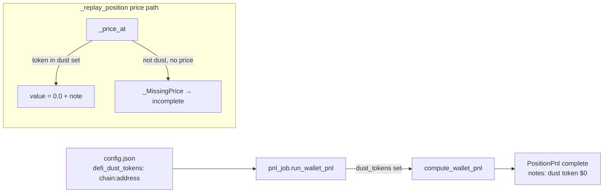

# 0093 — DeFi P&L: user-attested dust-token override

> **Status:** draft
> **Created:** 2026-07-12
> **Owner skill(s):** dev, human
> **Related ADRs:** [ADR-0085](../adrs/0085-defi-pnl-user-attested-dust-tokens.md) (paired — amends [ADR-0036](../adrs/0036-defi-pnl-reconstruction.md) narrowly; builds on [ADR-0082](../adrs/0082-defi-pnl-partial-totals-and-windowed-lp-profitability.md))

## TL;DR

A token the user attests is **dust** (negligible, unpriceable) should not keep its position `incomplete`. Add a user-maintained `chain:address` dust list (config) that the P&L replay values at **$0** instead of failing on a missing price — so the position completes, the token is disclosed in `notes`, and any token *not* on the list keeps ADR-0036's loud-failure exactly. First user-visible behavior: with `base:0xef0fd52e…` listed, `compute_wallet_pnl` on `0xae5b…9790` reconstructs **5/5** positions (the Wanderers position completes, valued at $0, with a naming note) instead of 4/5.

## Context & problem

Per [ADR-0085](../adrs/0085-defi-pnl-user-attested-dust-tokens.md): the 2026-07-12 consolidated smoke ([`../consolidated-smoke.md`](../consolidated-smoke.md), C1) confirmed the Wanderers token `base:0xef0fd52e65ddcdc201e2055a94d2abff6ff10a7a` is unpriceable even via Alchemy, so its position stays `incomplete` (the wallet total is honestly partial per ADR-0082). The user attests the token is dust. Rather than source a price for something declared worthless, let the user attest it to $0 — explicitly, per-token, and disclosed. The block today is the missing-price path in the replay (`_price_at` → `_MissingPrice`), not an unbooked event, so the override lives in the price lookup.

## Decision

Implement the ADR-0085 override: a `dust_tokens` set of `token_key` strings (`chain:address`) flows from `config.json` into `compute_wallet_pnl`; in the block-time price path a dust-listed token resolves to `0.0` instead of raising `_MissingPrice`; the position accrues a disclosing note; the default (loud-failure for unlisted tokens) is untouched; determinism holds (the list is a run input).

We rejected a keyed price source for the exotic, an auto value-threshold heuristic, and leaving it incomplete (rationale in ADR-0085).

## Architecture diagram

## Implementation phases

### Phase 1 — Dust-token override in the replay + config wiring
- **Owner skill:** dev
- **What:** Add a `dust_tokens: frozenset[str]` parameter to `compute_wallet_pnl` (and `_replay_position`), holding `token_key`-form `chain:address` keys. In the block-time price path, when a leg's token key is in `dust_tokens`, use `0.0` for that leg's value instead of calling the price source / raising `_MissingPrice` — so the token contributes $0 to basis/realized/unrealized and never blocks. When a position had ≥1 dust token zeroed, append a `notes` entry naming the token(s) valued at $0 by config (a complete position may now carry notes — keep `incomplete=False`). Add a `defi_dust_tokens: list[str]` field to `config.json` (ADR-0006; non-secret, default empty) and thread it through `pnl_job.run_wallet_pnl` into the engine. Regenerate `docs/reference/` if the tool/route surface changes (it should not — this is an input, not an output field).
- **Files touched:** `src/market_analyser/defi/pnl.py` (param + price-path override + note), `src/market_analyser/defi/pnl_job.py` (read config, pass `dust_tokens`), the config model/loader (wherever `config.json` is parsed), `src/market_analyser/api/mcp_tools/portfolio.py` (the other `compute_wallet_pnl` caller — pass an empty set or the same config), `tests/defi/test_pnl.py`, `tests/defi/test_pnl_job.py`.
- **Done when:** a fixture position holding an unpriceable token that **is** in `dust_tokens` completes (`incomplete=False`), values that token's legs at $0 (asserted: basis/realized reflect $0 for that leg, **not** a fabricated non-zero), and carries a note naming the zeroed token; the **same** position with the token **not** listed still returns `incomplete=True` with the missing-price note (ADR-0036 default intact, asserted in the same test); a non-dust priced leg in the same position is unaffected; a re-run with the same `dust_tokens` is byte-identical (`model_dump_json` equality); the all-complete determinism golden is unchanged when `dust_tokens` is empty (no regression). `portfolio_summary`'s basis join still passes.

### Phase 2 — Human live smoke
- **Owner skill:** human
- **What:** Add `base:0xef0fd52e65ddcdc201e2055a94d2abff6ff10a7a` to `config.json`'s `defi_dust_tokens`, restart the sidecar, run `compute_wallet_pnl` on `0xae5b…9790`.
- **Done when:** the wallet reconstructs **5/5** complete; the Wanderers position is `incomplete=False`, valued at ~$0, with the disclosing note; the wallet total is no longer flagged `partial` (or, if another position is incomplete for an unrelated reason, the Wanderers no longer contributes to the incomplete count). Record the verdict in [`../consolidated-smoke.md`](../consolidated-smoke.md) and the plan close notes.

## Risks & open questions

- Risk: **a mis-listed non-dust token silently zeros real value** — the exact failure ADR-0036 guards against. Mitigation (ADR-0085): opt-in, per-token, user-owned, and the disclosing `notes` entry makes every zeroed token visible on the next read; the default stays loud-failure.
- Risk: **note-carrying complete position** — a complete position gaining `notes` could confuse a consumer that treats "has notes" as "incomplete". Mitigation: consumers must key on `incomplete`, not on notes-presence; a test pins `incomplete=False` with a non-empty note.
- Open question: **global vs per-wallet dust list.** First cut is global (dust is a property of the token). If a token is dust in one wallet but real in another, a per-wallet override is a follow-up.

## What this plan does NOT do

- **Price the dust token** — it stays unpriceable; this values it at $0 by user attestation, it does not source a price (ADR-0085).
- **Auto-detect dust** — no value-threshold heuristic; dust is user-attested only.
- **A per-wallet or UI dust editor** — the list is a `config.json` field in the first cut; a renderer editor is a possible follow-up.
- **Change the tool/route output shape** — `dust_tokens` is an input; the response schema is unchanged (no migration, no apiref surface change beyond the config).

## Followups (after this lands)

- A renderer control to mark a position/token as dust from the DeFi tab (writes `config.json`).
- Per-wallet dust designation if the global list proves too coarse.
