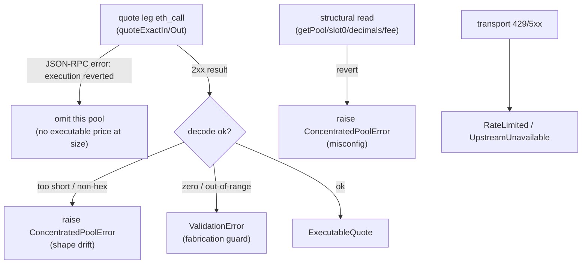

# 0094 — CL Quoter revert taxonomy: omit thin pools instead of aborting the scan

> **Status:** in-progress (2026-07-13)
> **Created:** 2026-07-12
> **Owner skill(s):** dev, human
> **Related ADRs:** [ADR-0086](../adrs/0086-cl-quoter-revert-omit-taxonomy.md) (the omit-on-quote-revert decision — **paired; accepts at close**), [ADR-0080](../adrs/0080-executable-quote-pricing-concentrated-liquidity.md) (the taxonomy this refines), [ADR-0031](../adrs/0031-data-source-adapter-contract.md) (the `ExecutableQuoteSource` contract), [ADR-0019](../adrs/0019-external-http-adapter-resilience.md) (transport taxonomy, unchanged), [ADR-0072](../adrs/0072-bounded-autonomy-and-prediction-market-execution.md)/[ADR-0074](../adrs/0074-edge-selection-criteria-for-execution.md) (the BA-7 evidence this unblocks)

## TL;DR

Make `ConcentratedPoolPriceAdapter` **omit** a pool whose Quoter *quote leg* reverts (a thin pool with no executable price at the size) instead of raising `ConcentratedPoolError` and aborting the whole scan — while still raising on a structural-read revert (misconfig) and on a decode failure / out-of-range value (shape drift / fabrication guard). This closes the Plan 0086 phase-4 finding: a single dust tier in a configured venue set currently makes `scan_pool_discrepancies` return `error:"malformed_response"` with zero observations, which defeats the tool's discovery purpose. Per [ADR-0086](../adrs/0086-cl-quoter-revert-omit-taxonomy.md).

## Context & problem

The Plan 0086 phase-4 live evidence run (2026-07-12, Base WETH/USDC — see `runs/defi/audits/2026-07-12T203712Z-plan-0086-phase4/report.md`) found that the shipped CL adapter treats **any** Quoter JSON-RPC revert as a fatal `ConcentratedPoolError`. But the Uniswap-v3 / Slipstream `QuoterV2` reverts (`Error(string) "Unexpected error"`) when a pool cannot source the requested size for lack of liquidity — confirmed live on Slipstream WETH/USDC tick-spacing 50 / 200 (dust: selling 1 WETH returns $0.30 / $0.05). One such pool aborts the entire scan.

This contradicts the adapter's own `ExecutableQuoteSource` contract (`data/sources.py`), which says "a pool that cannot source the size is omitted rather than fabricating a number" — the behaviour the CP adapter implements via `_cp_executable_legs → None`. The CL adapter has no omit path. Dust tiers are ubiquitous, so the tool is unusable against un-curated venue sets — you'd have to already know which tiers are deep, which is what the tool exists to discover. [ADR-0086](../adrs/0086-cl-quoter-revert-omit-taxonomy.md) resolves the ambiguous ADR-0080 clause along a structural boundary.

## Decision

Adopt [ADR-0086](../adrs/0086-cl-quoter-revert-omit-taxonomy.md): classify a CL read failure by **which call reverted**, not by the revert string.

- Quote-leg revert (`quoteExactInputSingle` / `quoteExactOutputSingle`) → **omit the pool** (either leg reverting omits it — a round trip needs both).
- Structural-read revert (`getPool` / `slot0` / `decimals` / `fee`) → **raise** `ConcentratedPoolError` (operator-visible misconfig).
- Decode failure on a successful response, or a successful-but-out-of-range value (e.g. zero Quoter output) → **raise** / `ValidationError` (shape drift / fabrication guard), unchanged.
- Transport failures (429 / 5xx) → `RateLimitedError` / `UpstreamUnavailableError`, unchanged.

No revert-string matching (robust across forks). A wrong quoter reverts every tier → the venue yields zero quotes, a visible diagnosable outcome.

## Architecture diagram

## Implementation phases

### Phase 1 — Omit-on-quote-revert in the CL adapter + taxonomy tests
- **Owner skill:** `dev`
- **What:** Split the CL adapter's read handling by call site. The two quote-leg calls (`_SEL_QUOTE_EXACT_IN` / `_SEL_QUOTE_EXACT_OUT` in `_quote_pool`) must catch a JSON-RPC **execution-revert** and signal "omit this pool" (e.g. `_quote_pool` returns `None`, and `_quote_venue` drops it — mirroring how `OnchainPoolPriceAdapter._executable_quote_pool` returns `None`). Structural reads (`getPool`, `slot0`, `decimals`, `fee`) keep raising `ConcentratedPoolError` on revert. Decode failures (too short / non-hex) and out-of-range values keep raising / `ValidationError`. Introduce a narrow internal distinction between "execution reverted" (a JSON-RPC `error` object) and a decode failure inside `_result_bytes` / `_eth_call` so the quote-leg call sites can branch without string matching. Update the `ExecutableQuoteSource` docstring in `data/sources.py` and the CL adapter module docstring to state the refined taxonomy and cite [ADR-0086](../adrs/0086-cl-quoter-revert-omit-taxonomy.md). Fix `test_quoter_revert_raises_typed_error` (it currently asserts the wrong behaviour for the quote-leg case) and add tests.
- **Files touched:** `src/market_analyser/data/adapters/concentrated_pools.py`, `src/market_analyser/data/sources.py` (docstring), `tests/defi/test_concentrated_pool_adapter.py`.
- **Done when:** A fixture where a configured tier's **quote leg** reverts yields **no quote for that pool but a valid quote for the deep tiers in the same venue** (the scan does not abort); a fixture where a **structural read** (`slot0` / `getPool` / `decimals` / `fee`) reverts still raises `ConcentratedPoolError`; a truncated / non-hex **successful** result still raises `ConcentratedPoolError`; a **zero** Quoter output still raises `ValidationError` (fabrication guard intact — not omitted); the read-only AST scan still passes (method set `== {"eth_call"}`); `mypy --strict` + ruff clean; the full non-network suite is green. The mixed-venue case (one dust tier + several deep tiers) returns exactly the deep-tier quotes.

### Phase 2 — Re-run the Plan 0086 evidence on an un-curated venue set
- **Owner skill:** `human`
- **What:** Re-run the phase-4 (and, if desired, phase-5 niche) evidence against the **full un-curated** WETH/USDC venue set — including the dust Slipstream tiers (50 / 200) that previously aborted the scan — via `scan_pool_discrepancies` and/or `scripts/defi/run_evidence_smoke.py`, and confirm the scan completes with the dust tiers omitted and the deep tiers priced. The validated address set + reproducible harness already exist under `runs/defi/audits/2026-07-12T203712Z-plan-0086-phase4/`.
- **Done when:** A recorded live read shows `scan_pool_discrepancies` returning ranked observations (not `error:"malformed_response"`) against the un-curated venue set, with the dust tiers absent from the results and the deep tiers present; the net-of-cost verdict (expected: still the honest-null no-go on majors) is written to `runs/defi/`.

## Risks & open questions

- **A non-thin quote-leg revert is now silent.** A transient node quirk that reverts a quote leg omits the pool rather than surfacing. Mitigation (ADR-0086): a venue that yields zero quotes across all tiers is the visible signal; the operator sees an empty venue, not a fabricated price. If this proves noisy in practice, a later refinement could log omitted-pool counts on the observation envelope.
- **Distinguishing execution-revert from decode-failure inside the shared `_eth_call`.** The cleanest cut is for `_result_bytes` to raise a distinct internal signal on a JSON-RPC `error` object (execution revert) vs a missing/short/non-hex `result` (decode failure), so the quote-leg call sites catch only the former. Keep the public `ConcentratedPoolError` surface for the raise cases.

## What this plan does NOT do

- **No change to the executable-quote schema, the screener, or the MCP tool output** — this is adapter-internal error handling only; `ExecutableQuote` / `ArbObservation` / `scan_pool_discrepancies` shapes are byte-identical.
- **No revert-string matching** — classification is by call site (ADR-0086).
- **No depth pre-filter / liquidity threshold** — rejected in ADR-0086.
- **No change to the CP adapter** — it already omits correctly.
- **No new venue, chain, or automated niche discovery** — out of scope (Plan 0086 followups).
