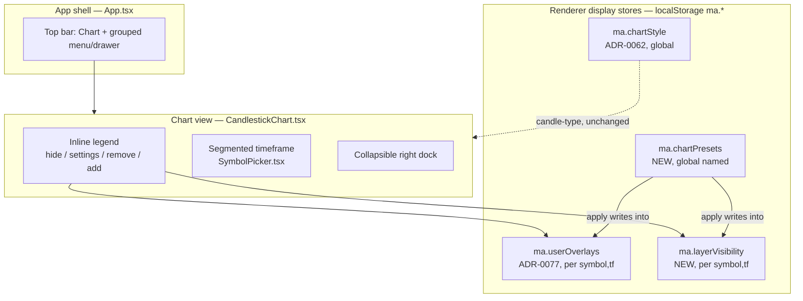

# 0096 — Chart & app declutter

> **Status:** approved
> **Created:** 2026-07-13
> **Owner skill(s):** ui-builder, human
> **Related ADRs:** [0089-chart-display-presets](../adrs/0089-chart-display-presets.md) (paired — accepts at close), [0077-user-originated-display-overlays](../adrs/0077-user-originated-display-overlays.md) (the overlay store presets compose), [0062-user-chart-style-overrides](../adrs/0062-user-chart-style-overrides.md) (chart style / candle-type — left global), [0039-renderer-theming-localstorage](../adrs/0039-renderer-theming-localstorage.md) (`ma.*` persistence), [0063-in-house-i18n-and-reason-codes](../adrs/0063-in-house-i18n-and-reason-codes.md) (en/ru parity for new strings), [0088-lightweight-charts-v5-panes](../adrs/0088-lightweight-charts-v5-panes.md) (v5 render substrate), [0008-electron-shell-conventions](../adrs/0008-electron-shell-conventions.md) (CSP unchanged)

## TL;DR

The chart opens with every indicator, chart-pattern trendline, and candlestick marker drawn at once — unreadable — and the app fronts twelve top-level tabs competing with the symbol/timeframe controls. This plan is a **renderer-only declutter** (`ui-builder` end-to-end, `human` smoke) borrowing five moves from TradingView: an **inline top-left chart legend** replacing the always-open LAYERS panel, **segmented timeframe buttons** replacing the dropdown, a **collapsible right dock**, **named chart presets** (built-in Clean / Trend / Mean-reversion / Patterns **+ save-your-own**, default Clean, per [ADR-0089](../adrs/0089-chart-display-presets.md)), and a **navigation collapse** that keeps only Chart on the top bar and folds the other eleven destinations into one grouped menu. First user-visible behavior: opening a symbol shows a restrained candles-plus-volume chart, and the screenshot-2 chaos appears only when the user asks for it. No sidecar, wire, event, schema, or CSP change.

## Context & problem

Two distinct clutter sources, verified in the current renderer (inventory 2026-07-13):

1. **The chart draws everything simultaneously.** `CandlestickChart.tsx` composes Supertrend (`useSupertrendSeries`), Bollinger (`useBbandsSeries`), the five-line Ichimoku cloud (`useIchimokuSeries`), OBV, plus chart-pattern trendlines (`useTrendlines` → `TrendlinePrimitive`) and candlestick markers/spans (`useChartMarkers`) — all at once. Layer visibility is an **ephemeral `hidden` React set that does not persist**, so there is no durable "clean" state and no one-action reset. The right **LAYERS** panel (`LayersPanel.tsx`, an `<aside>` docked inside the chart's `.chartArea` flex-row) is **resizable but not collapsible**, permanently eating width.
2. **Twelve hardcoded top tabs.** `App.tsx` holds a `View` string union and inline `<button>`s (no router), most of them non-chart destinations (Backtests, Signals, Recommendations, Technical read, Track record, Forecast, Convergence, DeFi, News, Alerts, Settings) sharing the eye-line with the chart's own controls.

The goal is legibility parity with a clean charting app (the TradingView reference the user supplied) without changing any analysis, data, or agent behavior — every piece here is client-side display state already owned by the renderer.

## Decision

Implement the declutter as one `ui-builder` plan in five phases plus a `human` smoke, all renderer-side. The single durable decision — **chart presets as a renderer-owned layer-composition container over the existing overlay/visibility/style stores, built-in + saveable, default Clean, with layer visibility promoted to persisted state** — is captured in [ADR-0089](../adrs/0089-chart-display-presets.md). The four other moves (inline legend, segmented timeframe, collapsible dock, nav collapse) are reversible layout choices captured here, not ADR-worthy on their own.

We rejected giving the **nav collapse** its own ADR (it is a re-labelable menu grouping, not an architectural fork — folded into phase 5 here), rejected **built-in-only** and **sticky-store-only** preset models (ADR-0089 Alternatives A/B), and **deferred the left-edge drawing dock** (trendline / measure / annotate tools) to a future plan — it is a new primitive layer, not a declutter, and would dwarf this scope. This plan only **reserves left-edge layout space** so that future dock lands without moving anything.

## Architecture diagram



## Implementation phases

Each phase ships as its own commit. `ui-builder` runs phases 1–5 in one session; phase 6 hands off to `human`.

### Phase 1 — Segmented timeframe control

- **Owner skill:** ui-builder
- **What:** Replace the timeframe `<select>` in `SymbolPicker.tsx` with a segmented button group.
- **Files touched:** `desktop/renderer/components/SymbolPicker.tsx`, `desktop/renderer/components/SymbolPicker.module.css`, `desktop/renderer/lib/timeframes.ts` (only if a display-label/order tweak is needed), existing `SymbolPicker` test.
- **Done when:** The timeframe selector renders as a roving-tabindex segmented group over the `TIMEFRAMES` set (active option visually pinned, `aria-pressed`/`aria-current` correct, arrow-key navigable); selecting a segment calls the unchanged `onTimeframeChange`; a jest test asserts each timeframe is reachable by keyboard and click and that selection fires the callback with the right value. No change to bar-loading behavior.

### Phase 2 — Inline chart legend (retire the LAYERS checklist)

- **Owner skill:** ui-builder
- **What:** A top-left on-chart legend that lists each active layer with its live value and a hover row of actions (hide / settings / remove), becoming the primary layer control; the "+ Indicator" add-control (`AddOverlayForm`) moves into the legend. The right `LayersPanel` checklist is no longer the authoritative control (its container is repurposed in phase 4).
- **Files touched:** new `desktop/renderer/components/ChartLegend.tsx` (+ `.module.css`), `desktop/renderer/components/CandlestickChart.tsx` (mount the legend inside `.chartContainer`, keep `onLayerToggle` / `handleAddOverlay` / `handleRemoveOverlay` wiring), `desktop/renderer/hooks/useLayersLegend.ts` / `desktop/renderer/lib/layersLegend.ts` (reuse the `ChartLayer[]` descriptor), `desktop/renderer/components/AddOverlayForm.tsx` (relocated, unchanged logic). New i18n keys for the row actions ([ADR-0063](../adrs/0063-in-house-i18n-and-reason-codes.md), en + ru).
- **Done when:** Active layers render as an on-chart top-left legend showing live values; each row hides via the same toggle path (agent rows hide-only, user rows removable — the ADR-0077 provenance distinction preserved); the add-control adds a user overlay via the existing `addUserOverlay`; the per-row "settings" action opens the relevant `ChartStyleControls` subset inline (or links to it). A jest test asserts: legend lists the merged layer set, hide toggles visibility, remove is present only on user rows, and add appends to `ma.userOverlays`. Draw-on-select candlestick/chart-pattern behavior (`useCandleMarkerGroups`, `useChartMarkers`) is unchanged.

### Phase 3 — Chart presets + persisted layer visibility

- **Owner skill:** ui-builder
- **What:** Implement [ADR-0089](../adrs/0089-chart-display-presets.md): promote layer visibility from the ephemeral `hidden` set to a persisted per-`(symbol, timeframe)` store; add the global preset store (built-in Clean / Trend / Mean-reversion / Patterns + user save-as); wire a preset selector into the legend header; make **Clean** the default for charts with no prior sticky state.
- **Files touched:** new `desktop/renderer/lib/layerVisibility.ts` (`ma.layerVisibility`, bounded/pruned like `userOverlays.ts`), new `desktop/renderer/lib/chartPresets.ts` (built-in constants + `ma.chartPresets` store + `applyPreset` / `saveCurrentAsPreset` / `subscribe`), `desktop/renderer/components/CandlestickChart.tsx` (replace the in-component `hidden` state with the persisted store via `useSyncExternalStore`; the in-memory shape stays `ReadonlySet<string>` so `useCandleMarkerGroups` / `useChartMarkers` consumers are unaffected), `desktop/renderer/components/ChartLegend.tsx` (preset selector + save-as), i18n keys for preset names + save action (en + ru).
- **Done when:** Opening a symbol with no stored overlays/visibility renders **Clean** (base candles + volume only — no Supertrend/BB/Ichimoku/OBV/patterns); selecting **Trend** / **Mean-reversion** / **Patterns** applies that bundle into the current `(symbol, timeframe)` buckets; **Save current as preset** creates a named custom preset that survives a reload; toggling a layer off **persists across a chart remount** (the papercut fix); the selector shows the applied preset name and switches to **"Custom"** once the layout diverges. Jest tests assert: default-is-Clean on an empty store, each built-in applies the expected overlay+visibility set, save-as round-trips through `localStorage`, and visibility persists across remount. `candleType` is **not** touched by any preset (asserted).

### Phase 4 — Right dock: collapsible + contextual

- **Owner skill:** ui-builder
- **What:** With layer control now on the legend, repurpose the right `<aside>` from an indicator checklist into a **collapsible** dock that reclaims chart width, defaulting collapsed; its expanded content is a minimal contextual **symbol-details** panel (reusing already-available quote/price data). Reserve left-edge layout space for the future drawing dock.
- **Files touched:** `desktop/renderer/components/CandlestickChart.tsx` + `desktop/renderer/components/CandlestickChart.module.css` (`.chartArea` flex-row → chart at `flex:1` full-width when collapsed; add a collapse/expand affordance), `desktop/renderer/components/LayersPanel.tsx` (converted/renamed to the contextual dock, or replaced by a new `desktop/renderer/components/ChartSidePanel.tsx`; retire the checklist role and the `onAddOverlay === undefined` auto-hide), new persisted key `ma.rightPanelCollapsed`, i18n keys for the collapse control.
- **Done when:** The right dock has a keyboard-reachable collapse/expand control; the collapsed state persists (`ma.rightPanelCollapsed`) and defaults **collapsed** so the chart opens full-width; when expanded, the dock shows contextual symbol details (not an indicator list — that lives in the legend now); the existing resize handle either persists (`ma.layersPanelWidth`) or is removed cleanly with its state. A jest test asserts collapse toggles chart width and persists. The left edge leaves room (CSS gutter/rail placeholder) for the deferred drawing dock — no drawing tools built.

### Phase 5 — Navigation collapse

- **Owner skill:** ui-builder
- **What:** Reduce the `App.tsx` header to **brand + Chart + a grouped menu/drawer + theme toggle**; fold the other eleven destinations into one menu, grouped for scanability. Symbol/timeframe stay in the chart view's own toolbar (they already live in `OhlcvView`, not the header).
- **Files touched:** `desktop/renderer/App.tsx` (header markup + menu component), new `desktop/renderer/components/NavMenu.tsx` (+ `.module.css`), `desktop/renderer/App.module.css` / `desktop/renderer/styles.css` (`.appHeader`), i18n keys for the group labels (en + ru). The `View` state machine and each `{view === … && <View/>}` body are unchanged.
- **Done when:** The top bar shows Chart + a menu trigger (plus brand + theme); opening the menu lists all eleven other destinations under scannable groups (proposed: **Analyze** — Technical read, Forecast, Convergence; **Ideas** — Signals, Recommendations, Backtests; **Portfolio** — DeFi, Track record; **System** — News, Alerts, Settings); selecting any item sets `view` through the existing state (no new routing); the SSE-driven auto-switch to the backtest view (`handleRunCompleted`) still works. A jest test asserts every destination in the old tab set is reachable from the menu and sets the correct `view`, and that backtest auto-switch is preserved. All labels resolve through `t('app.nav.*')` (en + ru parity).

### Phase 6 — Human visual smoke

- **Owner skill:** human
- **What:** Launch the app and verify the decluttered surface end-to-end.
- **Done when:** (a) A fresh symbol/timeframe opens on **Clean** — candles + volume only, legible; (b) each preset (Trend / Mean-reversion / Patterns) applies the expected layers, and Save-as → reload round-trips a custom preset; (c) the inline legend hides/removes layers and its settings action reaches styling; a layer toggled off stays off after a symbol switch and back; (d) the right dock collapses/expands and the chart reclaims width; (e) the nav menu reaches all eleven destinations and Backtests still auto-switches on run-complete; (f) en **and** ru render every new string (no raw keys); (g) `docs/renderer` build + the renderer jest suite + `test:main` are green, and a diff confirms **no change** to `desktop/renderer/index.html` / main-process CSP ([ADR-0008](../adrs/0008-electron-shell-conventions.md)) and no wire/event/`OverlaySpec` change.

## Data shapes

New renderer-only, `localStorage`-persisted structures (illustrative — not the final interface):

```ts
// ma.chartPresets — global, named (ADR-0089)
interface ChartPreset {
  name: string;                          // "Clean" | "Trend" | … | user-chosen
  overlays: OverlaySpec[];               // reuse the ADR-0077 sanitized spec shape
  visibility: Record<string, boolean>;   // layerId -> visible
  builtIn: boolean;                       // built-ins ship as code constants, not stored
}
// Built-in constants (code, not localStorage):
//   Clean          -> overlays: [], visibility: base candles + volume only
//   Trend          -> ema/supertrend/ichimoku on
//   Mean-reversion -> bbands + an oscillator pane on
//   Patterns       -> candlestick + chart-pattern layers on

// ma.layerVisibility — NEW, per (symbol,timeframe), promotes the ephemeral `hidden` set
type LayerVisibilityStore = Record<string, Record<string, boolean>>;  // "SYM|TF" -> { layerId: visible }

// ma.rightPanelCollapsed — NEW, boolean
```

`candleType` is **not** part of any preset — it stays in `ma.chartStyle` ([ADR-0062](../adrs/0062-user-chart-style-overrides.md)).

## Risks & open questions

- **Risk: promoting the `hidden` set to a persisted store regresses draw-on-select.** The ephemeral `hidden` set feeds `useCandleMarkerGroups`, `useChartMarkers`, and `layersLegend`. Mitigation: keep the in-memory shape identical (`ReadonlySet<string>`), back it with the persisted store via `useSyncExternalStore`, and land phase 3 behind the existing marker/legend tests plus new visibility-persistence tests before touching phase 4.
- **Risk: i18n parity breaks CI.** New strings land in phases 1/2/3/5 (segmented labels, legend actions, preset names, menu groups). Mitigation: add en **and** ru keys in the same commit that introduces each string ([ADR-0063](../adrs/0063-in-house-i18n-and-reason-codes.md)); phase 6 verifies no raw keys render.
- **Risk: "applied, not pinned" reads as broken.** The selector dropping to "Custom" after a tweak (ADR-0089) must be legible. Mitigation: explicit "Custom" state + a re-apply affordance; verified in phase 6.
- **Open question: nav grouping is subjective.** The four proposed groups are a first cut; they are a flat, re-labelable menu (no ADR lock), so tuning after use is cheap.
- **Risk: phase-4 scope creep into a full contextual dock.** Mitigation: phase 4 ships collapse + minimal symbol-details only; a real news/watchlist/details dock is a separate plan.

## What this plan does NOT do

- **The left-edge drawing dock** (trendline / ray / measure / annotate as v5 primitives, with persistence + hit-testing) — deferred to a future plan; this plan only reserves layout space on the left edge.
- **Any sidecar / wire / SSE event / `OverlaySpec` / schema change** — renderer-only; the wire contract is byte-identical (asserted in phase 6).
- **Candle-type in presets** — stays the global `ma.chartStyle` pref ([ADR-0062](../adrs/0062-user-chart-style-overrides.md)).
- **A full contextual right dock** (news feed, watchlist, rich symbol details) — phase 4 ships collapse + minimal details only.
- **Command-palette navigation** — rejected in the interview in favor of the grouped menu.

## Followups (after this lands)

- Author the deferred **drawing-tools plan** (left dock; v5 `IPrimitive` trendline/measure/annotate on the [ADR-0088](../adrs/0088-lightweight-charts-v5-panes.md) substrate).
- Opt-in `candleType` in **user-saved** presets (ADR-0089 note).
- Flesh out the phase-4 contextual right dock (symbol details / news / watchlist) as its own plan.
- Tune the nav menu groups from real use; consider a keyboard jump-to shortcut if the menu proves slow.
