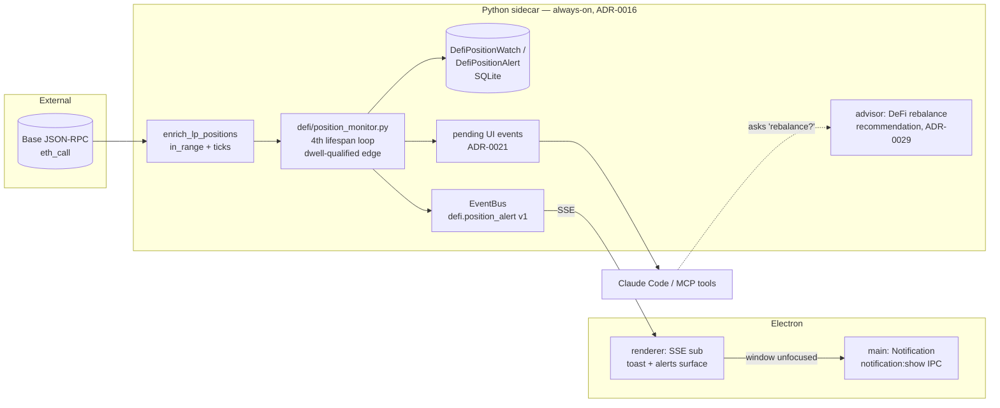

# 0099 — DeFi LP out-of-range monitor + notification (+ advisory rebalance hook)

> **Status:** in-progress
> **Created:** 2026-07-13
> **Owner skill(s):** dev, ui-builder, human
> **Related ADRs:** [ADR-0093](../adrs/0093-defi-position-monitor-dwell-triggered.md) (dedicated dwell-triggered monitor — accepts at close), [ADR-0094](../adrs/0094-os-native-notification-transport.md) (OS-native notification transport — accepts at close); realizes [ADR-0029](../adrs/0029-advisory-recommendation-boundary.md) (advisor DeFi-rebalance recommendation) and follows [ADR-0055](../adrs/0055-in-sidecar-watch-scheduler.md) (the market-alert scheduler this is a sibling to)

## TL;DR

A concentrated-liquidity LP earns fees only while price is inside its tick range; when it drifts out, the position goes idle and stops generating fees (the situation the user hit on Base wallet `0xae5b…9790`). We already *detect* in-range status read-only (`enrich_lp_positions` → `DefiPosition.in_range`), but nothing watches it on a clock. This plan adds a **dedicated in-sidecar DeFi position monitor** (a 4th lifespan job, sibling to the market-alert scheduler) that fires a **`defi.position_alert`** exactly once when a watched LP has been **continuously out of range for a configurable dwell** (default hours), reaching the user three ways: **agent-visible** (MCP tools + the pending-events poll), **in-app** (toast + alerts surface), and an **OS-native desktop notification** when the window is minimized/closed. When an alert fires, the user can ask the advisor for a **labeled rebalance recommendation** (recenter / widen / exit, with rationale + basis) — advice only, per ADR-0029. Actual on-chain rebalancing is explicitly **out of scope** (it crosses the ADR-0025 execution line and is barred from the ADR-0072 autonomous path — a future ADR arc). First visible behavior: `create_position_watch` on the wallet's out-of-range LP, and ~one dwell later a native toast + an agent-pollable alert saying "pool X has been out of range for N h, fees idle".

## Context & problem

The user reported an LP on Base (wallet `0xae5b…9790`) that drifted out of its range and stopped earning fees, and asked (1) can we auto-notify, and (2) can we eventually auto-rebalance.

What already exists (surveyed 2026-07-13):
- **Detection, read-only, today.** `RpcLpDetailAdapter` (`data/adapters/lp_detail.py`) reads `tick_lower/tick_upper/current_tick` over Base RPC and computes `in_range = tick_lower <= current_tick < tick_upper`; `enrich_lp_positions` (`defi/enrichment.py`) folds an `LpPositionDetail` onto each `kind="lp"` `DefiPosition`; the `scan_wallet` MCP tool surfaces it. Needs the `base_rpc_url` secret — the user has it.
- **An alerting substrate.** ADR-0055's `WatchScheduler` runs as a lifespan asyncio loop with a `/healthz` heartbeat, edge-triggered, persisting `Watch`/`Alert` rows and emitting `alert.triggered v1`; the renderer has an `AlertToaster` + Alerts view; the agent polls pending UI events (ADR-0021). DeFi already has sibling lifespan jobs (`defi/scan_job.py`, `defi/pnl_job.py`).

What's missing: any clock over LP positions, any dwell/duration logic, any persistence of range state across ticks, and any OS-level notification (the in-app toast only shows with the window open — ADR-0017 scoped system notifications as future; the Electron `Notification` API is unwired).

Rebalancing is a hard boundary, not a small extension: an LP rebalance is multi-leg + inventory-carrying, so ADR-0072 BA-1 bars it from the autonomous path, and it would cross ADR-0025's read-only line (needs all six invariants + the ADR-0044 trade-secret store, still `proposed`). The only in-boundary "rebalance" is an **advisor recommendation** (ADR-0029 — advice, never action).

## Decision

We picked a **dedicated DeFi position-monitor subsystem** (ADR-0093) over generalizing the shipped ADR-0055 scheduler, so the working market-alert path is untouched; the trigger is a **dwell-qualified edge** (fire once after sustained out-of-range, reset on re-entry) over instantaneous edge, because CL price on a boundary chatters and the economically meaningful event is *sustained* zero-fee. Notification reaches the user via **agent-visible MCP + in-app toast + a new OS-native notification IPC channel** (ADR-0094) for the minimized/closed-window case; notify-while-fully-closed (a tray/supervisor) stays deferred (ADR-0016). Watches come from **both** a config-pinned wallet set and agent-created per-position watches. An **advisor rebalance-recommendation hook** turns an out-of-range alert into a labeled advisory call, no action. We rejected generalizing the ADR-0055 core (live-table migration + bars-vs-RPC evaluator polymorphism destabilizes a shipped path), instantaneous-edge triggering (chatters on the boundary), an agent-side `/loop` as the primary clock (only runs while a paid session is alive, no cross-tick dwell state), and any on-chain rebalance execution (out of scope — future ADR).

## Architecture diagram



## Implementation phases

### Phase 1 — Position-watch persistence + pure dwell evaluator
- **Owner skill:** dev
- **What:** The data model and the pure, testable trigger logic — no clock yet.
- **Files touched:** `src/market_analyser/defi/position_watch.py` (new — `DefiPositionWatch`, `DefiPositionAlert`, and a pure `evaluate_position_dwell(prev_state, live_in_range, now, dwell) -> (new_state, fired: bool)` reducer), `src/market_analyser/persistence/models/defi_position_watches.py` (new), `src/market_analyser/persistence/repositories/defi_position_watches.py` (new — watches + alerts repos), a new additive Alembic migration at the **current chain head** (verify with `uv run alembic heads` — do NOT hardcode the revision number), plus tests.
- **Done when:** unit tests show the reducer (a) does not fire while in range, (b) does not fire on the first out-of-range observation, (c) fires exactly once after the position has been continuously out of range for ≥ `dwell`, (d) resets and re-arms on re-entry, and (e) preserves dwell state across a simulated restart (state is reconstructed from the persisted `out_since`, not from process memory); and a repo round-trip persists + reloads a watch and an alert.

### Phase 2 — Lifespan monitor job + `defi.position_alert` event + MCP tools (agent-visible delivery)
- **Owner skill:** dev
- **What:** The 4th lifespan asyncio loop that ticks watched positions through `enrich_lp_positions` and the phase-1 reducer, persists an alert on fire, emits the event, appends to the pending-events buffer, and the MCP CRUD tools. Config-pinned wallet seeding + agent-created watches, both behind the watches repo.
- **Files touched:** `src/market_analyser/defi/position_monitor.py` (new — the loop + `/healthz` heartbeat, modeled on `alerts/scheduler.py` + `defi/scan_job.py`; conservative default interval, e.g. 15 min), `src/market_analyser/events/payloads.py` (add `DefiPositionAlertPayloadV1` + register `defi.position_alert` in `TYPE_REGISTRY`), `src/market_analyser/api/app.py` (compose the job into `lifespan` beside the existing three), config for the pinned wallet set + `position_monitor_enabled` (opt-in, like `metric_accrual_enabled`), `src/market_analyser/api/mcp_tools/position_watches.py` (new — `create_position_watch` / `list_position_watches` / `delete_position_watch` / `list_position_alerts`), REST read route for the viewer if the Alerts surface needs it, `apiref` regen, plus tests.
- **Done when:** with `base_rpc_url` set and the monitor enabled, creating a watch on an **out-of-range** LP results — after the dwell — in exactly one persisted `DefiPositionAlert`, exactly one `defi.position_alert` event published, and one entry visible via `get_pending_ui_events` and `list_position_alerts`, whose payload carries pool address, `tick_lower/tick_upper`, `current_tick`, `in_range=false`, and `hours_out`; an **in-range** position fires nothing; a transient one-tick excursion fires nothing; an RPC read failure leaves dwell state unchanged (does not reset). `apiref --check` shows no drift; the payload contains no directive/advice field (asserted).

### Phase 3 — Advisor rebalance-recommendation hook (advisory only)
- **Owner skill:** dev
- **What:** A DeFi-rebalance advisory entrypoint (in `src/market_analyser/advisor/`, consumed by the `advisor` skill) that turns an out-of-range position's health context into a **labeled** recommendation — recenter / widen / exit — with rationale (forgone fees, dwell, price-vs-range) and an honest basis, or an honest "hold / insufficient basis". Strictly ADR-0029: no order, no trade key, no simulated execution.
- **Files touched:** `src/market_analyser/advisor/` (rebalance recommendation fusion consuming the phase-1/2 position context + the existing `defi/pnl` + risk inputs), wiring so the `recommend`-family surface can produce it from an alert's context, tests.
- **Done when:** given an out-of-range alert's position context, the advisor produces a labeled rebalance recommendation carrying a direction (recenter/widen/exit), rationale, and basis — and a test asserts there is no code path from this module to an order submission or a trade-permissioned secret (the ADR-0029 boundary holds). An in-range / healthy position yields a "no action" read.

### Phase 4 — OS-native notification transport + in-app DeFi-alert surface
- **Owner skill:** ui-builder
- **What:** Wire ADR-0094's `notification:show` IPC channel (Electron main `Notification` + typed preload bridge), have the renderer's SSE subscriber raise it on `defi.position_alert` **only when the window is unfocused**, and surface the alert in-app (toast + a DeFi row in the Alerts view) reusing the `AlertToaster`/`alertBus` pattern. Clicking the OS notification focuses/restores the window.
- **Files touched:** `desktop/electron/ipc/` (new notification handler) + `desktop/electron/preload/api/` (new bridge) + `desktop/electron/main.ts`/`window.ts` (focus-on-click, focused-state check), `desktop/renderer/hooks/useEventStream.ts` + handlers (route `defi.position_alert` → toast + OS notification), `desktop/renderer/views/AlertsView.tsx` (or a DeFi section) + a Zod schema for the new payload, `desktop/scripts/gen-types` regen, jest tests.
- **Done when:** an emitted `defi.position_alert` (a) with the window **minimized/unfocused** raises exactly one native OS notification whose click focuses the app, (b) with the window **focused** raises the in-app toast and **no** OS notification (no double-signal), and (c) appears as a row in the Alerts surface; renderer typecheck + lint + `gen-types:check` + jest all green; no CSP change (asserted).

### Phase 5 — Live smoke on the real wallet
- **Owner skill:** human
- **What:** End-to-end verification against Base wallet `0xae5b…9790`.
- **Done when:** the operator creates a position watch on the reported out-of-range LP (and/or pins the wallet), and confirms: after the dwell the monitor fires once; an OS notification appears with the window minimized; the agent sees the alert via the pending-events poll / `list_position_alerts`; asking the advisor "should I rebalance?" yields a labeled recommendation with rationale; and nothing anywhere reads as an executed or auto-prepared trade. Evidence recorded under `runs/defi/`.

## Data shapes

```python
# illustrative — not the final interface
class DefiPositionWatch(BaseModel):
    id: str
    wallet: str            # 0x…, checksummed
    chain: Chain           # "base" (deep-readable today; "ethereum" also)
    pool_address: str
    nft_token_id: int | None   # None = match any CL LP in the pool for this wallet
    dwell_hours: float = 6.0   # sustained-out-of-range threshold
    interval_seconds: int = 900
    enabled: bool = True
    source: Literal["config", "agent"]

class DefiPositionAlert(BaseModel):     # persisted + the event payload core
    watch_id: str
    wallet: str
    chain: Chain
    pool_address: str
    nft_token_id: int | None
    fired_at: datetime          # run-provenance; excluded from any determinism guarantee
    out_since: datetime
    hours_out: float
    tick_lower: int
    tick_upper: int
    current_tick: int
    in_range: bool              # False by construction at fire
    uncollected_fees: list[PositionToken] | None   # forgone-fee context, condition-only
    # NOTE: no direction / advice / size field — ADR-0029/0055 boundary
```

`defi.position_alert v1` wraps the alert core in the standard `{type, version, ts, payload}` envelope and registers in `TYPE_REGISTRY`.

## Risks & open questions

- **RPC rate-limit / cost from a second duty cycle.** Each tick re-reads watched positions on-chain. Mitigation: conservative 15-min default interval, best-effort enrichment (already degrades gracefully), heartbeat surface so a wedged monitor is visible. Watch-count × frequency is the knob to watch.
- **Zerion discovery leaves CL fields null; enrichment is best-effort and Base/Ethereum-only.** A watch on a pool the RPC adapter can't deep-read never fires (stays at discovery depth). Mitigation: phase-2 done-when requires the enriched path; surface "unreadable / never evaluated" distinctly from "in range" so a silent non-fire isn't mistaken for health.
- **Advisor rebalance hook scope creep (phase 3).** If the advisor has no existing DeFi-rebalance fusion path, phase 3 builds a minimal one — bounded to *recommendation* only. Open question to settle in phase 3: does it reuse the `recommend` tool surface or add a sibling entrypoint? Either way, the ADR-0029 no-action assertion is the gate.
- **Dwell state after a long sidecar downtime.** If the sidecar was down while a position went out of range, `out_since` is unknown on restart; the monitor should treat first-observed-out-of-range post-restart as the dwell start (conservative — may delay one dwell), not fire immediately. Pin this in phase-1 tests.
- **OS-notification is Windows-first and needs the shell running.** No notify-while-fully-closed (documented in ADR-0094). The sidecar keeps detecting + persisting regardless, but only the Electron shell raises the OS toast.

## What this plan does NOT do

- **No on-chain rebalancing, and no order preparation of any kind.** Automated rebalance is multi-leg/inventory-carrying → barred from the ADR-0072 autonomous path (BA-1) and crosses the ADR-0025 read-only line. It needs its own future ADR + the ADR-0044 trade-secret store; this plan stops at *detection + notification + advisory recommendation*.
- **No notify-while-Electron-fully-closed.** That is ADR-0016's deferred tray/supervisor; ADR-0094 is layered so it can be added later on the same channel.
- **No proximity / pre-warning trigger** ("price within X% of the range edge") — needs tick→price conversion; deferred, extensible without schema change.
- **No change to the shipped ADR-0055 market-alert path** (`WatchScheduler` / `Watch` / `Alert` / `alert.triggered`) — this is a separate subsystem (asserted).
- **No new runtime dependency** — Electron's built-in `Notification`, existing RPC/enrichment path.

## Followups (after this lands)

- Adopt the ADR-0094 OS-notification channel for the market-alert path (`alert.triggered`) too.
- Proximity-to-edge pre-warning once tick→price conversion lands.
- A tray/supervisor for notify-while-fully-closed (its own ADR, per ADR-0016).
- If/when execution is ever pursued: the assisted-confirm rebalance path as a distinct plan under the ADR-0025 invariants.
