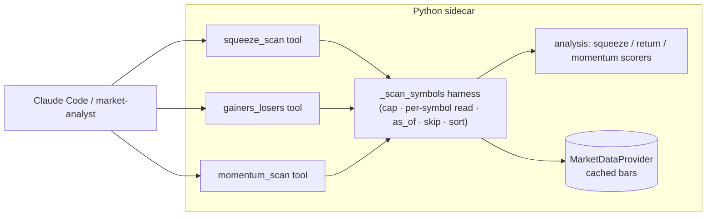

# 0100 — Watchlist condition scanners

> **Status:** approved
> **Created:** 2026-07-13
> **Owner skill(s):** dev, human
> **Related ADRs:** [0095](../adrs/0095-watchlist-scan-fanout-harness.md) (paired, accepts at close), [0023](../adrs/0023-technical-analysis-surface.md), [0007](../adrs/0007-market-data-provider.md), [0083](../adrs/0083-squeeze-and-counter-trend-volume-semantics.md)

## TL;DR

Add three watchlist scanners over a caller-supplied symbol list, computed on our own cached bars: **`squeeze_scan`** (rank a watchlist by how tightly each name is coiling, from the ADR-0083 squeeze trio), **`gainers_losers`** (rank by % change over the timeframe window), and **`momentum_scan`** (filter/rank by RSI band + trend, with no volume gate — the un-volume-gated complement to the shipped `smart_volume`). Phase 1 extracts the shared `_scan_symbols` fan-out harness ([ADR-0095](../adrs/0095-watchlist-scan-fanout-harness.md)) and lands `squeeze_scan` on it as the walking skeleton; later phases add the other two scanners and refactor the two existing volume scanners onto the harness. Conditions only — never buy/sell ([ADR-0029](../adrs/0029-advisory-recommendation-boundary.md)). First user-visible behaviour: `squeeze_scan(["BTC-USD","ETH-USD",…], "1d")` returns the watchlist ranked by squeeze tightness, the most-coiled names first.

## Context & problem

The inspiration project exposes universe-wide scanners (`bollinger_scan` for squeezes, `top_gainers`/`top_losers`) that answer "across my list, what's coiling / what's moving". We compute the squeeze trio (`bb_width`, `bb_width_pct90`, `squeeze_on`) and momentum **per symbol** inside `analyze_symbol`, and we scan watchlists for volume events (`volume_breakout`, `smart_volume`) — but there is no tool that ranks a whole watchlist by squeeze, by raw move, or by momentum condition. A user watching a basket has to call `analyze_symbol` N times and eyeball the results.

The fan-out these scanners need already exists — twice, copied — in the two volume scanners, each carrying its own copy of the cap + anti-lookahead + skip contract. Adding three more copies is the drift risk ADR-0095 addresses.

## Decision

Extract the shared scan fan-out once (ADR-0095), then add three condition scanners on top of it. `squeeze_scan` ranks by the existing squeeze trio; `gainers_losers` ranks by trailing close-to-close % change; `momentum_scan` filters by an RSI band and a requested trend (no volume gate — this is deliberately distinct from `smart_volume`, which requires a volume surge). All three read cached bars through the provider, honour `as_of`, skip missing symbols honestly, and emit conditions only. We rejected keeping the scanners self-contained (ADR-0095 alt A) and rejected a universe-wide exchange scan (the caller supplies the symbols — our data, our anti-lookahead guarantee, any asset class).

## Architecture diagram



## Implementation phases

### Phase 1 — Harness + `squeeze_scan` (walking skeleton)
- **Owner skill:** dev
- **What:** Extract the shared `_scan_symbols` fan-out (ADR-0095) and land `squeeze_scan` on it — rank a watchlist by squeeze tightness using the ADR-0083 trio.
- **Files touched:** `src/market_analyser/analysis/scanners.py` (new harness + squeeze scorer, or `api/mcp_tools/_scan.py`), `src/market_analyser/api/mcp_tools/squeeze_scan.py` (new), register in `api/mcp_app.py`, bump `EXPECTED_FULL_TOOLSET` +1, regenerate `docs/reference/`.
- **Done when:** `squeeze_scan` over a fixture watchlist returns matches ranked by `bb_width_pct90` ascending (tightest first) with `squeeze_on` flagged, skips no-bar symbols into `skipped`, and honours `as_of`. A unit test on the factored `_..._scan_response` pins the ranking order, the skip path, and truncation-invariance (a scan at `as_of=t` equals the same scan run later with the window truncated to `t` — no future leak). Short-history symbols whose percentile is undefined are skipped, not crashed.

### Phase 2 — `gainers_losers`
- **Owner skill:** dev
- **What:** Rank the watchlist by trailing close-to-close % change over the window, split by direction.
- **Files touched:** `analysis/scanners.py` (return scorer), `api/mcp_tools/gainers_losers.py` (new), register in `mcp_app.py`, `EXPECTED_FULL_TOOLSET` +1, apiref.
- **Done when:** `gainers_losers` returns matches sorted by `change_pct` descending, each carrying its signed change and direction; honours `as_of`. A unit test pins the ordering (largest gainer first, largest loser last), the sign convention, and no-lookahead. A symbol with a single bar (no prior close) is skipped, not divided-by-zero.

### Phase 3 — `momentum_scan`
- **Owner skill:** dev
- **What:** Filter/rank the watchlist by an RSI band (`rsi_min`/`rsi_max`) and a requested `trend`, over the snapshot indicators — no volume gate.
- **Files touched:** `analysis/scanners.py` (momentum scorer, reusing snapshot RSI + trend), `api/mcp_tools/momentum_scan.py` (new), register in `mcp_app.py`, `EXPECTED_FULL_TOOLSET` +1, apiref.
- **Done when:** `momentum_scan` returns only symbols whose RSI is within `[rsi_min, rsi_max]` (boundary-inclusive) and whose trend matches, each with its RSI + trend + momentum label, sorted deterministically; honours `as_of`. A unit test pins band boundary inclusivity, the trend filter, and no-lookahead. The tool's description documents the difference from `smart_volume` (no volume surge required).

### Phase 4 — Refactor the two shipped volume scanners onto the harness
- **Owner skill:** dev
- **What:** Move `volume_breakout` and `smart_volume` onto `_scan_symbols`, behaviour-preservingly; retire the "kept self-contained" note.
- **Files touched:** `api/mcp_tools/volume_breakout.py`, `api/mcp_tools/smart_volume.py`.
- **Done when:** the existing `volume_breakout` / `smart_volume` unit tests pass **unchanged** (their `_..._scan_response` bodies now delegate to the harness), and both tools call `_scan_symbols`. No behaviour change, no schema change, no apiref drift from this phase.

### Phase 5 — Live smoke
- **Owner skill:** human
- **What:** Run all three scanners over a real watchlist via MCP.
- **Done when:** `squeeze_scan` / `gainers_losers` / `momentum_scan` on a live basket (e.g. a handful of majors + alts on `1d`) return sane rankings, `skipped` honestly lists un-cached symbols, and no field reads as a buy/sell call.

## Data shapes

```python
# illustrative — not the final interface
class SqueezeScanMatch(BaseModel):
    model_config = ConfigDict(frozen=True, extra="forbid")
    symbol: str
    bb_width: float
    bb_width_pct90: float   # lower = tighter coil; ranked ascending
    squeeze_on: bool

class GainersLosersMatch(BaseModel):
    symbol: str
    change_pct: float       # signed, over the window
    direction: str          # "up" | "down"

class MomentumScanMatch(BaseModel):
    symbol: str
    rsi: float
    trend: str
    momentum: str

# every scanner returns the shared shape (matches | skipped | scanned_at)
```

## Risks & open questions

- Risk: the squeeze percentile needs enough bars to be meaningful; a short history yields `None`. Mitigation: skip-and-report into `skipped`, never crash (same rule as the volume scanners).
- Risk: `momentum_scan` overlaps conceptually with `smart_volume`. Mitigation: document the distinction in the tool description (momentum_scan = no volume gate; smart_volume = requires a volume surge).
- Risk: the phase-4 refactor regresses the two shipped scanners. Mitigation: their existing unit tests are the guard and must pass unchanged; if the harness can't preserve behaviour byte-for-byte, the harness is wrong, not the tests.
- Open: whether the harness lives under `analysis/` or `api/mcp_tools/_scan.py` — decided in phase 1 by where the cap/provider dependency sits most cleanly.

## What this plan does NOT do

- **No UI scanner view.** These are agent/MCP-first tools consumed by the `market-analyst` skill; a renderer scanner surface is a separate `ui-builder` followup.
- **No universe-wide exchange scan.** The caller supplies the symbols so the read stays on our cached bars with our anti-lookahead guarantee; scanning a whole exchange via a third party is out of scope (ADR-0095 context).
- **No alerting on scan results.** Firing a notification when a watchlist name coils is the ADR-0055 watch-scheduler path — a followup, not this plan.
- **No quality composite** (Plan 0101) and **no sector baskets** (Plan 0102) — those build on this plan's harness.

## Followups (after this lands)

- Renderer scanner surface (ui-builder).
- Wire scan conditions into `create_watch` so a squeeze/momentum condition can fire an alert.
