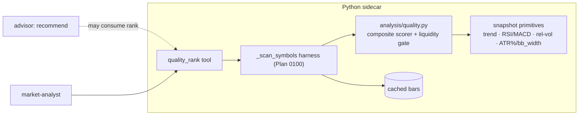

# 0101 — Composite quality/momentum screening rank

> **Status:** approved
> **Created:** 2026-07-13
> **Owner skill(s):** dev, human
> **Related ADRs:** [0096](../adrs/0096-screening-quality-rank-conditions-side.md) (paired, accepts at close), [0095](../adrs/0095-watchlist-scan-fanout-harness.md), [0029](../adrs/0029-advisory-recommendation-boundary.md), [0023](../adrs/0023-technical-analysis-surface.md)
> **Depends on:** [Plan 0100](0100-watchlist-condition-scanners.md) (the `_scan_symbols` harness)

## TL;DR

A composite technical-quality **rank** over a caller-supplied watchlist — a normalized 0–100 score decomposed into named factor contributions (trend / momentum / volume / volatility) with a liquidity gate that flags illiquid names — as a screening aid that stays strictly on the conditions side of ADR-0029 (no grade-as-call, no action, no levels). Reuses the Plan 0100 harness. First user-visible behaviour: `quality_rank(["BTC-USD","ETH-USD",…], "1d")` returns the watchlist ranked by composite score, each name with its per-factor breakdown and a liquidity flag.

## Context & problem

The inspiration project's most distinctive analytic is a 100-point composite quality/momentum score with a liquidity hard-gate — a fast way to rank a watchlist by "how good does this setup look". We have all the ingredients (trend classification, RSI/MACD momentum, relative volume, ATR%/`bb_width` volatility, bar volume) but no tool that fuses them into one comparable, ranked number.

The catch is the boundary: a naive port ships a "Strong / Avoid" grade, which is a buy/sell call in disguise and breaches ADR-0029. [ADR-0096](../adrs/0096-screening-quality-rank-conditions-side.md) resolves this — the composite is a transparent *rank* with factor decomposition and a liquidity gate, and no call-shaped output.

## Decision

Build a pure composite scorer from existing snapshot primitives, expose it as a `quality_rank` MCP tool over the Plan 0100 harness, and keep it strictly conditions-only per ADR-0096. The score is decomposed (each factor's contribution is visible), the liquidity gate caps/flags thin names, and the response carries **no** `action` / `signal` / `recommendation` / `grade` field. We rejected porting the upstream grade ladder (ADR-0096 alt A) and rejected housing it in the advisor (ADR-0096 alt B).

## Architecture diagram



## Implementation phases

### Phase 1 — Pure composite scorer + liquidity gate
- **Owner skill:** dev
- **What:** `analysis/quality.py` — a pure, trailing, deterministic scorer that maps a symbol's snapshot primitives to a normalized 0–100 composite plus per-factor contributions (trend, momentum, volume, volatility), and a liquidity gate from bar volume × price against a per-asset-class threshold.
- **Files touched:** `src/market_analyser/analysis/quality.py` (new), `analysis/types.py` (result model), tests under `tests/`.
- **Done when:** unit tests pin (a) the factor contributions summing to the composite, (b) monotonicity — a strictly better trend/momentum input raises that factor's contribution, (c) the liquidity gate capping/flagging a thin fixture name, (d) no-lookahead via truncation-invariance, and (e) **the result model has no `action` / `signal` / `recommendation` / `buy` / `sell` / `grade` field** (asserted absent, same guard style as the price-structure tools).

### Phase 2 — `quality_rank` MCP tool
- **Owner skill:** dev
- **What:** Expose `quality_rank` over the Plan 0100 harness — rank a caller watchlist by composite score descending.
- **Files touched:** `api/mcp_tools/quality_rank.py` (new), register in `mcp_app.py`, `EXPECTED_FULL_TOOLSET` +1, regenerate `docs/reference/`.
- **Done when:** `quality_rank` ranks a fixture watchlist descending by score, skips no-bar symbols into `skipped`, honours `as_of`, and the response is asserted to contain **no call-shaped key**. The tool description states plainly: screening rank, conditions only, not a recommendation — use `recommend` for a call.

### Phase 3 — Live smoke
- **Owner skill:** human
- **What:** Run `quality_rank` over a real watchlist via MCP.
- **Done when:** the ranking is sane against an eyeball of the names, the liquidity gate flags a genuinely thin symbol, and the output reads as a screen — not a buy list.

## Data shapes

```python
# illustrative — not the final interface
class QualityScore(BaseModel):
    model_config = ConfigDict(frozen=True, extra="forbid")
    symbol: str
    score: float                     # 0..100 composite, ranked desc
    factors: dict[str, float]        # {"trend":.., "momentum":.., "volume":.., "volatility":..}
    liquidity_ok: bool
    liquidity_note: str | None       # why it was flagged/capped, if it was
    # NO action / signal / recommendation / grade field — ADR-0096
```

## Risks & open questions

- Risk: factor weights are opinionated. Mitigation: named module constants, documented; changing them is a visible edit, not hidden behaviour.
- Risk: cross-asset normalization — crypto and equity volatility scales differ, so an absolute ATR% would mis-rank across classes. Mitigation: normalize each factor against a trailing distribution, not an absolute constant.
- Risk: boundary creep — a future edit adds a "grade" that reads as a call. Mitigation: the phase-1/2 "no call-shaped key" assertion is the guard; Mode 4 review re-checks it.

## What this plan does NOT do

- **No buy/sell grade** (ADR-0096) — the rank is conditions-only.
- **No advisor integration in this plan** — the advisor *may* later consume the rank; that wiring is a followup, not scope here.
- **No UI leaderboard** — a renderer surface is a `ui-builder` followup.
- **No fundamentals-based quality** — we have no fundamentals (no earnings/ratings); this is technical-quality only.

## Followups (after this lands)

- Feed the quality rank into `recommend` as an additional condition input (advisor).
- A renderer leaderboard view (ui-builder).
