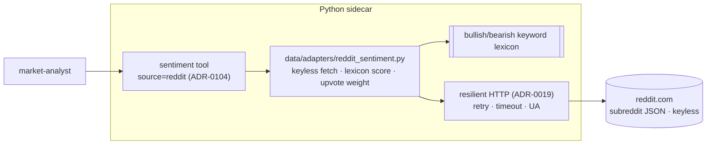

# 0103 — Reddit crowd sentiment source

> **Status:** approved
> **Created:** 2026-07-13
> **Owner skill(s):** dev, human
> **Related ADRs:** [0098](../adrs/0098-reddit-keyless-crowd-sentiment.md) (paired, accepts at close), [0031](../adrs/0031-data-source-adapter-contract.md), [0019](../adrs/0019-external-http-adapter-resilience.md), [0029](../adrs/0029-advisory-recommendation-boundary.md), [0069](../adrs/0069-crypto-first-asset-class-positioning.md)

## TL;DR

Add Reddit as a keyless crowd-sentiment source — a `SentimentSource` adapter over the public subreddit JSON endpoint, keyword-lexicon scored (bullish/bearish → a −1..+1 aggregate + label, upvote-weighted), surfaced as a **`reddit` source mode of the unified `sentiment` tool** ([ADR-0104](../adrs/0104-mcp-tool-surface-granularity.md); Plan 0109 shipped the tool + injectable source registry). Crowd condition, never advice ([ADR-0029](../adrs/0029-advisory-recommendation-boundary.md)); honest-empty on rate-limit ([ADR-0019](../adrs/0019-external-http-adapter-resilience.md)). First user-visible behaviour: `sentiment(source="reddit", symbol="BTC", category="crypto")` returns an aggregate bullish/bearish score + label + the top posts from the crypto subreddit group.

## Context & problem

We have three sentiment surfaces (news+VADER, StockTwits, Fear & Greed) but nothing from Reddit — the retail-crowd venue (WSB, r/CryptoCurrency) whose discussion tone neither headlines nor StockTwits captures. The inspiration project pulls Reddit keyless via the public subreddit JSON and scores it with a keyword lexicon; that is a clean fit for our existing `SentimentSource` seam and keyless-first posture, and [ADR-0098](../adrs/0098-reddit-keyless-crowd-sentiment.md) settles the shape (keyless JSON, keyword lexicon for v1, honest-degrade, condition-only).

## Decision

Add a keyless Reddit `SentimentSource` adapter mirroring `stocktwits.py`, scored by an in-house keyword lexicon and upvote-weighted, exposed as the `reddit` source mode of the unified `sentiment` tool ([ADR-0104](../adrs/0104-mcp-tool-surface-granularity.md)). It rides the ADR-0019 resilient HTTP path with a descriptive User-Agent and degrades to an honest empty result on rate-limit/failure. We rejected the authenticated Reddit API (ADR-0098 alt A), rejected skipping Reddit (alt B), and deferred VADER/ML scoring (alt C).

## Architecture diagram



## Implementation phases

### Phase 1 — Reddit `SentimentSource` adapter
- **Owner skill:** dev
- **What:** `data/adapters/reddit_sentiment.py` mirroring `stocktwits.py` — subreddit-group config (crypto / stocks / all), resilient keyless fetch (ADR-0019, descriptive User-Agent), keyword-lexicon scoring, upvote weighting, honest-empty degrade. Wire it into the `SentimentSource` Protocol / provider surface.
- **Files touched:** `src/market_analyser/data/adapters/reddit_sentiment.py` (new), `data/sources.py` / provider wiring if a new Protocol variant is needed, tests with fixture JSON.
- **Done when:** adapter unit tests over fixture JSON pin (a) the score sign for a bullish vs a bearish post set, (b) upvote weighting (a high-upvote post moves the aggregate more), (c) empty-on-error / empty-on-rate-limit degrade (no exception, no fabrication), and (d) the label thresholds. No secret required to run.

### Phase 2 — Reddit as a `sentiment(source="reddit")` mode
- **Owner skill:** dev
> **Amended 2026-07-15 ([ADR-0104](../adrs/0104-mcp-tool-surface-granularity.md)):** Reddit is a new *source* mode of the unified `sentiment` tool ([Plan 0109](0109-mcp-tool-consolidation.md) creates it), **not** a new top-level `reddit_sentiment` tool. If 0109 has landed, this phase adds `"reddit"` to the `source` enum + binds the adapter — no `register_*` call, no `EXPECTED_FULL_TOOLSET` bump. If 0103 runs before 0109 phase 3, land `reddit_sentiment` as written and 0109 folds it in; **prefer sequencing 0109 phase 3 first.**
> **Resolved 2026-07-15:** Plan 0109 closed — `sentiment(source)` and its injectable source registry are live on `main` (`api/mcp_tools/sentiment.py`, `source ∈ {news, stocktwits}`). The pre-0109 fallback branch is moot: this phase adds `"reddit"` to the registry, no new tool module, no toolset bump.
- **What:** Expose Reddit sentiment via `sentiment(source="reddit", symbol, category)` returning the aggregate + top posts.
- **Files touched:** `api/mcp_tools/sentiment.py` (add source binding) or, pre-0109, `api/mcp_tools/reddit_sentiment.py` (new) + `EXPECTED_FULL_TOOLSET` +1; regenerate `docs/reference/`.
- **Done when:** `sentiment(source="reddit", …)` returns `{score, label, sample_size, top_posts, as_of}` for a fixture, category routing (crypto / stocks / all) selects the right subreddit group, and the response is conditions-only (**no** `action` / `signal` / `recommendation` key asserted).

### Phase 3 — Live smoke
- **Owner skill:** human
- **What:** Run `sentiment(source="reddit", …)` on a couple of live tickers via MCP.
- **Done when:** the score + posts are plausible for the ticker, and a rate-limited call degrades to an honest empty result (not an error, not fabricated data).

## Data shapes

```python
# illustrative — not the final interface
class RedditSentiment(BaseModel):
    model_config = ConfigDict(frozen=True, extra="forbid")
    symbol: str
    score: float                     # -1..+1 aggregate, upvote-weighted
    label: str                       # e.g. "Strongly Bullish" .. "Strongly Bearish"
    sample_size: int
    top_posts: list[dict]            # [{"title":.., "upvotes":.., "url":.., "subreddit":..}]
    as_of: datetime
# lexicon lives as a module constant (bullish/bearish word lists)
```

## Risks & open questions

- Risk: Reddit's public rate-limit. Mitigation: honest-empty degrade (ADR-0019), documented so the caller knows an empty result may be a limit, not silence.
- Risk: keyword scoring is gameable/noisy (memes, sarcasm). Mitigation: read as one input among several (ADR-0098); v1 keeps the transparent lexicon rather than pretending ML fixes noise.
- Risk: User-Agent / ToS. Mitigation: a descriptive UA and low request volume; keyless read-only endpoint only.
- Open: the exact subreddit list per category — pinned in phase 1, maintained like the RSS feed list.

## What this plan does NOT do

- **No authenticated Reddit API / OAuth** (ADR-0098 alt A) — keyless JSON only, no new secret.
- **No VADER/ML scoring** (ADR-0098 alt C) — keyword lexicon for v1; ML is a possible refinement.
- **No Reddit UI panel** — the app has news/sentiment surfaces already; a Reddit-specific view is a `ui-builder` followup.
- **No historical Reddit archive** — current-window read only.

## Followups (after this lands)

- Fold Reddit into the composite/aggregated sentiment view alongside StockTwits + news (ui-builder).
- Evaluate VADER-over-Reddit if the raw feed proves useful.
