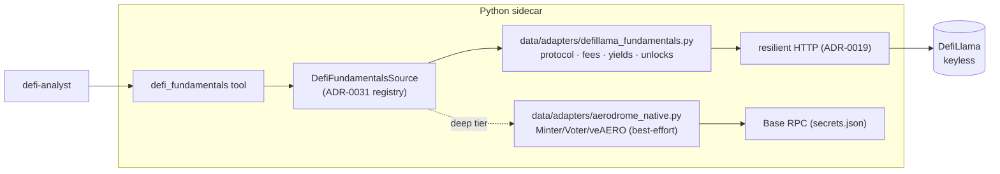

# 0107 — DeFi token & protocol fundamentals

> **Status:** approved
> **Created:** 2026-07-15
> **Owner skill(s):** dev, human
> **Related ADRs:** [0102](../adrs/0102-defi-token-fundamentals-source.md) (paired, accepts at close), [0031](../adrs/0031-data-source-adapter-contract.md), [0019](../adrs/0019-external-http-adapter-resilience.md), [0038](../adrs/0038-third-party-api-key-storage.md), [0029](../adrs/0029-advisory-recommendation-boundary.md), [0069](../adrs/0069-crypto-first-asset-class-positioning.md)

## TL;DR

Add DeFi-native fundamentals as a condition read. A keyless `DefiFundamentalsSource` over DefiLlama (protocol TVL + history, DEX volume, fee/reward APR, token mcap/FDV, unlock/emissions schedule) surfaced as a `defi_fundamentals` MCP tool, then a best-effort **Aerodrome-native** deep tier (exact emissions decay + veAERO/Voter vote-and-bribe weights) over the existing Base RPC. Conditions only ([ADR-0029](../adrs/0029-advisory-recommendation-boundary.md)); honest-degrade on miss ([ADR-0019](../adrs/0019-external-http-adapter-resilience.md)); wall-clock-sensitive, no `as_of`. First user-visible behaviour: `defi_fundamentals("AERO")` returns TVL/volume/APR trend + mcap/FDV + the unlock calendar (where covered), from DefiLlama, keyless.

## Context & problem

Analyzing AERO for a user holding AERO-heavy Aerodrome LPs surfaced a structural gap: our condition surface (price/structure + four sentiment surfaces) is blind to the fundamentals that move a small-cap DeFi token. `news_for` returns zero AERO items; nothing ingests protocol TVL/volume/APR trend, the AERO **emissions schedule** (which sets LP reward APR), **veAERO** vote/bribe dynamics, or the **unlock/dilution calendar**. [ADR-0102](../adrs/0102-defi-token-fundamentals-source.md) settles the shape: keyless DefiLlama primary, Aerodrome-native RPC deep reads as a best-effort second tier, both on the [ADR-0031](../adrs/0031-data-source-adapter-contract.md) registry seam, consumed by `defi-analyst` as conditions.

## Decision

Ship the keyless DefiLlama slice first (phases 1–3), then the Aerodrome-native deep tier (phases 4–5), then a live smoke (phase 6). The DefiLlama slice covers most of the ask with no new key/dependency; the deep tier buys emissions/veAERO depth for Aerodrome over the RPC key already in `secrets.json`. We rejected subgraph/RPC-only as primary (Aerodrome-specific, no cross-protocol comparables — ADR-0102 alt A) and a paid aggregator for v1 (alt B).

## Architecture diagram

## Implementation phases

### Phase 1 — `DefiFundamentalsSource` Protocol + keyless DefiLlama adapter
- **Owner skill:** dev
- **What:** define a `DefiFundamentalsSource` Protocol in `data/sources.py` returning a boundary-validated `DefiFundamentals` model (TVL + short history, DEX volume, fee APR + reward APR, token mcap/FDV, `unlocks` schedule list — each field optional/honest-null with provenance + upstream `as_of`). Implement `data/adapters/defillama_fundamentals.py` over DefiLlama's protocol / fees / yields endpoints and the emissions-unlocks dataset, on the ADR-0019 resilient path, honest-empty on miss.
- **Files touched:** `src/market_analyser/data/adapters/defillama_fundamentals.py` (new), `data/models` or `defi/models.py` (the `DefiFundamentals` model), `data/sources.py` (Protocol), tests with fixture JSON.
- **Done when:** adapter unit tests over fixture JSON pin (a) each field parses with correct units, (b) a missing field → honest `None` with a note, never a zero/fabricated value, (c) resilient-path failure / rate-limit → empty result (no exception), (d) mcap vs FDV distinguished. No secret required to run.

### Phase 2 — Registry wiring + `defi_fundamentals` MCP tool
- **Owner skill:** dev
- **What:** register the source under the ADR-0031 selector registry (composition root); expose `defi_fundamentals(symbol_or_protocol)` returning the model + provenance. Conditions only.
- **Files touched:** `api/app.py` / `mcp_app.py` (registry + tool registration), `api/mcp_tools/defi_fundamentals.py` (new), `EXPECTED_FULL_TOOLSET` +1, regenerate `docs/reference/`.
- **Done when:** the tool returns `{tvl, tvl_trend, dex_volume, fee_apr, reward_apr, mcap, fdv, unlocks, as_of, source, notes}` for a fixture; an unknown/uncovered token returns honest nulls + a note (not an error); the response asserts **no** `action`/`signal`/`recommendation` key (ADR-0029); apiref `--check` clean.

### Phase 3 — `defi-analyst` consumption note
- **Owner skill:** dev
- **What:** a short reference note in the `defi-analyst` skill docs pointing at `defi_fundamentals` as the fundamentals read (so the skill surfaces TVL/APR/unlocks alongside a health report), and a one-line pointer from `market-analyst` that DeFi-native fundamentals live in that tool. Docs only — no behavior in the skill runtime.
- **Files touched:** `.claude/skills/defi-analyst/references/data-sources.md`, `.claude/skills/market-analyst/references/project-context.md`.
- **Done when:** both skill references name the tool and its conditions-only boundary; no code change.

### Phase 4 — Aerodrome-native deep reader (best-effort)
- **Owner skill:** dev
- **What:** `data/adapters/aerodrome_native.py` reading the Aerodrome Minter (weekly emission + decay), Voter/gauge weights, and veAERO total-locked over the existing Base RPC (reuse the `RpcLpDetailAdapter` HTTP/eth_call pattern). Folds `emissions_detail` + `ve_gauge` fields onto `DefiFundamentals` for Aerodrome; **best-effort** — a failed/absent read leaves the DefiLlama-depth fields intact and adds a note (never fails the tool).
- **Files touched:** `src/market_analyser/data/adapters/aerodrome_native.py` (new), a pinned contract-address config, `defi_fundamentals` tool wiring for the deep fields, tests with mocked `eth_call` responses.
- **Done when:** tests pin (a) emission-decay + gauge-weight parse from mocked eth_call, (b) a read failure degrades to DefiLlama depth with a note (no exception, no zero), (c) determinism of the parse. Read-only proven (no state-changing call).

### Phase 5 — Wire the deep tier into the registry
- **Owner skill:** dev
- **What:** register the native reader in the composition root so `defi_fundamentals` uses it for Aerodrome and degrades elsewhere; extend the tool response with the optional deep fields.
- **Files touched:** `api/app.py`/`mcp_app.py`, `api/mcp_tools/defi_fundamentals.py`, apiref regenerate.
- **Done when:** for an Aerodrome token the tool carries `emissions_detail`/`ve_gauge`; for a non-Aerodrome token those are honest-null; apiref `--check` clean; toolset count unchanged (same tool, richer payload).

### Phase 6 — Live smoke
- **Owner skill:** human
- **What:** run `defi_fundamentals("AERO")` against the live sidecar (Base RPC + DefiLlama). Verify TVL/volume/APR trend + mcap/FDV populate, the unlock calendar is present or honestly absent, and the Aerodrome deep fields (emission decay, veAERO, gauge weight) come through — cross-check a figure or two against the Aerodrome/DefiLlama UI.
- **Files touched:** none (smoke); findings feed fix-forwards.
- **Done when:** user-attested that the tool returns coherent, non-fabricated fundamentals for AERO, with honest gaps where coverage is thin.

## Chain scope

- **Keyless DefiLlama tier (phases 1–3): chain-agnostic.** DefiLlama keys on token/protocol, not chain, so `defi_fundamentals` covers any major chain (Ethereum, Base, Arbitrum, Optimism, …) with no per-chain code — matching the ETH/Base/Arbitrum/Optimism span the wallet surface already has.
- **Aerodrome-native deep tier (phases 4–5): Base + Aerodrome only.** Protocol-native contract reads are per-protocol-per-chain; other protocols/chains (including an Ethereum-mainnet deep read via the `eth_rpc_url` we hold) are follow-on increments, not this plan.

## Risks & open questions
- **DefiLlama unlocks coverage for AERO is unverified** — phase 1 must confirm the endpoint carries it; if not, the unlock calendar degrades to "not covered" and the protocol-native tier (or a later paid source, ADR-0102 alt B) becomes the path. Surface this in phase-1 findings.
- **Aerodrome contract addresses / ABI** must be pinned correctly (Minter/Voter/veAERO on Base) — a wrong address is an honest-empty deep tier, not a crash, but it defeats phase 4's value. Verify against the Aerodrome docs, never model memory.
- **Endpoint drift.** DefiLlama renames fields occasionally; the resilient path + fixture tests catch parse breaks, but the live smoke is the real check.

## What this plan does NOT do
- No paid fundamentals aggregator (Token Terminal / Messari / DefiLlama Pro) — keyless first (ADR-0102 alt B).
- No protocol-native deep reads beyond Aerodrome-on-Base — every other protocol/chain stays at DefiLlama (chain-agnostic) depth until its own increment.
- No `as_of` historical replay — these are current-state reads (ADR-0102).
- No fundamentals-driven recommendation or score — conditions only; the advisor may consume the tool, but this plan adds no call-shaped output.
- No UI panel — tool + skill consumption only; a fundamentals view is a separate `ui-builder` plan if wanted.
