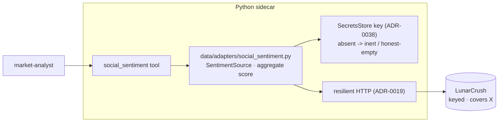

# 0108 — X / social sentiment source

> **Status:** draft
> **Created:** 2026-07-15
> **Owner skill(s):** dev, human
> **Related ADRs:** [0103](../adrs/0103-social-x-sentiment-source.md) (paired, accepts at close), [0031](../adrs/0031-data-source-adapter-contract.md), [0019](../adrs/0019-external-http-adapter-resilience.md), [0038](../adrs/0038-third-party-api-key-storage.md), [0029](../adrs/0029-advisory-recommendation-boundary.md), [0098](../adrs/0098-reddit-keyless-crowd-sentiment.md)

## TL;DR

Add X (Twitter) / social sentiment as a fifth `SentimentSource`, built **source-agnostically behind the seam** with the concrete provider (recommended: LunarCrush) behind a `SecretsStore` key. Absent the key the source is **inert and returns honest-empty**, so the feature ships and degrades cleanly with no spend. Conditions only ([ADR-0029](../adrs/0029-advisory-recommendation-boundary.md)); wall-clock-sensitive, no `as_of`. First user-visible behaviour: `social_sentiment("BTC")` returns an aggregate bullish/bearish score + sample size when a key is configured, or an honest-empty result when not.

## Context & problem

We have four sentiment surfaces (news+VADER, StockTwits, Fear & Greed, Reddit-in-flight) on one `SentimentSource` seam. The user wants **X (Twitter)** sentiment, but X reads are paid and break the keyless-first posture. [ADR-0103](../adrs/0103-social-x-sentiment-source.md) settles it: add a keyed `SentimentSource` implemented source-agnostically, recommend LunarCrush over the raw X API, resolve the key via `SecretsStore` ([ADR-0038](../adrs/0038-third-party-api-key-storage.md)), and **degrade to honest-empty without a key** so the code lands before any spend decision.

## Decision

Build the seam + a LunarCrush reference adapter (phases 1–2), gated behind an optional key with honest-empty degrade; smoke it only if/when a key is funded (phase 3). We rejected raw X API v2 as the primary (cost/rate-limits — ADR-0103 alt A), scraping (fragile/ToS — alt C), and deferring the seam entirely (alt D).

## Architecture diagram

## Implementation phases

### Phase 1 — Social `SentimentSource` adapter (LunarCrush reference), key-gated
- **Owner skill:** dev
- **What:** `data/adapters/social_sentiment.py` conforming to `SentimentSource.fetch_sentiment(symbol, window) -> SentimentSample`, mapping the provider's aggregate to our score + label + sample size. Key read lazily from `SecretsStore` (`lunarcrush_api_key`); **absent the key → inert, honest-empty** (no exception, no fabrication). On the ADR-0019 resilient path. Provider-mapping isolated so raw X (ADR-0103 alt A) could swap in later without touching the seam.
- **Files touched:** `src/market_analyser/data/adapters/social_sentiment.py` (new), `data/sources.py` if a wiring tweak is needed, `persistence/secrets.py` key-name registration, tests with fixture JSON (keyed) + a no-key path.
- **Done when:** tests pin (a) score sign/label for a bullish vs bearish fixture, (b) **no-key → honest-empty** (inert, no exception), (c) resilient-path failure/rate-limit → empty (no fabrication), (d) sample-size surfaced. Runs green with no secret configured.

### Phase 2 — `social_sentiment` MCP tool + registry wiring
- **Owner skill:** dev
- **What:** register the source in the composition root; expose `social_sentiment(symbol, window)` returning `{score, label, sample_size, source, as_of}`. Conditions only; honest-empty (with a "no key configured" note) when the key is absent.
- **Files touched:** `api/app.py`/`mcp_app.py` (registry + registration), `api/mcp_tools/social_sentiment.py` (new), `EXPECTED_FULL_TOOLSET` +1, regenerate `docs/reference/`.
- **Done when:** the tool returns the aggregate for a fixture; the no-key path returns honest-empty + note (not an error); response asserts **no** `action`/`signal`/`recommendation` key (ADR-0029); apiref `--check` clean.

### Phase 3 — Live smoke (deferred until a key is funded)
- **Owner skill:** human
- **What:** with a funded LunarCrush key in `secrets.json`, run `social_sentiment("BTC")` and `social_sentiment("AERO")` against the live sidecar. Verify the majors score coherently and check whether the **small-cap the user holds (AERO)** has usable coverage or comes back thin/empty — the coverage question ADR-0103 flags.
- **Files touched:** none (smoke).
- **Done when:** user-attested that the tool returns coherent social sentiment for majors, with an honest read on small-cap coverage. **This phase does not gate the plan's close** — phases 1–2 ship the seam; phase 3 runs whenever a key is funded.

## Risks & open questions
- **Small-cap coverage is the real unknown.** LunarCrush covers majors well; AERO-tier coverage may be thin — phase 3 answers this, and if it is inadequate the fallback is raw X (ADR-0103 alt A) or staying on Reddit for the long tail.
- **Provider choice is deferred by design.** The seam is source-agnostic, but the reference adapter targets LunarCrush's response shape; a switch to raw X later is an adapter rewrite behind the same Protocol (bounded, but real).
- **Cost/ToS.** The key is a paid dependency and a new secret — no key committed by this plan; funding is the user's separate decision.

## What this plan does NOT do
- No spend and no committed provider — phases 1–2 land the seam with honest-empty; the key is the user's later call (ADR-0103).
- No raw X API v2 integration in this plan — LunarCrush reference only; raw X is the documented fallback.
- No scraping / Nitter (ADR-0103 alt C).
- No new dependency beyond what the resilient HTTP path already provides (no vendor SDK — plain HTTP).
- No `as_of` replay, no sentiment history store — current-window read only, like the other sentiment tools.
- No UI panel — tool + skill consumption only.
