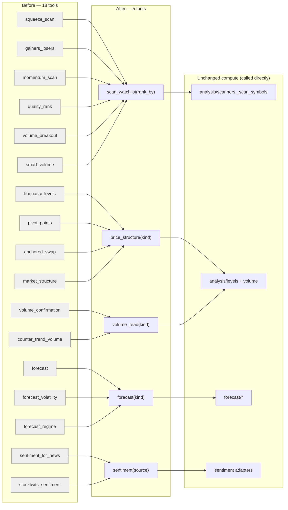

# 0109 — MCP tool consolidation (same-verb clusters → discriminated tools)

> **Status:** approved
> **Created:** 2026-07-15
> **Owner skill(s):** dev, human
> **Related ADRs:** [0104](../adrs/0104-mcp-tool-surface-granularity.md) (granularity rule + consolidation map); consumes [0014](../adrs/0014-mcp-as-second-sidecar-protocol.md), [0064](../adrs/0064-generated-sidecar-api-reference.md); preserves [0029](../adrs/0029-advisory-recommendation-boundary.md)/[0096](../adrs/0096-screening-quality-rank-conditions-side.md) boundaries

## TL;DR

Collapse the five same-verb tool clusters identified in ADR-0104 into five discriminated tools — `scan_watchlist(rank_by=…)`, `forecast(kind=…)`, `sentiment(source=…)`, `price_structure(kind=…)`, `volume_read(kind=…)` — retiring 18 top-level MCP tools in favour of 5. The MCP surface drops **62 → 50**. No underlying analysis, forecast, or sentiment computation changes; only the tool entrypoints re-shape. The first visible result: `scan_watchlist` answers every watchlist ranking (squeeze/gainers/momentum/quality/volume-breakout/smart-volume) through one tool with a documented `rank_by` enum instead of six overlapping tools.

## Context & problem

The sidecar mounts 62 agent-callable MCP tools, growing toward ~70 as queued plans each add one. Per ADR-0104, the redundancy is concentrated in tools that are the *same verb differing only by a mode*: six watchlist scanners over the shared `_scan_symbols` harness, three forecast kinds, two sentiment sources, four single-symbol price reads, and two single-symbol volume reads. In Claude Code these tools are deferred/lazy-loaded, so the cost is not context bytes but **routing quality** — near-identical descriptions make the agent mis-select or miss capabilities. ADR-0104 adopts a "one tool per verb; modes are parameters" rule and mandates the consolidation this plan executes.

## Decision

Fold each same-verb cluster behind one tool that takes a discriminator parameter and returns a result discriminated by that mode. The underlying computations (`analysis/scanners.py`, `analysis/levels.py`, `analysis/volume.py`, `forecast/`, the sentiment adapters) are called unchanged — this is a surface refactor at the `mcp_tools/` layer. Internal consumers that today reach for a soon-retired tool (`recommend` → the quality-rank computation; the advisor → the forecast legs) call the underlying functions directly, never the retired MCP tool. We rejected doing nothing (ADR-0104 alt A — leaves routing and growth unfixed), per-skill tool mounts (alt B — heavier than the problem), and an aggressive fold-into-`analyze_symbol` re-taxonomy (alt C — merges distinct verbs).

## Architecture diagram



## Implementation phases

Each phase folds one cluster, ships as its own commit, and keeps the tree green (the retired tools' tests migrate to the new tool's mode). Phases 1–5 are independent and may land in any order; phase 6 (ledger + docs + skill-doc sync) runs after the merges it accounts for; phase 7 is the live smoke. A cluster whose internal-consumer rewiring proves costly can be dropped without blocking the others — the plan degrades to a partial consolidation, and phase 6 accounts for whatever landed.

### Phase 1 — `scan_watchlist(rank_by=…)`
- **Owner skill:** dev
> **All six folded tools are already shipped and live** — `squeeze_scan`/`gainers_losers`/`momentum_scan` (Plan 0100, closed), `volume_breakout`/`smart_volume` (Plan 0021, refactored onto the harness by 0100), and **`quality_rank` (Plan 0101, fully shipped — `e6816e4` + the follow-up tool commit)**. This phase **retires** all six into modes; **no 0101 amendment is needed** (0109 owns the retirement). Each mode's compute already exists as a pure function and is called directly: the scanners via `analysis/scanners.py::_scan_symbols`, the `quality` mode via `analysis/quality.py` (0101's landed scorer + liquidity gate).
- **What:** One tool folding `squeeze_scan`, `gainers_losers`, `momentum_scan`, `quality_rank`, `volume_breakout`, `smart_volume`. `rank_by` ∈ {`squeeze`, `gainers`, `losers`, `momentum`, `quality`, `volume_breakout`, `smart_volume`} (gainers/losers may be one mode with a direction, or two — implementer's call, documented). Each mode's extra params live in a nested per-mode object; the result is discriminated by `rank_by`. All modes dispatch through the existing pure compute functions unchanged.
- **Files touched:** `api/mcp_tools/scan_watchlist.py` (new); delete the six retired modules (`squeeze_scan.py`, `gainers_losers.py`, `momentum_scan.py`, `quality_rank.py`, `volume_breakout.py`, `smart_volume.py`); `mcp_app.py` (one `register_scan_watchlist`, six removals); `recommend.py` — if it consumed the `quality_rank` **tool**, repoint it at `analysis/quality.py` directly (the advisor's ADR-0096 quality consumption must survive the tool's removal); `tests/api/test_scan_watchlist_tool.py` folds the six retired tools' assertions (one per mode); delete/merge their standalone test files (`test_quality_rank_tool.py` etc.).
- **Done when:** `scan_watchlist(rank_by="squeeze", symbols=[…])` returns the same ranked payload the old `squeeze_scan` did (asserted field-for-field against a fixture), and the same holds for each other `rank_by` value including `rank_by="quality"` (byte-equivalent to today's `quality_rank` on a fixture); `recommend` still produces a quality-informed recommendation with no reference to a `quality_rank` tool; the `quality` mode preserves 0101's conditions-only stance (ADR-0096 — no grade/action/conviction/levels).

### Phase 2 — `forecast(kind=…)`
- **Owner skill:** dev
- **What:** Fold `forecast_volatility` and `forecast_regime` into `forecast` as `kind` ∈ {`direction`, `volatility`, `regime`} (default `direction` preserves today's call). Result discriminated by `kind`; each kind keeps its current output shape and its `forecast.completed`/vol/regime event. The advisor's forecast legs call the underlying `forecast/` functions directly, unchanged.
- **Files touched:** `api/mcp_tools/forecast.py` (absorb), delete `forecast_volatility.py` + `forecast_regime.py`; `mcp_app.py`; verify `recommend.py`/advisor wiring reads the compute functions not the tools; `tests/api/test_forecast_nondirectional_tools.py` migrates to `kind` modes.
- **Done when:** `forecast(kind="volatility", …)` and `forecast(kind="regime", …)` return the payloads and publish the events their standalone tools did (asserted), `forecast(kind="direction")` is byte-equivalent to today's `forecast` on a fixture, and the advisor's vol/regime-as-non-voting inputs (ADR-0071) still resolve.

### Phase 3 — `sentiment(source=…)`
- **Owner skill:** dev
- **What:** Fold `sentiment_for_news` and `stocktwits_sentiment` into `sentiment` with `source` ∈ {`news`, `stocktwits`}, structured so a new source is one added enum value + adapter binding (the extension point 0103/0108 will use). Dispatches to the existing sentiment adapters unchanged.
- **Files touched:** `api/mcp_tools/sentiment.py` (new); delete `sentiment_for_news.py` + `stocktwits_sentiment.py`; `mcp_app.py`; `tests/api/test_*sentiment*` migrate to `source` modes.
- **Done when:** `sentiment(source="news", symbol=…)` and `sentiment(source="stocktwits", symbol=…)` return their predecessors' payloads (asserted), and adding a source is demonstrably a one-enum-value change (a stub third source registers without a new module or `register_*` call).

### Phase 4 — `price_structure(kind=…)`
- **Owner skill:** dev
- **What:** Fold `fibonacci_levels`, `pivot_points`, `anchored_vwap`, `market_structure` into `price_structure` with `kind` ∈ {`fibonacci`, `pivots`, `anchored_vwap`, `market_structure`}. Pure reads over cached bars (no chart events — these never drew, unlike `detect_levels`). `market_structure` keeps its ADR-0084 second-trend-read semantics as the `market_structure` mode.
- **Files touched:** `api/mcp_tools/price_structure.py` (new); delete the four retired modules; `mcp_app.py`; `tests/api/test_price_structure_tool.py` (folds the four).
- **Done when:** each `kind` returns its predecessor's payload field-for-field against a fixture, and the anti-lookahead property each read carried (trailing anchor, last-completed-bar pivots) still holds under a truncation test.

### Phase 5 — `volume_read(kind=…)`
- **Owner skill:** dev
- **What:** Fold the two single-symbol volume reads `volume_confirmation` and `counter_trend_volume` into `volume_read` with `kind` ∈ {`confirmation`, `counter_trend`}. `counter_trend`'s anchoring to the canonical snapshot trend (ADR-0083) is preserved. (Lowest-value merge; drop if review prefers to leave two thin tools.)
- **Files touched:** `api/mcp_tools/volume_read.py` (new); delete `volume_confirmation.py` + `counter_trend_volume.py`; `mcp_app.py`; `tests/api/test_volume_read_tool.py`.
- **Done when:** `volume_read(kind="confirmation")` and `volume_read(kind="counter_trend")` reproduce their predecessors' payloads (asserted), including the counter-trend split anchored to the live snapshot trend.

### Phase 6 — Toolset ledger + apiref + skill-doc sync
- **Owner skill:** dev
- **What:** Update `EXPECTED_FULL_TOOLSET` to the post-consolidation set (remove the 18 retired names, add the 5 new ones → 50), regenerate `docs/reference/` (`uv run python -m market_analyser.apiref`), and update every **skill reference doc** that names a retired tool so the skill descriptions/examples route to the new tool + mode (grep the `.claude/skills/**/references/` tree for the 18 retired names — `market-analyst` and `advisor` reference docs are the likely hits).
- **Files touched:** `tests/api/test_mcp_tools.py` (`EXPECTED_FULL_TOOLSET`), `docs/reference/*` (regenerated, not hand-edited), `.claude/skills/*/references/*.md` (retired-name replacements).
- **Done when:** `test_full_toolset_registration_is_exhaustive` passes against the 50-name set, `apiref --check` exits 0, and `grep -r` over `.claude/skills/**/references/` finds no retired tool name.

### Phase 7 — Live MCP smoke
- **Owner skill:** human
- **What:** Against the running sidecar, exercise each consolidated tool once per mode via the agent and confirm the answers match pre-consolidation behavior; confirm `recommend` still returns a quality-informed call. Deferrable like the other read-only smokes.
- **Done when:** every `rank_by`/`kind`/`source` value returns a sane payload live, and nothing in the agent's routing surfaces a retired tool name.

## Data shapes

```python
# illustrative — discriminated-union entrypoint; per-mode params nested to keep
# the discriminator itself the routing signal.
class ScanWatchlistParams(BaseModel):
    symbols: list[str]
    timeframe: str
    rank_by: Literal["squeeze", "gainers", "losers", "momentum",
                     "quality", "volume_breakout", "smart_volume"]
    # only the selected mode's block is read; others ignored
    momentum: MomentumScanOpts | None = None
    quality: QualityRankOpts | None = None
    # …one optional opts block per mode

# result is a tagged union: {"rank_by": "...", "ranked": [ ... ]}
```

## Risks & open questions

- **Internal-consumer coupling (phases 1–2).** If `recommend`/the advisor reach a retired tool rather than its compute function, that rewiring is the real work. Mitigation: audit `recommend.py` and the advisor fusion in phase 1/2 before deleting any module; if a consumer can't be cleanly redirected to the underlying function, defer that cluster's merge and land the rest.
- **Discriminated-union schema legibility.** A fat union can bury a mode. Mitigation: write per-enum-value descriptions that carry what the retired tool's one-liner did, so `ToolSearch` still surfaces the mode.
- **Event-shape preservation (phase 2).** `forecast_volatility`/`forecast_regime` publish distinct SSE events the viewer renders. The merge must keep those events byte-identical — asserted, not assumed.
- **Sequencing vs 0103/0108.** Those plans extend `sentiment`; this plan must land phase 3 before they run, or they build the unified tool themselves. The README execution order notes this.
- **Gainers vs losers.** One directional mode or two enum values — implementer's call in phase 1; document whichever, so the agent isn't guessing.

## What this plan does NOT do

- **Does not merge distinct verbs.** Chart control, data access, compute-and-draw tools, backtest/prediction/DeFi/advisory/watch/execution verbs are untouched (ADR-0104's "what stays separate").
- **Does not change any computation.** No indicator, forecast, scanner, or sentiment math changes — surface refactor only. Determinism, anti-lookahead, and ADR-0029/0096 boundaries preserved.
- **Does not add per-skill tool mounts** (ADR-0104 alt B, rejected).
- **Does not reroute 0102/0107/0046** — those keep their new tools per ADR-0104's disposition (distinct verbs / deliberate execution split). It amends only 0103/0108 (sentiment reroute) and 0042 (collapse plural risk tools) — done by architect at ADR authoring, not a dev phase here.

## Followups (after this lands)

- Re-run the `EXPECTED_FULL_TOOLSET` growth review at each future plan's Mode 4 as ADR-0104 mandates.
- If `volume_read` (phase 5) was dropped, note the surface count is 51 not 50.
