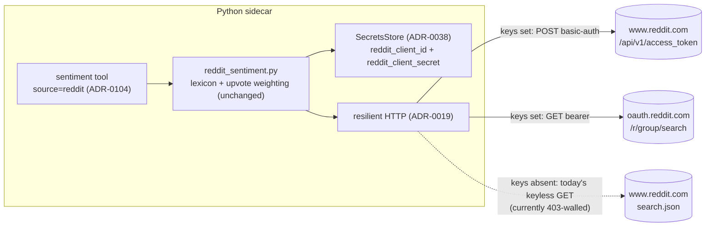

# 0111 — Reddit OAuth access path

> **Status:** approved (user picked the keyed-OAuth option, 2026-07-16)
> **Created:** 2026-07-16
> **Owner skill(s):** dev, human
> **Related ADRs:** [0105](../adrs/0105-reddit-keyed-oauth-access-path.md) (paired, accepts at close), [0098](../adrs/0098-reddit-keyless-crowd-sentiment.md) (amended), [0038](../adrs/0038-third-party-api-key-storage.md), [0019](../adrs/0019-external-http-adapter-resilience.md), [0031](../adrs/0031-data-source-adapter-contract.md), [0104](../adrs/0104-mcp-tool-surface-granularity.md)

## TL;DR

Give the Reddit sentiment adapter a **keyed app-only OAuth path** so it can climb over the anti-bot wall that 403-blocks all keyless Reddit JSON from this machine (2026-07-16 finding — [ADR-0105](../adrs/0105-reddit-keyed-oauth-access-path.md) has the probe evidence). Two new `SecretsStore` keys (`reddit_client_id`, `reddit_client_secret`); both present → token via `client_credentials` + search via `oauth.reddit.com`; either absent → today's keyless path, byte-identical. Scoring, group, seam, and tool mode all unchanged — this is an access-path amendment, not a rework. The **credentialed live smoke is the point of the plan**: `oauth.reddit.com` served the block page to an *unauthenticated* probe, so whether a valid bearer passes is genuinely unknown; phase 2 answers it and its outcome routes back to architect either way.

## Context & problem

`sentiment(source="reddit")` (Plan 0103, closed with its live smoke deferred) returns `sample_size=0` on every live call. The investigation proved this is Reddit's IP/client-level anti-bot wall (403 + HTML block page for every keyless request shape, including a browser User-Agent), not an adapter defect — the honest-degrade is working exactly as designed, which also means the source is silently dead. ADR-0098 rejected OAuth on an assumption the evidence now contradicts; ADR-0105 reverses that rejection.

Probe facts the design leans on: the token endpoint answers with a structured JSON 401 (reachable API), while `oauth.reddit.com` without a bearer serves the block page (keyed viability unproven until tried).

## Decision

Implement ADR-0105: key-gated OAuth inside `data/adapters/reddit_sentiment.py`, following the `SecretsStore`-injection pattern the keyed adapters already use (constructor-injected store, lazy `get()` at call time — cf. `alchemy_historical_price.py`). No new dependency, no new tool, no toolset change.

## Architecture diagram

## Implementation phases

### Phase 1 — Secrets keys + keyed adapter path + tests
- **Owner skill:** dev
- **What:**
  - `persistence/secrets.py`: add `reddit_client_id` and `reddit_client_secret` to the `SecretKey` Literal and `SecretsFile` fields (env overrides `MARKET_ANALYSER_REDDIT_CLIENT_ID` / `..._SECRET` come free from the prefix convention; the settings status route picks the keys up from `KNOWN_SECRET_KEYS`).
  - `data/adapters/reddit_sentiment.py`: accept `secrets_store: SecretsStore | None = None` (constructor-injected by the default provider; `None` preserves keyless-only behavior for existing tests). At fetch time, if **both** keys are set, use the keyed path: obtain an app-only token (`POST https://www.reddit.com/api/v1/access_token`, HTTP Basic `client_id:client_secret`, body `grant_type=client_credentials`, descriptive User-Agent kept), cache `(token, expires_at)` on the instance with a ~60s expiry margin, then `GET https://oauth.reddit.com/r/{group}/search` with the **same params, window filter, lexicon, and upvote weighting** plus `Authorization: bearer <token>`. On a 401 from the search, refresh the token once and retry; any further failure (token or search) degrades to the existing honest-empty. If either key is absent, run today's keyless path untouched.
  - Secret hygiene: the Basic/bearer headers ride `headers=` (already excluded from the response-cache key and from failure logs, which are path-only); token responses must not enter the shared TTL response cache (fetch the token with caching disabled — e.g. a `cache_ttl_seconds=0` client or an explicit bypass).
  - Tests (transport-seam monkeypatch, per the adapter's existing suite): no-key → keyless URL unchanged; keyed → basic-auth token POST then bearer GET on the oauth host with identical search params; expiry → re-auth; search-401 → exactly one refresh-and-retry; token failure → honest-empty; secrets never appear in logs or cache keys.
  - Docs: the `sentiment` tool description currently says the reddit source is "keyless" — update the wording to "keyless, or keyed OAuth when configured" and **regenerate** the API reference (`apiref` in-process, per Plan 0070 — never hand-edit generated docs).
- **Done when:** `uv run pytest` green; with no keys configured the adapter's request behavior is byte-identical to today; apiref regenerated with no other diff.

### Phase 2 — Register app, configure secrets, live smoke (the de-risk gate)
- **Owner skill:** human
- **What:** Register a Reddit app at `reddit.com/prefs/apps` (type "script" is fine for `client_credentials`), put `reddit_client_id`/`reddit_client_secret` into `secrets.json` (or the env vars). Smoke: `sentiment(source="reddit", symbol="BTC", window="7d")` — **success = `sample_size > 0`**; repeat for `ETH` to confirm it isn't a one-off. Record the outcome in this plan file.
- **Done when:** either (a) the smoke passes → close ceremony accepts ADR-0105, or (b) `oauth.reddit.com` still serves the block page to a valid bearer → record the failure honestly and route back to `architect` for the ADR-0105 fallback decision (accept-degraded vs supersede-and-drop). **Both outcomes complete the phase** — the plan exists to answer the question, not to guarantee a yes.

## Risks & open questions

- **The wall may not respect bearers.** `oauth.reddit.com` block-paged an unauthenticated probe; a valid token *should* pass (that host is the documented API surface), but this is the plan's central uncertainty and phase 2 is deliberately cheap to reach.
- **Registration friction.** Reddit app creation may require a verified email / aged account; if the user has no Reddit account this stalls at phase 2 (surface early).
- **Quota:** app-only OAuth is ~100 QPM — far above our volume (one request per tool call, 5-minute TTL cache); no throttling work needed.
- **ToS posture:** app-only read of public search results through the official API surface, descriptive User-Agent kept — the compliant lane, unlike alternative E's scraping.

## What this plan does NOT do

- No `degrade_reason` diagnosability field (ADR-0105 alternative B — an independent follow-up decision for all sentiment sources).
- No user-context OAuth, no PRAW, no new dependency.
- No scoring changes (lexicon/upvote weighting stand), no per-category subreddit groups, no `top_posts` payload.
- No tool or toolset change (`sentiment(source="reddit")` mode is untouched; `EXPECTED_FULL_TOOLSET` stays 51).
- No renderer work — there is no secrets settings form; configuration is the `secrets.json`/env path used by `base_rpc_url`.
