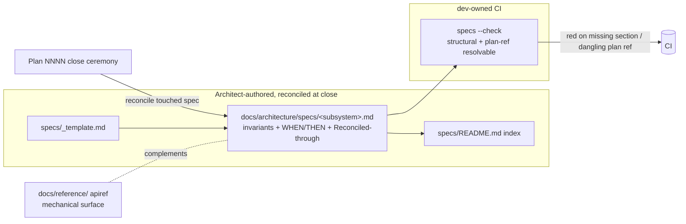

# 0112 — Living behavioral-spec layer (`docs/architecture/specs/`)

> **Status:** approved
> **Created:** 2026-07-21
> **Owner skill(s):** human (architect-authored specs), dev (freshness gate)
> **Related ADRs:** [0106-spec-system-posture-and-living-specs](../adrs/0106-spec-system-posture-and-living-specs.md) (accepts at close), [0064-generated-sidecar-api-reference](../adrs/0064-generated-sidecar-api-reference.md) (the mechanical counterpart)

## TL;DR

Add a native, low-ceremony **living-spec layer** under `docs/architecture/specs/` — one hand-authored behavioral contract per core subsystem (invariants + `WHEN/THEN` scenarios + a `Reconciled-through:` plan pointer), reconciled at each plan's close ceremony so it can't drift. This is the one idea worth borrowing from OpenSpec (ADR-0106) without adopting the tool: it closes the gap that plans (point-in-time, archived to `done/`) and apiref (mechanical params/payloads, not behavioral intent) leave open — there is no maintained "what does the system do *now*, by behavior" document. The first user-visible behavior: a reader (human or agent) opens `docs/architecture/specs/backtest-engine.md` and reads the determinism + no-lookahead contract as an enforced, current document rather than reconstructing it from a closed plan.

## Context & problem

The 2026-07-21 OpenSpec evaluation (ADR-0106) found this repo's plans + ADRs pipeline already covers proposal/design/tasks and decision-rationale better than OpenSpec would here — but it exposed one real gap: **no living behavioral-spec layer.** Plans expire (they describe what we're *about to build* and get `git mv`'d to `done/`); ADRs record *why we chose* something over alternatives; generated apiref (ADR-0064) records *mechanical surface* (params, payload shapes, source links). None of them is a continuously-maintained per-subsystem statement of *behavioral intent* — the invariants and scenarios a maintainer or agent needs to know are true of the running system today, e.g. "a backtest re-run from `spec.json` is byte-identical modulo run provenance" or "a decision at bar `i` sees only `bars[0..=i]`". Those contracts live scattered across `CLAUDE.md`, closed plans, and ADR consequences. This plan gives them one home and one freshness mechanism.

## Decision

Author behavioral specs as plain Markdown under `docs/architecture/specs/`, one file per core subsystem, each carrying invariants, `WHEN/THEN` scenarios, honest known-gaps, and a `Reconciled-through: Plan NNNN` line. Reconciliation is a new step in the architect close ceremony (the same session that flips a plan to `done/`), so a spec is refreshed exactly when the behavior it describes changes. A lightweight CI gate (a `dev`-owned check, sibling to `apiref --check`) enforces *structural* freshness — every spec has the required sections and a resolvable plan reference — while behavioral accuracy stays the architect's judgment at reconcile time. We rejected adopting OpenSpec's tooling (redundant with plans/ADRs, no ADR concept, unaware of our ceremony — ADR-0106) and rejected a status-quo do-nothing (leaves the gap the evaluation found).

## Architecture diagram



## Implementation phases

**Owner-tag note (read before Mode 4).** This plan is unusual: two of its three phases are *architect-authored documentation* (behavioral contracts, like ADRs and diagrams), which the fixed owner vocabulary (`dev`/`strategy-author`/`backtester`/`ui-builder`/`human`) does not name. We tag those phases **`human`** as the closest fit — the architect drafts each spec in a `/architect` session and the user ratifies the contract — and keep the only sibling-implementable work (the CI gate) as a clean **`dev`** phase. If the architect ecosystem later grows an `architect` owner value, these tags should move to it; until then `human` is the honest tag, not a missing one.

### Phase 1 — Pilot spec + format (walking skeleton)
- **Owner skill:** human
- **What:** Agree the spec shape and prove it on the single highest-value subsystem before building any tooling — the backtest engine's determinism + no-lookahead contract (the repo's most safety-critical behavioral claims, per the cross-cutting non-negotiables).
- **Files touched:** `docs/architecture/specs/_template.md` (the shape), `docs/architecture/specs/README.md` (one-line index + the reconcile-at-close convention), `docs/architecture/specs/backtest-engine.md` (the pilot, sourced from ADR-0018 + the `backtest/` code + `CLAUDE.md`'s determinism rules).
- **Done when:** `docs/architecture/specs/backtest-engine.md` states, as current invariants with `WHEN/THEN` scenarios, at least: (1) re-run byte-identity modulo `run_id`/`started_at`/`finished_at`, (2) trailing-only indicators / no bar-`i` access to `>i`, (3) no `set`-iteration / wall-clock / unseeded-randomness in the financially-meaningful path — each cross-linked to its governing ADR and source file, and carries a `Reconciled-through: Plan 0112` line. A reader can restate the determinism contract from this file alone without opening a closed plan.

### Phase 2 — Structural freshness gate
- **Owner skill:** dev
- **What:** A CI check (sibling to `apiref --check`) that fails when a spec is structurally stale or dangling — not a behavioral judge.
- **Files touched:** a `specs` check module + its wiring into the existing CI job and the `pnpm gen:api-docs`-adjacent tooling surface; a pytest under the api/apiref test area.
- **Done when:** running the check exits non-zero if any file in `docs/architecture/specs/` (excluding `_template.md`/`README.md`) is missing a required section (invariants, scenarios, `Reconciled-through:`) or references a `Plan NNNN` that resolves to neither `plans/` nor `plans/done/`; exits zero on the phase-1 pilot; the check is invoked in CI. The behavioral claim defended: a spec that lost its `Reconciled-through:` line, or points at a non-existent plan, turns CI red rather than passing silently.

### Phase 3 — Backfill core subsystems + amend the close ceremony
- **Owner skill:** human
- **What:** Extend coverage to the other high-value behavioral contracts and make reconciliation a standing ritual, not a one-off.
- **Files touched:** `docs/architecture/specs/data-provider.md` (the `MarketDataProvider` Protocol contract + no-lookahead-at-read, ADR-0007/0031/0032), `docs/architecture/specs/advisory-boundary.md` (the conditions-vs-calls boundary, ADR-0029 + its one carve-out), `docs/architecture/specs/mcp-tool-surface.md` (the one-verb-per-tool granularity + `EXPECTED_FULL_TOOLSET` budget, ADR-0104); an added "reconcile the touched spec(s)" step in the architect SKILL.md close-ceremony section (`.claude/skills/architect/SKILL.md`).
- **Done when:** the three additional specs exist with invariants + scenarios + resolvable `Reconciled-through:` lines (gate green), `specs/README.md` indexes all four, and the architect close-ceremony documentation names spec reconciliation as an explicit step so every future plan close keeps the layer fresh.

## Data shapes

The spec file format (illustrative — pinned by `_template.md` in phase 1):

```markdown
# Spec — <subsystem name>

> **Subsystem:** <one line>
> **Source:** src/market_analyser/<paths>  (and desktop/<paths> if renderer)
> **Reconciled-through:** Plan NNNN  (last plan whose close reconciled this file)
> **Governing ADRs:** NNNN-foo, NNNN-bar

## Invariants
- The engine MUST <behavioral guarantee>.  (ADR-NNNN)

## Scenarios
- WHEN <condition> THEN <observable behavior>.

## Known gaps / honest nulls
- <what this subsystem deliberately does not guarantee, and why>
```

## Risks & open questions

- **Risk: a spec goes behaviorally stale while staying structurally valid** — the gate checks sections and plan refs, not truth. Mitigation: reconciliation is bound to the close ceremony (the moment behavior changes) and the `Reconciled-through:` line makes lag visible; we deliberately keep the layer small (core subsystems only) so it stays maintainable. Accept that behavioral accuracy is architect judgment, not machine-checkable.
- **Risk: scope creep into a spec-per-module sprawl.** Mitigation: specs are per *subsystem behavioral contract*, not per file; if a subsystem has no non-obvious invariant, it gets no spec. Four seed specs is the intended ceiling for this plan.
- **Open question: should the gate eventually flag *content* staleness** (a spec whose `Reconciled-through:` lags the latest closed plan touching its `Source:` paths)? Deferred — phase 2 ships the structural check only; a path-aware staleness heuristic is a followup if drift proves real.
- **Open question: does the owner-tag vocabulary want an `architect` value?** This plan surfaces the tension (see the owner-tag note). Out of scope here; a vocabulary change is its own decision.

## What this plan does NOT do

- **Does not adopt OpenSpec** or any of its tooling — that call is ADR-0106; this plan builds only the borrowed concept natively.
- **Does not replace apiref** (`docs/reference/`, ADR-0064). Mechanical surface truth and behavioral-intent specs coexist.
- **Does not spec every subsystem.** Four seed contracts + the process; the rest are added lazily as plans touch them.
- **Does not add a runtime dependency** — Markdown + a small in-repo check, no npm/PyPI package.
- **Does not build cross-repo `stores`** (OpenSpec's shared-spec feature). If we ever run multiple repos sharing standards, that's a future plan referencing ADR-0106.

## Followups (after this lands)

- Consider a path-aware content-staleness heuristic in the gate (see open question).
- Evaluate whether a future greenfield repo should start from OpenSpec (ADR-0106 keeps that door open) vs. this native layer.
