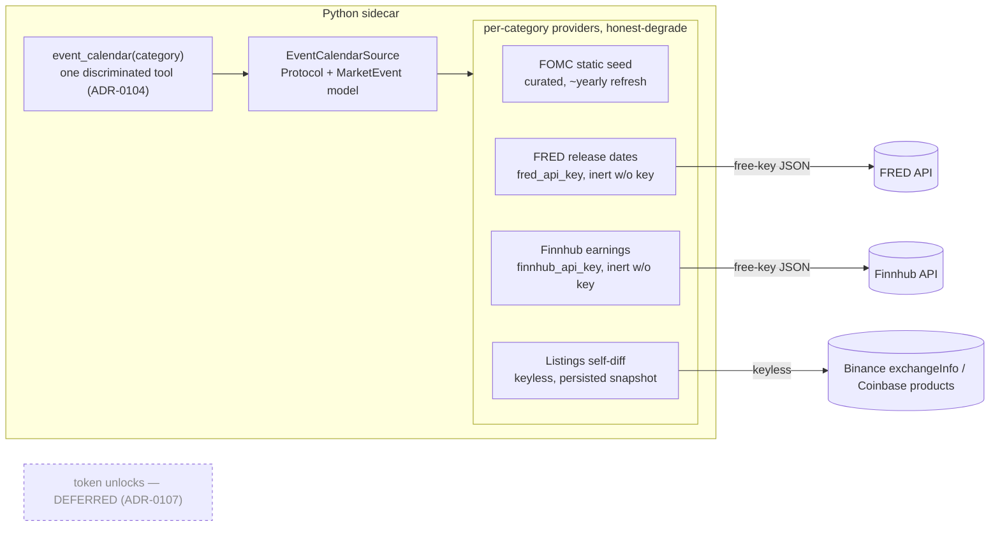

# 0113 — Event / economic calendar data source

> **Status:** in-progress
> **Created:** 2026-07-21
> **Owner skill(s):** dev (×3), human (×1 live smoke)
> **Related ADRs:** [0107-event-calendar-composed-source](../adrs/0107-event-calendar-composed-source.md) (accepts at close), [0104-mcp-tool-surface-granularity](../adrs/0104-mcp-tool-surface-granularity.md) (one-verb tool), [0038-third-party-api-key-storage](../adrs/0038-third-party-api-key-storage.md) (free keys), [0019-external-http-adapter-resilience](../adrs/0019-external-http-adapter-resilience.md) (honest-degrade), [0029-advisory-recommendation-boundary](../adrs/0029-advisory-recommendation-boundary.md) (conditions-only), [0069-crypto-first-asset-class-positioning](../adrs/0069-crypto-first-asset-class-positioning.md)

## TL;DR

Add the first Tier-5 capability: an events domain with a composed `EventCalendarSource` that answers "what scheduled events are coming" — FOMC + CPI/PCE release dates, equity earnings, and crypto listings/delistings — surfaced as one discriminated read-only `event_calendar(category=…)` MCP tool. Each provider honest-degrades independently (ADR-0019); the two free-key providers (FRED macro releases, Finnhub earnings) ship **inert without their key** (the ADR-0103/0105 pattern). Token unlocks are **deferred** (no keyless source — ADR-0107). First user-visible behavior: an agent asks `event_calendar(category="macro")` and gets the next FOMC meeting + CPI/PCE release dates in conversation.

## Context & problem

The analyst/advisor surface has no notion of scheduled forward events, and `news_for` returns nothing for on-chain-native tokens — there is no way to ask "what's coming this week". The 2026-07-21 source investigation (recorded in ADR-0107) found availability varies sharply by category: FOMC dates are curate-once static, CPI/PCE release dates and earnings are free-key (FRED, Finnhub), crypto listings are keyless-diff-only, and token unlocks are paid-only. The user chose free-keys-OK (inert without) and defer-unlocks. This plan builds the composed source and the read tool; the timeline view, alert-wiring, and corroboration/digest pieces of Tier 5 are separate follow-on plans.

## Decision

Build one `EventCalendarSource` Protocol + one `MarketEvent` model in a new `events/` (or `data/adapters/` + a thin `events` surface) area, with per-category provider adapters composed behind it, each degrading to honest-empty on miss. Ship a single `event_calendar(category)` tool per ADR-0104, conditions-only (ADR-0029), wall-clock-sensitive (no `as_of`). Free keys (`fred_api_key`, `finnhub_api_key`) resolve through `SecretsStore` (ADR-0038); absent a key, that provider is inert and the payload says so. Token unlocks are out of scope (ADR-0107, deferred). We rejected a single paid vendor (reverses keyless-first, no vendor covers all four), a live consensus/actual macro feed (no keyless source), paying for unlocks now (~$300/mo, spend paused), and folding events into the news adapter (different data shape).

## Architecture diagram



## Implementation phases

### Phase 1 — Macro calendar (walking skeleton)
- **Owner skill:** dev
- **What:** The `MarketEvent` model + `EventCalendarSource` Protocol + the `event_calendar(category="macro")` tool, backed by a curated FOMC static seed and a FRED release-dates adapter.
- **Files touched:** `src/market_analyser/events/` (models + source + `fred.py` + a `fomc_seed.py`/data file) or the established `data/adapters/` location; the tool registration under `api/mcp_tools/`; `EXPECTED_FULL_TOOLSET` +1; apiref regen.
- **Done when:** with `fred_api_key` set, `event_calendar(category="macro")` returns upcoming FOMC meeting dates (from the seed) plus CPI/PCE release dates (FRED, `file_type=json`), each a `MarketEvent` with `scheduled_at` + `source` + an honest `note`; **without the key**, it returns FOMC-only with a note that FRED is unconfigured (proven inert — zero requests). A fixture pins the FRED field mapping and the no-key inert path; conditions-only asserted (no call/action/signal key) at model and serialized-wire level.

### Phase 2 — Earnings (Finnhub, free-key inert)
- **Owner skill:** dev
- **What:** A Finnhub earnings-calendar adapter folded into the source as `category="earnings"`.
- **Files touched:** `events/finnhub.py` (or `data/adapters/`); tool handler gains the `earnings` category + an optional `symbol`/window; secrets key `finnhub_api_key`; apiref regen (no toolset bump — same verb).
- **Done when:** with `finnhub_api_key` set, `event_calendar(category="earnings", symbol="TSLA")` (and a window form) returns upcoming earnings as `MarketEvent`s with `scheduled_at` + EPS/revenue estimate fields where present, degrading fields it can't read on the free tier; **without the key**, honest-empty with a note (inert, zero requests). A fixture pins the field mapping (incl. a partial/estimate-gated row) and the inert path; conditions-only asserted.

### Phase 3 — Crypto listings/delistings (keyless self-diff)
- **Owner skill:** dev
- **What:** A keyless provider that diffs the current Binance `exchangeInfo` + Coinbase product set against a persisted prior snapshot and emits one event per tradeable add/remove.
- **Files touched:** `events/listings_diff.py`; a small snapshot persistence (**adds a migration → serialize, do not worktree-parallel**, per the plans-index rule); tool handler gains `category="listings"`; apiref regen.
- **Done when:** given two successive snapshots differing by one symbol, the provider emits exactly one `listing` and one `delisting` `MarketEvent` with the symbol, venue, and detection time; a **cold start (no prior snapshot) emits nothing and records the baseline** (by design, asserted); the payload carries an explicit note that forward announcements and forks/upgrades are **not** covered (ADR-0107 honest-incompleteness). Diff logic unit-pinned on fixture snapshots (no live fetch in the test).

### Phase 4 — Live smoke
- **Owner skill:** human
- **What:** Verify the free-key providers against real keys and confirm inert-without-key on a clean environment.
- **Files touched:** none (a `runs/` smoke note).
- **Done when:** with real `fred_api_key` + `finnhub_api_key`, `event_calendar` returns plausible upcoming FOMC/CPI/PCE + earnings for a watched symbol; on a fresh env with no keys, macro returns FOMC-only and earnings returns honest-empty (both with notes); the listings diff detects a real add/remove across two runs (or is confirmed baseline-then-quiet). Recorded in `runs/`.

## Data shapes

```python
# illustrative — not the final interface
class MarketEvent(BaseModel):
    category: Literal["macro", "earnings", "listings"]  # unlocks deferred (ADR-0107)
    title: str                       # "FOMC meeting", "TSLA earnings", "TOKEN listed on Binance"
    symbol: str | None               # equity/crypto symbol where applicable
    scheduled_at: datetime           # the event's date/time (UTC); listings use detection time
    magnitude: float | None          # e.g. EPS estimate; None where not applicable
    source: str                      # "fred" | "fomc_seed" | "finnhub" | "binance" | "coinbase"
    note: str | None                 # honest coverage caveat / degrade reason
```

## Risks & open questions

- **Risk: free-tier field gating (Finnhub).** Some estimate fields / non-US coverage are premium. Mitigation: validate against a real key in phase 2, degrade unreadable fields to `None` rather than failing the call.
- **Risk: FRED returns XML by default.** Mitigation: always pass `file_type=json`; pin it in the fixture.
- **Risk: listings-diff cold start.** The first run has no prior snapshot, so it can only baseline, not detect. This is by design (asserted in phase 3) — surface it in the note, don't pretend day-1 completeness.
- **Risk: curated FOMC seed drift.** Mitigation: the seed is a small dated table with a "refresh when the Fed publishes" chore note; ~yearly cadence keeps the burden bounded.
- **Open question: alert-wiring cadence.** Wiring events into the dwell scheduler + OS notifications ("FOMC in 2 days") is high-value but is a follow-on (keeps this plan a clean read-only data source). Deferred.

## What this plan does NOT do

- **Token unlocks** — deferred (ADR-0107); no keyless source, spend paused. A separate follow-on plan if/when a spend-or-scrape decision is made.
- **Live macro consensus/actual numbers** — dates only for v1 (ADR-0107 Alternative B).
- **The per-symbol timeline view** — a separate Tier-5 `ui-builder` plan (fuses events + news + sentiment + price).
- **Alert-wiring / OS notifications for events** — follow-on, reusing ADR-0055/0093/0094.
- **News corroboration/dedup and the agent-curated digest** — later Tier-5 plans.
- **A UI surface** — this plan ships the source + agent-callable tool only; the view is a follow-on.

## Followups (after this lands)

- Token-unlocks spend/scrape decision (its own plan) — the deferred category.
- Event alert-wiring into the dwell scheduler + OS notifications.
- Per-symbol timeline view (`ui-builder`).
- Earnings across the full watchlist (batch/window form) if the single-symbol form proves useful.
