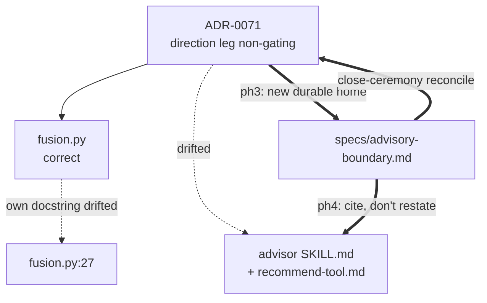

# 0114 — Fusion gate doc conformance: bring the advisor's documented contract back to ADR-0071

> **Status:** draft
> **Created:** 2026-09-04
> **Owner skill(s):** dev, architect, skill-creator
> **Related ADRs:** [0071](../adrs/0071-non-directional-forecasts-non-voting.md) (the decision the docs drifted from — direction leg demoted to non-gating, non-directional forecasts non-voting), [0029](../adrs/0029-advisory-recommendation-boundary.md) (the fuse contract ADR-0071 amends), [0070](../adrs/0070-non-directional-forecast-targets.md) (why the direction leg has near-absent edge), [0106](../adrs/0106-spec-system-posture-and-living-specs.md) (the living-spec layer this plan extends)

## TL;DR

The code implements ADR-0071 correctly; five documentation sites still describe the **pre-ADR-0071** contract — that a directional call requires the forecast's argmax to agree, and that `conviction = P(direction) × edge` unconditionally. Two of those sites are the `advisor` skill's own always-loaded `SKILL.md`; one is the module docstring of `fusion.py` itself. Separately, and worse: the **demoted conviction branch — the one that fires in production almost every run — has no test.** This plan corrects the five sites, pins the untested branch, and gives the fusion gate contract a durable home in `specs/advisory-boundary.md` so the drift cannot silently recur. No new ADR: ADR-0071 already made this decision and remains accurate.

## Context & problem

Surfaced 2026-09-04 by a live 9-strategy `recommend` sweep on BTC-USD 1d (`runs/advice/sweep/2026-09-04T100500Z-BTC-USD/`). Every call returned `reason.direction_leg_nongating` with `skill_margin 0.000`, and conviction came back equal to each strategy's walk-forward `sharpe_mean` — `ichimoku` reporting a conviction of `1.0000` that contains **no forecast probability at all**. An agent reading the advisor skill's documented formula would narrate that as near-certainty. That is a live misreading risk, not a cosmetic docs nit.

Verified current state:

- **Code is correct.** `_direction_leg_gating` ([`fusion.py:125`](../../../src/market_analyser/advisor/fusion.py)) returns `edge_margin is not None and edge_margin >= DIRECTION_SKILL_MARGIN` (`0.02`, `fusion.py:96`); the blocker filter at `fusion.py:611` counts only `c.gating` checks; conviction at `fusion.py:909-911` is `directional_prob * edge_factor if directional_prob is not None else edge_factor`, then dampened by the non-voting regime factor.
- **ADR-0071 is correct and accepted.** It states the demotion, the threshold-as-tuning-knob, and that it amends ADR-0029. Nothing to supersede.
- **Five drift sites**, all asserting the superseded contract:

  | Site | Claim that is now wrong |
  |---|---|
  | `.claude/skills/advisor/SKILL.md:29` | "requires **every** leg to agree… the forecast's argmax direction" |
  | `.claude/skills/advisor/SKILL.md:30` | `P(direction) × clamp(sharpe_mean / 1.0, 0, 1)` stated unconditionally |
  | `references/recommend-tool.md:46` | argmax listed as gating requirement #1 of 3 |
  | `references/recommend-tool.md:64` | the same unconditional formula |
  | `references/recommend-tool.md:67` | "say the factors, not just the product" — impossible on the demoted path |
  | `src/market_analyser/advisor/fusion.py:27` | module docstring of the source-of-truth file states the unconditional product |

- **Test-coverage gap on the default path.** The demotion *gate* is well pinned (`test_fusion.py:519` just-below-threshold, `:547` demoted-disagreement-no-longer-vetoes, `:562` determinism; `test_recommend_tool.py:377` no-edge-is-demoted-not-a-veto). The demoted *conviction* is not: every conviction test (`test_fusion.py:352-378`) drives the helper with a shipped `prob_up`, i.e. the gating path only. `test_conviction_is_the_documented_product` (`:373`) asserts `0.60 × 0.5 == 0.30` — true, but only on that path, and its name reinforces the stale claim. Nothing fails if the `else edge_factor` branch regresses to using `P` unconditionally.

**Root cause of the drift.** The fusion gate contract has no home in the living-spec layer. `specs/advisory-boundary.md` scopes itself to *who may recommend* (ADR-0029's carve-out and its three containment rules) and says nothing about gate mechanics, so the skill docs became the de-facto reference — and skill files are outside the close-ceremony reconcile step ([ADR-0106](../adrs/0106-spec-system-posture-and-living-specs.md)). Fixing only the prose leaves that hole open.

## Decision

Correct all five sites to the ADR-0071 contract, pin the demoted conviction branch with a test that fails against the pre-ADR-0071 formula, and add the gate contract as invariants to `specs/advisory-boundary.md` (with ADR-0071 added to its `Governing ADRs` and `Reconciled-through:` bumped to 0114). The spec is the durable home; the skill docs then cite it rather than restating it, so the next amendment to the gate has exactly one place to land and the close-ceremony reconcile step covers it.

Rejected: **superseding ADR-0071** (nothing about the decision is wrong — only its downstream description); **deleting the conviction formula from the skill docs entirely** (the advisor skill must narrate conviction honestly, so it needs the contract, just the correct one); **treating this as a plain bug-fix commit with no plan** (it spans three owner skills and carries a test deliverable, which is exactly what the phase/owner protocol exists for).

## Implementation phases

### Phase 1 — Correct the `fusion.py` module docstring
**Owner skill:** `dev`

Rewrite the conviction paragraph at `src/market_analyser/advisor/fusion.py:20-33` to state both branches: `P(direction) × edge_credit` when the direction leg gates, `edge_credit` alone when it is demoted with no shipped probability, each then scaled by the non-voting regime factor. Cross-reference ADR-0071 inline as the surrounding comments already do.

**Done when:** the docstring names the demoted branch; no code change in this phase; `pytest tests/advisor/` green.

### Phase 2 — Pin the demoted conviction branch
**Owner skill:** `dev`

Add to `tests/advisor/test_fusion.py`: a conviction test driving the demoted path (a forecast with `edge_margin` below `DIRECTION_SKILL_MARGIN` and `prob_up`/`prob_down` `None`) asserting `conviction == pytest.approx(edge_credit × regime_factor)` — i.e. that it equals the clamped `sharpe_mean` when the regime factor is neutral. Rename `test_conviction_is_the_documented_product` to name the gating path explicitly so the two branches read as a pair.

**Done when:** the new test **fails** if `fusion.py:909-911` is mutated to apply `P` unconditionally (verify by temporary local mutation, revert before commit); full `pytest` green.

### Phase 3 — Give the gate contract a durable home in the living spec
**Owner skill:** `architect`

In `docs/architecture/specs/advisory-boundary.md`: add ADR-0071 to `Governing ADRs`; add two invariants under **Invariants** — (a) a directional call requires the *voting* legs to agree, with the direction leg voting only when its out-of-sample skill margin clears the pinned threshold, and (b) conviction is derived from the forecast probability of the called direction **when one is shipped** times the walk-forward edge credit, scaled by the non-voting regime factor, and never invented or rounded up; add a scenario covering the demoted path. Bump `Reconciled-through:` to Plan 0114.

**Done when:** `pnpm specs:check` passes; the spec states the contract the code implements.

### Phase 4 — Correct the advisor skill docs
**Owner skill:** `skill-creator`

Fix `SKILL.md:29-30` and `references/recommend-tool.md:46,64,67` to the ADR-0071 contract, each pointing at `docs/architecture/specs/advisory-boundary.md` as the durable source rather than restating mechanics. `recommend-tool.md`'s "How the verdict is decided" list must distinguish gating from non-gating checks, and its conviction section must tell the narrating agent to say **which** branch produced the number — the live failure mode this plan came from.

**Done when:** no occurrence of the unconditional formula or of argmax-as-gate remains under `.claude/skills/advisor/`; a re-read of the sweep artifact's numbers against the corrected docs reproduces the correct reading.

## Architecture diagram

## Risks & open questions

- **The threshold is a tuning knob, not a law.** ADR-0071 flags `DIRECTION_SKILL_MARGIN = 0.02` as a constant that can be set wrong. This plan documents the *shape*; it does not revisit the value. If the value is ever retuned, the spec invariant (phase 3) should state the threshold by name, not by number, so it does not become a sixth drift site — write it as "the pinned threshold" and let the code carry the constant.
- **Skill files sit outside the specs gate.** `specs --check` enforces structure on `docs/architecture/specs/`, not on `.claude/skills/`. Phase 4's correctness is human/review-enforced. A future plan could add a cheap grep gate for superseded-contract phrasing in skill docs; deliberately out of scope here.
- **Open:** whether `specs/advisory-boundary.md` should absorb *all* fusion mechanics (levels geometry, sizing, the blocker vocabulary) or only the gate + conviction contract. This plan takes the narrow read — only what drifted — to avoid a spec that duplicates `fusion.py`.

## What this plan does NOT do

- **No behavior change.** Not one line of `fusion.py` logic is touched; phase 1 is a docstring, phase 2 is a test. If any phase changes a `Recommendation` field, that is a defect in this plan's execution.
- **No new ADR and no supersession.** ADR-0071 stands as written.
- **No retuning of `DIRECTION_SKILL_MARGIN`.**
- **No change to the advisory boundary itself** — who may recommend, and the three containment rules, are untouched.
- **No regeneration of `docs/reference/`** — the generated apiref renders the live tool docstring, which is already correct.
