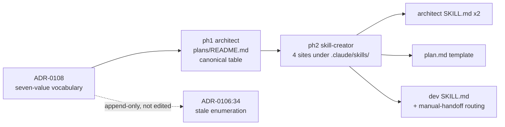

# 0115 — Roll ADR-0108's owner-skill vocabulary out across all five enumeration sites

> **Status:** draft
> **Created:** 2026-09-04
> **Owner skill(s):** architect, skill-creator
> **Related ADRs:** [0108](../adrs/0108-owner-skill-vocabulary-includes-doc-owners.md) (the decision this plan executes — accepts at close), [0106](../adrs/0106-spec-system-posture-and-living-specs.md) (recorded the same gap from the living-spec side and is left append-only)

## TL;DR

[ADR-0108](../adrs/0108-owner-skill-vocabulary-includes-doc-owners.md) extends the plan-phase owner-skill vocabulary from five values to seven, adding `architect` and `skill-creator`. The vocabulary is restated in **five places** across two directories with two different owners. This plan changes all five in one pass so the contract is stated identically everywhere. Two phases, split strictly by directory ownership. No code, no schema, no tool-surface change.

## Context & problem

Surfaced 2026-09-04 during Plan 0114: phase 3 was tagged `architect` and phase 4 `skill-creator`, both out of the five-value vocabulary. `dev` correctly refused phase 4 and escalated. ADR-0108 records the decision and its three prior occurrences; this plan is only the rollout.

The five sites, and who owns each:

| Site | Owner | What it is |
|---|---|---|
| `docs/architecture/plans/README.md` § Owner-skill vocabulary (per phase) | `architect` | the canonical bulleted table, one line per value |
| `.claude/skills/architect/SKILL.md` (Mode 1, implementation-phases bullet) | `skill-creator` | inline enumeration in the plan-authoring rules |
| `.claude/skills/architect/SKILL.md` (Mode 4, review lens 1) | `skill-creator` | inline enumeration in the in-vocabulary blocker check |
| `.claude/skills/architect/references/templates/plan.md` | `skill-creator` | the phase-owner-tags paragraph |
| `.claude/skills/dev/SKILL.md` § When a plan mixes owner skills | `skill-creator` | the vocabulary line + handoff routing table |

`docs/architecture/adrs/0106-spec-system-posture-and-living-specs.md:34` also enumerates the old five values. It is **deliberately not touched** — ADRs are append-only; ADR-0108's Notes section records that it is superseded in substance.

## Decision

Split by directory ownership, one phase each. The `plans/README.md` table is the canonical statement and lands first, so the skill-file restatements have something to be consistent *with*.

Each of the five sites gains the two new values with a one-clause gloss of what the owner covers, and — at the two sites that describe handoff routing — an explicit note that the new boundaries are **manual** (auto-handoff stays scoped to `dev` ↔ `ui-builder` per ADR-0108).

## Implementation phases

### Phase 1 — The canonical vocabulary table
**Owner skill:** `architect`

Update `docs/architecture/plans/README.md` § "Owner-skill vocabulary (per phase)": add `` `architect` `` (— `docs/architecture/`: ADRs, plans, diagrams, living specs) and `` `skill-creator` `` (— `.claude/skills/`: skill contracts and references) to the bulleted list, and note that the set is closed and why the analyst/advisor skills are not in it (they own no committed source — ADR-0108). Link ADR-0108 from the section. Also bump the Conventions next-free-ADR to 0109.

**Done when:** the table lists seven values with a gloss each; the closed-set rationale and the ADR-0108 link are present; next-free numbers are accurate.

### Phase 2 — The four skill-file restatements
**Owner skill:** `skill-creator`

Update all four `.claude/skills/` sites listed in the table above to the seven-value vocabulary, matching phase 1's wording so the restatements do not drift from the canonical table:

- `architect/SKILL.md` Mode 1 implementation-phases bullet, and Mode 4 review lens 1 (the in-vocabulary blocker check) — both enumerations.
- `architect/references/templates/plan.md` phase-owner-tags paragraph.
- `dev/SKILL.md` § "When a plan mixes owner skills": the vocabulary line, plus the routing prose — `architect` and `skill-creator` boundaries are **manual** handoffs (emit the payload and stop), not auto-handoff.

While in `dev/SKILL.md`, also make the `human`-owner and unknown-owner branches read consistently with the widened set.

**Done when:** `grep -rn "strategy-author\`, \`backtester\`, \`ui-builder\`, \`human\`" .claude/` returns nothing (no site still states the five-value set); all four files name `architect` and `skill-creator`; `dev/SKILL.md` states the new boundaries as manual.

## Architecture diagram

## Risks & open questions

- **Five prose restatements with no gate behind them.** ADR-0108 names this as its main negative. Nothing prevents a sixth site appearing, or one of the five drifting again. A cheap `grep`-based check for the five-value string could be added to the `specs --check` gate or a pre-commit hook; deliberately **out of scope** here (it would mean teaching a structural gate about skill files, which is a design question, not a rollout). Flagged for a followup if it recurs.
- **`grep` in phase 2's done-when matches an exact backticked string.** A reformatted enumeration (different spacing, different order) would slip past it. The reviewer should read all four sites, not just trust the grep — the same lesson as Plan 0114's seventh drift site, which a scoped edit missed.
- **Open:** whether `architect`-owned phases should be barred from a plan's *first* phase, so that no plan can be authored and implemented end-to-end without an implementer boundary. Not decided; no current plan needs it.

## What this plan does NOT do

- **Does not edit ADR-0106** or any other accepted ADR. Append-only.
- **Does not widen auto-handoff.** The `dev` ↔ `ui-builder` scope is unchanged; new boundaries are manual.
- **Does not add the analyst or advisor skills** to the vocabulary — ADR-0108 keeps the set closed and says why.
- **Does not add a lint/gate** for vocabulary drift (see Risks).
- **Does not retag any existing plan.** Plan 0114's `architect`/`skill-creator` tags become valid on ADR-0108's acceptance without being rewritten.
- **No code, tests, migrations, or generated docs.**
