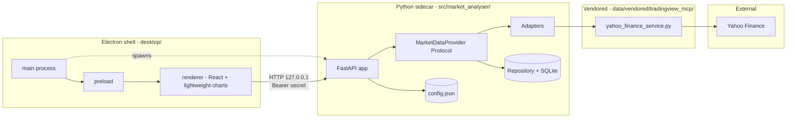
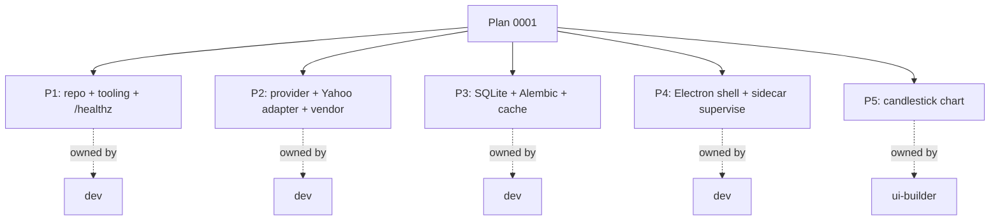

# 0001 — Bootstrap: Electron + Python sidecar walking skeleton with OHLCV chart for one symbol

> **Status:** done (closed 2026-05-18; review followups landed via [Plan 0004](0004-bootstrap-review-followups.md))
> **Created:** 2026-05-17
> **Owner skill(s):** `dev` (phases 1–4 + 4.1), `ui-builder` (phase 5)
> **Related ADRs:** [ADR-0002](../../adrs/0002-ipc-local-http.md), [ADR-0003](../../adrs/0003-vendoring-strategy.md), [ADR-0005](../../adrs/0005-desktop-shell-electron.md), [ADR-0006](../../adrs/0006-persistence-layout.md), [ADR-0007](../../adrs/0007-market-data-provider.md), [ADR-0008](../../adrs/0008-electron-shell-conventions.md)
> **Strategy / backtest scaffolding** is intentionally out of bootstrap scope; that's owned by [Plan 0002](../0002-strategy-interface.md) and a future backtest plan. See "What this plan does NOT do" below.
> **History:** This is the canonical bootstrap plan. An earlier Tauri-flavoured draft was abandoned on 2026-05-17 before any code was written; see [ADR-0001](../../adrs/0001-tauri-vs-electron.md) (superseded) for the rationale of the shell change to Electron.

## TL;DR

Stand up the empty `market-analyser` repo as an **Electron + Python-sidecar** desktop app. Vendor the minimum subset of `tradingview-mcp` needed to fetch daily OHLCV for a single symbol (Yahoo Finance), wire it through a **unified `MarketDataProvider` Protocol** with **SQLite caching** behind it, expose one HTTP endpoint, and render the result as a **candlestick chart** in the Electron renderer. End state of week one: double-click the app, see a candlestick chart for `AAPL 1d` populated from a fresh fetch on first open and from the local SQLite cache on every subsequent open. No strategies, no backtests, no screeners — just the walking skeleton that proves every architectural seam works end-to-end.

## Context & problem

The repo is at zero (`skills-lock.json` and the `.claude/` skills directory only — no source code). Before any sibling skill (`strategy-author`, `backtester`, `ui-builder`) can do useful work, six things must be locked in by code, not just by ADR:

1. **Directory layout** that survives contact with all three sibling skills (the data-layer parts; strategy/backtest layouts land in their own plans).
2. **Heavy tooling baseline** — `uv`, `ruff`, `mypy` (strict), `pytest`, `pip-audit`, pre-commit, GitHub Actions CI on push, conventional-commit enforcement, release automation scaffolding. (Per the bootstrap-rigor decision.)
3. **Vendoring boundary** — what we copy from `../tradingview-mcp` and where it sits, with the discipline from [ADR-0003](../../adrs/0003-vendoring-strategy.md).
4. **The `MarketDataProvider` Protocol** with stubs for every planned method (per [ADR-0007](../../adrs/0007-market-data-provider.md)) and one implemented method (`get_ohlcv`) for phase 2.
5. **SQLite persistence** with Alembic migrations and a `bars` table behind the provider's cache (per [ADR-0006](../../adrs/0006-persistence-layout.md)).
6. **The Electron shell** with secure renderer defaults, sidecar spawn/supervise, and a React renderer that shows a candlestick chart for `AAPL 1d`.

The walking-skeleton choice — **OHLCV chart for one symbol** rather than the BTC screener table from the abandoned Tauri-era draft — is deliberately the smallest scope that exercises every architectural seam: shell ↔ sidecar IPC, FastAPI handler, MarketDataProvider, persistence cache, vendored adapter, external HTTP. A polled screener would skip the chart and the persistence cache; a strategy or backtest would skip the chart and overshoot scope. A candlestick chart fills the gap.

This plan acknowledges a real tension and resolves it explicitly: we chose **lazy vendoring** (only vendor what each phase needs) and **a full unified provider abstraction** (the whole Protocol surface declared from day one). These reconcile by inverting the order — the Protocol is the schedule, each phase implements one method by vendoring one underlying source. The other methods raise `NotImplementedError("not implemented until phase N")` and a test asserts each method becomes callable in the phase that owns it.

## Decision

Build an **Electron** desktop shell (per [ADR-0005](../../adrs/0005-desktop-shell-electron.md)) that talks to a **local FastAPI Python sidecar** over **localhost HTTP** (per [ADR-0002](../../adrs/0002-ipc-local-http.md)) with a per-launch bearer-token shared secret. The sidecar exposes one endpoint (`GET /ohlcv`) for week one, served via a `DefaultMarketDataProvider.get_ohlcv` that dispatches to a `YahooAdapter` wrapping a freshly-vendored copy of `tradingview-mcp`'s `yahoo_finance_service.py`, with **SQLite-backed caching** keyed on `(symbol, timeframe, event_ts)`. The renderer is **React + TypeScript** rendering a candlestick chart with `lightweight-charts`. Heavy tooling — strict `mypy`, `ruff`, `pre-commit`, `pip-audit`, conventional-commit-enforced CI on every push, and a release-stub workflow — lands in phase 1.

We rejected Tauri (per ADR-0005), stdio JSON-RPC for IPC (per ADR-0002), and the "defer abstraction" approach from the abandoned Tauri-era draft (per ADR-0007). We rejected Parquet for OHLCV in phase 2 (premature; revisit when SQLite-bar reads become a measured bottleneck — see Followups).

## Architecture diagram



Full reference diagram (including the cache-hit/miss sequence and SQLite schema) lives at [bootstrap-component-map.md](../../diagrams/bootstrap-component-map.md).

## Implementation phases

Each phase is small enough to land as a single PR. Phases 1–2 are plumbing-heavy but phase 1 already produces a visible artifact (`/healthz` returns ok over authenticated HTTP), so the skeleton walks from the first PR.

### Phase 1 — Repo skeleton, heavy tooling, sidecar `/healthz`

- **Owner skill:** `dev`
- **What:** Python project layout under `src/market_analyser/`, `uv`-managed environment, strict tooling baseline, and an empty FastAPI app exposing `GET /healthz` returning `{"ok": true, "version": "0.0.1"}`. No vendored code, no persistence yet.
- **Files touched:**
  - `pyproject.toml`, `uv.lock` — package metadata; dev deps `pytest`, `ruff`, `mypy`, `pip-audit`, `pre-commit`, `commitizen`. Runtime deps minimal: `fastapi`, `uvicorn[standard]`, `pydantic`.
  - `src/market_analyser/__init__.py`, `src/market_analyser/api/__init__.py`, `src/market_analyser/api/app.py` (FastAPI factory + `/healthz` route).
  - `src/market_analyser/api/__main__.py` — uvicorn entrypoint. Reads `--port` and `--secret` from `argv`, binds to `127.0.0.1` only, sets up auth middleware that rejects every request without `Authorization: Bearer <secret>` except `/healthz`.
  - `tests/test_healthz.py` — asserts `/healthz` returns ok with and without the secret (no auth on this route by design).
  - `.github/workflows/ci.yml` — matrix on Linux + Windows, runs `ruff check`, `ruff format --check`, `mypy --strict`, `pytest --cov=src --cov-fail-under=85`, `pip-audit`.
  - `.pre-commit-config.yaml` — `ruff`, `ruff-format`, `mypy`, `commitizen` for conventional-commit messages.
  - `mypy.ini` or `[tool.mypy]` in pyproject — strict mode (`disallow_untyped_defs`, `warn_return_any`, etc.).
  - `.github/workflows/release.yml` — stub triggered on tag push (`v*.*.*`), runs build + checksum but does not yet publish. Real release wiring in a packaging plan.
  - `.gitignore`, `README.md` (one paragraph + run command), `LICENSE` (MIT, matching upstream tradingview-mcp).
- **Done when:**
  - `uv sync` succeeds on a clean checkout.
  - `uv run python -m market_analyser.api --port=0 --secret=test` prints the chosen port to stdout and `/healthz` returns 200.
  - `curl http://127.0.0.1:<port>/ohlcv` returns 401 without `Authorization: Bearer test`; returns 404 with the header (route doesn't exist yet — auth runs first).
  - All CI jobs green on a no-op PR.
  - `pre-commit run --all-files` passes.
  - Coverage gate ≥ 85 % on the trivial code that exists.

### Phase 2 — `MarketDataProvider` Protocol, Yahoo adapter, vendor `yahoo_finance_service`

- **Owner skill:** `dev`
- **What:** Declare the full Protocol with stubs, vendor the one upstream module needed for the chart, write the Yahoo adapter, wire it into a `DefaultMarketDataProvider` that returns Bars (no caching yet — that's phase 3). This is the largest phase; it locks the data-layer surface that every later phase consumes.
- **Files touched:**
  - `src/market_analyser/data/__init__.py`.
  - `src/market_analyser/data/types.py` — pydantic models: `Bar`, `Quote`, `SymbolInfo`, `ScreenerRow`, `SentimentSample`, `NewsItem`. (All planned method return types declared from day one; only `Bar` is used yet.)
  - `src/market_analyser/data/provider.py` — the `MarketDataProvider` Protocol with method signatures for `get_ohlcv`, `get_quote`, `search_symbols`, `get_screener`, `get_sentiment`, `get_news`. Each method takes `as_of: datetime | None = None` per [ADR-0007](../../adrs/0007-market-data-provider.md).
  - `src/market_analyser/data/default_provider.py` — `DefaultMarketDataProvider` class. `get_ohlcv` is implemented (delegates to the Yahoo adapter). Other methods raise `NotImplementedError("implemented in phase N — see plan 0001")`.
  - `src/market_analyser/data/adapters/__init__.py`, `src/market_analyser/data/adapters/yahoo.py` — `YahooAdapter.fetch_ohlcv(symbol, timeframe, start, end) -> list[Bar]`. Imports from the vendored module; validates inputs; defends against `None`, `NaN`, negative volumes per `best-practices.md`.
  - `src/market_analyser/data/vendored/__init__.py`, `src/market_analyser/data/vendored/tradingview_mcp/__init__.py` (header comment naming source SHA), `src/market_analyser/data/vendored/tradingview_mcp/core/services/yahoo_finance_service.py` (verbatim from upstream with only import-path rewrites). `vendored.lock` at repo root pins the commit SHA.
  - `src/market_analyser/data/vendored/tradingview_mcp/LICENSE` — upstream MIT license, unchanged.
  - `src/market_analyser/api/routes/ohlcv.py` — `GET /ohlcv?symbol=&timeframe=&start=&end=`. Returns `list[Bar]` as JSON. Calls `request.app.state.provider.get_ohlcv(...)`.
  - `tests/data/test_yahoo_adapter.py` — adapter unit tests with vendored module mocked. Asserts input-validation errors fire on `NaN` close, negative volume, malformed timestamps.
  - `tests/data/test_provider_protocol.py` — asserts every Protocol method is callable (passes) and that unimplemented methods raise `NotImplementedError` with the documented phase-N message.
  - `tests/api/test_ohlcv_route.py` — route test with a `FakeMarketDataProvider` injected.
  - `tests/network/test_yahoo_smoke.py` — `@pytest.mark.network` integration test that hits Yahoo and asserts `AAPL 1d` returns ≥ 5 bars in the last 7 days. Skipped in CI by default.
- **Done when:**
  - `curl -H "Authorization: Bearer <secret>" "http://127.0.0.1:<port>/ohlcv?symbol=AAPL&timeframe=1d&start=2026-04-01&end=2026-05-01"` returns a JSON list of Bars.
  - `mypy --strict` passes against the new `data/` package.
  - The protocol-introspection test passes for `get_ohlcv` and raises-NotImplementedError for the five stubs.
  - `vendored.lock` exists and contains the SHA we vendored from.

### Phase 3 — Persistence: SQLite + Alembic + bar-cache

- **Owner skill:** `dev`
- **What:** Add the persistence layer, run migrations on sidecar startup, and wrap the `DefaultMarketDataProvider` with a caching layer that reads from `bars` first and writes after each remote fetch. This is the phase that lets the second cold-launch of the app render the chart without hitting Yahoo.
- **Files touched:**
  - `src/market_analyser/persistence/__init__.py`, `src/market_analyser/persistence/engine.py` (SQLAlchemy engine factory; resolves `app.db` path under `%APPDATA%/market-analyser/` on Windows, XDG equivalent elsewhere).
  - `src/market_analyser/persistence/models.py` — SQLAlchemy ORM declaration for `Bar` only. Strategy/run/trade tables land in the plan that introduces them (Plan 0002 / future backtest plan), not here.
  - `src/market_analyser/persistence/repository.py` — `BarRepository.get_bars(symbol, timeframe, start, end) -> list[Bar]`, `upsert_bars(list[Bar])`. Validates that `event_ts != ingested_at` and `source` is non-empty.
  - `src/market_analyser/persistence/migrations/env.py`, `src/market_analyser/persistence/migrations/script.py.mako`, `src/market_analyser/persistence/migrations/versions/0001_bars_table.py` — single migration for the `bars` table.
  - `src/market_analyser/data/default_provider.py` — gains a `bar_repository` dependency. `get_ohlcv` becomes cache-aware (see Cache policy below).
  - `src/market_analyser/api/app.py` — startup hook runs `alembic upgrade head` before serving the first request.
  - `src/market_analyser/config.py` — pydantic `AppConfig` model, loaded from `config.json` on startup; refuses to start on validation error.
  - `tests/persistence/test_bar_repository.py` — uses in-memory SQLite, asserts upsert deduplicates on `(symbol, timeframe, event_ts)`.
  - `tests/persistence/test_migrations.py` — applies up and down for each migration against an empty DB.
  - `tests/data/test_default_provider_cache.py` — asserts cache-hit returns repository data without calling the adapter; cache-miss writes through after an adapter fetch.
- **Cache policy:** On `get_ohlcv(symbol, timeframe, start, end, as_of=None)` — if `as_of` is set, **never** call the adapter (backtest mode is read-only against cached bars; missing data is an error). Otherwise, query the repository for the requested range; for any contiguous gap, fetch from the adapter, validate, upsert with `source="yahoo"`, and return the merged result. This single rule is the anti-lookahead seam at the data layer.
- **Done when:**
  - First app launch creates `app.db`, applies migration `0001_bars_table`, and the chart populates from Yahoo.
  - Second launch (network disabled) still renders the chart from the cached `bars` rows.
  - `as_of` queries that exceed cached coverage return 422 (no silent network fetch).
  - Migration up-and-down round-trip test passes for `0001_bars_table`.

### Phase 4 — Electron shell, sidecar spawn, secure renderer defaults

Conventions referenced below (build pipeline, tsconfigs, IPC discipline, security defaults, packaging) are pinned in [ADR-0008](../../adrs/0008-electron-shell-conventions.md). This phase realizes them; the ADR is the source of truth if any concrete detail here drifts.

- **Owner skill:** `dev`
- **What:** Stand up the Electron app per ADR-0008 (esbuild for main + preload, Vite for renderer, four tsconfigs, namespaced preload, double-CSP, sandboxed renderer). Spawn the Python sidecar with a free port and a generated bearer secret, expose the auth-aware fetch helper to the renderer via `contextBridge`, and load a blank React route. No chart yet — just proven shell ↔ sidecar comms.
- **Package manager:** pnpm for the `desktop/` workspace (per ADR-0008 "Neutral" notes — faster, strict-by-default, single lockfile).
- **Concrete dependency set** (pin exact versions in phase 4 PR):
  - **Runtime:** `electron`, `react`, `react-dom`, `zod` (for IPC payload validation per ADR-0008 IPC discipline).
  - **Dev — bundlers:** `vite`, `@vitejs/plugin-react`, `esbuild`.
  - **Dev — TS / lint / format:** `typescript`, `@typescript-eslint/parser`, `@typescript-eslint/eslint-plugin`, `eslint`, `eslint-plugin-react`, `eslint-plugin-react-hooks`, `prettier`.
  - **Dev — orchestration:** `concurrently`, `wait-on`, `cross-env`.
  - **Dev — testing:** `jest`, `ts-jest`, `@types/jest`, `jest-environment-jsdom`, `@testing-library/react`, `@testing-library/jest-dom`, `playwright`.
  - **Dev — git hooks:** `husky`, `lint-staged`.
  - **Dev — packaging:** `electron-builder`.
- **Files touched:**
  - `desktop/package.json` — scripts: `dev`, `dev:debug`, `build`, `build:main`, `build:preload`, `build:renderer`, `start`, `package`, `package:{win,mac,linux}`, `test`, `test:main`, `test:all`, `test:e2e`, `lint`, `lint:fix`, `typecheck`, `prepare`. `lint-staged` config in-file. `build` (electron-builder) config in-file per ADR-0008 "Packaging".
  - `desktop/tsconfig.json`, `desktop/tsconfig.main.json`, `desktop/tsconfig.preload.json`, `desktop/tsconfig.renderer.json` — exactly as ADR-0008 prescribes.
  - `desktop/vite.config.ts` — root `desktop/renderer`, port 5173, React plugin, manualChunks for `vendor-react`.
  - `desktop/scripts/build-main.mjs`, `desktop/scripts/build-preload.mjs` — esbuild bundle scripts. Externals per ADR-0008.
  - `desktop/electron/main.ts` — `app.whenReady()` → pick free port, generate 32-byte hex secret, register `protocol.registerSchemesAsPrivileged` (empty for now), spawn `python -m market_analyser.api --port=<n> --secret=<s>`, await `/healthz` (max 10 s), then create the window via `createWindow()`. `app.on('before-quit')` sends `SIGTERM` and waits up to 3 s before `SIGKILL`. Crash supervisor: restart once, then show the fatal-error window.
  - `desktop/electron/window.ts` — `createWindow()` per ADR-0008 security defaults (`contextIsolation: true`, `nodeIntegration: false`, `sandbox: true`, `show: false` until `ready-to-show`). Also installs the double-CSP via `session.defaultSession.webRequest.onHeadersReceived` — strip incoming `content-security-policy` case-insensitively, then write ours with the `connect-src http://127.0.0.1:*` relaxation.
  - `desktop/electron/preload/index.ts` — assembles `window.api` from per-domain modules under `desktop/electron/preload/api/`; calls `contextBridge.exposeInMainWorld('api', api)`. Exports `ElectronAPI = typeof api`.
  - `desktop/electron/preload/api/app.ts` — `getInfo()`, `getSidecarPort()` (returns `{ port, secretToken }`).
  - `desktop/electron/preload/api/sidecar.ts` — `onStatus(callback)` returning a cleanup function (push-event pattern).
  - `desktop/electron/preload/api/dialog.ts`, `desktop/electron/preload/api/shell.ts` — directory picker, whitelisted external-URL opener.
  - `desktop/electron/ipc/index.ts` — `registerIpcHandlers()` composes per-domain registrars. `cleanupServices()` mirror on `before-quit`.
  - `desktop/electron/ipc/appHandlers.ts`, `desktop/electron/ipc/sidecarHandlers.ts`, `desktop/electron/ipc/dialogHandlers.ts`, `desktop/electron/ipc/shellHandlers.ts` — handler per channel, Zod-validated payloads.
  - `desktop/shared/ipc-channels.ts` — `IPC_CHANNELS` const object (channels from ADR-0008's table).
  - `desktop/shared/schemas/` — Zod schemas for every IPC payload.
  - `desktop/shared/types/` — TS interfaces shared across processes; OpenAPI-generated sidecar types land under `desktop/renderer/types/sidecar/` via `desktop/scripts/gen-types.ts`.
  - `desktop/renderer/index.html` — root HTML with the `<meta http-equiv="Content-Security-Policy">` matching the HTTP-header CSP.
  - `desktop/renderer/main.tsx`, `desktop/renderer/App.tsx` — React entry, single route, calls `window.api.getInfo()` on mount and displays "sidecar: ok".
  - `desktop/renderer/api/client.ts` — typed fetch wrapper. Reads `{port, secretToken}` from `window.api.getSidecarPort()` on first call; injects `Authorization: Bearer <secret>` and base URL.
  - `desktop/renderer/types/global.d.ts` — `declare global { interface Window { api: ElectronAPI } }`.
  - `desktop/.eslintrc.json`, `desktop/.prettierrc.json` — flat ESLint config + Prettier defaults per ADR-0008.
  - `desktop/jest.config.ts`, `desktop/jest.config.main.ts` — two-config split per ADR-0008.
  - `.husky/pre-commit` (`lint-staged && yarn typecheck` equivalent for pnpm: `pnpm --filter desktop lint-staged && pnpm --filter desktop typecheck`).
  - `.husky/pre-push` (`pnpm --filter desktop test:all && uv run pytest` — combined TS + Python gate).
  - `desktop/tests/security.spec.ts` — Playwright e2e: asserts `window.require` is undefined; renderer-side `fetch('https://example.com')` is blocked by CSP; `fetch` to the sidecar succeeds with the injected bearer.
  - `desktop/tests/sidecar-supervisor.spec.ts` — Playwright e2e: kills sidecar PID once → supervisor restarts; kills again → fatal-error window visible.
- **Done when:**
  - `pnpm --filter desktop dev` opens a window. DevTools shows "sidecar: ok" within 10 s of cold start.
  - `pnpm --filter desktop typecheck` runs all four tsconfigs cleanly.
  - `pnpm --filter desktop test` and `test:main` pass; the security and supervisor e2e specs are green.
  - Killing the sidecar process by PID causes the supervisor to restart it once; killing it again shows the fatal-error window.
  - Closing the window terminates the sidecar within 3 s.
  - `pnpm --filter desktop package:win` produces an installer in `desktop/release/` (smoke-test the artifact opens, does not need to install).

### Phase 4.1 — e2e renderer load-path gap (followup)

Discovered during phase-4 implementation. `desktop/electron/main.ts:23` derives `isDev = !app.isPackaged`, then `desktop/electron/window.ts:76-80` calls `loadURL("http://localhost:5173")` when `isDev` is true. Playwright's `_electron.launch({ args: [...index.cjs] })` is not packaged, so the renderer reaches for a Vite dev server the test runner never starts, yielding `chrome-error://chromewebdata/`. All four e2e specs (the two phase-4 specs and the two phase-5 specs) are blocked until this is fixed.

The fix replaces the implicit "not packaged ⇒ Vite is up" assumption with an explicit env-var signal, per [ADR-0008](../../adrs/0008-electron-shell-conventions.md) Notes (env-var contract). Tests then exercise the production `loadFile(dist/renderer/index.html)` path — closer parity with what packaged users get, and no dev-server-in-CI flake.

- **Owner skill:** `dev`
- **Why not a new plan:** scope is one branch flip plus a Playwright `globalSetup`; the architectural decision (env-var, not `NODE_ENV`, not `isPackaged`) is settled in ADR-0008.
- **Files touched:**
  - `desktop/electron/main.ts` — read `process.env.ELECTRON_RENDERER_URL` and pass it through to `createWindow`. `isDev = !app.isPackaged` stays, but it is used **only** for the CSP dev-mode relaxation, not for the renderer source.
  - `desktop/electron/window.ts` — `createWindow` accepts an optional `rendererUrl?: string`; branches on its presence (`loadURL(rendererUrl)` if set, `loadFile(rendererFile)` if not). Same-origin check in `will-navigate` widens to "starts with `rendererUrl`" when set.
  - `desktop/package.json` — `dev` script sets `ELECTRON_RENDERER_URL=http://localhost:5173` via `cross-env` before invoking Electron. Confirms ADR-0008's stated dev-mode loader behaviour.
  - `desktop/playwright.config.ts` — add `globalSetup` so `pnpm test:e2e` is self-contained.
  - `desktop/scripts/playwright-global-setup.mjs` (new) — runs `pnpm build` via `child_process.spawnSync` so `dist/{main,preload,renderer}/` exist. The script must **not** set `ELECTRON_RENDERER_URL` — its absence is precisely the signal that selects the `loadFile` branch.
  - `desktop/electron/sidecar.ts` — venv-python autodetect, added mid-session under user approval. Bare `python` on Windows resolves to the WindowsApps shim (no project deps), which makes the sidecar exit with `ModuleNotFoundError` before the supervisor's PORT-line wait can succeed. New `resolvePythonExecutable(repoRoot)` helper picks in order: `$MARKET_ANALYSER_PYTHON` (explicit override) → `<repo>/.venv/{Scripts/python.exe | bin/python}` (uv venv autodetect) → bare `python` fallback. This whole spawn path is rewritten again by [Plan 0004](0004-bootstrap-review-followups.md) phase 3 (move secret out of argv); the resolution helper carries forward intact.
- **Done when:**
  - `pnpm --filter desktop test:e2e` is green standalone (globalSetup builds idempotently). Three of the four specs pass (security ×2, supervisor). The fourth — `ohlcv-view.spec.ts` — is newly runnable after this phase but fails on a phase-5 state-coverage gap (empty state has no testable affordance); routed to [Plan 0004](0004-bootstrap-review-followups.md) phase 7 (`ui-builder`), not a phase-4.1 blocker.
  - `pnpm --filter desktop dev` still loads the renderer from `http://localhost:5173` (manual smoke; HMR works).
  - Packaged build still loads `dist/renderer/index.html` (no regression — `ELECTRON_RENDERER_URL` is unset and `app.isPackaged === true`, so the file branch is taken).
  - `isDev` no longer governs the renderer source; the only remaining use of `app.isPackaged` for renderer behaviour is the CSP dev-mode `'unsafe-inline'` relaxation.
  - The phase-4 done-when bullet "the security and supervisor e2e specs are green" is now satisfied (it was pending this fix).

### Phase 5 — Candlestick chart for one symbol

- **Owner skill:** `ui-builder`
- **What:** Render the OHLCV data for `AAPL 1d` as a candlestick chart using `lightweight-charts`. One controlled symbol input (defaults to `AAPL`), one timeframe selector (defaults to `1d`), a "refresh" button. No watchlist, no multi-symbol, no overlays.
- **Files touched:**
  - `desktop/renderer/components/CandlestickChart.tsx` — wraps `lightweight-charts`, receives `bars: Bar[]`, handles resize and disposal.
  - `desktop/renderer/components/SymbolPicker.tsx` — controlled input + timeframe dropdown.
  - `desktop/renderer/components/OhlcvView.tsx` — composes the above; uses React Query (or a small ad-hoc hook) to call `window.api.getOhlcv` and renders loading / error / empty / populated states.
  - `desktop/renderer/App.tsx` — point the single route at `OhlcvView`.
  - `desktop/renderer/styles.css` — minimum legibility; visuals are not part of the bootstrap.
  - `desktop/tests/ohlcv-view.spec.ts` — Playwright e2e: launch app, wait for chart canvas, assert ≥ 1 candle is drawn for the default symbol.
- **Done when:**
  - Cold launch → window with chart populated for `AAPL 1d`.
  - Change symbol to `MSFT` → chart re-renders with `MSFT` bars.
  - Disconnect network and reload → chart still renders from cached bars.
  - Disconnect network *and* request a date range outside the cache → error state visible (no infinite spinner, no crash).
  - e2e test green in CI.



The bootstrap intentionally ships **no** `strategies/`, `backtest/`, or `contracts/strategy.py` modules — those land under [Plan 0002](../0002-strategy-interface.md). A `dev` agent picking up the bootstrap will not create those directories; the first plan that touches them is Plan 0002 phase 1.

## Directory layout (target state at end of bootstrap)

```
market-analyser/
├── pyproject.toml
├── uv.lock
├── vendored.lock                       # upstream tradingview-mcp commit SHA
├── .env.example
├── .gitignore
├── .pre-commit-config.yaml
├── README.md
├── LICENSE
├── .github/
│   └── workflows/
│       ├── ci.yml                      # ruff, mypy --strict, pytest, pip-audit
│       └── release.yml                 # tag-triggered build stub
├── docs/
│   └── architecture/                   # plans, ADRs, diagrams
├── desktop/                            # Electron + React shell (per ADR-0005)
│   ├── package.json
│   ├── tsconfig.json
│   ├── vite.config.ts
│   ├── .eslintrc.cjs
│   ├── electron/
│   │   ├── main.ts
│   │   ├── preload.ts
│   │   └── security.ts
│   ├── renderer/
│   │   ├── index.html
│   │   ├── main.tsx
│   │   ├── App.tsx
│   │   ├── api/
│   │   │   └── client.ts
│   │   └── components/
│   │       ├── CandlestickChart.tsx
│   │       ├── SymbolPicker.tsx
│   │       └── OhlcvView.tsx
│   ├── scripts/
│   │   └── gen-types.ts
│   └── tests/
│       ├── security.spec.ts
│       └── ohlcv-view.spec.ts
├── src/
│   └── market_analyser/
│       ├── __init__.py
│       ├── config.py
│       ├── api/
│       │   ├── __init__.py
│       │   ├── __main__.py
│       │   ├── app.py
│       │   └── routes/
│       │       └── ohlcv.py
│       ├── data/
│       │   ├── __init__.py
│       │   ├── types.py
│       │   ├── provider.py             # MarketDataProvider Protocol (ADR-0007)
│       │   ├── default_provider.py     # cache-aware dispatch
│       │   ├── adapters/
│       │   │   ├── __init__.py
│       │   │   └── yahoo.py
│       │   └── vendored/
│       │       ├── __init__.py
│       │       └── tradingview_mcp/
│       │           ├── __init__.py
│       │           ├── LICENSE
│       │           └── core/
│       │               └── services/
│       │                   └── yahoo_finance_service.py
│       ├── persistence/
│       │   ├── __init__.py
│       │   ├── engine.py
│       │   ├── models.py
│       │   ├── repository.py
│       │   └── migrations/
│       │       ├── env.py
│       │       ├── script.py.mako
│       │       └── versions/
│       │           └── 0001_bars_table.py
└── tests/
    ├── test_healthz.py
    ├── api/
    │   └── test_ohlcv_route.py
    ├── data/
    │   ├── test_yahoo_adapter.py
    │   ├── test_provider_protocol.py
    │   └── test_default_provider_cache.py
    ├── persistence/
    │   ├── test_bar_repository.py
    │   └── test_migrations.py
    └── network/
        └── test_yahoo_smoke.py         # @pytest.mark.network — skipped in CI
```

No strategy or backtest packages exist at end of bootstrap. The first plan to create them is [Plan 0002](../0002-strategy-interface.md); a future backtest plan creates `src/market_analyser/backtest/`.

## Vendoring manifest (phase 2)

Copy exactly one file from `../tradingview-mcp/src/tradingview_mcp/` into `src/market_analyser/data/vendored/tradingview_mcp/`, preserving directory structure. Everything else stays out until a later plan calls for it (lazy vendoring per the bootstrap rigor choice).

| Upstream path                                | Why we need it now                                        |
|----------------------------------------------|-----------------------------------------------------------|
| `core/services/yahoo_finance_service.py`     | Sole source of OHLCV for the bootstrap chart.             |

If `yahoo_finance_service.py` imports `core/types.py` or `core/utils/validators.py` transitively at runtime, those come in too — the manifest is a starting point, not a hard cap. The PR description must list any transitive additions.

**Vendoring discipline** (per [ADR-0003](../../adrs/0003-vendoring-strategy.md)):
- Every vendored file gets a one-line header: `# Vendored from tradingview-mcp@<sha> path/to/file.py — see ADR-0003.`
- Imports rewritten to the new package path; no other edits on copy.
- The `vendored.lock` file at repo root pins the upstream SHA.
- A `scripts/check-vendor-drift.py` is a followup (not in scope this plan); the discipline is honour-system until then.

Explicitly **not vendored this week** (with the phase that earns each, when known):
- `screener_service.py` + dependencies — earned by the first plan that adds a screener UI.
- `backtest_service.py` — earned by the backtester plan.
- `sentiment_service.py`, `news_service.py` — earned when a sentiment UI exists.
- `bitcoin_market_service.py`, `egx_service.py`, `extended_hours_service.py`, `scanner_service.py`, `multi_agent_service.py`, `proxy_manager.py`, `coinlist.py`, `indicators*.py` — out of scope; bring in when a phase needs them.
- `portfolio.py` — paper-trading layer, not relevant pre-strategies.
- `server.py` — MCP entrypoint, never vendored.

## Data shapes

Shared by sidecar and renderer. Pinned in `src/market_analyser/data/types.py`; TypeScript types are generated from the sidecar's OpenAPI by `desktop/scripts/gen-types.ts`. Strategy-side shapes (`Signal`, `StrategyMeta`, `StrategyProtocol`) are **out of scope for the bootstrap** — they land in [Plan 0002](../0002-strategy-interface.md) under `src/market_analyser/contracts/strategy.py`. The single canonical `Bar` model lives in `data/types.py`; Plan 0002 imports it from there.

```python
# illustrative — final shape is owned by data/types.py
from datetime import datetime
from pydantic import BaseModel, Field

class Bar(BaseModel):
    symbol: str
    timeframe: str          # "1m" | "5m" | "1h" | "1d" | ...
    event_ts: datetime      # UTC; the time the bar represents
    open: float
    high: float
    low: float
    close: float
    volume: float = Field(ge=0)
    source: str             # "yahoo" for phase 2

class Quote(BaseModel):
    symbol: str
    price: float
    as_of: datetime
    source: str
```

The Provider Protocol surface (declared upfront with `NotImplementedError` stubs in phase 2; methods filled in by later phases and plans):

```python
# illustrative
from datetime import datetime
from typing import Protocol, Sequence

class MarketDataProvider(Protocol):
    def get_ohlcv(self, symbol: str, timeframe: str,
                  start: datetime, end: datetime,
                  as_of: datetime | None = None) -> Sequence[Bar]: ...

    def get_quote(self, symbol: str,
                  as_of: datetime | None = None) -> Quote: ...

    def search_symbols(self, query: str,
                       as_of: datetime | None = None) -> Sequence[SymbolInfo]: ...

    def get_screener(self, filters: ScreenerFilters,
                     as_of: datetime | None = None) -> Sequence[ScreenerRow]: ...

    def get_sentiment(self, symbol: str,
                      window: str,
                      as_of: datetime | None = None) -> SentimentSample: ...

    def get_news(self, symbol: str,
                 window: str,
                 as_of: datetime | None = None) -> Sequence[NewsItem]: ...
```

## Risks & open questions

- **Risk: Yahoo Finance rate-limits or blocks the unauthenticated `yfinance` path.** `yahoo_finance_service.py` in tradingview-mcp uses the public path; if Yahoo tightens limits during the bootstrap, the chart breaks. Mitigation: cache hits cover the common case after the first fetch; the smoke test is `@pytest.mark.network` and won't break CI. If it becomes a recurring failure, the followup is to add a paid data source behind a new adapter, not to patch the vendored code.
- **Risk: `lightweight-charts` doesn't quite render our bar shape.** It expects `{ time, open, high, low, close }` with seconds-precision time. Mitigation: a thin adapter function in `desktop/renderer/api/client.ts` maps `Bar` to the chart's expected shape; tests cover the edge cases (Unix-epoch vs ISO, intra-bar timestamps).
- **Risk: `mypy --strict` is harsh and may slow phase authoring.** Mitigation: accepted by the bootstrap-rigor choice; we pay this cost upfront rather than retrofit. Pragmatic relaxations (`Any` in test fixtures only) are allowed via per-file overrides.
- **Risk: Alembic migration applied at sidecar startup vs separately is a real fork.** We chose "at startup" for the bootstrap — simpler. The cost is that a broken migration locks the user out of their own data with no way to recover from the UI. Mitigation: every migration has a downgrade test; the persistence repository never deletes user data outside of a migration; we surface migration errors in the fatal-error window in phase 4.
- **Risk: The `MarketDataProvider` Protocol shape is wrong.** We declare it without yet having implementations for five of its six methods. A wrong shape costs an adapter-rewrite cycle. Mitigation: ADR-0007 captures the rationale; the shape is empirical — refactor the Protocol in the phase that earns the change, write a new ADR if the change is structural.
- **Open question (resolved by [ADR-0011](../../adrs/0011-bearer-secret-transport.md), 2026-05-18):** Where does the per-launch bearer secret get written so the renderer can read it? Current decision: passed from `electron/main.ts` to the renderer via the `contextBridge` preload, never persisted to disk. The Python sidecar originally read it from `argv[--secret=...]`; Plan 0004 phase 3 switched the sidecar-bound transport to the `MARKET_ANALYSER_SECRET` env var so the secret no longer appears in process listings. See [ADR-0011](../../adrs/0011-bearer-secret-transport.md) for the rationale and alternatives considered.
- **Open question:** What's the strategy for migrations that need the user's data (e.g., backfilling `source` on existing `bars` rows after phase 3 ships)? Out of scope for the bootstrap; flagged as a followup before any second migration lands.

## Security & data-integrity checklist (per `best-practices.md`)

These are enforced by phase and must be on the PR description for the phase that owns them.

- [Phase 1] Auth middleware rejects every non-`/healthz` request without a valid bearer token. Test asserts 401 on missing/wrong token.
- [Phase 1] Sidecar binds to `127.0.0.1` only — never `0.0.0.0` or `::`.
- [Phase 2] Adapter validates: non-`None` close, finite OHLC values, `volume >= 0`, `event_ts` is UTC-aware. Bad bars raise; the provider never silently drops or zero-pads.
- [Phase 3] `event_ts` distinct from `ingested_at` on every persisted bar.
- [Phase 3] `as_of` argument in `get_ohlcv` never triggers a remote fetch (anti-lookahead seam at the data layer).
- [Phase 4] Electron `BrowserWindow` constructed with `nodeIntegration: false`, `contextIsolation: true`, `sandbox: true`, `webSecurity: true`. Test asserts `window.require` is undefined.
- [Phase 4] CSP allowlists the sidecar base URL and `'self'` only.
- [Phase 4] The bearer secret is generated fresh per launch (32-byte hex); never logged.
- [All phases] No secrets are logged. No secrets are persisted to SQLite. `.env`, `secrets.json`, and bearer tokens never appear in logs, ADRs, plans, or diagrams.

## What this plan does NOT do

Out of scope for the bootstrap. Each is intentionally cut, with the plan where it belongs.

- **Strategy authoring or backtesting.** [Plan 0002](../0002-strategy-interface.md) (owned by `strategy-author`) creates `src/market_analyser/contracts/strategy.py` and `src/market_analyser/strategies/`; a future backtest plan creates `src/market_analyser/backtest/`. The bootstrap creates none of these directories.
- **Screener UI.** The screener path is in the Provider Protocol but the method raises `NotImplementedError`. Earned by a future plan that adds a screener view.
- **Sentiment, news, BTC pulse, multi-agent.** All out — they were on the abandoned Tauri-era draft but the current walking skeleton is OHLCV-centric.
- **Live trading, paper trading, portfolio.** Out indefinitely. No `portfolio.py` vendoring.
- **Multi-symbol charts, indicator overlays, drawing tools.** Out of bootstrap; first follow-up after `ui-builder` has a baseline.
- **Auto-update, code-signing, installer packaging.** Out — covered by a future packaging plan. The release workflow stub in phase 1 is intentionally inert.
- **Cross-platform smoke test.** Develop on Windows (the user's primary OS). macOS/Linux smoke tests are a followup plan once anyone needs them.
- **`scripts/check-vendor-drift.py`.** Listed in ADR-0003 followups; honour-system until then.
- **Async sidecar.** All FastAPI handlers stay sync. Async lands when a slow endpoint forces it.

## Followups (after this lands)

- Write `scripts/check-vendor-drift.py` so vendored drift is enforced, not honour-system.
- Profile `get_ohlcv` against a synthetic million-row `bars` table; if SQLite scans become a bottleneck, write a Parquet-for-OHLCV ADR that supersedes the OHLCV part of ADR-0006.
- Add a "secrets schema and rotation" ADR before wiring any authenticated external API.
- Add a packaging plan covering Windows code-signing, `electron-updater` wiring, and the `publish` flip in `electron-builder` config (the structure for both is already in ADR-0008; only the activation is deferred).
- Add a cross-platform smoke-test workflow once a second contributor needs it.
- Add a runtime instrumentation ADR (where do we send metrics/logs in production?). Defer until there is a real "I can't tell why this is slow" pain.
- Add a migration-safety ADR before the second non-trivial migration lands (today's migrations are additive only).
- Decide whether `desktop/` lives in this repo or its own (monorepo vs split). The shared TS types argument leans monorepo; revisit only if the desktop release cadence diverges sharply from the sidecar.
