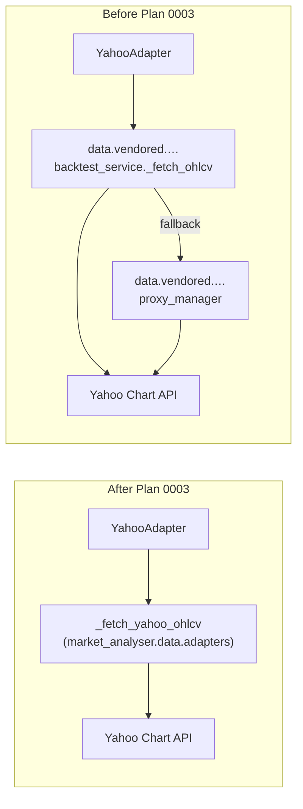

# 0003 — Excise vendored upstream and rewrite Yahoo data path

> **Status:** done
> **Created:** 2026-05-17
> **Closed:** 2026-05-19
> **Owner skill(s):** `dev`
> **Related ADRs:** [ADR-0009](../../adrs/0009-rewrite-data-layer-in-house.md) (supersedes [ADR-0003](../../adrs/0003-vendoring-strategy.md))

## TL;DR

Rewrite the Yahoo OHLCV fetch as a small in-house function in our adapter package, delete the entire `src/market_analyser/data/vendored/` tree and `vendored.lock`, and scrub every reference to the companion `tradingview-mcp` repository from source code, live docs, diagrams, skill `SKILL.md` / references, and `CLAUDE.md`. After this plan lands, the name survives only in (a) [ADR-0003](../../adrs/0003-vendoring-strategy.md) (superseded, historical), (b) [ADR-0009](../../adrs/0009-rewrite-data-layer-in-house.md) (the supersession), (c) the one-line amendment notes Phase 3 adds to [ADR-0004](../../adrs/0004-strategy-interface.md) / [ADR-0006](../../adrs/0006-persistence-layout.md) / [ADR-0007](../../adrs/0007-market-data-provider.md), (d) this plan file, (e) [Plan 0001](0001-bootstrap.md)'s "Vendoring manifest" section — grandfathered as historical record of what the bootstrap actually did, never rewritten in-place once a plan is archived in `done/`, and (f) `plans/README.md`'s active-roster row for this plan — structurally names the plan's slug + summary. End-to-end OHLCV behaviour is preserved: `GET /ohlcv` still returns the same `Bar` shape and tests pass.

## Context & problem

[ADR-0009](../../adrs/0009-rewrite-data-layer-in-house.md) reverses [ADR-0003](../../adrs/0003-vendoring-strategy.md): the companion repository will be deleted once this project is complete, so the vendoring discipline buys nothing once the upstream is gone. The decision is captured; this plan is the execution.

Concretely, three files live under `src/market_analyser/data/vendored/tradingview_mcp/core/services/`:

- `backtest_service.py` — function-level carve-out, only `_fetch_ohlcv` (~40 lines of urllib + JSON parsing against Yahoo's Chart API) is retained. The single caller is `YahooAdapter`.
- `proxy_manager.py` — Webshare rotating-proxy helper, opt-in via environment variables, dormant when env vars are unset. Imported as a fallback inside `_fetch_ohlcv`.
- `yahoo_finance_service.py` — `get_price` / `get_market_snapshot` (single-quote helpers). Currently unused by any production code path.

The Yahoo adapter at `src/market_analyser/data/adapters/yahoo.py:20-21` is the only consumer of vendored code. Once its dependency is replaced, the entire vendored tree becomes unreachable and can be deleted.

Beyond source code, the strings `tradingview-mcp` / `tradingview_mcp` / `vendored` appear across:
- ADR bodies (0003, 0004, 0006, 0007 — 0003 is superseded and kept verbatim; the others need surgical scrubs).
- Plans (0001 — bootstrap, has a "Vendoring manifest" section; 0002 — strategy interface, mentions in passing).
- Diagrams (`bootstrap-component-map.md`).
- Skills (`CLAUDE.md`, every `.claude/skills/*/SKILL.md`, every `.claude/skills/*/references/*.md`, including the entire file `strategy-author/references/porting-from-tradingview-mcp.md`).
- Architect templates (`plan.md` has a tradingview-mcp risk example; `diagram-examples.md` and `best-practices.md` reference the vendoring policy).

Each location needs a sweep to leave the repo coherent after the upstream disappears.

## Decision

Rewrite the OHLCV fetch as a small in-house function (`_fetch_yahoo_ohlcv`) co-located with the Yahoo adapter, **drop proxy support for now** (it was opt-in and off by default; restoring it is a one-line follow-up plan if Yahoo rate-limits us in production), delete the vendored tree and `vendored.lock`, then scrub references across docs and skills. Final-phase `grep` enforces the scope.

## Architecture diagram

## Implementation phases

Each phase is one commit. `dev` runs all phases in one session.

### Phase 1 — Rewrite the Yahoo OHLCV fetch in-house
- **Owner skill:** `dev`
- **What:** Add a private `_fetch_yahoo_ohlcv(symbol: str, period: str, interval: str) -> list[dict]` in a new module `src/market_analyser/data/adapters/_yahoo_fetch.py`. Same call as today (`GET https://query1.finance.yahoo.com/v8/finance/chart/{symbol}?interval={interval}&range={period}` via `urllib.request`, 15s timeout). UA header is `market-analyser/{version}` (read `__version__` from `market_analyser`). No proxy fallback. Same row shape returned (`date`, `open`, `high`, `low`, `close`, `volume`) so the parsing in `YahooAdapter` does not change. Update `YahooAdapter` to import the new function. Update the smoke test to point at the new module if it patched the vendored path.
- **Files touched:** new `src/market_analyser/data/adapters/_yahoo_fetch.py`; edit `src/market_analyser/data/adapters/yahoo.py` (replace the vendored import on lines 20–21 and 47); update relevant tests under `tests/`.
- **Done when:** the full test suite passes; `grep -rn "from market_analyser.data.vendored" src/ tests/` returns zero hits.

### Phase 2 — Delete the vendored tree and `vendored.lock`
- **Owner skill:** `dev`
- **What:** Remove `src/market_analyser/data/vendored/` entirely (the whole `tradingview_mcp` subtree plus its package `__init__.py`s). Delete `vendored.lock` at the repo root. Update `src/market_analyser/data/__init__.py` to remove the "and vendored sources" / vendored-tree wording from the docstring.
- **Files touched:** delete `src/market_analyser/data/vendored/` (recursive), delete `vendored.lock`, edit `src/market_analyser/data/__init__.py`.
- **Done when:** `grep -rn "tradingview_mcp\|vendored\.lock\|data\.vendored\|data/vendored" src/ tests/` returns zero hits; full test suite passes.

### Phase 3 — Scrub `docs/architecture/`
- **Owner skill:** `dev`
- **What:**
  - Set the `Status:` line of [ADR-0003](../../adrs/0003-vendoring-strategy.md) to `superseded by ADR-0009`. Leave the body untouched (ADRs are append-only).
  - In [ADR-0007](../../adrs/0007-market-data-provider.md): **do not rewrite the body** (it remains the canonical Protocol design). Add one front-matter line under the `Related ADRs:` line: `> **Amendment:** see [ADR-0009](0009-rewrite-data-layer-in-house.md) — "vendored sources" now reads as "our own implementation".` Same treatment for any other accepted ADR that references vendoring in passing ([ADR-0004](../../adrs/0004-strategy-interface.md), [ADR-0006](../../adrs/0006-persistence-layout.md)) — single amendment line, no body edits.
  - In [Plan 0002](../0002-strategy-interface.md) (still `draft`, editable): rewrite the affected sections to point at in-house implementation. [Plan 0001](0001-bootstrap.md) is **not** in scope — it closed on 2026-05-18 and lives in `plans/done/`. Its "Vendoring manifest" section is the historical record of what the bootstrap actually did; editing a closed plan in `done/` rewrites that record. Grandfather it instead via the done-when grep allow-list below.
  - In `docs/architecture/diagrams/bootstrap-component-map.md`: replace "vendored" boxes/labels with the new in-house equivalents. If the diagram is now substantially wrong, re-draw rather than patch.
- **Files touched:** `docs/architecture/adrs/0003-vendoring-strategy.md`, `0004-strategy-interface.md`, `0006-persistence-layout.md`, `0007-market-data-provider.md`; `docs/architecture/plans/0002-strategy-interface.md`; `docs/architecture/diagrams/bootstrap-component-map.md`.
- **Done when:** `grep -rin "tradingview[-_]mcp\|vendored" docs/` matches only (a) the body of ADR-0003, (b) the body of ADR-0009, (c) the body of this plan, (d) the one-line amendment notes in ADR-0004 / 0006 / 0007, (e) the body of `plans/done/0001-bootstrap.md` (grandfathered — historical record of the bootstrap's vendoring manifest), and (f) `plans/README.md` (structural — the active-roster row for this plan names its own slug + summary).

### Phase 4 — Scrub skills and root `CLAUDE.md`
- **Owner skill:** `dev` (skill description edits need care — see Risks)
- **What:**
  - Edit `CLAUDE.md` to remove the sibling-repo references from the project description, the ADR list, and the pitfalls section.
  - Edit every `.claude/skills/*/SKILL.md` and `.claude/skills/*/references/*.md` to drop mentions. Specifically including: `architect/SKILL.md`, `architect/references/project-context.md`, `architect/references/best-practices.md`, `architect/references/templates/plan.md` (has a tradingview-mcp risk example), `architect/references/templates/diagram-examples.md`; `dev/SKILL.md`, `dev/references/project-context.md`, `dev/references/commit-conventions.md`; `strategy-author/SKILL.md`, `strategy-author/references/project-context.md`, `strategy-author/references/best-practices.md`, `strategy-author/references/templates/strategy-template.py`; `backtester/SKILL.md`, `backtester/references/project-context.md`, `backtester/references/best-practices.md`; `ui-builder/SKILL.md`; `market-analyst/SKILL.md`, `market-analyst/references/project-context.md`.
  - **Delete** `.claude/skills/strategy-author/references/porting-from-tradingview-mcp.md` outright — its entire premise is the sibling repo. Update `strategy-author/SKILL.md` to remove any reference to it.
  - Review `.claude/skills/*/evals/evals.json` files — if any eval prompt names the sibling repo, retire that eval row (do not silently rewrite — evals are baselines).
  - Rewrite the "How it relates to tradingview-mcp" subsection of `architect/references/project-context.md` into a "Data layer — written in-house" subsection that summarises ADR-0009's policy and lists the data sources we plan to write (Yahoo, TradingView screener, sentiment, news) as own-implementation milestones.
- **Files touched:** `CLAUDE.md` + roughly 18 files under `.claude/skills/` + one deletion. Exact list to be enumerated by `dev` via a repo-wide grep before starting.
- **Done when:** `grep -rin "tradingview[-_]mcp" .claude/ CLAUDE.md` returns zero hits; every modified SKILL.md still parses (frontmatter intact, headings consistent); every `.claude/skills/*/evals/evals.json` either is unchanged or has had eval rows explicitly retired with a one-line note in the eval file's commit message.

### Phase 5 — Final repo-wide sweep
- **Owner skill:** `dev`
- **What:** Run a final repo-wide `grep -rin "tradingview[-_]mcp\|vendored\.lock\|data\.vendored\|data/vendored"` and confirm matches appear **only** in: `docs/architecture/adrs/0003-vendoring-strategy.md`, `docs/architecture/adrs/0009-rewrite-data-layer-in-house.md`, `docs/architecture/plans/0003-excise-vendored-upstream.md`, `docs/architecture/plans/done/0001-bootstrap.md` (grandfathered — historical record of the bootstrap's vendoring manifest, never rewritten in-place once archived), and `docs/architecture/plans/README.md` (structural — the active-roster row names this plan's slug + summary). Smoke-test the sidecar end-to-end: start it, call `GET /ohlcv?symbol=AAPL&timeframe=1d&start=<-30d>&end=<now>`, confirm a valid `Bar` list is returned and the data is consistent with the previous in-house implementation on the same window.
- **Files touched:** none expected — diagnostic phase. If hits surface, fix in place before completing.
- **Done when:** grep output matches exactly the five grandfathered files; `GET /ohlcv` returns a non-empty valid Bar list on a known symbol.

## Data shapes

No new data shapes. The `Bar` pydantic model in `src/market_analyser/data/types.py` is unchanged. The internal raw-row dict from `_fetch_yahoo_ohlcv` keeps the same keys (`date`, `open`, `high`, `low`, `close`, `volume`) so the parsing in `YahooAdapter.fetch_ohlcv` does not change.

## Risks & open questions

- **Risk: skill description edits change how Claude Code triggers skills.** Several `SKILL.md` files mention `tradingview-mcp` in their `description:` frontmatter (which drives auto-trigger routing). Mitigation: phase 4 edits these minimally — delete the mention, do not rephrase the surrounding sentence. The user should eyeball each `description:` diff before commit.
- **Risk: Yahoo rate-limits the unauthenticated direct request once the proxy fallback is gone.** Proxy was opt-in (off by default) so this is unlikely in dev. Mitigation: if it manifests, a follow-up plan introduces a slim in-house proxy helper at `src/market_analyser/data/adapters/_proxy.py`. Do not pre-build it as part of Plan 0003.
- **Risk: deleting `porting-from-tradingview-mcp.md` removes useful porting heuristics.** The file contains transferable advice on adapting strategy ideas, much of which is generic. Mitigation: if `strategy-author` later wants the generic parts back, a new reference doc — written from scratch, not derived from the deleted one — can be added. We do not preserve the file under a renamed path.
- **Risk: ADR-0007's body refers to "vendored sources" in several places, which after this plan will read confusingly.** Phase 3 chooses "front-matter amendment, body untouched" to honour the ADR append-only norm. If review finds the body genuinely misleading rather than merely dated, supersede ADR-0007 in a follow-up rather than editing the body.
- **Open question: split `_yahoo_fetch.py` as a private module, or inline into `yahoo.py`?** Phase 1 picks the split for testability and to keep `yahoo.py` focused on the adapter contract. Worth a one-line review note.
- **Open question: do we want a regression test that pins the Yahoo Chart response parser shape?** ADR-0007's "validate at boundaries" rule says yes. Phase 1 should include at least one test fixture from a recorded Yahoo response — even if just a JSON file under `tests/fixtures/`.

## What this plan does NOT do

- Rewrite the `MarketDataProvider` Protocol or any of [ADR-0007](../../adrs/0007-market-data-provider.md)'s substantive design. The Protocol shape, the `as_of` seam, the cache chokepoint, the lazy bring-in cadence — all unchanged.
- Write or rewrite data sources not currently in use (screener, sentiment, news, indicators, BTC market). Those are written fresh by future plans as needed.
- Restore Webshare proxy support. If we need it, a follow-up plan introduces a slim in-house version.
- Touch the strategy interface, the persistence layout, the IPC contract, the Electron shell, or any sibling-skill code outside the scrub.
- Move plan files to `done/`. That happens in the architect close ceremony after review.

## Followups (after this lands)

- *(empty at draft time; fill in if the rewrite surfaces edge cases worth documenting.)*
