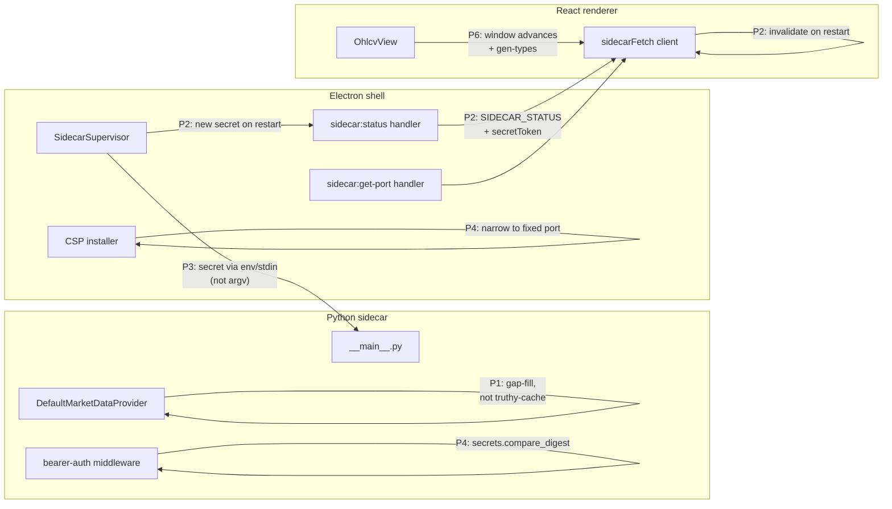

# 0004 — Bootstrap review follow-ups: cache coverage, secret rotation, security hardening, renderer DX

> **Status:** done (closed 2026-05-18)
> **Created:** 2026-05-18
> **Approved:** 2026-05-18
> **Owner skill(s):** `dev` (phases 1–5), `ui-builder` (phases 6, 7)
> **Related ADRs:** [ADR-0002](../../adrs/0002-ipc-local-http.md), [ADR-0007](../../adrs/0007-market-data-provider.md), [ADR-0008](../../adrs/0008-electron-shell-conventions.md)
> **Related plan(s):** [0001-bootstrap](0001-bootstrap.md) — this plan addresses findings from its end-of-plan architect review.

## TL;DR

Close the architect-review deltas on Plan 0001. Two findings are user-visible and material: `DefaultMarketDataProvider` returns partial bars when the cache holds only part of the requested window (silent truncation), and the sidecar generates a fresh bearer secret on crash-restart without any path to push it to the renderer (so the "restart once" feature 401s every renderer call after the first crash). Two more are e2e-suite findings surfaced by the phase-4.1 architect re-review: `sidecar-supervisor.spec.ts` is a stub (asserts the Electron main PID is positive, never touches the sidecar — so the supervisor restart logic has no test coverage), and `security.spec.ts` is missing the CSP-block test its docstring claims (only node-integration and sidecar-fetch are exercised). The rest are smaller — non-constant-time auth compare, bearer secret leaked in process argv, a too-wide CSP, a frozen 365-day window in `OhlcvView`, a missing `gen-types.ts` script, an `OhlcvView` empty state with no testable affordance (unmasked by phase 4.1), and a handful of polish items. Phases are ordered so the two user-visible bugs land first; the e2e gaps are folded into phases 2 and 4 because they live in the same files. After this plan lands, Plan 0001 gets its close ceremony (status flip + move to `plans/done/`).

## Context & problem

The end-of-plan review of Plan 0001 (see chat transcript on 2026-05-18) surfaced fifteen findings against the code that landed in commits `26608fd` → `056456e`. Severities ranged from a silent-data bug (cache coverage) to nits (an unused parameter). Some were known at plan-write time and explicitly listed as "Open questions"; others were plan-implementation deviations that slipped through phase-by-phase commits.

The forcing function for grouping them into one plan rather than scattering issues:

1. Two findings are **plan-policy deviations** (cache gap-fill spec from Phase 3; the per-launch secret rotation contract from Phase 4 + Phase 1) — they need re-aligning with the plan, not just patching.
2. Three findings (constant-time compare, argv secret, CSP narrowing) are **security tightening** that share a code surface and review attention.
3. The renderer DX cluster (frozen window, gen-types, error sanitization) is owned by `ui-builder`, so it routes to a different sibling skill and benefits from a single PR.
4. Bundling lets the architect close Plan 0001 once after this plan completes, instead of waiting on six trickle commits.

## Decision

We ship seven small phases, ordered so dev-owned phases run first as a contiguous block (phases 1–5) and the two `ui-builder`-owned phases run last as the second contiguous block (phases 6, 7) — single skill handoff at the 5→6 boundary per the cross-skill handoff protocol. Phases 1 and 2 are the user-visible fixes and land first. Phase 3 picks one of {env-var, stdin} for the bearer-secret transport and may emit a short ADR (the choice closes Plan 0001's open question on the matter). Phase 4 is two-line security tightening. Phase 5 is opportunistic cleanup of the nits. Phases 6 and 7 are the renderer-DX cluster and the OhlcvView empty-state affordance.

We rejected the alternative of opening one PR per finding because the review surface is small (~200 LoC total) and CI cost dominates over diff size; one cohesive plan also gives the architect a single close ceremony rather than fifteen.

## Architecture diagram

## Implementation phases

### Phase 1 — Cache range-coverage in `DefaultMarketDataProvider`

- **Owner skill:** `dev`
- **What:** Replace the truthy-cache check with a gap-fill that honors Plan 0001 phase 3 cache policy. The repository call returns whatever it has; the provider computes contiguous gaps against `[start, end]`, fetches each gap from the adapter, upserts the result, then re-queries to return the merged window.
- **Files touched:**
  - `src/market_analyser/data/default_provider.py` — `get_ohlcv` rewritten around a small `_coverage_gaps(cached, start, end, timeframe) -> list[tuple[datetime, datetime]]` helper. The `as_of` branch is unchanged (cache-only is correct for backtest mode).
  - `src/market_analyser/persistence/repository.py` — if `get_bars` doesn't already return rows sorted by `event_ts`, add an explicit `ORDER BY event_ts` so the gap algorithm can stream linearly.
  - `tests/data/test_default_provider_cache.py` — new tests: (a) cache covers `[start, end]` entirely → no adapter call; (b) cache covers a head slice → adapter is asked for the tail gap only; (c) cache has a middle hole → adapter called for the hole; (d) empty cache → existing behavior (adapter called for full window); (e) `as_of` set + partial coverage → raises (anti-lookahead).
- **Done when:**
  - All five new cache tests pass.
  - Manual smoke: with the chart at the default 365-day window, delete a slice of `bars` rows from the cache, reload, and confirm the chart re-fills the deleted slice from Yahoo without re-fetching the bars that were already cached.
  - `mypy --strict` clean on the new helper.

### Phase 2 — Sidecar secret rotation reaches the renderer (and the supervisor spec earns its name)

- **Owner skill:** `dev`
- **What:** Make the renderer's bearer cache invalidate when the sidecar restarts with a new secret. Three changes in lockstep: the `sidecar:status` push event carries the new token on `kind: 'restarted'`; the renderer's `sidecarFetch` swaps its cached `SidecarPort` when it receives one; the IPC schema is extended. **Plus:** rewrite `sidecar-supervisor.spec.ts` to actually exercise the kill → restart cycle Plan 0001 phase 4 required. The current spec is a stub (asserts `process.pid > 0` against the Electron main process, never touches the sidecar) — `dev` discovered this during phase-4.1 only after the load-path fix unblocked the runner, and the stub assertion happened to keep passing.
- **Files touched:**
  - `desktop/shared/schemas/sidecar.ts` — add `secretToken: z.string().min(1).optional()` to `SidecarStatusSchema`. Required when `kind === 'restarted'`, absent otherwise. Use a discriminated `z.union` or a `superRefine` to encode the contract.
  - `desktop/electron/sidecar.ts` — `handleExit` already generates a fresh secret; include it in the `restarted` emit: `this.emit({ kind: 'restarted', pid: ..., secretToken: newSecret })`. Expose the current sidecar PID on a test-only IPC channel (or via `globalThis.__sidecarPid` guarded by an env flag set in `playwright-global-setup.mjs`) so the spec can target the Python child, not the Electron main.
  - `desktop/renderer/api/client.ts` — on module load (or first call), subscribe to `window.api.sidecar.onStatus`; on `restarted` events that carry a `secretToken`, write the new value into the cached `SidecarPort`. Subscription cleanup is not required because the client is process-scoped.
  - `desktop/tests/sidecar-supervisor.spec.ts` — **full rewrite, not extension.** New flow: launch → wait for `/ohlcv` response (readiness gate, keep it) → read the sidecar PID via the test-only channel → `process.kill(pid)` from the spec → wait for a `sidecar:status` event with `kind === 'restarted'` → fire a new `/ohlcv` fetch from the renderer and assert 200 (not 401, not connection refused) → kill again → assert the fatal-error window is visible (title or role-based selector). The existing `expect(pid).toBeGreaterThan(0)` line and its surrounding `app.evaluate(() => process.pid)` go away — that PID is the Electron main, not the sidecar, and the assertion is a tautology.
- **Done when:**
  - The rewritten supervisor spec passes from a cold build and demonstrably fails if `SidecarSupervisor.handleExit` is short-circuited (manual sanity check: comment out the restart branch, watch the spec go red).
  - Post-restart renderer fetch returns 200, not 401 (the secret-rotation half of this phase).
  - Second-crash flow surfaces the fatal-error window (Plan 0001 phase 4 done-when's "killing it again shows the fatal-error window" bullet — never tested before).
  - `desktop/shared/schemas/shellOpen.test.ts`-style unit test added asserting `restarted` without `secretToken` rejects at parse time.

### Phase 3 — Move bearer secret out of process argv

- **Owner skill:** `dev`
- **What:** Resolve Plan 0001's Open Question on argv-snooping by passing the bearer secret through a channel another local-user process cannot read. Two viable options — env-var injection or stdin handshake. Pick one in the phase PR (see Notes); the rest of the phase is the same either way.
- **Files touched:**
  - `desktop/electron/sidecar.ts` — drop `--secret=${secretToken}` from the spawn args. For the env-var option, set `env: { ...process.env, MARKET_ANALYSER_SECRET: secretToken }` on the `spawn()` call. For the stdin option, keep stdio as `['pipe', 'pipe', 'pipe']`, write the secret + newline to `child.stdin`, then close stdin.
  - `src/market_analyser/api/__main__.py` — drop `--secret` from argparse; read from `os.environ["MARKET_ANALYSER_SECRET"]` or from `sys.stdin.readline().rstrip()`. Refuse to start if missing or empty.
  - `tests/test_api_startup.py` (new) — assert the chosen path: the sidecar starts when the secret is supplied via the new channel and refuses to start when it isn't.
  - `docs/architecture/adrs/0011-bearer-secret-transport.md` (optional but recommended) — one-page ADR capturing the env-vs-stdin trade and the chosen option. Closes Plan 0001's Open Question.
- **Done when:**
  - On Windows, `Get-CimInstance Win32_Process | Where-Object { $_.Name -eq "python.exe" } | Select-Object CommandLine` shows no secret in the command line of the running sidecar.
  - On Linux, `cat /proc/<pid>/cmdline | tr '\0' '\n'` shows no secret.
  - All existing sidecar tests pass with the new transport.

### Phase 4 — Constant-time bearer compare + narrow CSP (and write the missing CSP test)

- **Owner skill:** `dev`
- **What:** Two independent security-tightening edits, plus filling a gap in the e2e suite. `desktop/tests/security.spec.ts` currently has two tests (`renderer cannot access node integration`, `sidecar fetch with injected bearer succeeds`) — its **docstring** at lines 4-6 claims a third ("Cross-origin fetch is blocked by CSP") but the corresponding `test(...)` block was never written. Plan 0001 phase 4 done-when required all three. This phase finishes the job and narrows the CSP target at the same time.
- **Files touched:**
  - `src/market_analyser/api/app.py` — replace `token != secret` with `not secrets.compare_digest(token, secret)`. Import `secrets` at module top.
  - `desktop/electron/window.ts` — `installCsp(isDev: boolean, sidecarPort: number)`: replace `connect-src ... http://127.0.0.1:*` with `... http://127.0.0.1:${sidecarPort}`. Update the dev CSP to match.
  - `desktop/electron/main.ts` — pass `info.port` into `installCsp` after `supervisor.start()` resolves. `installCsp` must therefore be called AFTER the sidecar has a port — move it from line 28 to after the `await supervisor.start()` line.
  - `desktop/tests/security.spec.ts` — **add** a third test (not extend; the test the plan implies doesn't exist yet). New test: launch → `window.evaluate(async () => { try { await fetch('http://127.0.0.1:1/ping'); return 'allowed' } catch (e) { return e.toString() } })` → assert the result is a CSP-block error string, not `"allowed"` and not a network error against the real sidecar port. Also add a second cross-origin probe against an arbitrary external host (e.g. `https://example.com`) and assert it's blocked — covers the docstring's "Cross-origin fetch is blocked by CSP" claim directly.
- **Done when:**
  - The new CSP e2e tests pass against both a wrong localhost port (blocked) and `example.com` (blocked); a fetch to the actual sidecar port still succeeds (covered by the existing `sidecar fetch with injected bearer` test).
  - The bearer test in `tests/test_healthz.py` or a sibling auth test confirms wrong tokens still 401 (functional parity).
  - `security.spec.ts`'s file-level docstring matches the tests that actually exist (no more aspirational bullets).

### Phase 5 — Cleanup nits

- **Owner skill:** `dev`
- **What:** Five low-risk polish items batched into one commit so they don't clutter the log. This phase is the last dev-owned phase before the handoff to `ui-builder` for phases 6 and 7.
  - `desktop/electron/sidecar.ts:177` — drop the unused `_secret` parameter from `waitForHealthz`.
  - `desktop/electron/sidecar.ts:54-68` — move `this.intentionalShutdown = true` to the first line of `stop()`, above the early-return guard, to close the exit-during-stop race window.
  - `desktop/shared/schemas/sidecar.ts` — tighten the `SidecarStatusSchema`: make `message` required when `kind` is in `{'crashed', 'fatal'}` (discriminated union or `superRefine`).
  - `src/market_analyser/data/default_provider.py` — once Phase 1 gap-fill lands, remove the now-redundant `if fetched: self._repo.upsert_bars(fetched); return self._repo.get_bars(...)` two-step (the gap-fill already does the right thing in one pass).
  - `src/market_analyser/data/adapters/yahoo.py` — log the over-fetch ratio (request span vs. period bucket) at DEBUG so the over-fetch finding is observable if it becomes a bandwidth problem.
- **Done when:**
  - Typecheck + tests pass.
  - No behavior change visible to the user; this phase is pure code health.

### Phase 6 — Renderer DX & maintainability

- **Owner skill:** `ui-builder`
- **What:** Three small renderer improvements bundled because they're all in the same surface and one owner. First phase after the dev→ui-builder handoff.
  1. **Window refresh.** `OhlcvView`'s `start`/`end` are computed once via `useMemo([])` and never advance. Move them into a `useMemo([refetchToken])` so pressing "Refresh" advances the window to "now", or recompute on every render and use a custom equality so the deps array of `useOhlcv` doesn't churn on every paint.
  2. **OpenAPI type generation.** Build `desktop/scripts/gen-types.ts` per Plan 0001 phase 4. Read the sidecar's OpenAPI JSON from a temp run of `python -m market_analyser.api ...` or from a checked-in `openapi.json`; emit TypeScript interfaces into `desktop/renderer/types/sidecar/`. Replace the hand-written `bar.ts` with the generated output.
  3. **Error-body sanitization.** `client.ts:ApiError` puts the raw response body into `Error.message`; `OhlcvView` renders it. Add a sanitization step that strips file paths and stack-trace lines from the body before rendering. The thrown `ApiError` keeps the raw body in `.body` for logging; only `.message` is what reaches the DOM.
- **Files touched:**
  - `desktop/renderer/views/OhlcvView.tsx` — window-refresh fix.
  - `desktop/scripts/gen-types.ts` (new) + `desktop/package.json` (`gen-types` script entry).
  - `desktop/renderer/types/sidecar/bar.ts` — replaced by generated output (or moved to `renderer/types/sidecar/generated/` and re-exported).
  - `desktop/renderer/api/client.ts` — sanitization helper on `ApiError.message`.
  - `desktop/tests/ohlcv-view.spec.ts` — assertion that pressing Refresh re-queries with an updated `end` parameter (Playwright route interception captures the URL).
- **Done when:**
  - Refresh changes the URL's `end=` query parameter.
  - `pnpm gen-types` produces a `Bar` interface byte-identical to the current hand-written one (proof of round-trip); changing the Pydantic model and re-running updates the TS.
  - An `ApiError` whose body contains an absolute path renders only the message text, no path, in the UI.

### Phase 7 — OhlcvView empty-state affordance (phase-4.1 review followup)

- **Owner skill:** `ui-builder`
- **What:** Add a testable affordance to the four-state machine's empty branch and widen the e2e predicate accordingly. Surfaced by [Plan 0001](0001-bootstrap.md) phase 4.1: with the renderer-load-path gap fixed, `ohlcv-view.spec.ts` now runs but times out when the sidecar returns zero bars, because the empty `
` at `desktop/renderer/views/OhlcvView.tsx:61-65` carries no `role`, `aria-label`, or `data-testid`. The spec's "chart OR alert" guard at `desktop/tests/ohlcv-view.spec.ts:36-40` therefore matches neither branch. Empty is not an error — fix it by making it observable, not by re-routing it through the error state.
- **Files touched:**
  - `desktop/renderer/views/OhlcvView.tsx` — add `role="status"` and `data-testid="ohlcv-empty"` to the empty-state div. Keep the existing copy. (Loading already has `role="status"`; error has `role="alert"`. This closes the third quadrant of the four-state machine.)
  - `desktop/tests/ohlcv-view.spec.ts` — widen the predicate from `chart OR alert` to `chart OR alert OR empty` (i.e. also probe `[data-testid="ohlcv-empty"]`). The "≥ 1 canvas inside chart" assertion stays gated on `chart.isVisible()` so empty/error don't trip it.
- **Done when:**
  - `pnpm --filter desktop test:e2e` passes all four specs from a cold build — Plan 0001 phase 4.1's done-when text becomes fully accurate.
  - Manual smoke: launch the app pointing at a symbol with no cached bars and network disabled (or any range Yahoo returns empty for); the UI shows the "No bars for …" message and the spec passes against the same state.
- **Note:** Do not solve this by seeding cached bars in `globalSetup`. The empty branch is a real user state (offline + uncached symbol + bad range) and the spec should cover it as a first-class outcome, not paper over it.

## Risks & open questions

- **Risk: Phase 1 (cache gap-fill) changes Yahoo call volume.** Cache misses currently fetch the whole window; gap-fill fetches only the missing slice. If Yahoo's per-period range strings don't allow fetching a 30-day slice in the middle of a 365-day window cleanly, the adapter may still need to over-fetch and trim. Mitigation: keep the adapter API unchanged; if a gap is below some threshold (e.g. 10 days), widen it to the next bigger period to minimize round-trips.
- **Risk: Phase 2 (status-event secret) races with the renderer's first fetch.** If the renderer registers the `onStatus` listener AFTER a `restarted` event has fired, the new secret is lost. Mitigation: subscribe in `client.ts` module initialization, before any `sidecarFetch` call can run. Alternative: have `getPort()` always return the latest cached value and trigger a fresh IPC roundtrip on 401.
- **Risk: Phase 3 (secret transport) breaks the e2e tests' sidecar boot.** The Playwright `globalSetup` builds the renderer but does not spawn the sidecar via the supervisor (it relies on the supervisor running at app startup), so this should be transparent. Verify by running `pnpm --filter desktop test:e2e` once the transport change lands.
- **Open question (Phase 3):** env-var vs stdin? Env-var is simpler and what most desktop apps do; stdin is marginally more secure (env vars are visible to descendants of the same process tree). For a sidecar with no child processes, env-var is the pragmatic pick — capture the rationale in ADR-0011.
- **Open question (Phase 6):** does `gen-types` run at build time or at commit time (pre-commit hook)? Build-time keeps the diff out of git; commit-time means CI can verify the generated file matches the source-of-truth. Lean commit-time so the generated file is reviewable in PRs and CI catches drift.

## What this plan does NOT do

- **It does not flip Plan 0001's status or move it to `plans/done/`.** That is the architect's close ceremony after this plan completes.
- **It does not address Plan 0001's other open questions** (migration safety, secrets schema/rotation, packaging). Those have their own followups listed in Plan 0001.
- **It does not introduce React Query, a state library, or any new dependency.** Phase 6's hook-level fix stays inside the existing ad-hoc `useOhlcv` shape.
- **It does not redesign the `MarketDataProvider` Protocol.** The five `NotImplementedError` stubs stay as-is; they earn their implementations in future plans (Plan 0002 for `get_quote`, screener / sentiment / news plans for the rest).

## Followups (after this lands)

- Plan 0001 close ceremony: flip `Status: done`, move to `docs/architecture/plans/done/0001-bootstrap.md`. Architect runs this, not the implementer.
- If Phase 3 emits ADR-0011: cross-link it from Plan 0001's "Risks & open questions" section so the open question is visibly resolved.
- If gap-fill (Phase 1) reveals that Yahoo's range-string API can't satisfy small middle-of-window slices, write a short ADR on the adapter's over-fetch policy.
