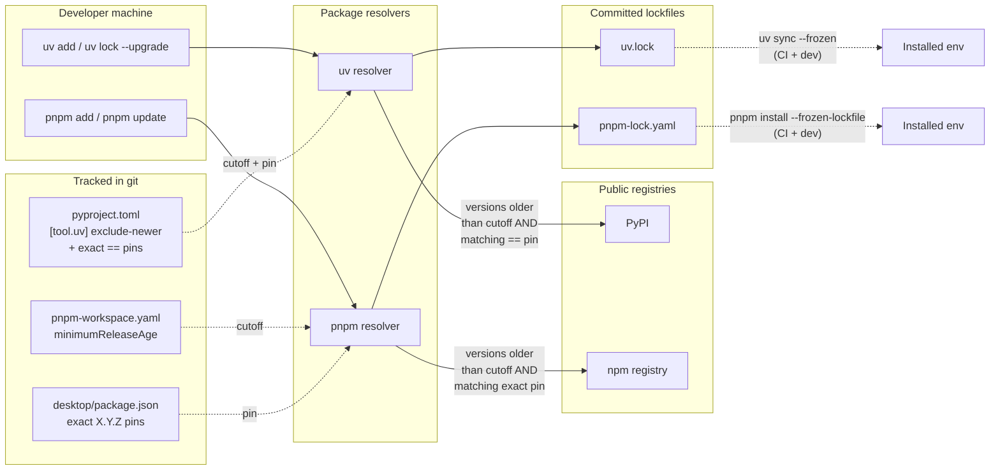

# 0005 — Dependency discipline (cooldown + manifest pinning)

> **Status:** done
> **Created:** 2026-05-19
> **Owner skill(s):** `dev`
> **Related ADRs:** [ADR-0012](../../adrs/0012-dependency-cooldown.md), [ADR-0013](../../adrs/0013-pin-direct-dependencies.md)

## TL;DR

Land both halves of the dependency-discipline policy in a single `dev` session: (1) configure `uv` and `pnpm` to refuse any package version published within the last 14 days at resolution time (cooldown), and (2) rewrite every direct dependency in `pyproject.toml` and `desktop/package.json` from `>=` / `^` ranges to exact `==X.Y.Z` / `X.Y.Z` pins matching the current lockfiles (manifest pinning). Add one `Dependency discipline` section to `CLAUDE.md` covering both policies, the weekly cutoff-bump cadence, the CVE override path, and the "every upgrade is a manifest edit" rule. CI and the existing `--frozen` install discipline are not modified.

## Context & problem

The repository's lockfiles already protect frozen installs, but the resolver path is doubly unprotected today. First, freshly-published malicious versions can ride into the lockfile on the next `uv add` / `uv lock --upgrade` / `pnpm add` / `pnpm update`; ADR-0012 closes that by enforcing a 14-day minimum release age. Second, the manifests carry `>=` and `^` ranges, so even with the cooldown active a `--upgrade` sweeps every direct dependency to its newest cooldown-admissible version in one undifferentiated lockfile diff; ADR-0013 closes that by requiring exact pins in the manifests, so every direct-dep bump is a deliberate manifest edit with a reviewable commit message.

Both decisions touch the same files (`pyproject.toml` for Python, `desktop/package.json` for Node) and the same dev session, so the plan bundles them. Splitting into two plans would mean two near-identical close ceremonies and two near-identical CI re-verifications.

## Decision

We will implement both ADRs in one plan, in the order: cooldown first (so any verification re-resolution is already bounded by the cutoff), pinning second (mechanical rewrite of constraints, no version change), documentation last. We rejected splitting into two plans (redundant ceremony) and reordering pinning before cooldown (would leave a small window where verification re-resolutions are unbounded).

## Architecture diagram



Cooldown and pin compose: only versions both older than the cutoff *and* matching the manifest's exact pin are admissible. The lockfile is the agreement; `--frozen` installs read it directly and are unaffected by either policy.

## Implementation phases

### Phase 1 — Verify pnpm setting name, units, and minimum version

- **Owner skill:** `dev`
- **What:** Confirm the exact `pnpm` configuration key for "minimum release age", its expected units, the file it has to live in, and the minimum pnpm version that supports it. Source: pnpm's own documentation (`pnpm.io/settings` or equivalent for the installed major version). ADR-0012 uses the working name `minimum-release-age` (kebab-case in `.npmrc`) — phase 1 either confirms that or corrects it before any config lands. *Phase-1 verification outcome: the honored location is `minimumReleaseAge` (camelCase) in `pnpm-workspace.yaml`; pnpm v10+ reads only auth/registry from `.npmrc`. Minimum pnpm version is `10.16.0`.*
- **Files touched:** None (verification only — record findings in the phase-2 commit message).
- **Done when:**
  - The exact pnpm config file + key name is known and matches what the installed `pnpm` actually honors.
  - The unit (minutes / seconds / days) is known and the value for "14 days" is computed accordingly.
  - The minimum supporting pnpm version is known, and we know whether the version currently pinned by `pnpm/action-setup` in `.github/workflows/ci.yml` (`version: 9`) meets that floor. If pnpm 9 does not support the setting, phase 2's done-when changes to include a CI bump and a `packageManager` field in `desktop/package.json` (or a new root `package.json`).
- **Notes:** This phase ships no diff if the only output is "ADR was right" — fold its findings into phase 2's commit message and skip an empty commit.

### Phase 2 — Land the two cooldown cutoffs with a smoke test

- **Owner skill:** `dev`
- **What:** Add the static cutoff value to both ecosystems and verify each resolver actually honors it.
- **Files touched:**
  - `pyproject.toml` — add `[tool.uv]` table with `exclude-newer = "2026-05-05"` (today − 14 days as of 2026-05-19).
  - `pnpm-workspace.yaml` at the repo root — add `minimumReleaseAge: <verified-value-in-minutes>` (and any other settings phase 1 surfaces as necessary).
  - `.github/workflows/ci.yml` and/or `desktop/package.json` `packageManager` — only if phase 1 found that the pinned pnpm version is too old.
- **Done when:**
  - `uv lock --upgrade` run against a temp checkout produces no version bumps with a publish date after `2026-05-05`; bumping the cutoff to a known-newer date does produce at least one bump (proves the setting is honored, not silently ignored). Verification is done locally by `dev` and summarised in the commit message; no script is committed.
  - `pnpm update --latest` (or equivalent dry-run) inside `desktop/` similarly refuses versions younger than the cutoff and accepts them when the cutoff is bumped. Same verification pattern.
  - Existing `uv sync --frozen` and `pnpm install --frozen-lockfile` continue to succeed unchanged against the current lockfiles.
- **Notes:** Do not commit any lockfile churn from the verification probes. Phase 2's commit contains only the config additions.

### Phase 3 — Pin every direct Python dependency to an exact version

- **Owner skill:** `dev`
- **What:** Rewrite every `>=` / `~=` / `^` style constraint in `pyproject.toml` to an exact `==X.Y.Z` pin, using the version currently resolved in `uv.lock`. Covers `[project.dependencies]`, `[dependency-groups.dev]`, and `[build-system] requires`. The migration must not change resolution — same versions before and after.
- **Files touched:**
  - `pyproject.toml`.
- **Done when:**
  - Every entry in `[project.dependencies]` is of the form `"<package>==<version>"`. No `>=`, no `~=`, no `^`, no bare names.
  - Every entry in `[dependency-groups.dev]` is of the form `"<package>==<version>"`. Same rule.
  - `[build-system] requires` lists `["hatchling==<version>"]`, where `<version>` is whatever `uv` actually used to build the wheel during the last sync (read from `uv.lock`).
  - `uv sync --frozen` succeeds with no change — the lockfile is byte-identical before and after the manifest edit (assert by running `uv sync --frozen` and inspecting `git diff -- uv.lock`, which must be empty).
  - `uv lock --check` (or equivalent dry-run) reports the lockfile is in sync with the new manifest.
- **Notes:** If `uv lock --check` flags a drift between the new pins and the lockfile, the pin was wrong (off-by-one against the lockfile). Fix the pin to match the lockfile; do not refresh the lockfile to match the pin in this phase — that would silently absorb resolution changes the phase is supposed to avoid.

### Phase 4 — Pin every direct Node dependency to an exact version

- **Owner skill:** `dev`
- **What:** Rewrite every `^` / `~` / `>=` / `latest` style constraint in `desktop/package.json` (`dependencies` and `devDependencies`) to an exact version string, using the version currently resolved in `pnpm-lock.yaml`. The migration must not change resolution.
- **Files touched:**
  - `desktop/package.json`.
- **Done when:**
  - Every entry in `dependencies` is a bare exact version (e.g., `"react": "18.3.1"`). No `^`, `~`, `>=`, `*`, `latest`, or git/file/link references unless that was already the case.
  - Every entry in `devDependencies` is a bare exact version. Same rule. (Most are already pinned; the work focuses on `@eslint/js`, `eslint-config-prettier`, and any other `^`/`~`-prefixed entries.)
  - `pnpm install --frozen-lockfile` succeeds with no change — `git diff -- pnpm-lock.yaml` is empty after the edit.
  - `pnpm install --lockfile-only` (no install, just resolution) produces a byte-identical lockfile (assert by running it and confirming `git diff` is empty).
- **Notes:** If a `^X.Y.Z` entry resolves in `pnpm-lock.yaml` to `X.Y.W` where `W > Z` (the common case), the pin value is `X.Y.W`, not `X.Y.Z`. Always read the actual resolved version out of the lockfile; do not assume the manifest's lower bound matches what is installed.

### Phase 5 — Document the discipline policy in `CLAUDE.md`

- **Owner skill:** `dev`
- **What:** Add a `## Dependency discipline` section to `CLAUDE.md` (top-level, before `## Pitfalls to avoid`) covering both policies in one place: (1) the cooldown policy in one sentence, linking to ADR-0012; (2) the exact-pin policy in one sentence, linking to ADR-0013; (3) the weekly cutoff bump cadence (~7 days, user-driven, normal chore commit); (4) the CVE-driven cutoff bump procedure (bump cutoff in `pyproject.toml` / `pnpm-workspace.yaml`, name the CVE in the commit message, run `uv lock` / `pnpm install` as the same commit); (5) the "every direct-dep upgrade is a manifest edit" rule (you bump `fastapi` by editing the `==X.Y.Z` line in `pyproject.toml`, then running `uv lock`, both in one commit); (6) explicit non-existence of a per-package cooldown allowlist or a "ranges allowed" exception.
- **Files touched:**
  - `CLAUDE.md`.
- **Done when:**
  - `CLAUDE.md` has a `## Dependency discipline` section in the position described above.
  - The section links to `docs/architecture/adrs/0012-dependency-cooldown.md` and `docs/architecture/adrs/0013-pin-direct-dependencies.md` exactly once each.
  - The section is at most ~40 lines; longer means it has drifted into ADR territory and the prose should be cut.
- **Notes:** Do not write parallel docs in a new top-level file; `CLAUDE.md` is the orientation map and the dependency policy belongs in it. The ADRs carry the reasoning; `CLAUDE.md` carries the operational handle.

## Data shapes

No new data shapes. The tracked values are:

```toml
# pyproject.toml
[tool.uv]
exclude-newer = "2026-05-05"

[project]
dependencies = [
    "alembic==<exact>",
    "fastapi==<exact>",
    "pydantic==<exact>",
    "sqlalchemy==<exact>",
    "uvicorn[standard]==<exact>",
]

[dependency-groups]
dev = [
    "pytest==<exact>",
    "pytest-cov==<exact>",
    "httpx==<exact>",
    "ruff==<exact>",
    "mypy==<exact>",
    "pip-audit==<exact>",
    "pre-commit==<exact>",
    "commitizen==<exact>",
]

[build-system]
requires = ["hatchling==<exact>"]
```

```yaml
# pnpm-workspace.yaml (repo root) — exact location + key verified in phase 1
minimumReleaseAge: 20160  # 14 days × 24 hours × 60 minutes
```

```jsonc
// desktop/package.json (sketch)
{
  "dependencies": {
    "lightweight-charts": "4.2.3",
    "react": "18.3.1",
    "react-dom": "18.3.1",
    "zod": "3.23.8"
  },
  "devDependencies": {
    "@eslint/js": "<exact, no caret>",
    "eslint-config-prettier": "<exact, no caret>"
    // ...etc, every entry exact
  }
}
```

`<exact>` is read out of the corresponding lockfile at migration time, not chosen freshly.

## Risks & open questions

- **Risk: pnpm setting name or units wrong.** If phase 1's verification is sloppy, phase 2 could land a `pnpm-workspace.yaml` line that `pnpm` silently ignores. Mitigation: phase 2's done-when includes a positive smoke check (set the cutoff to a known-newer date and confirm the resolver actually refuses younger versions). A silently-ignored setting fails that check.
- **Risk: phase 3 / phase 4 pin values drift from the lockfile.** If `dev` picks the manifest's old lower bound (e.g., `0.115`) instead of the resolved version (`0.115.4`), `uv sync --frozen` may still work by coincidence (because the lockfile is the actual source for the install), but `uv lock --check` will flag drift. Mitigation: each phase's done-when explicitly requires `--check` to pass and the lockfile diff to be empty.
- **Risk: cutoff drift over time.** If the user doesn't bump the cutoff for several weeks, dependency-update PRs start failing for ordinary "version is too new" reasons. Mitigation: the `CLAUDE.md` section names the cadence so the failure mode is recognized.
- **Risk: pre-feature pnpm on a contributor's machine.** A contributor with an older pnpm would silently bypass the cooldown locally. Mitigation: pin the version in `desktop/package.json#packageManager` if phase 1 indicates we should; CI's `pnpm/action-setup` action pin protects the lockfile.
- **Open question: do we want a CI guard that fails if the cutoff is older than ~30 days?** Tempting (would surface stale cutoffs as red CI), but adds a wall-clock dependence to CI runs. Not in this plan; revisit if drift in practice turns out to be a problem.
- **Open question: do we want CI to also assert the manifests carry no range operators?** A grep-based guard against `>=`, `^`, `~` in `pyproject.toml` and `desktop/package.json` would prevent regressions. Out of scope for this plan; if the discipline holds via review, no guard is needed. If regressions creep in, file a followup.

## What this plan does NOT do

- It does not add a commercial supply-chain scanner (Socket / Phylum / Snyk). ADR-0012 notes these as complementary.
- It does not change `pip-audit` configuration or schedule.
- It does not introduce a private package registry mirror.
- It does not automate the cutoff bump or the dependency upgrade flow. Both are user-driven by design.
- It does not change the lockfile policy (`--frozen` everywhere), the `pnpm/action-setup` action setup, or any test invocation.
- It does not pin transitive dependencies in the manifests. Lockfiles cover those.
- It does not add a CI guard that lints out range operators or stale cutoffs. Those are followups if the discipline doesn't hold via review alone.

## Followups (after this lands)

- **Cutoff installation re-resolves the lockfile.** Applying `[tool.uv] exclude-newer` to a `uv.lock` that already contains post-cutoff versions forces those entries to drop back to their newest cutoff-admissible counterpart on the next `uv lock`. The initial 2026-05-05 cutoff rolled back ~16 transitives (mypy 2.1.0 → 1.20.2, pydantic 2.13.4 → 2.13.3, ruff 0.15.13 → 0.15.12, uvicorn 0.47.0 → 0.46.0, virtualenv, urllib3, tomlkit, requests, plus the removal of `ast-serialize@0.4.0` entirely). Expect the same shape of lockfile churn at every weekly cutoff bump — the manifest edit is a one-liner but `uv.lock` will move with it. The plan's phase-2 "succeeds unchanged against the current lockfiles" language was correct for `uv sync --frozen` (which doesn't re-resolve) but did not anticipate that the cutoff would retroactively eject already-locked versions.
- **Under cooldown, `pnpm install --lockfile-only` is not a viable lockfile-consistency check.** pnpm's strict mode (correctly) refuses to re-resolve any pre-release transitive newer than the cutoff with no admissible alternative; Plan 0005 hit this on `resolve@2.0.0-next.7` (3 days old, pulled in by `eslint-plugin-react@7.37.1`). The meaningful Node-side checks while a cooldown is active are `pnpm install --frozen-lockfile` (exit 0) and a manifest-vs-lockfile specifier-text comparison. Phase 4's done-when text should be read as substituted accordingly.
- **pnpm v11 collateral.** The `minimumReleaseAge` floor (pnpm ≥ 10.16.0) drove a CI + `packageManager` bump to `pnpm@11.1.2`, which in turn required migrating `onlyBuiltDependencies: [electron, esbuild]` → `allowBuilds: {electron: true, esbuild: true}` in `pnpm-workspace.yaml` (v11 removed the old field). Future pnpm-major bumps should expect this shape of breaking-config collateral.
