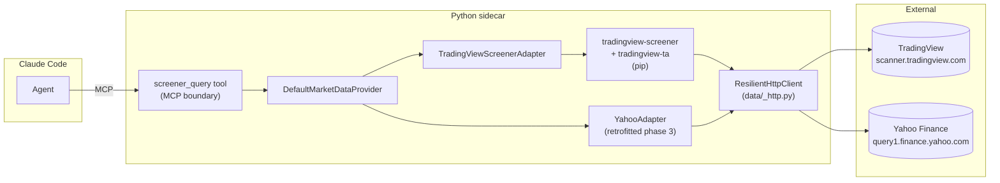

# 0009 — Resilience module + TradingView screener adapter

> **Status:** done
> **Created:** 2026-05-20
> **Approved:** 2026-05-20
> **Closed:** 2026-05-24
> **Owner skill(s):** `dev` (all phases)
> **Related ADRs:** [ADR-0019](../adrs/0019-external-http-adapter-resilience.md) (paired — defines the shared resilience pattern), [ADR-0007](../adrs/0007-market-data-provider.md) (Provider Protocol — `get_screener` is the stubbed method this plan implements), [ADR-0009](../adrs/0009-rewrite-data-layer-in-house.md) (in-house data layer), [ADR-0012](../adrs/0012-dependency-cooldown.md) + [ADR-0013](../adrs/0013-pin-direct-dependencies.md) (new direct deps), [ADR-0014](../adrs/0014-mcp-as-second-sidecar-protocol.md) (MCP tool transport)

## TL;DR

Land the shared resilience module `data/_http.py` (TTL cache + retry + backoff + concurrency cap + proxy-from-env), build the TradingView screener adapter on top of it, expose a `screener_query` MCP tool the agent can call, and retrofit the existing Yahoo adapter so we exit this plan with zero adapter-level resilience drift. First user-visible behavior at the end of the plan: open Claude Code, ask "find me oversold large-cap US stocks with RSI < 30 on the daily", see a ranked list returned with the matching symbols and key indicators.

## Context & problem

[ADR-0007](../adrs/0007-market-data-provider.md) declared `get_screener` as a Protocol method in 2026-05-17 and left it stubbed with `NotImplementedError`. Today the only data source wired through the Provider is the Yahoo OHLCV adapter from [Plan 0003](done/0003-excise-vendored-upstream.md). The agent can ask "what's AAPL's price?" but not "what's interesting today?" — the only candidate-discovery mechanism is the user typing a ticker.

Two architectural threads converge here:

1. **Tier 2 (data breadth) needs a base.** The roadmap names five more anonymous-or-cheap HTTP sources (TradingView screener, RSS news, F&G indices, StockTwits, BTC macro). Each needs the same resilience layer. Per [ADR-0019](../adrs/0019-external-http-adapter-resilience.md), we land the resilience pattern as a shared module *before* the second adapter, not by refactoring three of them later.
2. **The screener is the highest-leverage first Tier 2 capability.** It is the only data source that adds a fundamentally new capability *shape* (the agent finds candidates from a universe) rather than enriching context on a symbol the user already named. The Explore report on `tradingview-mcp` confirmed the `tradingview-screener` + `tradingview-ta` library duo is battle-tested, anonymous, and aligns with our Provider shape.

The plan therefore bundles the resilience module with its first consumer (TradingView screener) so the abstraction ships against a real adapter, and folds in the Yahoo retrofit so we exit with zero "two retry policies in the codebase" debt.

## Decision

We implement [ADR-0019](../adrs/0019-external-http-adapter-resilience.md)'s resilience pattern in three phases: (1) the module standalone with its own tests, (2) the TradingView screener adapter sitting on it + MCP tool, (3) the Yahoo retrofit. Then a fourth phase exposes the screener through the MCP tool surface (the agent-facing payoff) and validates end-to-end against a real upstream.

We rejected at planning time: (a) "bundle the resilience module into the Yahoo retrofit" — rejected because the screener is the first real new consumer and the abstraction should ship against the use case that drove the design, not the retrofit; (b) "ship the screener with inline resilience first, extract the module later" — rejected because the whole point of [ADR-0019](../adrs/0019-external-http-adapter-resilience.md) is to not repeat the `tradingview-mcp` mistake of per-service ad-hoc resilience that drifted across services.

## Architecture diagram



The seam: every external HTTP request — TradingView, Yahoo, and every future Tier 2 source — goes through `ResilientHttpClient`. Adapter code holds source-specific knowledge (URLs, payload shapes, response parsing); the client holds the cross-cutting concerns (cache, retry, backoff, concurrency, proxy).

## Implementation phases

Each phase is one commit. The [`feedback_tests_are_acceptance_criteria`](../../../.claude/skills/architect/references/templates/cross-skill-handoff.md) rule applies — every done-when is a behavioral claim defended by a concrete assertion. Stub specs and tautological assertions fail Mode 4 review.

### Phase 1 — `ResilientHttpClient` module + tests

- **Owner skill:** `dev`
- **What:** Implement the module from [ADR-0019](../adrs/0019-external-http-adapter-resilience.md). The class wraps stdlib `urllib.request` (no new transport dependency). It provides `get(url, *, params, headers, cache_key) -> HttpResponse` and `post(url, *, json, params, headers, cache_key) -> HttpResponse`, the `HttpResponse` / `ErrorKind` / `ProxyConfig` / `HttpClientStats` pydantic models, and a `ResilientHttpError` raised on retry exhaustion. The default classifier is shipped; the `classify` method is overridable. Telemetry counters increment per request / cache-hit / retry / exhaustion and are exposed via `client.stats()`. Jitter uses a constructor-injected `random.Random` for deterministic tests.
- **Files touched:**
  - New `src/market_analyser/data/_http.py` (~250–300 lines).
  - New `src/market_analyser/data/_http_types.py` OR inline in `_http.py` (implementer's call): `HttpResponse`, `ErrorKind` (StrEnum), `ProxyConfig`, `HttpClientStats`, `ResilientHttpError`.
  - New `tests/data/test_resilient_http_client.py`.
- **Done when:**
  - **Cache TTL behavior:** With `cache_ttl_seconds=10` and `cache_max_entries=4`, two successive `client.get(url)` calls (mocked transport) issue exactly one underlying HTTP request. After the cache key is invalidated (by `time` advanced past the TTL via a `time.monotonic` monkeypatch), the third call issues a second underlying request. `client.stats().cache_hits == 1`, `client.stats().requests == 2`.
  - **Cache LRU eviction:** With `cache_max_entries=2`, three distinct GETs followed by a repeat of the first one: the repeat is a miss (1 was evicted), `cache_hits == 0` for the four calls, `cache_evictions == 1`.
  - **Cache key derivation:** Two GETs to the same URL with different `params` produce two cache entries (different keys); two GETs to the same URL with the same `params` produce one entry. Header values do NOT affect cache key derivation (covered by an explicit test where two calls differ only in `Authorization` and produce one cached entry).
  - **Transient retry:** Mocked transport raises `ConnectionError` on attempts 1 and 2, then returns a 200 on attempt 3. Single `client.get(url)` returns the 200 response; `client.stats().retries == 2`; `client.stats().requests == 1` (one logical request, three physical attempts).
  - **Backoff timing:** With `backoff_initial=0.5`, `backoff_factor=2.0`, `backoff_max=30.0`, `random.Random(seed=1)`, and a mocked `time.sleep`, the recorded sleep durations between attempts match an expected fixture list (e.g., `[0.5 + jitter_1, 1.0 + jitter_2, 2.0 + jitter_3]`). Jitter values asserted to within 1e-9 of values reproducible with the seed.
  - **Permanent error raises immediately:** Mocked transport raises HTTP 404. `client.get(url)` raises `ResilientHttpError`; `client.stats().retries == 0`.
  - **Rate-limit longer backoff:** HTTP 429 response → retried, AND the initial backoff is at least 2x the `backoff_initial` (the documented "longer floor" rule). Asserted on the recorded sleep durations.
  - **Retry exhaustion raises:** Mocked transport raises `ConnectionError` on every attempt. `client.get(url)` raises `ResilientHttpError` after `max_retries=3` retries (4 total attempts). The raised exception's `.last_exception` is a `ConnectionError`; `.source_name` matches the constructor argument; `.attempts == 4`.
  - **Concurrency cap blocks:** With `max_concurrency=2` and a mocked transport that sleeps 50ms per request, firing four concurrent `client.get` calls from a thread pool: the elapsed time for all four to complete is at least 100ms (two pairs serialized) but less than 200ms (the pairs run in parallel within each batch). Asserted with a generous tolerance to keep the test non-flaky.
  - **Proxy fallback:** With `proxy=ProxyConfig(http_url="http://nope", ...)` and a mocked transport that raises `ConnectionError` on the proxy URL but returns 200 on the direct URL: `client.get(url)` returns the 200 from the direct attempt. `client.stats().proxy_fallbacks == 1`.
  - **`ProxyConfig.from_env()` with no env vars set returns `None`.** With `MARKET_ANALYSER_PROXY_HTTP_URL=http://x:8080` and `MARKET_ANALYSER_PROXY_HTTPS_URL=https://y:8080` set, returns a `ProxyConfig` with those URLs and `rotation_session_id=None`. With the rotation env var also set, populates that field.
  - **No secret leakage in stats or logs:** With a `headers={"Authorization": "Bearer abc"}` argument to `client.get`, the captured log handler (test fixture) contains zero occurrences of `"abc"`. `client.stats()` does not contain the header value.
  - **Classifier extension:** Subclassing `ResilientHttpClient` and overriding `classify(self, exc, response)` to return `ErrorKind.RATELIMIT` on HTTP 403 results in HTTP 403 being retried with the rate-limit backoff. Asserted via the StockTwits-like test scenario.
  - `uv run pytest tests/data/test_resilient_http_client.py` passes with no skips, no xfails. mypy strict passes on the new module.

### Phase 2 — TradingView screener adapter + `screener_query` MCP tool

- **Owner skill:** `dev`
- **What:** Implement the TradingView screener adapter on top of `ResilientHttpClient`. Adds two direct dependencies (`tradingview-screener` and `tradingview-ta`) per the cooldown + pinning policy. The adapter exposes `query(filters, market, exchange, limit) -> Sequence[ScreenerRow]`. `DefaultMarketDataProvider.get_screener(filters, as_of)` dispatches to it (and is now non-stub). A new MCP tool `screener_query` exposes it to the agent with a Pydantic-validated input model.
- **Files touched:**
  - `pyproject.toml`: add `tradingview-screener==<latest-stable>` and `tradingview-ta==<latest-stable>` as direct deps (exact pins per [ADR-0013](../adrs/0013-pin-direct-dependencies.md)); bump `[tool.uv] exclude-newer` to the latest stable release date of those packages (in the same commit, per [ADR-0012](../adrs/0012-dependency-cooldown.md)).
  - `uv.lock`: regenerated by `uv lock`.
  - New `src/market_analyser/data/adapters/tradingview_screener.py` (the adapter class wrapping the libraries; uses `ResilientHttpClient` as its HTTP transport via the libraries' configurable session hook — if the upstream libraries do NOT support session injection, the adapter wraps the HTTP-level calls directly and re-implements the small payload-shape logic. Implementer picks at start.).
  - `src/market_analyser/data/default_provider.py`: `get_screener` now dispatches to the new adapter (no longer raises `NotImplementedError`).
  - New `src/market_analyser/api/mcp_tools/screener_query.py` (the tool function + its Pydantic input model).
  - `src/market_analyser/api/mcp_app.py`: register the new tool next to the existing ones (Plans 0006 / 0007 / 0008).
  - New `tests/data/test_tradingview_screener_adapter.py` (offline — uses canned response fixtures, no `@pytest.mark.network`).
  - New `tests/api/test_screener_query_tool.py`.
  - New `tests/data/fixtures/tradingview_screener_response.json` (a real captured response, scrubbed of any user-identifying fields, used as the offline test fixture).
- **Done when:**
  - **Adapter offline correctness:** Given the fixture JSON, `adapter.query(filters={"RSI": {"lt": 30}}, market="america", limit=50)` returns a `list[ScreenerRow]` with exactly the number of rows in the fixture, each `ScreenerRow.symbol` populated, each `ScreenerRow.fields` containing the indicator columns the upstream returned. Asserted field-by-field for the first row.
  - **Filter validation at the boundary:** Calling `adapter.query(filters={"unknown_field": 5})` raises a clear `ScreenerFilterError` naming the unknown field. Calling with `limit=10000` (above the documented max) raises with the cap value. Calling with `market="not_a_market"` raises.
  - **Provider integration:** `DefaultMarketDataProvider().get_screener(filters={"RSI": {"lt": 30}})` (no `as_of`) returns the same rows as the direct adapter call. With `as_of=<a datetime>` raises `ValueError` (screener results are wall-clock-sensitive — `as_of` for screener is not supported in v1; documented in the docstring).
  - **MCP tool happy path:** Calling `screener_query(filters={"RSI": {"lt": 30}}, market="america", limit=50)` via the MCP test fixture returns `{"rows": [...]}` whose count matches the adapter return. The tool's input model rejects unknown keys (`extra="forbid"`) with an MCP-level error.
  - **MCP tool boundary validation:** `limit > 200` rejected at MCP boundary. `market` not in `{"america", "crypto", "forex", ...}` enum rejected. `filters` empty dict → accepted (returns the default "all stocks" view); `filters=None` → rejected (must be explicit empty dict, not None).
  - **Cache behavior (live test, optional):** Marked `@pytest.mark.network`. Two successive `adapter.query(...)` calls within the TTL window result in `client.stats().requests == 1` (the second is a cache hit). After TTL expiry (by mocking the client's TTL to 1s and sleeping), a third call issues a second request.
  - **Live smoke (logged in the commit message; not a CI gate):** A `tests/data/test_tradingview_screener_live.py` marked `@pytest.mark.network` queries `america` market with `RSI < 30, exchange=NASDAQ, limit=10` and asserts the response is a non-empty list whose first row has a non-empty `symbol`. This proves the upstream integration end-to-end on real network. Skipped in CI; runnable locally.
  - **No secret in adapter code or fixture:** grep the new files for "bearer", "api_key", "secret"; expected to be zero matches outside of comments referencing other modules.
  - `uv run pytest tests/data/test_tradingview_screener_adapter.py tests/api/test_screener_query_tool.py` passes with no skips other than the `@pytest.mark.network` live one.

### Phase 3 — Retrofit `YahooAdapter` onto `ResilientHttpClient`

- **Owner skill:** `dev`
- **What:** Port the existing `YahooAdapter` (`src/market_analyser/data/adapters/yahoo.py` + `_yahoo_fetch.py`) to use `ResilientHttpClient` for its HTTP traffic. The adapter's external contract (`fetch_ohlcv(symbol, timeframe, start, end) -> Sequence[Bar]`) is unchanged; the internal HTTP layer is the only thing that moves. The existing OHLCV cache-merge tests must continue to pass byte-for-byte.
- **Files touched:**
  - `src/market_analyser/data/adapters/yahoo.py` (internal HTTP calls replaced with `ResilientHttpClient` usage).
  - `src/market_analyser/data/adapters/_yahoo_fetch.py` (likely most of the inline retry/backoff code removed; the file may shrink or be deleted if everything moves up).
  - `tests/data/test_yahoo_adapter.py` (the existing tests — verify they still pass; add one new test asserting `client.stats().retries` increments on a transient mocked failure, proving the new path is wired).
- **Done when:**
  - All pre-existing `tests/data/test_yahoo_adapter.py` tests pass without modification to their assertions (modify only the test setup / fixtures if the constructor signature changes).
  - The Plan 0001 OHLCV fixture round-trip (a fetch against a canned upstream response → a list of `Bar` instances) produces byte-identical output to the pre-retrofit version. Asserted by running the same fixture through the new adapter and comparing `[bar.model_dump() for bar in result]` to a committed expected JSON.
  - One new test exercises a transient failure on the underlying `urllib` mock and asserts `client.stats().retries >= 1` for the retry that the adapter previously hand-rolled. Proves the path is now going through the shared client.
  - `git grep -nE 'retry|backoff|cache' src/market_analyser/data/adapters/_yahoo_fetch.py src/market_analyser/data/adapters/yahoo.py` returns zero matches outside of comments/docstrings — the resilience logic has fully moved up.
  - `uv run pytest tests/data/` passes with no skips other than `@pytest.mark.network`. mypy strict still passes.

### Phase 4 — End-to-end smoke + readme entry

- **Owner skill:** `dev`
- **What:** Two small surfaces to round out the user-visible payoff: a `tests/integration/test_screener_end_to_end.py` exercising MCP → provider → adapter → client → live upstream (network-marked), and a docs entry in `docs/onboarding/claude-code-setup.md` (the file Plan 0007 phase 5 created) showing the agent the canonical `screener_query` prompt examples.
- **Files touched:**
  - New `tests/integration/test_screener_end_to_end.py` (`@pytest.mark.network`).
  - `docs/onboarding/claude-code-setup.md` (extend with a "Screening" section).
- **Done when:**
  - The integration test, when run locally with `-m network`, calls the MCP tool with `{"filters": {"RSI": {"lt": 35}}, "market": "america", "exchange": "NASDAQ", "limit": 5}` and asserts: response status is success, returned rows count is between 1 and 5 (inclusive), each row has a non-empty `symbol`, each row's `fields` contains `RSI` whose value is `< 35`. The test is skipped in CI (`network` marker is not in CI's `-m` filter); the README documents how to run it locally.
  - `docs/onboarding/claude-code-setup.md` has a "Screening" section with at least three example prompts (e.g., "find oversold large-cap US stocks on the daily", "show me crypto pairs with a bullish MACD cross in the last 4 hours", "what tickers in my watchlist have BB squeeze right now") and a one-line note that screener results are wall-clock-sensitive (no `as_of` support).

## Data shapes

The `ScreenerRow` model from [ADR-0007](../adrs/0007-market-data-provider.md) (already declared in `src/market_analyser/data/types.py`) is adequate — `fields: dict[str, float | str | None]` is loose enough for arbitrary TradingView indicator columns. No new pydantic models needed at the data-layer boundary.

```python
# illustrative — final shape locked in phase 1 / phase 2.

class ScreenerQueryInput(BaseModel):
    """MCP-boundary input. extra='forbid'."""
    filters: dict[str, Any]                                # validated by adapter
    market: Literal["america", "crypto", "forex", "egypt"] = "america"
    exchange: str | None = None                            # e.g. "NASDAQ", "NYSE"; None = all
    limit: int = Field(50, ge=1, le=200)
    model_config = {"frozen": True, "extra": "forbid"}

class ScreenerQueryOutput(BaseModel):
    rows: list[ScreenerRow]
    queried_at: datetime                                   # wall-clock UTC for explainability
```

The MCP tool returns the wall-clock at which the query was issued (`queried_at`) because screener results are time-sensitive and the agent should be able to surface "as of HH:MM" in its reply.

## Risks & open questions

- **Risk: `tradingview-screener` upstream library breaks on us.** The library is a reverse-engineered wrapper over TradingView's web scanner endpoint. TradingView has changed the endpoint before (the upstream's 2026-05-13 resilience commit was triggered by exactly that). Mitigation: keep the adapter's surface minimal (one method, `query()`), pin the library version exactly, and write the offline test against captured responses so a CI green doesn't mean the live upstream works. The `@pytest.mark.network` live tests catch upstream breakage when run locally; a future plan can wire them into a scheduled job.
- **Risk: rate limits on TradingView's scanner endpoint.** Anonymous and generous in our experience, but a rapid-fire agent can blow through them. Mitigation: `ResilientHttpClient`'s `max_concurrency=4` cap by default; the adapter's TTL cache (60 s default per [ADR-0019](../adrs/0019-external-http-adapter-resilience.md)) absorbs the common "agent asks the same query twice in 30 s" pattern.
- **Risk: `as_of` semantics for screener.** Screener results are wall-clock-sensitive — a query for "RSI < 30" five minutes ago is not the same query now. We reject `as_of` at the Provider boundary (v1). When a backtest-style use case surfaces ("what would I have screened on this date?"), it's a future plan: requires a persisted screener-results table, plus a decision on how often we snapshot. Not in scope here.
- **Risk: TradingView's filter DSL drifts.** The `filters` argument is `dict[str, Any]` at the MCP boundary and validated inside the adapter. If TradingView adds a new filter type, our adapter rejects it as "unknown_field" until a manual update. Trade-off accepted: strict validation > permissive pass-through, because permissive pass-through means agents send invalid queries and discover the breakage at upstream-error time.
- **Risk: the cookie-cutter offline test passes while the live upstream is broken.** Mitigation: live smoke test in phase 2 (`@pytest.mark.network`) AND the phase-4 integration test. Both are local-only; CI cannot guarantee upstream availability.
- **Risk: `tradingview-screener` and `tradingview-ta` are reverse-engineered against a non-public API.** Acceptable for a personal research tool; flagged so the user understands the dependency risk. The MCP tool's docstring mentions this so an agent surfacing the tool to the user can include the caveat in its reply.
- **Risk: `ResilientHttpClient` is sync but Python's `urllib.request` blocks the event loop.** The sidecar's MCP transport is `asgi`-shaped (FastAPI). Wrap blocking calls in `asyncio.to_thread(...)` at the MCP tool layer; do not block the loop directly. Pinned by an explicit test in phase 2 that the MCP tool returns within 1 s when the adapter call is mocked to take 100ms (i.e., the event loop is not blocked).
- **Open question: do we cache screener results in SQLite for cross-session use?** No, v1. SQLite is for `bars`; intra-process TTL is for everything else (per [ADR-0019](../adrs/0019-external-http-adapter-resilience.md)). Reconsider when a "save this screen" UI surfaces.
- **Open question: per-source telemetry — do we expose the `HttpClientStats` over HTTP?** Not in this plan. A future observability plan adds a `GET /metrics` route (renderer-bearer-gated) that returns each registered client's stats. For now, `client.stats()` is only exercised by tests.
- **Open question: should the resilience module be `data/_http.py` or its own top-level `_http/` package?** Module-level for v1 (one file, ~250–300 lines). Promote to a package if it crosses ~500 lines (cache and retry split into their own files). Not a now-decision.

## What this plan does NOT do

- **Other Tier 2 adapters.** No news, sentiment, F&G, StockTwits, BTC macro, DeFi. Plans 0010 / 0011 / 0012 / future cover those.
- **`AsyncResilientHttpClient`.** Sync only. The Provider Protocol is sync per [ADR-0007](../adrs/0007-market-data-provider.md).
- **Connection pooling.** `urllib.request` does not pool; we accept the cost.
- **`as_of` support for screener.** Wall-clock-sensitive, no v1 backtest-replay use case.
- **A persisted "saved screens" feature.** No UI, no `saved_screens` SQLite table.
- **Replace `urllib.request` with `httpx`.** Reversible later; not v1.
- **`GET /metrics` route.** Telemetry exists in `stats()` but is not exposed over HTTP.
- **A scheduled CI smoke job that hits the live upstream.** Live tests are local-only; a future plan can wire them into a non-blocking nightly job.
- **A "screener watchlist" UI in Electron.** The renderer-side view that lets the user pin a saved screen and see it auto-refresh is a Tier 6 polish item; not in scope.

## Assumptions made (not interviewed)

The Mode 1 interview locked the series + screener-first direction. Beyond that:

1. **`tradingview-screener` and `tradingview-ta` libraries can have their HTTP layer redirected through `ResilientHttpClient`.** If they don't expose a session/transport hook, the adapter falls back to driving the HTTP-level scanner endpoint directly and re-implementing the small payload-shape conversion. The implementer makes this call at phase 2 start and surfaces the choice in the commit message.
2. **Stdlib `urllib.request` is the right transport.** No new dep. Reversible if `httpx` justifies its weight later.
3. **The MCP tool surface name `screener_query` is fine.** Snake-case, matches Plan 0006/0007/0008 conventions. If the agent ends up confusing it with `screener` (no-suffix), rename in a follow-up.
4. **No backtest-mode replay for screener.** `as_of` raises at the Provider boundary. If a backtest use case surfaces, that's a follow-up plan with its own ADR.

## Followups (after this lands)

Populated at the close ceremony (2026-05-24) from review findings + the implementer's commit-message flags. No blockers; all four phases shipped with done-when assertions verified against a live test run (371 passed / 4 known Windows skips / 3 network-deselected; mypy `--strict` clean on the seven touched modules).

| # | Item | Owner | Note |
|---|------|-------|------|
| 1 | `tradingview-ta==3.3.0` is an unused direct dependency | `dev` | The adapter uses `tradingview-screener` purely as a query/URL builder and POSTs through `ResilientHttpClient` (`get_scanner_data` is deliberately not called per ADR-0019's single-HTTP-path invariant). `tradingview-ta` is imported nowhere in `src/` (`git grep tradingview_ta src/` → 0 matches). The plan's phase-2 file list named both libs, but only `tradingview-screener` is consumed. Against ADR-0013 parsimony. Remove from `pyproject.toml` + re-run `uv lock` in a single commit — unless a near-term plan (0010–0012) is expected to consume it, in which case add a one-line comment recording the intent. Implementer flagged this in commit `6aaa638` for the ceremony. |
| 2 | `_http.py` is 513 lines — just over the ~500-line package-split trigger | `dev` | ADR-0019's open-question set ~500 lines as the point to promote `data/_http.py` to an `_http/` package (cache + retry in their own files). The line count is over, but the cache/retry *logic* is well under budget — the bulk is the type definitions (`HttpResponse`, `ProxyConfig`, `HttpClientStats`, `ResilientHttpError`, `ErrorKind`) and docstrings. No action recommended now; revisit only if the retry/cache logic itself grows. Recorded so the threshold isn't silently blown past in 0010–0012 as more classifier overrides land. |
| 3 | Dual `limit` cap is undocumented | `dev` | Adapter `_MAX_LIMIT = 500`; MCP boundary `Field(le=200)`. Defensible split (MCP is the agent-facing gate, the adapter is reusable defense-in-depth) but the two ceilings aren't cross-referenced. One-line comment on `_MAX_LIMIT` pointing at the MCP boundary would close the gap. Nit. |
| 4 | Screener path not yet on the system map | `architect` | `docs/architecture/diagrams/claude-cli-driven-architecture.md` predates both `run_backtest` (Plan 0008, already a queued followup) and now `screener_query` + the TradingView upstream. Fold the screener lane into the same diagram-refresh pass already tracked in the plans-index open-followups for Plan 0008. |
